

<b>§</b><b>3&nbsp; </b><b>二阶偏微分方程</b>

一、&nbsp;&nbsp;&nbsp;&nbsp;&nbsp;&nbsp;&nbsp;&nbsp;&nbsp;&nbsp;&nbsp;&nbsp;
一、&nbsp;&nbsp;&nbsp;&nbsp;&nbsp;&nbsp;&nbsp;&nbsp;
二阶偏微分方程的分类、标准形式与特征方程

&nbsp;&nbsp;&nbsp; 考虑二阶偏微分方程

<pre style='text-align:right;line-height:12.0pt;text-autospace:none;vertical-align:
bottom' align=right>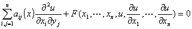&nbsp;&nbsp;&nbsp;&nbsp;&nbsp;&nbsp;&nbsp;&nbsp;&nbsp;&nbsp;&nbsp;&nbsp;&nbsp;&nbsp;&nbsp;&nbsp;&nbsp;&nbsp;&nbsp;&nbsp;&nbsp;&nbsp;&nbsp;&nbsp;&nbsp;&nbsp;&nbsp;&nbsp;&nbsp;&nbsp;&nbsp;&nbsp;&nbsp;&nbsp;&nbsp;&nbsp;&nbsp;&nbsp; (1)</pre>

式中<i>a</i><i>ij</i>(<b><i>x</i></b>)=<i>a</i><i>ij</i>(<i>x</i>1,<i>x</i>2,…,<i>x</i><i>n</i>)为<i>x</i>1,<i>x</i>2,…,<i>x</i><i>n</i>的已知函数.

&nbsp;&nbsp;&nbsp; [特征方程·特征方向·特征曲面·特征平面·特征锥面]

代数方程

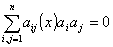

称为二阶方程(1)的特征方程；这里<i>a</i>1,<i>a</i>2,…,<i>a</i><i>n</i>是某些参数，且有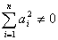.如果点<i>x</i>°=(<i>x</i>1°,<i>x</i>2°,…,<i>x</i><i>n</i>°)满足特征方程，即

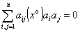

则过<i>x</i>°的平面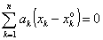的法线方向<i>l</i>:(<i>a</i>1,<i>a</i>2,…,<i>a</i><i>n</i>)称为二阶方程的特征方向；如果一个(<i>n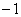</i>)维曲面，其每点的法线方向都是特征方向，则称此曲面为特征曲面；过一点的(<i>n</i>)维平面，如其法线方向为特征方向，则称这个平面为特征平面，在一点由特征平面的包络组成的锥面称为特征锥面.

&nbsp;&nbsp;&nbsp; [<i>n</i>个自变量方程的分类与标准形式]&nbsp; 在点<i>P</i>(<i>x</i>1°,<i>x</i>2°,…,<i>x</i><i>n</i>°)，根据二次型

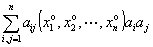&nbsp;&nbsp;&nbsp;&nbsp;&nbsp;&nbsp;&nbsp;
(<i>ai</i>为参量)

的特征根的符号，可将方程分为四类：

&nbsp;&nbsp;&nbsp; (i)&nbsp;&nbsp;&nbsp;&nbsp;&nbsp;&nbsp; 特征根同号，都不为零，称方程在点<i>P</i>为椭圆型.

&nbsp;&nbsp;&nbsp; (ii)&nbsp;&nbsp;&nbsp; 特征根都不为零，有<i>n</i>个具有同一种符号 ，余下一个符号相反，称方程在点<i>P</i>为双曲型.

&nbsp;&nbsp;&nbsp; (iii)&nbsp;&nbsp; 特征根都不为零，有<i>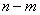</i>个具有同一种符号(<i>n</i>&gt;<i>m</i>&gt;1)，其余<i>m</i>个具有另一种符号，称方程在点<i>P</i>为超双曲型.

&nbsp;&nbsp;&nbsp; (iv)&nbsp;&nbsp;&nbsp;&nbsp; 特征根至少有一个是零，称方程在点<i>P</i>为抛物型.

&nbsp;&nbsp;&nbsp; 若在区域<i>D</i>内每一点方程为椭圆型，双曲型或抛物型，则分别称方程在区域<i>D</i>内是椭圆型、双曲型或抛物型.

&nbsp;&nbsp;&nbsp; 在点<i>P</i>作自变量的线性变换可将方程化为标准形式：

&nbsp;&nbsp;&nbsp; 椭圆型：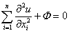

&nbsp;&nbsp;&nbsp; 双曲型：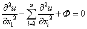

&nbsp;&nbsp;&nbsp; 超双曲型：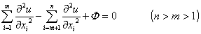

&nbsp;&nbsp;&nbsp; 抛物型：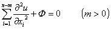

式中<i>Φ</i>为不包含二阶导数的项.

&nbsp;&nbsp;&nbsp; [两个自变量方程的分类与标准形式]&nbsp; 方程的一般形式为

<pre style='text-align:right;line-height:12.0pt;text-autospace:none;vertical-align:
bottom' align=right>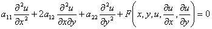&nbsp;&nbsp;&nbsp;&nbsp;&nbsp;&nbsp;&nbsp;&nbsp;&nbsp;&nbsp;&nbsp;&nbsp;&nbsp;&nbsp;&nbsp;&nbsp;&nbsp;&nbsp;&nbsp;&nbsp;&nbsp;&nbsp;&nbsp;&nbsp;&nbsp;&nbsp;&nbsp;&nbsp;&nbsp;&nbsp;&nbsp; (2)</pre>

&nbsp;<i>a</i>11,<i>a</i>12,<i>a</i>22为<i>x</i>,<i>y</i>的二次连续可微函数，不同时为零.

&nbsp;&nbsp; &nbsp;方程

<i>a</i>11d<i>y</i>2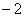<i>a</i>12d<i>x</i>d<i>y</i>+<i>a</i>22d<i>x</i>2=0

称为方程(2)的特征方程.特征方程的积分曲线称为二阶方程(2)的特征曲线.

&nbsp;&nbsp;&nbsp; 在某点<i>P</i>(<i>x</i>0,<i>y</i>0)的邻域<i>D</i>内，根据Δ=<i>a</i>122－<i>a</i>11<i>a</i>12的符号将方程分类：

&nbsp;&nbsp;&nbsp; 当Δ&gt;0时，方程为双曲型；

&nbsp;&nbsp; &nbsp;当Δ=0时，方程为抛物型；

&nbsp;&nbsp;&nbsp; 当Δ&lt;0时，方程为椭圆型.

在点<i>P</i>的邻域<i>D</i>内作变量替换，可将方程化为标准形式：

（i）&nbsp;&nbsp;&nbsp;&nbsp;&nbsp;&nbsp;&nbsp;&nbsp;&nbsp;&nbsp;&nbsp;&nbsp;&nbsp;&nbsp;&nbsp;&nbsp;&nbsp;
（i）&nbsp;&nbsp;&nbsp;&nbsp;&nbsp;&nbsp; 双曲型：因Δ&gt;0，存在两族实特征曲线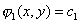，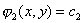，作变换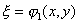，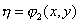和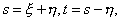方程化为标准形式

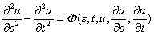

或&nbsp;&nbsp;&nbsp;&nbsp;&nbsp;&nbsp;&nbsp;&nbsp;&nbsp;&nbsp;&nbsp;&nbsp;&nbsp;&nbsp;&nbsp;&nbsp;&nbsp;&nbsp;&nbsp;&nbsp;&nbsp;&nbsp;&nbsp;&nbsp;&nbsp;&nbsp;
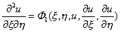

（ii）&nbsp;&nbsp;&nbsp;&nbsp;&nbsp;&nbsp;&nbsp;&nbsp;&nbsp;&nbsp;&nbsp;&nbsp;&nbsp;&nbsp;&nbsp;
（ii）&nbsp;&nbsp;&nbsp;&nbsp; 抛物型: 因Δ=0，只存在一族实的特征曲线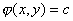，取二次连续可微函数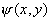，使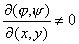，作变换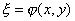，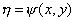，方程化为标准形式

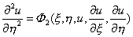

（iii）&nbsp;&nbsp;&nbsp;&nbsp;&nbsp;&nbsp;&nbsp;&nbsp;&nbsp;&nbsp;&nbsp;&nbsp;&nbsp;&nbsp;
（iii）&nbsp;&nbsp;&nbsp; 椭圆型：因Δ&lt;0，不存在实特征曲线，设

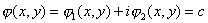

为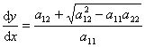的积分，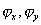不同时为零，作变量替换，,方程化为标准形式

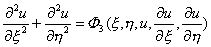

