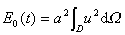

<h3 style='text-autospace:none;vertical-align:bottom'>二、极值原理·能量积分·定解问题的惟一性定理</h3>

&nbsp;&nbsp;&nbsp; 椭圆型方程、抛物型方程的极值原理及双曲型方程的能量守恒原理是相应方程的解所具有的最基本性质之一，在定解问题的研究中起着重要的作用.

&nbsp;&nbsp;&nbsp; [椭圆型方程的极值原理与解的惟一性定理]

&nbsp;&nbsp;&nbsp; 1°&nbsp; 极值原理&nbsp; 设<i>D</i>为<i>n</i>维欧氏空间<i>En</i>的有界区域，<i>S</i>是<i>D</i>的边界，在<i>D</i>内考虑椭圆型方程

式中<i>a</i><i>ij</i>(<b><i>x</i></b>),<i>b</i><i>i</i>(<b><i>x</i></b>),<i>c</i>(<b><i>x</i></b>),<i>f</i>(<b><i>x</i></b>)在上连续，<i>c</i>(<b><i>x</i></b>)≤0且二次型正定，即存在常数<i>μ</i>&gt;0，对任意和任意的<i>ai</i>有

&nbsp;&nbsp;&nbsp; 定理1&nbsp; 设<i>u</i>(<i>x</i>)为<i>D</i>内椭圆型方程的解，它在<i>D</i>内二次连续可微，在上连续，且不是常数，如<i>f</i>(<b><i>x</i></b>)≤0（或<i>f</i>(<b><i>x</i></b>)≥0），则<i>u</i>(<b><i>x</i></b>)不能在<i>D</i>的内点取非正最小值（或非负最大值）.

&nbsp;&nbsp;&nbsp; 如果过边界<i>S</i>上的任一点<i>P</i>都可作一球，使它在<i>P</i>点与<i>S</i>相切且完全包含在区域<i>D</i>内，则有

&nbsp;&nbsp;&nbsp; 定理2&nbsp; 设<i>u</i>(<b><i>x</i></b>)为椭圆型方程在<i>D</i>内二次连续可微，在上连续可微的解，且不是常数，并设<i>f</i>(<b><i>x</i></b>)≤0（或<i>f</i>(<b><i>x</i></b>)≥0）.若<i>u</i>(<b><i>x</i></b>)在边界<i>S</i>上某点<i>M</i>处取非正最小值（或非负最大值），只要外法向导数<b></b>在点<i>M</i>存在，则

&nbsp;&nbsp;
(或)

&nbsp;&nbsp;&nbsp; 2°&nbsp; 定解问题

&nbsp;&nbsp;&nbsp; (i)&nbsp;&nbsp; 第一边值问题（狄利克莱问题）

&nbsp;&nbsp;&nbsp;&nbsp;&nbsp;&nbsp;
(<i>S</i>)

&nbsp;&nbsp;&nbsp; (ii)&nbsp; 第二边值问题（诺伊曼问题）

(<i>S</i>)

其中 <i>N</i>为<i>S</i>的外法线方向.

&nbsp;&nbsp;&nbsp; (iii) 第三边值问题（混合问题）

&nbsp;&nbsp;&nbsp;&nbsp;&nbsp; (<i>S</i>)

<i>a</i>(),<i>b</i>(),()在<i>S</i>上连续，<i>N</i>是<i>S</i>的外法线方向，<i>a</i>()≥0,<i>b</i>()≤0，且<i>a</i>2()+<i>b</i>2()≠0.

&nbsp;&nbsp;&nbsp; 3°&nbsp; 解的惟一性问题&nbsp; 设<i>c</i>(<b><i>x</i></b>)及<i>b</i>()不同时恒等于零，如果定解问题<i>Lu=f</i>,<i>lu=</i>的解存在，则是惟一的，设<i>c</i>(<b><i>x</i></b>)及<i>b</i>()都恒等于零，如果定解问题<i>Lu=f</i>,<i>lu=</i>的解存在，则除相差一个常数外，解是惟一的.

&nbsp;&nbsp;&nbsp; [抛物型方程的极值原理与解的惟一性定理]&nbsp; 设为柱体，在柱体内部 考虑抛物型方程

式中<i>a</i><i>ij</i>(<b><i>x</i></b>,<i>t</i>),<i>b</i><i>i</i>(<b><i>x</i></b>,<i>t</i>),<i>c</i>(<b><i>x</i></b>,<i>t</i>),<i>f</i>(<b><i>x</i></b>,<i>t</i>)在上连续，且正定.

&nbsp;&nbsp;&nbsp; 1°&nbsp; 强极值原理&nbsp; 设<i>u</i>(<b><i>x</i></b><i>,t</i>)为抛物型方程<i>Lu=f</i>(<b><i>x</i></b>,<i>t</i>)在<i>D</i>×(0,<i>T</i>)内连续可微在上连续的解.并设<i>f</i>(<b><i>x</i></b>)=0，若<i>u</i>(<b><i>x</i></b><i>,t</i>)在<i>D</i>×(0,<i>T</i>]的某点(<b><i>x</i></b>0,<i>t</i>0)取非负的最大值，即

则对任意满足下列条件的点<i>P</i>(<b><i>x</i></b>,<i>t</i>)，都有<i>u</i>(<b><i>x</i></b>,<i>t</i>)=<i>m</i>：点<i>P</i>(<b><i>x</i></b>,<i>t</i>)满足<i>t&lt;t0</i>,且可用完全在<i>D</i>×(0,<i>T</i>] 内的连续曲线<b><i>x</i></b><i>=<b>x</b></i>(<i>t</i>)与点(<b><i>x</i></b>0,<i>t</i>0)相连.

&nbsp;&nbsp;&nbsp; 如在的侧边界<i>Γ</i>:<i>S</i>×[0,<i>T</i>]上（<i>S</i>是<i>D</i>的边界）任一点<i>P</i>都可作一球，使它在<i>P</i>点与<i>Γ</i>相切且完全在<i>D</i>×(0,<i>T</i>)内，则有

&nbsp;&nbsp;&nbsp; 定理&nbsp; 设<i>u</i>(<b><i>x</i></b>,<i>t</i>)在上连续，在<i>D</i>×(0,<i>T</i>]内满足抛物型方程<i>Lu=f</i>，且不是常数，设 <i>f</i>≤0，若<i>u</i>(<b><i>x</i></b>,<i>t</i>)在<i>Γ</i>上某点<i>M</i>处取非正最小值，只要外法向导数在点<i>M</i>存在，则&nbsp; 

&nbsp;&nbsp;&nbsp; 2°&nbsp; 柯西问题与混合问题

&nbsp;&nbsp;&nbsp; 柯西问题的初值条件是

&nbsp;&nbsp;&nbsp; 混合问题按下列的定解条件分别称为

&nbsp;&nbsp;&nbsp; &nbsp;(i)&nbsp; 第一边值问题：,;

&nbsp;&nbsp;&nbsp; &nbsp;(ii) 线性边值问题：,,

其中<i>N</i>为<i>Γ</i>的外法线方向为已知函数，<i>a</i>≥0，<i>b</i>≤0，<i>a</i>2+<i>b</i>2≠0

&nbsp;&nbsp;&nbsp; 3°&nbsp; 解的惟一性定理&nbsp; 如果抛物型方程<i>Lu=f</i>的混合问题的解存在,那末它是惟一的.如果柯西问题存在有界的解，那末在有界函数类中，解是惟一的.

&nbsp;&nbsp;&nbsp; [波动方程的能量积分与解的惟一性定理]

&nbsp;&nbsp;&nbsp; 1°&nbsp; 波动方程的柯西问题与混合问题&nbsp; 设波动方程为

&nbsp;&nbsp;&nbsp; 柯西问题的初值条件是

&nbsp;&nbsp;&nbsp; 如果在有界区域<i>Q</i>:<i>D</i>×(0,<i>T</i>]中考虑波动方程，记的侧边界为<i>Γ</i>，则混合问题的定解条件是

(i)&nbsp;&nbsp;&nbsp;&nbsp;&nbsp;&nbsp;&nbsp;&nbsp;&nbsp;&nbsp;&nbsp;&nbsp;&nbsp;&nbsp;&nbsp;&nbsp;&nbsp;&nbsp;&nbsp;&nbsp;&nbsp;&nbsp;&nbsp;
(i)&nbsp;&nbsp;&nbsp;&nbsp;&nbsp;&nbsp;&nbsp;&nbsp;&nbsp;&nbsp;&nbsp; 第一边值问题

(ii)&nbsp;&nbsp;&nbsp;&nbsp;&nbsp;&nbsp;&nbsp;&nbsp;&nbsp;&nbsp;&nbsp;&nbsp;&nbsp;&nbsp;&nbsp;&nbsp;&nbsp;&nbsp;&nbsp;&nbsp;&nbsp;
(ii)&nbsp;&nbsp;&nbsp;&nbsp;&nbsp;&nbsp;&nbsp;&nbsp;&nbsp; 第二边值问题

(iii)&nbsp;&nbsp;&nbsp;&nbsp;&nbsp;&nbsp;&nbsp;&nbsp;&nbsp;&nbsp;&nbsp;&nbsp;&nbsp;&nbsp;&nbsp;&nbsp;&nbsp;&nbsp;&nbsp;&nbsp;
(iii)&nbsp;&nbsp;&nbsp;&nbsp;&nbsp;&nbsp;&nbsp;&nbsp; 第三边值问题

式中<i>N</i>为<i>Γ</i>的外法线方向，<i>φ</i>(<i>x</i>),<i>ψ</i>(<i>x</i>)为<i>D</i>上的已知函数，为定义在<i>Γ</i>上的已知函数，.

&nbsp;&nbsp;&nbsp; 2°&nbsp; 解的惟一性定理&nbsp; 波动方程的混合问题与柯西问题的解如果存在必定惟一.

&nbsp;&nbsp;&nbsp; 惟一性定理可用下面能量积分证明.

&nbsp;&nbsp;&nbsp; 3°&nbsp; 能量积分&nbsp; 积分

<a href="#None" name="_ftnref1" title="">*</a>

称为波动方程的能量积分.

&nbsp; &nbsp;&nbsp;满足齐次波动方程及<i>u</i>|<i>Γ</i>=0（或）的函数<i>u</i>(<i>x</i>,<i>t</i>)成立：

&nbsp;&nbsp;&nbsp; 能量守恒原理&nbsp;&nbsp;&nbsp;&nbsp;&nbsp;&nbsp;&nbsp;&nbsp;&nbsp;&nbsp;&nbsp;&nbsp;&nbsp;&nbsp;&nbsp;&nbsp;&nbsp;&nbsp;&nbsp;&nbsp;&nbsp;&nbsp;&nbsp;&nbsp;&nbsp;&nbsp;&nbsp;&nbsp;&nbsp;&nbsp;&nbsp;&nbsp;&nbsp;&nbsp;&nbsp;&nbsp;
<i>E</i>(<i>t</i>)=<i>E</i>(0).

&nbsp;&nbsp;&nbsp; 能量不等式&nbsp;&nbsp;&nbsp;&nbsp;&nbsp;&nbsp;&nbsp;&nbsp;&nbsp;&nbsp;&nbsp;&nbsp;

式中&nbsp;&nbsp;&nbsp;&nbsp;&nbsp;&nbsp;&nbsp;&nbsp;&nbsp;&nbsp;&nbsp;&nbsp;&nbsp;&nbsp;&nbsp;&nbsp;&nbsp;&nbsp;&nbsp;&nbsp;&nbsp;&nbsp;&nbsp;&nbsp;&nbsp;&nbsp;&nbsp;&nbsp;

满足齐次波动方程及的函数，在上面能量不等式<i>E</i>(<i>t</i>)中增加一项，上面关系仍成立.

&nbsp;&nbsp;&nbsp; 对于柯西问题,在特征锥

&nbsp;&nbsp;&nbsp;&nbsp;&nbsp;&nbsp;
（<i>R</i>为大于零的常数）

中考虑齐次波动方程的解<i>u</i>,记特征锥与<i>t=t</i>0的截面为，关于能量积分

成立下面的能量不等式

式中&nbsp;&nbsp;&nbsp;&nbsp;&nbsp;&nbsp;&nbsp;&nbsp;&nbsp;&nbsp;&nbsp;&nbsp;&nbsp;&nbsp;&nbsp;&nbsp;&nbsp;&nbsp;&nbsp;&nbsp;&nbsp;

<i>π</i><i>t</i>是<i>t=</i>常数的超平面与以为上底所作的柱体（母线平行于<i>Ot</i>轴）的交截面.

 

 

<a href="#None" name="_ftn1" title="">*</a>&nbsp; 是的简写,下同.

