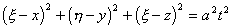

<h3 style='text-autospace:none;vertical-align:bottom'>三、三种典型方程</h3>

&nbsp;&nbsp;&nbsp; 1.&nbsp;&nbsp; 波动方程

&nbsp;&nbsp;&nbsp; 研究下面形式的波动方程

式中<i>f</i>(<i>x</i>,<i>y</i>,<i>z</i>,<i>t</i>)为已知函数.

&nbsp;&nbsp;&nbsp; 许多物体的运动规律可用波动方程来描述.如弦振动可用一维波动方程描述；膜的振动可用二维波动方程描述；声波和电磁波的振荡可用三维波动方程描述.

&nbsp;&nbsp; &nbsp;[齐次方程柯西问题的解]&nbsp; 设齐次波动方程的柯西问题满足下面初始条件：

并设三次连续可微，二次连续可微，那末解<i>u</i>的表达式分别为

&nbsp;&nbsp;&nbsp; 1°&nbsp; 三维（克希霍夫公式）

式中<i>S</i><i>at</i>表示球面：，d<i>S</i>表示球面的面积元素.

&nbsp;&nbsp;&nbsp; 2°&nbsp; 二维（泊松公式）

式中<i>K</i><i>at</i>表示圆：&nbsp;&nbsp;&nbsp;&nbsp;&nbsp;&nbsp;&nbsp;&nbsp;&nbsp;&nbsp;&nbsp;&nbsp;&nbsp;&nbsp;
.

&nbsp;&nbsp;&nbsp; 3°&nbsp; 一维（达兰贝尔公式）

利用降维法可从高维的解推得低维的解.

&nbsp;&nbsp;&nbsp; [非齐次方程柯西问题的解]&nbsp; 非齐次波动方程柯西问题的解等于上面齐次方程柯西问题的解添加一项所谓推迟势 .

1°&nbsp; 三维

式中积分区域是以(<i>x,y,z</i>)为中心，<i>at</i>为半径的球体,

&nbsp;&nbsp;&nbsp; 2°&nbsp; 二维

式中&nbsp;&nbsp;&nbsp;&nbsp;&nbsp;&nbsp;&nbsp;&nbsp;&nbsp;&nbsp;&nbsp;&nbsp;&nbsp;&nbsp;&nbsp;&nbsp;&nbsp;&nbsp;&nbsp;&nbsp;&nbsp;&nbsp;&nbsp;&nbsp;&nbsp;&nbsp;&nbsp;&nbsp;&nbsp;&nbsp;&nbsp;&nbsp;&nbsp;&nbsp;&nbsp;&nbsp;&nbsp;&nbsp;&nbsp;&nbsp;&nbsp;&nbsp;&nbsp;&nbsp;&nbsp;&nbsp;&nbsp;&nbsp;&nbsp;&nbsp;&nbsp;
.

&nbsp;&nbsp;&nbsp;&nbsp;&nbsp;&nbsp;&nbsp;
一维

&nbsp;&nbsp;&nbsp; [解的物理意义]&nbsp; 波动方程解的表达式具有明确的物理意义.

&nbsp;&nbsp;&nbsp; 1°&nbsp; 波的传播&nbsp; 以弦振动为例，在达兰贝尔公式中，形如(<i>x-at</i>)的解描写了弦振动以常速度<i>a</i>向右传播，称(<i>x-at</i>)为右传播波，(<i>x</i>+<i>at</i>)为左传播波，<i>a</i>为波速.

&nbsp;&nbsp;&nbsp; 2°&nbsp; 依赖区间&nbsp; 过点<i>P</i>(<i>x,t</i>)作两条特征线<i>x=c</i>1，<i>x</i>+<i>at=c</i>2交<i>x</i>轴于<i>x</i>1，<i>x</i>2，则区间[<i>x</i>1,<i>x</i>2]称为点<i>P</i>的依赖区间，由达兰贝尔公式可见解在<i>P</i>点的值只与[<i>x</i>1,<i>x</i>2]上初始条件有关，而与区间外(<i>x</i>)，(<i>x</i>)的值无关.

&nbsp;&nbsp;&nbsp; 3°&nbsp; 决定区域&nbsp; 过<i>x</i>轴上两点<i>x</i>1，<i>x</i>2(<i>x</i>1&lt;<i>x</i>2)分别作特征线

<i>x=x</i>1+<i>at</i>，<i>x=x</i>2<i></i>

则三角形区域&nbsp;&nbsp;&nbsp;&nbsp;&nbsp;&nbsp;&nbsp;&nbsp;&nbsp;&nbsp;&nbsp;&nbsp;&nbsp;&nbsp;&nbsp;&nbsp;&nbsp;&nbsp;&nbsp;&nbsp;&nbsp;&nbsp;&nbsp;&nbsp;&nbsp;&nbsp;&nbsp;&nbsp;&nbsp;&nbsp;&nbsp;&nbsp;&nbsp;&nbsp;&nbsp;&nbsp;
<i>x</i>1+<i>at</i>≤<i>x</i>≤<i>x</i>2<i></i><i>&nbsp;&nbsp;&nbsp;&nbsp; </i>(<i>t</i>&gt;0)

称为[<i>x</i>1,<i>x</i>2]的决定区域(图14.4(<i>a</i>))，在区域中解的数值由[<i>x</i>1,<i>x</i>2]上的初始条件完全决定.任意改变初始条件在[<i>x</i>1,<i>x</i>2]外的数值，解在此区域中不会发生任何变化.

图14.4

&nbsp;&nbsp;&nbsp; 4°&nbsp; 影响区域&nbsp;&nbsp; 过<i>x</i>轴上两点分别作特征线

<i>x=x</i>1<i></i>，<i>x=x</i>2+<i>at</i>

称区域&nbsp;&nbsp;&nbsp;&nbsp;&nbsp;&nbsp;&nbsp;&nbsp;&nbsp;&nbsp;&nbsp;&nbsp;&nbsp;&nbsp;&nbsp;&nbsp;&nbsp;&nbsp;&nbsp;&nbsp;&nbsp;&nbsp;&nbsp;&nbsp;&nbsp;&nbsp;&nbsp;&nbsp;&nbsp;&nbsp;&nbsp;&nbsp;&nbsp;&nbsp;&nbsp;&nbsp;&nbsp;&nbsp;&nbsp;&nbsp;&nbsp;&nbsp;&nbsp;&nbsp;&nbsp;&nbsp;&nbsp;&nbsp;
<i>x</i>1-<i>at</i>≤<i>x</i>≤<i>x</i>2<i></i><i>&nbsp;&nbsp;&nbsp;&nbsp; </i>(<i>t</i>&gt;0)

为[<i>x</i>1,<i>x</i>2]的影响区域(图14.4(<i>b</i>)).在此区域中，解的数值受到[<i>x</i>1,<i>x</i>2]上初始条件的影响，而在此区域外，解的值不受[<i>x</i>1,<i>x</i>2]上的初始条件影响，当区域[<i>x</i>1,<i>x</i>2]缩为一点<i>x</i>0时，点<i>x</i>0的影响区域为<i>x</i>轴上区间(图14.4(<i>c</i>))

<i>x</i>0<i></i>≤<i>x</i>≤<i>x</i>0+<i>at&nbsp;&nbsp;&nbsp;&nbsp;
</i>(<i>t</i>&gt;0)

&nbsp;&nbsp;&nbsp; 对二维波动方程，点(<i>x</i>0,<i>y</i>0,<i>t</i>0)的依赖区域为<i>t=</i>0上的圆.

(<i>x</i>－<i>x</i>0)2+(<i>y</i>－<i>y</i>0)2≤<i>a</i>2<i>t</i>02

在<i>t=</i>0上圆(<i>x</i>－<i>x</i>0)2+(<i>y</i>－<i>y</i>0)2≤<i>a</i>2<i>t</i>02的决定区域是以(<i>x</i>0,<i>y</i>0,<i>t</i>0)为顶点的圆锥体区域(图14.5(<i>a</i>)).

(<i>x</i>－<i>x</i>0)2+(<i>y</i>－<i>y</i>0)2≤<i>a</i>2(<i>t</i>－<i>t</i>0)2&nbsp;&nbsp;&nbsp;&nbsp;&nbsp; (<i>t</i>≤<i>t</i>0)

初始平面<i>t=</i>0上一点(<i>x</i>0,<i>y</i>0,0)的影响区域为圆锥体(图14.5(<i>b</i>)).

<pre style='text-align:right;line-height:12.0pt;text-autospace:none;vertical-align:
bottom' align=right>(<i>x</i>－<i>x</i>0)2+(<i>y</i>－<i>y</i>0)2≤<i>a</i>2<i>t</i>2&nbsp;&nbsp;&nbsp;&nbsp; (<i>t&gt;</i>0)&nbsp;&nbsp;&nbsp;&nbsp;&nbsp;&nbsp;&nbsp;&nbsp;&nbsp;&nbsp;&nbsp;&nbsp;&nbsp;&nbsp;&nbsp;&nbsp;&nbsp;&nbsp;&nbsp;&nbsp;&nbsp;&nbsp;&nbsp;&nbsp;&nbsp;&nbsp;&nbsp;&nbsp;&nbsp;&nbsp;&nbsp;&nbsp;&nbsp; (1)</pre>

初始平面<i>t=</i>0上某一区域的影响区域，就是由此区域上每一点所作的圆锥体(1)的包络面所围成的区域.

图14.5

&nbsp;&nbsp;&nbsp; 对三维波动方程，点(<i>x</i>0,<i>y</i>0,<i>z</i>0,<i>t</i>0)的依赖区域为<i>t=</i>0上的球面

(<i>x</i>－<i>x</i>0)2+(<i>y</i>－<i>y</i>0)2+(<i>z</i><i>－z</i>0)2=<i>a</i>2<i>t</i>02

初始平面<i>t=</i>0上的球体

(<i>x</i><i>－x</i>0)2+(<i>y</i><i>－y</i>0)2+(<i>z</i><i>－z</i>0)2≤<i>a</i>2<i>t</i>02

的决定区域是以它为底，以(<i>x</i>0,<i>y</i>0,<i>z</i>0,<i>t</i>0)为顶点的圆锥体区域

(<i>x</i><i>－x</i>0)2+(<i>y</i><i>－y</i>0)2+(<i>z</i><i>－z</i>0)2≤<i>a</i>2(<i>t</i><i>－t</i>0)2&nbsp;&nbsp; &nbsp;&nbsp;&nbsp;&nbsp;&nbsp;(<i>t</i>≤<i>t</i>0)

在初始平面<i>t=</i>0上点(<i>x</i>0,<i>y</i>0,<i>z</i>0,0)的影响区域为锥面

<pre style='text-align:right;line-height:12.0pt;text-autospace:none;vertical-align:
bottom' align=right>(<i>x</i><i>－x</i>0)2+(<i>y</i><i>－y</i>0)2+(<i>z</i><i>－z</i>0)2=<i>a</i>2<i>t</i>2&nbsp;&nbsp;&nbsp;&nbsp;&nbsp;&nbsp; (<i>t&gt;</i>0)&nbsp;&nbsp;&nbsp;&nbsp;&nbsp;&nbsp;&nbsp;&nbsp;&nbsp;&nbsp;&nbsp;&nbsp;&nbsp;&nbsp;&nbsp;&nbsp;&nbsp;&nbsp;&nbsp;&nbsp;&nbsp;&nbsp;&nbsp;&nbsp;&nbsp;&nbsp;&nbsp;&nbsp;&nbsp;&nbsp;&nbsp;&nbsp;&nbsp;&nbsp;&nbsp;&nbsp; (2)</pre>

初始平面上某一区域的影响区域就是它上面的每一点所作的锥面(2)的包络面围成的区域.

&nbsp;&nbsp;&nbsp; 二维与三维波的传播存在着下述本质区别.

&nbsp;&nbsp;&nbsp; 5°&nbsp; 惠更斯原理&nbsp; 对三维波动方程，点(<i>x</i>0,<i>y</i>0,<i>z</i>0,0)的影响区域为

(<i>x</i><i>－x</i>0)2+(<i>y</i><i>－y</i>0)2+(<i>z</i><i>－z</i>0)2≤<i>a</i>2<i>t</i>2&nbsp;&nbsp;&nbsp;&nbsp;&nbsp;&nbsp; (<i>t&gt;</i>0)

若在某一有界区域<i>Ω</i>有一个初始扰动，在时刻<i>t</i>受到此初始扰动的影响区域就是所有以点为中心，以<i>at</i>为半径的球面全体，当<i>t</i>足够大时，这种球面族有内外包络面，称外包络面为传播波的前阵面，内包络面为后阵面.前阵面以外的部分表示扰动尚未传到的区域，后阵面以内的部分是波已传过并恢复了原来状态的区域，前后阵面之间的区域就是受到扰动影响的部分，在三维，波的传播有清晰的前阵面与后阵面，称为惠更斯原理或称无后效现象.

&nbsp;&nbsp;&nbsp; 6°&nbsp; 波的弥散&nbsp; 对二维波动方程，点(<i>x</i>0,<i>y</i>0)的影响区域为

(<i>x</i><i>－x</i>0)2+(<i>y</i><i>－y</i>0)2≤<i>a</i>2<i>t</i>2&nbsp;&nbsp;&nbsp;&nbsp; 

若在有界区域<i>Ω</i>内有一个初始扰动，则波的传播只有前阵面而无后阵面，所以当<i>Ω</i>的初始扰动传到某点后，扰动对此点的影响不会消失，不过随时间的增加而逐渐减弱.这种现象称为波的弥散，或说波具有后效现象.

