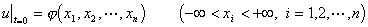

&nbsp;&nbsp;&nbsp; 2.&nbsp;&nbsp; 热传导方程

&nbsp;&nbsp;&nbsp; 热传导方程的一般形式为

式中<i>f</i>(<i>x,t</i>)为连续有界函数.

&nbsp;&nbsp;&nbsp; 热传导方程是描述热的传导过程，分子的扩散过程等物理规律的.

&nbsp;&nbsp;&nbsp; 对于<i>n</i>维热传导方程的柯西问题的初值条件为

式中为连续有界函数，方程的解的表达式为

