

3.&nbsp;&nbsp;&nbsp; 拉普拉斯方程

&nbsp;&nbsp;&nbsp; 研究重力场、静力场、磁场以及一些物理现象（如振动、热传导、扩散）的平衡或稳定过程，通常得到椭圆型方程，最典型的方程为拉普拉斯方程

Δ<i>u=</i>0

及泊松方程

Δ<i>u=</i><i>ρ</i>

式中<i>ρ</i>为已知函数，Δ为拉普拉斯算子，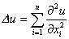

&nbsp;&nbsp;&nbsp; [圆或球的狄利克莱问题解的泊松积分]&nbsp; 当区域为圆或球时，分别采用极坐标(<i>r,</i>)或球坐标(<i>r</i>,<i>θ</i>,)较为方便.

&nbsp;&nbsp;&nbsp; Δ<i>u=</i>0的极坐标形式为

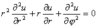

&nbsp;&nbsp;&nbsp; Δ<i>u=</i>0的球坐标形式为

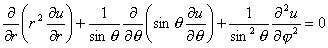

&nbsp;&nbsp;&nbsp; 狄利克莱问题解的泊松积分为

&nbsp;&nbsp;&nbsp; 1°&nbsp; 区域是圆时，Δ<i>u=</i>0, <i>u</i>|<i>r=a</i>=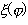，解为泊松积分

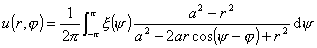

式中为已知连续函数,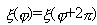.

&nbsp;&nbsp;&nbsp; 2°&nbsp; 区域是球时，Δ<i>u=</i>0, <i>u</i>|<i>r=a</i>=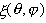，解为泊松积分

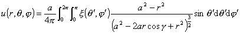

式中为已知连续函数，

&nbsp;&nbsp;&nbsp; [调和函数的性质]&nbsp; 二维拉普拉斯方程的连续解称为调和函数，它具有以下重要性质：

&nbsp;&nbsp;&nbsp; 1°&nbsp; 设函数<i>u</i>(<i>x,y</i>)在以<i>S</i>为边界的有界区域<i>D</i>内调和，在上有连续一阶偏导数，则

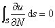

式中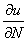为外法向导数.

&nbsp;&nbsp;&nbsp; 2°&nbsp; 算术平均值定理&nbsp; 设函数<i>u</i>(<i>x,y</i>)在圆的内部调和，在闭圆上连续，则<i>u</i>(<i>x,y</i>)在圆心的值等于它在圆周上的值的算术平均值.

&nbsp;&nbsp;&nbsp; 3°&nbsp; 每一个调和函数<i>u</i>(<i>x,y</i>)对<i>x,y</i>无穷次可微.

&nbsp;&nbsp;&nbsp; 4°&nbsp; 哈拉克第一定理（一致收敛定理）&nbsp; 设{<i>u</i><i>k</i>(<i>x,y</i>)}, (<i>k</i>=1,2)在有界区域<i>D</i>内调和，在上连续，如果<i>u</i><i>k</i>(<i>x,y</i>)在<i>D</i>的边界上一致收敛，则在<i>D</i>内也一致收敛，并且极限函数在<i>D</i>内调和.

&nbsp;&nbsp;&nbsp; 5°&nbsp; 哈拉克第二定理（单调性定理）&nbsp; 设调和函数列{<i>u</i><i>k</i>(<i>x,y</i>)},
(<i>k</i>=1,2,…)在<i>D</i>的某一内点收敛，且对于任意<i>k</i>，

<i>u</i><i>k</i>+1(<i>x,y</i>)≥<i>u</i><i>k</i>(<i>x,y</i>)

则<i>u</i><i>k</i>(<i>x,y</i>) 在<i>D</i>内处处收敛于某调和函数，同时在<i>D</i>的每一有界闭子区域上一致收敛.

&nbsp;&nbsp;&nbsp; 6°&nbsp; 刘维尔定理&nbsp; 如函数<i>u</i>(<i>x,y</i>)在全平面上调和且不是常数，则它不可能有上界和下界.

&nbsp;&nbsp;&nbsp; 7°&nbsp; 可去奇点定理&nbsp; 设<i>u</i>(<i>x,y</i>)在<i>A</i>点的一个邻域（除<i>A</i>点外）调和且有界，但在<i>A</i>点没有定义，则可定义函数<i>u</i>(<i>x,y</i>)在<i>A</i>点的值，使<i>u</i>在整个<i>A</i>点的邻域（包括<i>A</i>点）内是调和函数.

&nbsp;&nbsp;&nbsp; [李雅普诺夫闭曲面与内、外边值问题]&nbsp; 设<i>S</i>为<i>En</i>的有限闭曲面，如果满足下列条件，那末<i>S</i>称为李雅普诺夫闭曲面：

&nbsp; &nbsp;&nbsp;(i)&nbsp;&nbsp; 曲面到处有切面.

&nbsp;&nbsp;&nbsp; (ii)&nbsp; 存在常数<i>d&gt;</i>0，对曲面上每一点<i>P</i>，可作一个以<i>P</i>为中心、<i>d</i>为半径的球，使曲面在此球内的部分和任意一条与<i>P</i>点法线平行的直线相交不多于一点

&nbsp;&nbsp;&nbsp; (iii) 曲面上任意二点<i>P</i>1及<i>P</i>2的法线的夹角<i>γ</i>(<i>P</i>1,<i>P</i>2)满足

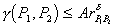

式中<i>A</i>,<i>δ</i>为正常数，0&lt;<i>δ</i>≤1，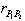是点<i>P</i>1与<i>P</i>2之间的距离.

&nbsp;&nbsp;&nbsp; (iv) 从空间任意一点<i>P</i>0看曲面的任一部分<i>σ</i>的立体角有界，即

||≤<i>k </i>（<i>k</i>为常数）

（从点<i>P</i>0看曲面<i>S</i>的立体角为

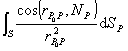

式中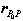表示矢量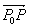 ，<b><i>N</i></b><i>P</i>表示<i>S</i>在点<i>P</i>的外法线矢量，d<i>S</i><i>P</i>表示点<i>P</i>的面积元素.）

设<i>D</i>为<i>En</i>的有界区域，其边界<i>S</i>为李雅普诺夫闭曲面.求在<i>D</i>内满足

Δ<i>u=</i>0

而在<i>S</i> 上满足给定边界条件的解称为内边值问题；求在<i>D</i>外满足Δ<i>u=</i>0而在<i>S</i>上满足给定边界条件的解称为外边值问题.

&nbsp;&nbsp;&nbsp; [狄利克莱问题与诺伊曼问题的解]

&nbsp;&nbsp;&nbsp; 狄利克莱问题&nbsp;&nbsp;&nbsp; &nbsp;&nbsp;&nbsp;&nbsp;&nbsp;&nbsp;&nbsp;&nbsp;&nbsp;Δ<i>u</i>=0，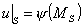

&nbsp;&nbsp;&nbsp; 诺伊曼问题&nbsp;&nbsp;&nbsp;&nbsp;&nbsp;&nbsp;&nbsp;&nbsp;&nbsp;&nbsp;&nbsp;&nbsp;&nbsp;&nbsp;
Δ<i>u</i>=0，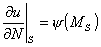

式中<i>M</i><i>S</i>∈<i>S</i>，为<i>S</i>上的已知连续函数，为外法向导数.

&nbsp;&nbsp;&nbsp; 1°&nbsp; 狄利克莱问题的解可表示为面积分

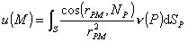.

式中<i>v</i>(<i>P</i>)称为面密度，面积分<i>u</i>(<i>M</i>)称为双层位势，<b><i>r</i></b><i>PM</i>为点<i>M</i>与变点<i>P</i>之间的距离，<b><i>r</i></b><i>PM</i>为矢量 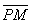，<b><i>N</i></b><i>P</i>为<i>S</i>在点<i>P</i>的外法线矢量，<i>v</i>(<i>M</i>)满足第二类弗雷德霍姆积分方程(第十五章§1)：

&nbsp;&nbsp;&nbsp; (i)&nbsp;&nbsp; 内边值问题

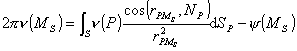

&nbsp;&nbsp;&nbsp; (ii)&nbsp; 外边值问题

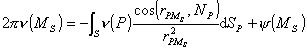

&nbsp;&nbsp;&nbsp; 2°&nbsp; 诺伊曼问题的解可表示为面积分

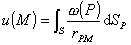

式中(<i>P</i>)称为面密度，面积分<i>u</i>(<i>M</i>)称为单层位势，(<i>P</i>)满足第二类弗雷德霍姆积分方程：

&nbsp;&nbsp;&nbsp; (i)&nbsp;&nbsp; 内边值问题

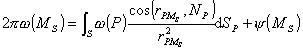

&nbsp;&nbsp;&nbsp; (ii)&nbsp; 外边值问题

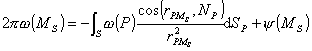

&nbsp;&nbsp;&nbsp; 定理： 狄利克莱的内外边值问题及诺伊曼的外边值问题有惟一解，而诺伊曼的内边值问题解存在的充分必要条件是：

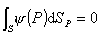

&nbsp;&nbsp;&nbsp; [泊松方程]&nbsp; 在区域<i>D</i>内，泊松方程Δ<i>u=</i><i>ρ</i>（<i>ρ</i>为已知连续函数）有特解：

&nbsp;&nbsp;&nbsp; 三维： 体势位

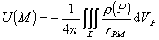

&nbsp;&nbsp;&nbsp; 二维： 对数势位

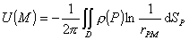

式中<b><i>r</i></b><i>PM</i>为点<i>M</i>与变点<i>P</i>之间的距离.

&nbsp;&nbsp;&nbsp; 如果已知泊松方程的一个特解<i>U</i>(<i>M</i>)，则<i>=u</i><i>－U</i>满足Δ<i>=</i>0，从而泊松方程的边值问题可化为拉普拉斯方程相应的边值问题.

