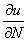
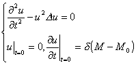
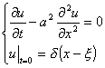
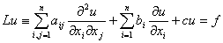
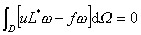

<h3 style='text-autospace:none;vertical-align:bottom'>四、基本解与广义解</h3>

&nbsp;&nbsp;&nbsp; [共轭微分算子与自共轭微分算子]&nbsp; 算子

称为二阶线性微分算子，式中<i>a</i><i>ij</i>,<i>b</i><i>i</i>,<i>c</i>为<i>x</i>1,<i>x</i>2,…,<i>x</i><i>n</i>的二次连续可微函数.由公式

决定的算子<i>L*</i>称为<i>L</i>的共轭微分算子.如果<i>L=L*</i>，则称<i>L</i>为自共轭微分算子.

&nbsp;&nbsp;&nbsp; [格林公式]

&nbsp;&nbsp;&nbsp; 1°&nbsp; 算子<i>L</i>的格林公式是

式中<i>S</i>为区域<i>D</i>的边界，<b><i>N</i></b>为<i>S</i>的外法线矢量，<b><i>e</i></b><i>i</i>为<i>x</i><i>i</i>的轴的矢量

(0,…,0,,0,…,0),

cos(<b><i>N</i></b>,<b><i>e</i></b><i>i</i>)表示矢量<b><i>N</i></b>与<b><i>e</i></b><i>i</i>的夹角的余弦，

&nbsp;&nbsp;&nbsp; 2°&nbsp; 三维拉普拉斯算子的格林公式

其中是外法向导数.

&nbsp;&nbsp;&nbsp; 3°&nbsp; 算子

的格林公式

式中<i>L*</i>为<i>L</i>的共轭微分算子，<b><i>N</i></b>为外法线矢量，<b><i>i</i></b>,<b><i>j</i></b>分别为<i>x</i>轴，<i>y</i>轴上的单位矢量.

&nbsp;&nbsp;&nbsp; [基本解]

&nbsp;&nbsp;&nbsp; 1°&nbsp; 方程<i>Lu=f</i>的基本解：

&nbsp;&nbsp;&nbsp; 设<i>M</i>,<i>M</i>0为<i>En</i>中的点，满足方程

的解<i>U</i>(<i>M,M</i>0)称为方程<i>Lu=f</i>的基本解，有时也称为方程<i>Lu=</i>0的基本解，式中(<i>M-M</i>0)称为<i>n</i>维狄拉克函数（<i>-</i>函数）.

&nbsp;&nbsp;&nbsp; 基本解<i>U</i>(<i>M,M</i>0)满足

&nbsp;&nbsp;&nbsp; (i)&nbsp;&nbsp;&nbsp;&nbsp; <i>LU</i>(<i>M,M</i>0)=0，当<i>M</i><i>≠M</i>0，

&nbsp;&nbsp;&nbsp; (ii)&nbsp;&nbsp;&nbsp; 对任意充分光滑的函数<i>f</i>(<i>M</i>)，

于是<i>U</i>(<i>M,M</i>0)满足<i>Lu=f</i>(<i>M</i>) .

&nbsp;&nbsp;&nbsp; 所以有时也就把满足条件(i)、(ii)的函数<i>U</i>(<i>M,M</i>0)定义为方程<i>Lu=f</i>(<i>M</i>)的基本解.

&nbsp;&nbsp;&nbsp; &nbsp;(<i>a</i>) Δ<i>u=</i>0的基本解

&nbsp;&nbsp;&nbsp; 二维：&nbsp;&nbsp;&nbsp;&nbsp;&nbsp;&nbsp;&nbsp;&nbsp;&nbsp;&nbsp;&nbsp;&nbsp;&nbsp;&nbsp;&nbsp;&nbsp;&nbsp;

&nbsp;&nbsp;&nbsp; 三维：&nbsp;&nbsp;&nbsp;&nbsp;&nbsp;&nbsp;&nbsp;&nbsp;&nbsp;&nbsp;&nbsp;&nbsp;&nbsp;&nbsp;&nbsp;&nbsp;&nbsp;

&nbsp;&nbsp;&nbsp; <i>n</i>维：&nbsp;&nbsp;&nbsp;&nbsp;&nbsp;&nbsp;&nbsp;&nbsp;&nbsp;&nbsp;&nbsp;&nbsp;&nbsp;&nbsp;&nbsp;&nbsp;&nbsp;&nbsp;

式中表示点<i>M</i>与<i>M</i>0之间的距离.

&nbsp;&nbsp;&nbsp; (<i>b</i>)&nbsp; <i>n</i>维空间的多重调和方程<i>mu=</i>0的基本解

&nbsp;&nbsp;&nbsp; (<i>c</i>)&nbsp; 热传导方程的基本解

&nbsp;&nbsp;&nbsp; (<i>d</i>)&nbsp; 波动方程的基本解

&nbsp;&nbsp;&nbsp; 一维：

&nbsp;&nbsp;&nbsp; 二维：

<pre style='line-height:12.0pt;text-autospace:none;vertical-align:bottom'>&nbsp;&nbsp;&nbsp;&nbsp;&nbsp;&nbsp;&nbsp;&nbsp;&nbsp;&nbsp;&nbsp;&nbsp;&nbsp;&nbsp;&nbsp;&nbsp;&nbsp;&nbsp;&nbsp;&nbsp;&nbsp;&nbsp;&nbsp;&nbsp;&nbsp;&nbsp; </pre>

三维：

&nbsp;&nbsp;&nbsp; 2°&nbsp; 柯西问题的基本解

&nbsp;&nbsp;&nbsp; (i)&nbsp;&nbsp; 称满足

的解为波动方程柯西问题的基本解，它的形式为

&nbsp;&nbsp;&nbsp; 一维：

&nbsp;&nbsp;&nbsp; 二维：

&nbsp; &nbsp;&nbsp;三维：

&nbsp;&nbsp;&nbsp; (ii)&nbsp; 称满足

的解为热传导方程柯西问题的基本解，它的形式是

&nbsp;&nbsp;&nbsp; 同样方法可以定义其他定解问题的基本解.

&nbsp;&nbsp;&nbsp; 由定义可见，基本解表示由集中量（如点热源，点电荷等）所产生的解，下段介绍的格林函数，黎曼函数也具有这种特点，统称它们为点源函数，或影响函数.

&nbsp; &nbsp;&nbsp;[广义解]&nbsp; 在区域<i>D</i>中给定二阶线性方程

式中<i>f</i>在<i>D</i>上连续.

&nbsp;&nbsp;&nbsp; 1°&nbsp; 设<i>u</i><i>n</i>(<i>x</i>)为<i>D</i>上充分光滑（如二阶连续可微）的函数序列，当<i>n</i>→∞时，<i>u</i><i>n</i>(<i>x</i>)一致（或在适当意义下）收敛于函数<i>u</i>(<i>x</i>)，同时<i>Lu</i><i>n</i>也一致（或在适当意义下）收敛于<i>f</i>(<i>x</i>)，则称<i>u</i>(<i>x</i>)为<i>Lu=f</i>的广义解.

&nbsp;&nbsp;&nbsp; 2°&nbsp; 设函数<i>u</i>(<i>x</i>)在区域<i>D</i>内连续，如果对于任意二次连续可微且在与<i>D</i>的边界距离小于某一正数的点上恒等于零的函数（与无关，称为<i>D</i>的试验函数）有

那末称<i>u</i>(<i>x</i>)为方程<i>Lu=f</i>的广义解.

&nbsp;&nbsp;&nbsp; 有时为了区别广义解，称以前定义的解为古典解，古典解一定是广义解.但因广义解不一定光滑，甚至不可微，所以不一定是古典解.

&nbsp;&nbsp;&nbsp; 例如，当(<i>x</i>)，(<i>x</i>)只是<i>x</i>的连续函数时，函数

<i>u</i>(<i>x,t</i>)=(<i>x</i>+<i>t</i>)－(<i>x</i><i>－t</i>)

为波动方程

的广义解，但不是古典解.

