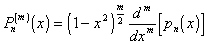
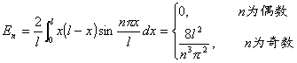

<h3 style='text-autospace:none;vertical-align:bottom'>五、二阶偏微分方程的常用解法</h3>

&nbsp;&nbsp;&nbsp; 1.&nbsp; 分离变量法

&nbsp;&nbsp;&nbsp; 它是解线性微分方程常用的一种方法，特别当区域是矩形、柱体、球体时使用更为普遍.这种方法是先求满足边界条件的特解，利用迭加原理，作这些特解的线性组合，得到定解问题的解.求特解时常归结为求某些常微分方程边值问题的特征值和特征函数.以下对不同类型方程说明分离变量法的具体解法.

&nbsp;&nbsp;&nbsp; [弦振动方程]

&nbsp;&nbsp;&nbsp; 1°&nbsp; 两端固定的弦振动齐次方程混合问题

&nbsp;&nbsp;&nbsp; 设<i>u</i>(<i>x,t</i>)=<i>X</i>(<i>x</i>)<i>T</i>(<i>t</i>)，具体解法如下：

&nbsp;&nbsp;&nbsp; (1)&nbsp; <i>X</i>(<i>x</i>)，<i>T</i>(<i>t</i>)满足的常微分方程：

&nbsp;&nbsp; 

&nbsp;&nbsp;&nbsp; (2)&nbsp; 用此二常微分方程的解的乘积表示弦振动方程的特解<i>u</i><i>n</i>(<i>x,t</i>).

&nbsp;&nbsp;&nbsp; 解边值问题

当&nbsp;&nbsp;&nbsp;&nbsp;&nbsp;&nbsp;&nbsp;&nbsp;&nbsp;&nbsp;&nbsp;&nbsp;&nbsp;&nbsp;
&nbsp;&nbsp;&nbsp;&nbsp;&nbsp;&nbsp;&nbsp;&nbsp;&nbsp;&nbsp;&nbsp;&nbsp;

时，有非零解

称<i>λ</i><i>n</i>为边值问题的特征值，<i>X</i><i>n</i>(<i>x</i>)为特征函数.把<i>λ</i><i>n</i>代入<i>T</i>(<i>t</i>)的方程，得

式中<i>A</i><i>n</i>,<i>B</i><i>n</i>为任意常数，这样就得到弦振动方程的特解：

&nbsp;&nbsp;&nbsp; (3)&nbsp; 把<i>u</i><i>n</i>(<i>x,t</i>)迭加，形式上作级数

&nbsp;&nbsp;&nbsp; (4)&nbsp; 利用特征函数的正交性，确定系数<i>An</i>,<i>Bn</i>.

&nbsp;&nbsp;&nbsp; 把(<i>x</i>)及(<i>x</i>)展开成傅立叶级数

式中

利用初始条件可得

于是混合问题的形式解为

&nbsp;&nbsp;&nbsp; 若(i) (<i>x</i>)具有一阶和二阶连续导数，三阶导数逐段连续，且(0)=(<i>l</i>)，<i>&quot;</i>(0)=<i>&quot;</i>(<i>l</i>)=0;(ii)(<i>x</i>)连续可微，二阶导数逐段连续，(0)=(<i>l</i>)=0，那末形式解右端的级数一致收敛，形式解就是混合问题的正规解.

&nbsp;&nbsp;&nbsp; 2°&nbsp; 解的物理意义

弦的这种形式的振动称为驻波，点 (<i>m</i>=0,1<i>n</i>) 为不动的点，称为节点；点 (<i>m</i>=0,1,2<i>n</i>－1)处振幅最大，称为腹点；称为弦振动的固有频率；弦线发出的最低音的频率为 （<i>τ</i>为张力，<i>ρ</i>为弦的线密度）称为该弦的基音，其他频率都是它的整数倍，称为泛音.

&nbsp;&nbsp;&nbsp; 3°&nbsp; 非齐次方程的混合问题

&nbsp;&nbsp;&nbsp; 将<i>u</i>(<i>x</i>,<i>t</i>)和<i>f</i>(<i>x</i>,<i>t</i>)展开成傅立叶级数：

&nbsp;&nbsp;&nbsp; 那末根据定解条件再利用1°中(<i>x</i>)与(<i>x</i>)的傅立叶展开式，有

所以

形式解为

&nbsp;&nbsp;&nbsp; 若(<i>x</i>)具有一、二阶连续导数，三阶导数逐段连续，(<i>x</i>)和<i>f</i>(<i>x,t</i>)连续可微，二阶导数逐段连续，同时

(0)=(<i>l</i>)=<i>&quot;</i>(0)=<i>&quot;</i>(<i>l</i>)=0

(0)=(<i>l</i>)=<i>f</i>(0<i>,t</i>)=<i>f</i>(<i>l,t</i>)=0

则级数一致收敛，形式解就是非齐次方程混合问题的正规解.

&nbsp;&nbsp;&nbsp; 4°&nbsp; 遇到非齐次边界条件

作变换

可化为关于<i>v</i>(<i>x,t</i>)的齐次边界条件求解.

&nbsp;&nbsp;&nbsp; [热传导方程]&nbsp; 热传导方程的第一边值问题

&nbsp;&nbsp;&nbsp; 设<i>u</i>(<i>x,t</i>)=<i>X</i>(<i>x</i>)<i>T</i>(<i>t</i>)，得

<i>X&quot;</i>(<i>x</i>)+2<i>X</i>(<i>x</i>)=0

<i>T'</i>(<i>t</i>)+<i>a</i>22<i>T</i>(<i>t</i>)=0

&nbsp;&nbsp;&nbsp; 特征值，对应的特征函数为，而

&nbsp;&nbsp;&nbsp; 

&nbsp;&nbsp;&nbsp; 作形式解

式中<i>c</i><i>n</i>等于(<i>x</i>)的傅立叶系数即.

&nbsp;&nbsp;&nbsp; 当(<i>x</i>)具有一、二阶连续导数，三阶导数逐段连续，(0)=(<i>l</i>)=0，则上述级数一致收敛，形式解就是正规解了.

&nbsp;&nbsp;&nbsp; [拉普拉斯方程]&nbsp; 球内定常温度分布的狄利克莱问题—拉普拉斯方程的狄利克莱问题.

&nbsp;&nbsp;&nbsp; 选用球坐标

&nbsp;&nbsp;&nbsp; 令<i>u</i>(<i>r, ,</i>)=<i>v</i>(<i>r,</i>)().代入方程，分离变量得

<pre style='text-align:right;line-height:12.0pt;text-autospace:none;vertical-align:
bottom' align=right><i>&quot;</i>()+<i>k</i>2()=0&nbsp;&nbsp;&nbsp;&nbsp;&nbsp;&nbsp;&nbsp;&nbsp;&nbsp;&nbsp;&nbsp;&nbsp;&nbsp;&nbsp;&nbsp;&nbsp;&nbsp;&nbsp;&nbsp;&nbsp;&nbsp;&nbsp;&nbsp;&nbsp;&nbsp;&nbsp;&nbsp;&nbsp;&nbsp;&nbsp;&nbsp;&nbsp;&nbsp;&nbsp;&nbsp;&nbsp;&nbsp;&nbsp;&nbsp;&nbsp;&nbsp; (1)</pre><pre
style='text-align:right;line-height:12.0pt;text-autospace:none;vertical-align:
bottom' align=right>&nbsp;&nbsp;&nbsp;&nbsp;&nbsp;&nbsp;&nbsp;&nbsp;&nbsp;&nbsp;&nbsp;&nbsp;&nbsp;&nbsp;&nbsp;&nbsp;&nbsp;&nbsp;&nbsp;&nbsp;&nbsp;&nbsp;&nbsp; (2)</pre>

利用对于变量的周期性，<i>u</i>(<i>r, ,</i> )=<i>u</i>(<i>r,
,</i> <i>+</i>2)，可知方程(1)中的<i>k</i>只能取<i>m</i>(<i>m</i>=0,1)，那末()取{cos<i>m</i><i>,</i>sin<i>m</i>}.再将方程(2)分离变量，令<i>v</i>=<i>R</i>(<i>r</i>)<i>H</i>(<i></i>)，得

<pre style='text-align:right;line-height:12.0pt;text-autospace:none;vertical-align:
bottom' align=right>&nbsp;&nbsp;&nbsp;&nbsp;&nbsp;&nbsp;&nbsp;&nbsp;&nbsp;&nbsp;&nbsp;&nbsp;&nbsp;&nbsp;&nbsp;&nbsp;&nbsp;&nbsp;&nbsp;&nbsp;&nbsp;&nbsp;&nbsp;&nbsp;&nbsp;&nbsp;&nbsp;&nbsp;&nbsp;&nbsp;&nbsp;&nbsp;&nbsp;&nbsp;&nbsp;&nbsp;&nbsp;&nbsp;&nbsp;&nbsp;&nbsp;&nbsp;&nbsp;&nbsp;&nbsp;&nbsp;&nbsp;&nbsp; (3)</pre><pre
style='text-align:right;line-height:12.0pt;text-autospace:none;vertical-align:
bottom' align=right>&nbsp;&nbsp;&nbsp;&nbsp;&nbsp;&nbsp;&nbsp;&nbsp;&nbsp;&nbsp;&nbsp;&nbsp;&nbsp;&nbsp;&nbsp;&nbsp;&nbsp;&nbsp;&nbsp;&nbsp;&nbsp;&nbsp;&nbsp;&nbsp;&nbsp; (4)</pre>

方程(4)的解可用勒让德多项式表示，为了使解有界，<i>λ</i>只能取

<i>λ</i><i>n</i>2=<i>n</i>(<i>n+</i>1)&nbsp;&nbsp;&nbsp;&nbsp;&nbsp;&nbsp;&nbsp;
(<i>n=</i>0,1,2,…)

对应的解<i>H</i>(<i></i>)=<i>P</i><i>n</i>(<i>m</i>)(cos<i></i>)，，<i>P</i><i>n</i>(<i>x</i>)为勒让德多项式

方程(3)可写成

这是欧拉方程，其有界解为<i>R</i>(<i>r</i>)=<i>c</i>1<i>r</i><i>n</i>.最后将<i>u</i>的特解迭加，利用边界条件和球函数的正交性得

式中<i>P</i><i>n</i>(<i>m</i>)(cos<i></i>)为一般勒让德函数.

&nbsp;&nbsp;&nbsp; 如果二次连续可微，则表示的级数一致收敛，它就是狄利克莱问题的解.

&nbsp;&nbsp;&nbsp; [高阶方程]&nbsp; 梁的横向振动方程为

<pre style='text-align:right;line-height:12.0pt;text-autospace:none;vertical-align:
bottom' align=right>（<i>a</i>为常数）&nbsp;&nbsp;&nbsp;&nbsp;&nbsp;&nbsp;&nbsp;&nbsp;&nbsp;&nbsp;&nbsp;&nbsp;&nbsp;&nbsp;&nbsp;&nbsp;&nbsp;&nbsp;&nbsp;&nbsp;&nbsp;&nbsp;&nbsp;&nbsp;&nbsp;&nbsp;&nbsp;&nbsp; (1)</pre>

定解条件为

&nbsp;&nbsp;&nbsp; 设<i>y</i>(<i>x,t</i>)=<i>X</i>(<i>x</i>)<i>T</i>(<i>t</i>)，那末

<pre style='text-align:right;line-height:12.0pt;text-autospace:none;vertical-align:
bottom' align=right></pre>

方程(2)满足<i>X&quot;</i>(0)=<i>X&quot;</i>(<i>l</i>)=0的特征值，特征函数 (<i>n</i>=1,2)，方程(3)的解为

所以方程(1)的形式解为

由<i>y</i>(<i>x,</i>0)=<i>x</i>(<i>l</i><i>－x</i>)得

最后得到方程(1)的解.

