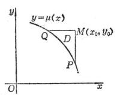
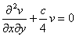

2.&nbsp;
双曲型方程的黎曼方法

&nbsp;&nbsp;&nbsp; 考虑拉普拉斯双曲型方程

&nbsp;&nbsp;&nbsp; [古沙问题的特征线法]&nbsp; 古沙问题是

设<i>a</i>(<i>x,y</i>),<i>b</i>(<i>x,y</i>),<i>c</i>(<i>x,y</i>),<i>f</i>(<i>x,y</i>)为连续函数；连续可微且，令

则古沙问题化为下面积分方程组的求解问题

<table cellspacing=0 cellpadding=0 hspace=0 vspace=0 align=left>
 <tr>
  <td valign=top align=left style='padding-top:0mm;padding-right:9.0pt;
  padding-bottom:0mm;padding-left:9.0pt'>
  

  
&nbsp;

  
&nbsp;

  
&nbsp;

  
&nbsp;

  
图14.6

  

  </td>
 </tr>
</table>

&nbsp;&nbsp;&nbsp; 它可用逐次逼近法求解，显然<i>x=x</i>0,<i>y=y</i>0为拉普拉斯双曲型方程的特征线，所以此法也称为特征线法.

&nbsp;&nbsp;&nbsp; [广义柯西问题的黎曼方法]&nbsp; 广义柯西问题是

&nbsp;&nbsp;&nbsp; 设<i>a</i>(<i>x,y</i>),<i>b</i>(<i>x,y</i>),<i>c</i>(<i>x,y</i>), 1(<i>x</i>)及(<i>x</i>)为连续可微函数，且<i>'</i>(<i>x</i>)≠0，而<i>f</i>(<i>x,y</i>)及2(<i>x</i>)为连续函数.

&nbsp;&nbsp;&nbsp; 设<i>M</i>(<i>x</i>0<i>,y</i>0)不是<i>y=</i>(<i>x</i>)上的点，过点<i>M</i>作特征线<i>x=x</i>0,<i>y=y</i>0交<i>y=</i>(<i>x</i>)于<i>P</i>及<i>Q</i>，记曲边三角形<i>PMQ</i>为<i>D</i>（图14.6），在<i>D</i>上用格林公式（本节，四）得

&nbsp;&nbsp;&nbsp; 设<i>v</i>(<i>x,y</i>;<i>x</i>0,<i>y</i>0)为下面古沙问题的解：

那末广义柯西问题解的黎曼公式为

式中<i>v</i>(<i>x,y</i>;<i>x</i>0,<i>y</i>0)称为黎曼函数，这个方法称为黎曼方法.

&nbsp;&nbsp;&nbsp; 一般可用特征线法求黎曼函数.但对常系数偏微分方程

&nbsp;&nbsp;&nbsp;&nbsp;&nbsp;
（<i>c</i>为常数）

也可用下法求黎曼函数.设<i>v=v</i>(<i>z</i>)，，则方程化为贝塞耳方程

黎曼函数就是满足此贝塞耳方程及条件<i>v</i>(0)=1的零阶贝塞耳函数，

对常系数的拉普拉斯双曲型方程通过变换可化为

的形式，它的黎曼函数就是上式.

