

3.&nbsp; 椭圆型方程的格林方法

&nbsp;&nbsp;&nbsp; 在区域<i>D</i>考虑椭圆型方程

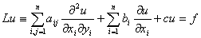

式中<i>a</i><i>ij</i>,<i>b</i><i>i</i>,<i>c,f</i>为<i>x</i>1,…,<i>x</i><i>n</i>的连续可微函数，<i>a</i><i>ij</i>=<i>a</i><i>ji</i>，二次型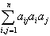是正定的.

&nbsp;&nbsp;&nbsp; [格林函数及其性质]&nbsp; 若<i>Lu=</i>0的共轭方程<i>L*u</i>=0的基本解<i>G</i>(<b><i>x</i></b><i>,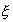</i>)在<i>D</i>的边界<i>S</i>上满足

<i>G</i>(<b><i>x</i></b><i>,</i>)=0,&nbsp; <b><i>x</i></b>∈<i>S</i>

则称<i>G</i>(<b><i>x</i></b><i>,</i>)为方程<i>Lu=</i>0的格林函数，式中<b><i>x</i></b><i>=</i>(<i>x</i>1,…,<i>x</i><i>n</i>)，<i>ξ</i>为参变点，<i>=</i>(<i></i>1,…,<i></i><i>n</i>)，即<i>G</i>(<b><i>x</i></b><i>,</i>)=<i>G</i>(<i>x</i>1,…,<i>x</i><i>n</i>;

<i></i>1,…,<i></i><i>n</i>).

&nbsp;&nbsp;&nbsp; 格林函数具有对称性质：设<i>G</i>(<b><i>x</i></b><i>,</i>),<i>V</i>(<b><i>x</i></b><i>,</i>)分别为方程<i>Lu=</i>0及其共轭方程的格林函数，则成立对称关系

<i>G</i>(<b><i>x</i></b><i>,</i>)=<i>V</i>(<b><i>x</i></b><i>,</i>)

特别如果<i>Lu</i>为自共轭微分算子，则有

<i>G</i>(<b><i>x</i></b><i>,</i>)=<i>G</i>(<i></i>,<b><i>x</i></b>)

&nbsp;&nbsp;&nbsp; [利用格林函数解边值问题]

&nbsp;&nbsp;&nbsp; 1°&nbsp; 一般公式&nbsp; 在区域<i>D</i>上应用格林公式（本节，四），并取<i>v=G</i>(<b><i>x</i></b><i>,</i>)，则方程<i>Lu=f</i>的狄利克莱问题<i>u</i>|<i>s</i>=的解为

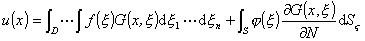

式中

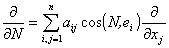&nbsp;&nbsp;&nbsp;&nbsp;&nbsp;
（<b><i>N</i></b>是<i>S</i>的外法线方向）

&nbsp;&nbsp;&nbsp; 2°&nbsp; 对于球体（球心为<i>O</i>，半径为<i>a</i>），<i>u=</i>0的基本解为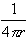，<i>r</i>为<i>P</i>(<i>x,y,z</i>)与参变点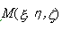的距离，作<i>M</i>关于球面的反演点<i>M</i>1，记<i>r</i>1为<i>M</i>1与<i>P</i>的距离，则格林函数为

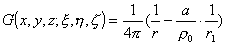

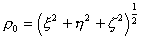.狄利克莱问题<i>u</i>|<i>s</i>=的解为

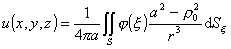

式中<i>S</i>为球面.引用球坐标时，解为泊松积分(本节，三，3).

&nbsp;&nbsp;&nbsp; 3°&nbsp; 在圆上（半径为<i>a</i>），<i>u=</i>0的格林函数为

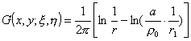

式中<i>r</i>为<i>P</i>(<i>x,y</i>)与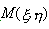参变点的距离，<i>r</i>1为<i>P</i>与<i>M</i>点关于圆的反演点<i>M</i>1的距离，圆上狄利克莱问题的解为泊松积分.

&nbsp;&nbsp;&nbsp; 

