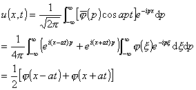

&nbsp;4.&nbsp; 积分变换法

&nbsp;&nbsp;&nbsp; 积分变换法是解线性微分方程，特别是常系数方程的一种有效方法，它是把方程的某一独立变量看成参变量，作未知函数的积分变换，这样可减少原方程独立变量的个数而将方程化为简单形式（最简单的情况是常微分方程，甚至是代数方程）.解此简化方程的对应定解问题并通过逆积分变换就得到原定解问题的解.下面举例说明傅立叶变换和拉普拉斯变换方法.

&nbsp;&nbsp;&nbsp; 例<b>1</b>&nbsp; 用傅立叶变换法解弦振动方程的柯西问题

&nbsp;&nbsp;&nbsp; 解&nbsp; 把<i>t</i>作为参变量，作<i>u</i>(<i>x,t</i>)关于<i>x</i>的傅立叶变换

F

&nbsp;&nbsp;&nbsp; 原来的柯西问题化为下面的定解问题

把<i>p</i>看作参数，其解为

由傅立叶变换的反演公式得到原问题的解

&nbsp;&nbsp;&nbsp; 例<b>2</b>&nbsp; 用拉普拉斯变换法解热传导方程的定解问题

&nbsp;&nbsp;&nbsp; 解&nbsp; 把<i>x</i>当作参变量，作<i>u</i>(<i>x,t</i>)关于<i>t</i>的拉普拉斯变换

L

原问题化为

通解为

要求解有界.<i>c</i>2必须为零，所以，

查拉普拉斯变换表（第十一章）得

式中erfc(<i>y</i>)为余误差函数.

