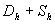

<b>§</b><b>4&nbsp;&nbsp; </b><b>偏微分方程的数值解法</b>

一、&nbsp;&nbsp;&nbsp;
一、&nbsp;&nbsp;&nbsp;&nbsp;&nbsp;&nbsp;&nbsp;&nbsp;
差分法

&nbsp;&nbsp;&nbsp; 差分法是常用的一种数值解法.它是在微分方程中用差商代替偏导数，得到相应的差分方程，通过解差分方程得到微分方程解的近似值.

&nbsp;&nbsp;&nbsp; 1.&nbsp; 网格与差商

<table cellspacing=0 cellpadding=0 hspace=0 vspace=0 align=left>
 <tr>
  <td valign=top align=left style='padding-top:0mm;padding-right:9.0pt;
  padding-bottom:0mm;padding-left:9.0pt'>
  

  

  
图14.7

  

  </td>
 </tr>
</table>

&nbsp;&nbsp;&nbsp; 在平面 (<i>x </i>, <i>y</i>)上的一以<i>S</i>为边界的有界区域<i>D</i>上考虑定解问题.为了用差分法求解，分别作平行于<i>x</i>轴和<i>y</i>轴的直线族.

&nbsp;&nbsp;&nbsp;&nbsp;&nbsp;
(<i>i</i>, <i>j</i>=0,1,2,…,<i>n</i>)&nbsp; 

作成一个正方形网格，这里<i>h</i>为事先指定的正数，称为步长；网格的交点称为节点，简记为(<i>i</i>, <i>j</i>).取一些与边界<i>S</i>接近的网格节点，用它们连成折线，所围成的区域记作.称内的节点为内节点，位于上的节点称为边界节点（图14.7）.下面都在网格上考虑问题：寻求各个节点上解的近似值.在边界节点上取与它最接近的边界点上的边值作为解的近似值，而在内节点上，用以下的差商代替偏导数：

&nbsp;&nbsp;&nbsp; 注意， 1°&nbsp; 式中的差商称为向后差商，而称为向前差商，称为中心差商.也可用向前差商或中心差商代替一阶偏导数.

&nbsp;&nbsp;&nbsp; 2°&nbsp; <i>x</i>轴与<i>y</i>轴也可分别采用不同的步长<i>h</i>, <i>l</i>，即用直线族

&nbsp;&nbsp;
(<i>i ,j</i>=0, ±1, ±2 )

作一个矩形网格.

