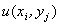
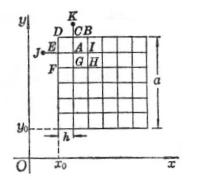

2.&nbsp; 椭圆型方程的差分方法

&nbsp;&nbsp;&nbsp; [五点格式]&nbsp; 考虑拉普拉斯方程的第一边值问题

式中为定义在<i>D</i>的边界<i>S</i>上的已知函数.

&nbsp;&nbsp;&nbsp; 采用正方形网格，记，在节点(<i>i</i>, <i>j</i>)上分别用差商

代替，对应的差分方程为

&nbsp; &nbsp;&nbsp;&nbsp;&nbsp;&nbsp;&nbsp;&nbsp;&nbsp;&nbsp;&nbsp;&nbsp;&nbsp;&nbsp;&nbsp;&nbsp;&nbsp;&nbsp;&nbsp;&nbsp;&nbsp;&nbsp;&nbsp;&nbsp;&nbsp;&nbsp;&nbsp;&nbsp;&nbsp;&nbsp;&nbsp;&nbsp;&nbsp;&nbsp;&nbsp;&nbsp;&nbsp;&nbsp;（1）

或

即任一节点(<i>i</i>,
<i>j</i>)上的值等于周围相邻节点上解的值的算术平均，这种形式的差分方程称为五点格式，在边界节点上取

&nbsp;&nbsp;&nbsp;&nbsp;&nbsp;&nbsp;&nbsp;&nbsp;&nbsp;&nbsp;&nbsp;&nbsp;&nbsp;&nbsp;&nbsp;&nbsp;&nbsp;&nbsp;&nbsp;&nbsp;&nbsp;&nbsp;&nbsp;&nbsp;&nbsp;&nbsp;&nbsp;&nbsp;&nbsp;&nbsp;
(2)

式中是与节点(<i>i</i>, <i>j</i>)最接近的<i>S</i>上的点.于是得到了以所有内节点上的值为未知量的若干个线性代数方程，由于每一个节点都可列出一个方程，所以未知量的个数与方程的个数都等于节点的总数，于是，可用通常的方法（如高斯消去法）解此线性代数方程组，但当步长不很大时，用高斯消去法将会遇到很大困难，可用下面介绍的其他方法求解.

&nbsp;&nbsp; &nbsp;若<i>h</i>0时，差分方程的解收敛于微分方程的解，则称差分方程为收敛的.

&nbsp;&nbsp;&nbsp; 在计算过程中，由于进行四则运算引起舍入误差，每一步计算的舍入误差都会影响以后的计算结果，如果这种影响所产生的计算偏差可以控制，而不至于随着计算次数的增加而无限增大，则称差分方程是稳定的.

&nbsp;&nbsp;&nbsp; [迭代法解差分方程]&nbsp; 在五点格式的差分方程中，任意取一组初值{}，只要求它们在边界节点(<i>i</i>, <i>j</i>)上取以已知值，然后用逐次逼近法（也称迭代法）解五点格式：

逐次求出{}.当(<i>i+</i>1, <i>j</i>)，(<i>i</i>－1, <i>j</i>)，(<i>i</i>, <i>j</i>－1)，(<i>i</i>, <i>j+</i>1)中有一点是边界节点时，每次迭代时，都要在这一点上取最接近的边界点的值.当<i>n</i>→∞时，收敛于差分方程的解，因此<i>n</i>充分大时，{}可作差分方程的近似解，迭代次数越多，近似解越接近差分方程的解.

&nbsp;&nbsp;&nbsp; [用调节余数法求节点上解的近似值]&nbsp; 以差商代替Δ<i>u</i>时，用节点(<i>i+</i>1, <i>j</i>)，(<i>i</i>－1, <i>j</i>)，(<i>i</i>, <i>j+</i>1)，(<i>i</i>, <i>j</i>－1)上<i>u</i>的近似值来表示<i>u</i>在节点(<i>i</i>, <i>j</i>)的值将产生的误差，称此误差为余数，即

<table cellspacing=0 cellpadding=0 hspace=0 vspace=0 align=left>
 <tr>
  <td valign=top align=left style='padding-top:0mm;padding-right:9.0pt;
  padding-bottom:0mm;padding-left:9.0pt'>
  

  

  
图14.8

  

  </td>
 </tr>
</table>

&nbsp;&nbsp;&nbsp; 设在(<i>i</i>, <i>j</i>)上给以改变量，从上式可见将减少4，而其余含有的差分方程中的余数将增加，多次调整的值就可将余数调整到许可的有效数字的范围内，这样可获得各节点上<i>u</i>(<i>x</i>, <i>y</i>)的近似值.这种方法比较简单，特别在对称区域中计算更简捷.

&nbsp;&nbsp;&nbsp; 例&nbsp; 求Δ<i>u</i>=0在内节点<i>A</i>,<i>B</i>,<i>C</i>,<i>D</i>上解的近似值.设在边界节点1,2,3,4上分别取值为1,2,3,4（图14.8）

&nbsp;&nbsp;&nbsp; 解&nbsp; 记<i>u</i>(<i>A</i>)=<i></i>，点<i>A</i>,<i>B</i>,<i>C</i>,<i>D</i>的余数分别为

－4<i></i>+&nbsp; <i>u</i><i>B</i>+&nbsp; <i>u</i><i>c</i>&nbsp;&nbsp;&nbsp;&nbsp;&nbsp;&nbsp;&nbsp;
+5=<i></i>

<i></i><i>&nbsp; </i>－4 <i>u</i><i>B</i> &nbsp;&nbsp;&nbsp;&nbsp;&nbsp;&nbsp;&nbsp;&nbsp;+
<i>u</i><i>D</i>+7=<i>R</i><i>B</i>

<i></i><i>&nbsp; </i>&nbsp;&nbsp;&nbsp;&nbsp;&nbsp;&nbsp;&nbsp; －4 <i>u</i><i>c</i>+ <i>u</i><i>D</i>+3=<i>R</i><i>C</i>

&nbsp;&nbsp;&nbsp;&nbsp;&nbsp;&nbsp;&nbsp;&nbsp;&nbsp;&nbsp;&nbsp;&nbsp;
<i>u</i><i>B</i>+&nbsp; <i>u</i><i>c</i>－4<i>u</i><i>D</i>+5=<i>R</i><i>D</i>

&nbsp;&nbsp;&nbsp; 以边界节点的边值的算术平均值作为初次近似值，即

<i></i>=<i>u</i><i>B</i>(0)=<i>u</i><i>C</i>(0)=<i>u</i><i>D</i>(0)=2.5

则相应的余数为：

<i></i><i> </i>=0,&nbsp; <i>R</i><i>B</i>=2,&nbsp; <i>R</i><i>C</i>= －2,&nbsp; <i>R</i><i>D</i>=0

最大余数为±2.先用<i>δ</i><i>u</i><i>C</i>=－0.5把<i>R</i><i>C</i>缩减为零，<i>u</i><i>C</i>相应地变为2，这时<i></i>,<i>
R</i><i>D</i>也同时缩减(－0.5)，新余数是<i></i>=－0.5,<i>R</i><i>B</i>=2,, <i>R</i><i>D</i>=－0.5.类似地再变更<i>δ</i><i>u</i><i>B</i>=0.5，从而 <i>u</i><i>B</i>变为3，则得新余数为.这样便可消去各节点的余数，于是<i>u</i>在各节点的近似值为：

<i></i><i>&nbsp; </i>=2.5,&nbsp; <i>u</i><i>B</i>=3,&nbsp; <i>u</i><i>C</i>=2,&nbsp;
<i>u</i><i>D</i>=2.5

&nbsp;&nbsp;&nbsp; 现将各次近似值及余数列表如下：

<table class=MsoNormalTable border=1 cellspacing=0 cellpadding=0
 style='border-collapse:collapse;border:none'>
 <tr>
  <td width=32 rowspan=2 style='width:24.0pt;border:solid windowtext 1.0pt;
  border-left:none;padding:0mm 5.4pt 0mm 5.4pt'>
  
次数

  </td>
  <td width=104 rowspan=2 style='width:78.0pt;border:solid windowtext 1.0pt;
  border-left:none;padding:0mm 5.4pt 0mm 5.4pt'>
  
调 整 值

  </td>
  <td width=496 colspan=8 style='width:372.0pt;border-top:solid windowtext 1.0pt;
  border-left:none;border-bottom:solid windowtext 1.0pt;border-right:none;
  padding:0mm 5.4pt 0mm 5.4pt'>
  
第<i>n</i>次近似值及余数

  </td>
 </tr>
 <tr>
  <td width=62 style='width:46.5pt;border-top:none;border-left:none;border-bottom:
  solid windowtext 1.0pt;border-right:solid windowtext 1.0pt;padding:0mm 5.4pt 0mm 5.4pt'>
  
<i></i>

  </td>
  <td width=62 style='width:46.5pt;border-top:none;border-left:none;border-bottom:
  solid windowtext 1.0pt;border-right:solid windowtext 1.0pt;padding:0mm 5.4pt 0mm 5.4pt'>
  
<i></i>

  </td>
  <td width=62 style='width:46.5pt;border-top:none;border-left:none;border-bottom:
  solid windowtext 1.0pt;border-right:solid windowtext 1.0pt;padding:0mm 5.4pt 0mm 5.4pt'>
  
<i>uB</i>

  </td>
  <td width=62 style='width:46.5pt;border-top:none;border-left:none;border-bottom:
  solid windowtext 1.0pt;border-right:solid windowtext 1.0pt;padding:0mm 5.4pt 0mm 5.4pt'>
  
<i>RB</i>

  </td>
  <td width=62 style='width:46.5pt;border-top:none;border-left:none;border-bottom:
  solid windowtext 1.0pt;border-right:solid windowtext 1.0pt;padding:0mm 5.4pt 0mm 5.4pt'>
  
<i>uC</i>

  </td>
  <td width=62 style='width:46.5pt;border-top:none;border-left:none;border-bottom:
  solid windowtext 1.0pt;border-right:solid windowtext 1.0pt;padding:0mm 5.4pt 0mm 5.4pt'>
  
<i>RC</i>

  </td>
  <td width=62 style='width:46.5pt;border-top:none;border-left:none;border-bottom:
  solid windowtext 1.0pt;border-right:solid windowtext 1.0pt;padding:0mm 5.4pt 0mm 5.4pt'>
  
<i>uD</i>

  </td>
  <td width=62 style='width:46.5pt;border:none;border-bottom:solid windowtext 1.0pt;
  padding:0mm 5.4pt 0mm 5.4pt'>
  
<i>RD</i>

  </td>
 </tr>
 <tr>
  <td width=32 style='width:24.0pt;border-top:none;border-left:none;border-bottom:
  solid windowtext 1.0pt;border-right:solid windowtext 1.0pt;padding:0mm 5.4pt 0mm 5.4pt'>
  
0

  
1

  
2

  </td>
  <td width=104 valign=top style='width:78.0pt;border-top:none;border-left:
  none;border-bottom:solid windowtext 1.0pt;border-right:solid windowtext 1.0pt;
  padding:0mm 5.4pt 0mm 5.4pt'>
  
<i>δ</i><i>uC</i> = －0.5

  
<i>δ</i><i>uB</i> =&nbsp; 0.5

  </td>
  <td width=62 valign=top style='width:46.5pt;border-top:none;border-left:none;
  border-bottom:solid windowtext 1.0pt;border-right:solid windowtext 1.0pt;
  padding:0mm 5.4pt 0mm 5.4pt'>
  
2.5

  
2.5

  
2.5

  </td>
  <td width=62 valign=top style='width:46.5pt;border-top:none;border-left:none;
  border-bottom:solid windowtext 1.0pt;border-right:solid windowtext 1.0pt;
  padding:0mm 5.4pt 0mm 5.4pt'>
  
0

  
－0.5

  
0

  </td>
  <td width=62 valign=top style='width:46.5pt;border-top:none;border-left:none;
  border-bottom:solid windowtext 1.0pt;border-right:solid windowtext 1.0pt;
  padding:0mm 5.4pt 0mm 5.4pt'>
  
2.5

  
2.5

  
3

  </td>
  <td width=62 valign=top style='width:46.5pt;border-top:none;border-left:none;
  border-bottom:solid windowtext 1.0pt;border-right:solid windowtext 1.0pt;
  padding:0mm 5.4pt 0mm 5.4pt'>
  
2

  
&nbsp;&nbsp;&nbsp;&nbsp;
  2

  
0

  </td>
  <td width=62 valign=top style='width:46.5pt;border-top:none;border-left:none;
  border-bottom:solid windowtext 1.0pt;border-right:solid windowtext 1.0pt;
  padding:0mm 5.4pt 0mm 5.4pt'>
  
2.5

  
2

  
2

  </td>
  <td width=62 valign=top style='width:46.5pt;border-top:none;border-left:none;
  border-bottom:solid windowtext 1.0pt;border-right:solid windowtext 1.0pt;
  padding:0mm 5.4pt 0mm 5.4pt'>
  
－2

  
0

  
0

  </td>
  <td width=62 valign=top style='width:46.5pt;border-top:none;border-left:none;
  border-bottom:solid windowtext 1.0pt;border-right:solid windowtext 1.0pt;
  padding:0mm 5.4pt 0mm 5.4pt'>
  
2.5

  
2.5

  
2.5

  </td>
  <td width=62 valign=top style='width:46.5pt;border:none;border-bottom:solid windowtext 1.0pt;
  padding:0mm 5.4pt 0mm 5.4pt'>
  
0

  
－0.5

  
0

  </td>
 </tr>
 <tr style='height:21.95pt'>
  <td width=136 colspan=2 style='width:102.0pt;border-top:none;border-left:
  none;border-bottom:solid windowtext 1.0pt;border-right:solid windowtext 1.0pt;
  padding:0mm 5.4pt 0mm 5.4pt;height:21.95pt'>
  
结果近似值

  </td>
  <td width=62 style='width:46.5pt;border-top:none;border-left:none;border-bottom:
  solid windowtext 1.0pt;border-right:solid windowtext 1.0pt;padding:0mm 5.4pt 0mm 5.4pt;
  height:21.95pt'>
  
2.5

  </td>
  <td width=62 style='width:46.5pt;border-top:none;border-left:none;border-bottom:
  solid windowtext 1.0pt;border-right:solid windowtext 1.0pt;padding:0mm 5.4pt 0mm 5.4pt;
  height:21.95pt'>
  
&nbsp; 

  </td>
  <td width=62 style='width:46.5pt;border-top:none;border-left:none;border-bottom:
  solid windowtext 1.0pt;border-right:solid windowtext 1.0pt;padding:0mm 5.4pt 0mm 5.4pt;
  height:21.95pt'>
  
3

  </td>
  <td width=62 style='width:46.5pt;border-top:none;border-left:none;border-bottom:
  solid windowtext 1.0pt;border-right:solid windowtext 1.0pt;padding:0mm 5.4pt 0mm 5.4pt;
  height:21.95pt'>
  
&nbsp; 

  </td>
  <td width=62 style='width:46.5pt;border-top:none;border-left:none;border-bottom:
  solid windowtext 1.0pt;border-right:solid windowtext 1.0pt;padding:0mm 5.4pt 0mm 5.4pt;
  height:21.95pt'>
  
2

  </td>
  <td width=62 style='width:46.5pt;border-top:none;border-left:none;border-bottom:
  solid windowtext 1.0pt;border-right:solid windowtext 1.0pt;padding:0mm 5.4pt 0mm 5.4pt;
  height:21.95pt'>
  
&nbsp; 

  </td>
  <td width=62 style='width:46.5pt;border-top:none;border-left:none;border-bottom:
  solid windowtext 1.0pt;border-right:solid windowtext 1.0pt;padding:0mm 5.4pt 0mm 5.4pt;
  height:21.95pt'>
  
2.5

  </td>
  <td width=62 style='width:46.5pt;border:none;border-bottom:solid windowtext 1.0pt;
  padding:0mm 5.4pt 0mm 5.4pt;height:21.95pt'>
  
&nbsp; 

  </td>
 </tr>
</table>

&nbsp;&nbsp;&nbsp; [解重调和方程的差分方法]&nbsp; 在矩形<i>D</i>(<i>x</i>0≤<i>x</i>≤<i>x</i>0+<i>a</i>,<i>y</i>0≤<i>y</i>≤<i>y</i>0+<i>a</i>)中考虑重调和方程

取步长，引直线族

&nbsp;&nbsp;&nbsp; (<i>i</i>,
<i>j</i> = 0, 1, 2
<i>n</i>)

作成一个正方形网格.用差商代替偏导数

<table cellspacing=0 cellpadding=0 hspace=0 vspace=0 align=left>
 <tr>
  <td valign=top align=left style='padding-top:0mm;padding-right:9.05pt;
  padding-bottom:0mm;padding-left:9.05pt'>
  

  
&nbsp;

  

  
上式表明了以(<i>x</i>, <i>y</i>)为中心时，<i>u</i>(<i>x</i>, <i>y</i>)的函数值与周围各点函数值的关系，但对于邻近边界节点的点(<i>x</i>, <i>y</i>)，如图14.9中的<i>A</i>，就不能直接使用上式，此时将划分网格的直线族延伸，在延伸线上定出与边界距离为<i>h</i>的点，称这些点为外邻边界节点，如图14.9以<i>A</i>为中心时，点<i>E</i>,<i>C</i>为边界节点，点<i>J</i>,<i>K</i>为<i>E</i>,<i>C</i>的外邻边界节点，用下法补充定义外邻边界节点<i>J</i>处函数的近似值<i>u</i><i>J</i>，便可应用上面的公式.

  
1°&nbsp; 边界条件为

  

  
图14.9

  

  </td>
 </tr>
</table>

&nbsp;

&nbsp;

&nbsp;

&nbsp;

&nbsp;

&nbsp;

&nbsp;

&nbsp;

时，定义<i></i>.

2°&nbsp;&nbsp;&nbsp; 边界条件为

时，定义<i></i>.

&nbsp;&nbsp;&nbsp; [其他与Δ<i>u</i>有关的网格]

&nbsp;&nbsp;&nbsp; 1°&nbsp; 三角网格（图14.10(<i>a</i>)）

&nbsp;&nbsp;&nbsp; 取<i>P</i>0(<i>x</i>, <i>y</i>)为中心，它的周围6个邻近节点分别为：

则&nbsp;&nbsp;&nbsp;&nbsp;&nbsp;&nbsp;&nbsp;&nbsp;&nbsp;&nbsp;&nbsp;&nbsp;&nbsp;&nbsp;&nbsp;&nbsp;&nbsp;&nbsp;&nbsp;&nbsp;&nbsp;&nbsp;

式中，<i>R</i>表示余项.

&nbsp;&nbsp;&nbsp; 2°&nbsp; 六角网格（图14.10(<i>b</i>)） 
&nbsp;&nbsp;&nbsp; 取<i>P</i>0(<i>x</i>, <i>y</i>)为中心，它的三个邻近节点分别为

则&nbsp;&nbsp;&nbsp;&nbsp;&nbsp;&nbsp;&nbsp;&nbsp;&nbsp;&nbsp;&nbsp;&nbsp;&nbsp;&nbsp;&nbsp;&nbsp;&nbsp;&nbsp;&nbsp;&nbsp;&nbsp;&nbsp;&nbsp;&nbsp;&nbsp;&nbsp;
.

图14.10

&nbsp;&nbsp;&nbsp; 3°&nbsp; 极坐标系中的网格（图14.10(<i>c</i>)）

&nbsp;&nbsp;&nbsp; 取<i>P</i>0(<i>r</i>,)为中心，它的四个邻近节点分别为

而拉普拉斯方程

的相应的差分方程为

