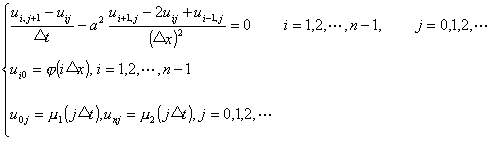

3.&nbsp;
抛物型方程的差分方法

&nbsp;&nbsp;&nbsp; 考虑热传导方程的边值问题

将[0,<i>b</i>]分为<i>n</i>等份，每段长为.引两族平行线（图14.11）

&nbsp;

图14.11

<i>x</i>=<i>x</i><i>i</i>=<i>ix</i>&nbsp;&nbsp;&nbsp;&nbsp;&nbsp;
(<i>i</i>=0,1,2<i>n</i>)

<i>y</i>=<i>y</i><i>j</i>=<i>jt</i>&nbsp;&nbsp;&nbsp;&nbsp;&nbsp; (<i>j</i>=0,1,2<i>t</i> 取值见后)

作成一个长方形的网格，记<i>u</i>(<i>x</i><i>i</i>,<i>t</i><i>j</i>)为<i>u</i><i>ij</i>，节点(<i>x</i><i>i</i>,<i>t</i><i>j</i>)为(<i>i</i>,<i>j</i>)，在节点(<i>i</i>,<i>j</i>)上分别用

代替，于是边值问题化为差分方程

记，差分方程可写成

<pre style='text-align:right;line-height:12.0pt;text-autospace:none;vertical-align:
bottom' align=right>&nbsp;&nbsp;&nbsp;&nbsp;&nbsp;&nbsp;&nbsp;&nbsp;&nbsp;&nbsp;&nbsp;&nbsp;&nbsp;&nbsp;&nbsp;&nbsp;&nbsp;&nbsp;&nbsp;&nbsp;&nbsp;&nbsp;&nbsp;&nbsp;&nbsp;&nbsp; （1）</pre>

由此可按<i>t</i>增加的方向逐排求解.在第0排上<i>u</i><i>i</i>0的值由初值(<i>ix</i>)确定，<i>j</i>+1排<i>u</i><i>i</i>,<i>j</i>+1的值可由第<i>j</i>排的三点(<i>i</i>+1,<i>j</i>),(<i>i</i>,<i>j</i>),(<i>i</i><i>－</i>1,<i>j</i>)上的值<i>u</i><i>i</i>+1,<i>j</i>, <i>u</i><i>ij</i>,<i>u</i><i>i</i>-1,<i>j</i>确定，而<i>u</i>0,<i>j</i>+1,<i>u</i><i>n</i>,<i>j</i>+1已由边界条件1((<i>j</i>+1)<i>t</i>)及2((<i>j</i>+1)<i>t</i>)给定，于是可逐排计算一切节点上的<i>u</i><i>ij</i>值.当<i></i>(<i>x</i>), 1(<i>x</i>)和2(<i>x</i>)充分光滑，且时，差分方程收敛而且稳定.所以利用差分方程（1）计算时，必须使，即.

&nbsp;&nbsp;&nbsp; 热传导方程还可用差分方程

代替，此时如已知前<i>j</i>排<i>u</i><i>ij</i>的值，为求第<i>j</i>+1排的<i>u</i><i>i</i>,<i>j</i>+1 必须解包含<i>n</i><i>－</i>1个未知量的线性代数方程组，这种差分方程称为隐式格式的差分方程，前面所提的差分方程称为显式格式差分方程.

&nbsp;&nbsp;&nbsp; 隐式格式差分方程对任意的<i>λ</i>都是稳定的.

