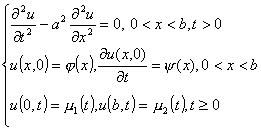
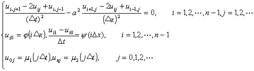
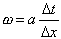
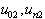
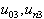
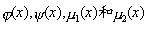
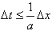

4.&nbsp;
双曲型方程的差分方法

&nbsp;&nbsp;&nbsp; 考虑弦振动方程的第一边值问题

&nbsp;&nbsp;&nbsp; 用矩形网格，列出对应的差分方程：

&nbsp;&nbsp;&nbsp; 记与上段一样，利用和在第0排及第1排的已知数值（初始条件）<i>u</i><i>i</i>0 , <i>u</i><i>i</i>1可计算<i>u</i><i>i</i>2，然后用已知的<i>u</i><i>i</i>1 , <i>u</i><i>i</i>2及可计算<i>u</i><i>i</i>3,类似地可确定一切节点上的<i>u</i><i>ij</i>值.

&nbsp;&nbsp;&nbsp; 当充分光滑，且<i>ω</i>≤1时，差分方程收敛且稳定，所以要取.

