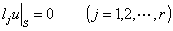
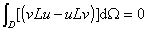

<h3 style='text-autospace:none;vertical-align:bottom'>二、变分方法</h3>

&nbsp;&nbsp;&nbsp; 1.&nbsp; 自共轭边值问题

&nbsp;&nbsp;&nbsp; 将§3定义的共轭微分算子的概念推广到一般方程.

&nbsp;&nbsp;&nbsp; 设<i>D</i>是中的有界区域，<i>S</i>为其边界，在上考虑2<i>k</i>阶线性微分方程

的齐次边值问题

式中<i>f</i>(<i>x</i>)是<i>D</i>内的已知函数，<i>l</i><i>ju</i>是线性微分算子.

&nbsp;&nbsp;&nbsp; 将 分部积分<i>k</i>次得

式中(<i>u</i>,<i>v</i>)是一个<i>D</i>上的积分，其被积函数包含<i>u</i>,<i>v</i>的<i>k</i>阶导数；<i>R</i><i>j</i>和是定义在边界<i>S</i>上的两个线性微分算子.再将(<i>u</i>,<i>v</i>)分部积分<i>k</i>次得

式中<i>L*</i>是一个2<i>k</i>阶的微分算子，称为<i>L</i>的共轭微分算子.若<i>L=L*</i>，则称<i>L</i>为自共轭微分算子.从上面可推出格林公式

如从<i>l</i><i>ju</i>|<i>S</i>=<i>l</i><i>jv</i>|<i>S</i>=0可推出在边界<i>S</i>上

则称<i>l</i><i>ju</i>|<i>S</i>=0为自共轭边界条件.如果微分算子及边界条件都是自共轭的，则称相应的边值问题为自共轭边值问题，此时有

&nbsp;&nbsp;&nbsp; 每个边值问题对应于某希尔伯特空间<i>H</i>（例如<i>L</i>2(<i>D</i>)，见第九章§7）中的一个算子<i>A</i>，其定义域<i>M</i><i>A</i> 是<i>H</i>中一线性稠密集合，它由足够次连续可微且满足边界条件的函数组成，在<i>M</i><i>A</i>上，<i>Au</i>的数值与<i>Lu</i>的数值相同，从而求解边值问题化为解算子方程

的问题.

&nbsp;&nbsp; &nbsp;设<i>A</i>为定义在实的希尔伯特空间<i>H</i>中的某线性稠密集合<i>M</i><i>A</i>上的线性算子.若对于<i>M</i><i>A</i>的任意非零元素成立

(<i>Au</i>,<i>v</i>)=(<i>u</i>,<i>Av</i>)

则称<i>A</i>为对称算子.若对任意非零元素<i>u</i>成立

则称<i>A</i>为正算子.如成立更强的不等式

(<i>Au</i>,<i>u</i>)≥<i>r</i>||<i>u</i>||2&nbsp;&nbsp;&nbsp;&nbsp;&nbsp;
(<i>r&gt;</i>0)

则称<i>A</i>为正定算子.此处(<i>u</i>,<i>v</i>)表示希尔伯特空间的内积，||<i>u</i>||2=(<i>u</i>,<i>u</i>).

