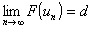
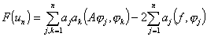
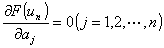

3.&nbsp;
极小化序列与里兹方法

&nbsp;&nbsp;&nbsp; 在处理变分问题中，极小化序列起着重要的作用.考虑泛函

<i>F</i>(<i>u</i>)=(<i>Au</i>,<i>u</i>)－2(<i>f</i>,<i>u</i>)

以<i>d</i>表示泛函的极小值.设在希尔伯特空间中存在一列元素{<i>u</i><i>n</i>}&nbsp; (<i>n</i>=1,2)，使

则称{<i>u</i><i>n</i>}为极小化序列.

&nbsp;&nbsp;&nbsp; 定理&nbsp; 若算子<i>A</i>是正定的，则<i>F</i>(<i>u</i>)的每一个极小化序列既按<i>H</i>空间的模也按<i>H</i>0的模收敛于使泛函<i>F</i>(<i>u</i>)取极小的元素.

&nbsp;&nbsp;&nbsp; 这个定理不但指出利用极小化序列可求问题的解，而且提供一种近似解的求法，即把极小化序列中的每一个元素当作问题的近似解.

&nbsp;&nbsp;&nbsp; 设算子<i>A</i>是正定的，构造极小化序列的里兹方法的主要步骤是：

&nbsp;&nbsp;&nbsp; (1)&nbsp; 在线性集合<i>M</i><i>A</i>中选取<i>H</i>0中完备的元素序列{<i>i</i>} ， (<i>i</i>=1,2) 并要求对任意的<i>n</i>,1,2,…,<i>n</i>线性无关.称这样的元素为坐标元素.

&nbsp;&nbsp;&nbsp; (2)&nbsp; &nbsp;令 ，其中<i>a</i><i>k</i>为待定系数.代入泛函<i>F</i>(<i>u</i>)，得自变量<i>a</i>1,<i>a</i>2,…,<i>a</i><i>n</i>的函数

&nbsp;&nbsp;&nbsp; (3)&nbsp; 为使函数<i>F</i>(<i>u</i><i>n</i>)取极小，必须，从而求出<i>a</i><i>k</i>&nbsp;&nbsp; (<i>k</i>=1,2,…,<i>n</i>).序列{<i>u</i><i>n</i>}即为极小化序列，<i>u</i><i>n</i>可作为问题的近似解.

