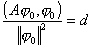
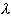
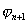
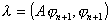
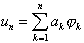
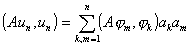
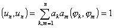
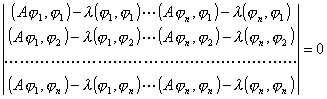
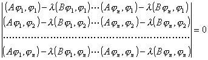

4.&nbsp;
里兹方法在特征值问题上的应用

&nbsp;&nbsp;&nbsp; 算子方程

<i>Au</i><i>－u</i>=0

的非零解称为算子<i>A</i>的特征值，对应的非零解<i>u</i>称为所对应的特征函数.

&nbsp;&nbsp;&nbsp; 对线性算子<i>A</i>，若存在常数<i>K</i>，使对任何<i>M</i><i>A</i>的元素成立

(<i>A</i>,)≥<i>K</i>||||2

则称<i>A</i>为下有界算子，正定算子是下有界的（此时<i>K</i>=0）.记(<i>A</i>,)/||||2的下确界为<i>d</i>.

&nbsp;&nbsp;&nbsp; 定理1&nbsp; 设<i>A</i>为下有界对称算子，若存在不为零的元素0<i>M</i><i>A</i>，使

则<i>d</i>就是<i>A</i>的最小特征值，0为对应的特征函数.

&nbsp;&nbsp;&nbsp; 于是求下有界对称算子的最小特征值问题化为变分问题，即在希尔伯特空间中求使泛函(<i>A</i>,)/||||2取极小的元素，或在||||=1的条件下求使泛函(<i>A</i>,)取极小的元素.

&nbsp;&nbsp;&nbsp; 定理2&nbsp; 设<i>A</i>是下有界对称算子，1≤2≤…≤<i>n</i>是它的前<i>n</i>个特征值，1,2,…,<i>n</i>是对应的标准正交特征函数，如果存在不为零的元素，在附加条件

(,)=1, (,1)=0,&nbsp; (,2)=0,&nbsp; …,&nbsp; (,<i></i><i>n</i>)=0

下使泛函(<i>A</i>,)取极小，则<i>n</i>+1是算子<i>A</i>的特征函数，对应的特征值

就是除1 ，<i>n</i>外的最小的一个特征值.

&nbsp;&nbsp;&nbsp; 于是求第<i>n</i>+1个特征值就化为变分问题，即在附加条件

(,)=1, (,1)=0,&nbsp; (,2)=0,&nbsp; (,<i>n</i>)=0

下求使泛函(<i>A</i>,)取极小的元素.

&nbsp;&nbsp;&nbsp; 为了利用里兹方法求特征值，在<i>M</i><i>A</i>中选取一列在<i>H</i>0中完备的坐标元素序列{<i>i</i>},&nbsp;
(<i>i</i>=1,2)， 令，确定<i>a</i><i>k</i>，使在条件 (<i>u</i><i>n</i>,<i>u</i><i>n</i>)=1下，(<i>Au</i><i>n</i>,<i>u</i><i>n</i>)取极小，这个问题化为求<i>n</i>个变元<i>a</i>1,<i>a</i>2,…,<i>a</i><i>n</i>的函数

在条件

下的极值问题，一般可用拉格朗日乘数法解（见第九章§3，<i>t</i>），此时

的最小的根即为特征值的近似值，如果将上式的根按大小排列，就依次得后面的特征值的近似值，但精确度较差.

&nbsp;&nbsp;&nbsp; 对一般算子方程

<i>Au</i><i>－Bu=</i>0

如果<i>A</i>为下有界对称算子，<i>B</i>为正定算子，则

的根就是特征值的近似值.

