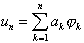
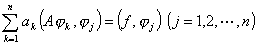

5.&nbsp;
迦辽金方法 

&nbsp;&nbsp;&nbsp; 用里兹方法解数学物理问题有很多限制，最主要的限制是要求算子正定，但很多问题不一定满足这个条件，迦辽金方法弥补了这个缺陷.

&nbsp;&nbsp;&nbsp; 迦辽金方法的主要步骤是：

&nbsp;&nbsp;&nbsp; (1)&nbsp; 在<i>M</i><i>A</i>中选取在空间<i>H</i>中完备的元素序列{<i>i</i>} (<i>i</i>=1,2)，其中任意<i>n</i>个元素线性无关，称{<i>i</i>} (<i>i</i>=1,2,…)为坐标元素序列.

&nbsp;&nbsp;&nbsp; (2)&nbsp; 把方程的近似解表示为

式中<i>a</i><i>k</i>是待定常数，把<i>u</i><i>n</i>代入方程<i>Au=f</i>中的<i>u</i>，两端与<i>j</i>&nbsp;&nbsp;
(<i>j</i>=1,2,…,<i>n</i>)求内积，得 <i>a</i><i>k</i>的<i>n</i>个代数方程

&nbsp;&nbsp;&nbsp; (3)&nbsp; 求出<i>a</i><i>k</i>，代回<i>u</i><i>n</i>的表达式，便得方程的近似解<i>u</i><i>n</i>.

&nbsp;&nbsp;&nbsp; 在自共轭边值问题中，当算子是正定时，由迦辽金方法和里兹方法得到的关于<i>a</i><i>k</i>的代数方程组是相同的.

