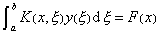
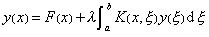
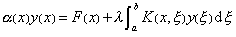
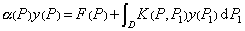
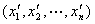
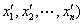
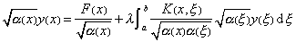
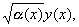
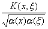

<b>第十五章</b><b>&nbsp; </b><b>积分方程</b>

积分方程论是泛函分析的一个重要分支，它是研究数学其他学科（例如偏微分方程边值问题）和各种物理问题的一个重要数学工具。本章叙述线性积分方程，重点介绍弗雷德霍姆积分方程的性质和解法；并简略地介绍了沃尔泰拉积分方程以及一些奇异积分方程；此外，还扼要地叙述积分方程的逐次逼近法和预解核，并举例说明近似解法；最后考察了一个非线性积分方程。

&nbsp;&nbsp;&nbsp;&nbsp;&nbsp;&nbsp;&nbsp;&nbsp;&nbsp;&nbsp;&nbsp;&nbsp;&nbsp;&nbsp;&nbsp;&nbsp;&nbsp;&nbsp;&nbsp;&nbsp;&nbsp;&nbsp;&nbsp;&nbsp;&nbsp;&nbsp;&nbsp;&nbsp;&nbsp;&nbsp;&nbsp;&nbsp;&nbsp; §1<b>&nbsp;&nbsp;&nbsp;&nbsp; </b><b>积分方程一般概念与弗雷德霍姆方程</b>

一. 积分方程一般概念

1. 积分方程的定义与分类

[线形积分方程]&nbsp; 在积分号下包含未知函数<i>y</i>(<i>x</i>)的方程

<pre style='text-align:right' align=center>&nbsp;&nbsp;&nbsp;&nbsp;&nbsp;&nbsp;&nbsp;&nbsp; &nbsp;&nbsp;&nbsp;&nbsp;&nbsp;&nbsp;&nbsp;&nbsp;&nbsp;&nbsp;&nbsp;&nbsp;&nbsp;&nbsp;&nbsp;&nbsp;&nbsp;&nbsp;&nbsp;&nbsp;&nbsp;&nbsp;&nbsp;&nbsp;(1)</pre>

称为积分方程。式中<i>α</i>(<i>x</i>),<i>F</i>(<i>x</i>)和<i>K</i>(<i>x,</i><i>ξ</i>)是已知函数，<i>λ</i><i>,a,b</i>是常数，变量<i>x</i>和ξ可取区间(<i>a,b</i>)内的一切值；<i>K</i>(<i>x,</i><i>ξ</i>)称为积分方程的核，<i>F</i>(<i>x</i>)称为自由项，λ称为方程的参数。如果<i>K</i>(<i>x,</i><i>ξ</i>)关于<i>x,</i><i>ξ</i>是对称函数，就称方程(1)是具有对称核的积分方程；如果方程中的未知函数是一次的，就称为线性积分方程，方程(1)就是线性积分方程的一般形式；如果<i>F</i>(<i>x</i>)≡0 ，就称方程(1)为齐次积分方程，否则称为非齐次积分方程。

[一维弗雷德霍姆积分方程（Fr方程）]

第一类Fr方程

第二类Fr方程

第三类Fr方程

[<i>n</i>维弗雷德霍姆积分方程]&nbsp; 

称为<i>n</i>维弗雷德霍姆积分方程，式中<i>D</i>是<i>n</i>维空间中的区域，<i>P,P</i>1&Icirc;<i>D</i><i>，</i>它们的坐标分别是(<i>x</i>1,<i>x</i>2,L,<i>xn</i>)和,<i>a</i>(<i>P</i>)=<i>a</i>(<i>x</i>1,<i>x</i>2,L,<i>xn</i>),<i>F</i>(<i>P</i>)=<i>F</i>(<i>x</i>1,<i>x</i>2,L<i>xn</i>)和<i>K</i>(<i>P,P</i>1)=<i>K</i>(<i>x</i>1,<i>x</i>2,L,<i>xn</i>, 是已知函数，<i>f</i>(<i>P</i>)是未知函数。

关于Fr方程的解法，一维和<i>n</i>(&gt;1)维的情况完全类似，因此在以后的讨论中仅着重考虑一维Fr方程。

[沃尔泰拉积分方程]&nbsp; 如果积分上限<i>b</i>改成变动上限，上面三类Fr方程分别称为第一、第二、第三类沃尔泰拉积分方程。

由于第三类Fr方程当<i>a</i>(<i>x</i>)在(<i>a</i>,<i>b</i>)内是正函数时，可以化成&nbsp;&nbsp;&nbsp;&nbsp;&nbsp;&nbsp;&nbsp;&nbsp;&nbsp;&nbsp;&nbsp;&nbsp;&nbsp;&nbsp;&nbsp;&nbsp;&nbsp;&nbsp;&nbsp;&nbsp;&nbsp;&nbsp;&nbsp;&nbsp;&nbsp;&nbsp;&nbsp;&nbsp;&nbsp;&nbsp;&nbsp;&nbsp;&nbsp;&nbsp;&nbsp;&nbsp;&nbsp;&nbsp;&nbsp;&nbsp;&nbsp;&nbsp;&nbsp;&nbsp;&nbsp;&nbsp;&nbsp;&nbsp;&nbsp;&nbsp;&nbsp;&nbsp;&nbsp;&nbsp;&nbsp;&nbsp;&nbsp;&nbsp;&nbsp;&nbsp;&nbsp;&nbsp;&nbsp;&nbsp;&nbsp;&nbsp;&nbsp;&nbsp;&nbsp;&nbsp;&nbsp;&nbsp;&nbsp;&nbsp;&nbsp;&nbsp;&nbsp;&nbsp;&nbsp;&nbsp;&nbsp;&nbsp;&nbsp;&nbsp;&nbsp;&nbsp;&nbsp;

它是含有未知函数以为积分方程的核的第二类Fr方程。所以本章重点研究一维第二类Fr方程。

