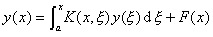

2. 积分方程与微分方程之间的关系

某些积分方程可化为微分方程，也可从微分方程推导出积分方程。先来考虑二阶线性微分方程的初值问题：

<pre style='text-align:right' align=right>&nbsp;&nbsp;&nbsp;&nbsp;&nbsp;&nbsp;&nbsp;&nbsp; &nbsp;&nbsp;&nbsp;&nbsp;&nbsp;&nbsp;&nbsp;&nbsp;&nbsp;&nbsp;&nbsp;&nbsp;&nbsp;&nbsp;&nbsp;&nbsp;&nbsp;&nbsp;&nbsp;（2）</pre>

若从方程(2)中解出，然后在区间(<i>a</i>,<i>x</i>)上对<i>x</i>求积分两次，利用初始条件，经过简单的计算不难得出<a href="#None"
name="_ftnref1" title="">*</a>，

&nbsp;&nbsp;&nbsp;&nbsp;&nbsp;&nbsp;&nbsp;&nbsp;&nbsp; 

令

和

上式就可写为如下的形式:

<pre style='text-align:right' align=right>&nbsp;&nbsp;&nbsp; &nbsp;&nbsp;&nbsp;&nbsp;&nbsp;&nbsp;&nbsp;&nbsp;&nbsp;&nbsp; &nbsp;&nbsp;&nbsp;&nbsp;&nbsp;&nbsp;&nbsp;&nbsp;&nbsp;&nbsp;&nbsp;&nbsp;&nbsp;&nbsp;&nbsp;&nbsp;&nbsp;&nbsp;&nbsp;&nbsp;&nbsp;&nbsp;&nbsp;&nbsp;&nbsp;&nbsp;&nbsp;&nbsp;&nbsp;&nbsp;&nbsp;&nbsp;(3)</pre>

这是一个第二类沃尔泰拉方程，核<i>K</i>是<i>x</i>的线性函数。

例1&nbsp;&nbsp;&nbsp;&nbsp;&nbsp;&nbsp;&nbsp;&nbsp;&nbsp;&nbsp;&nbsp;&nbsp;&nbsp;&nbsp;&nbsp;&nbsp;&nbsp;&nbsp;&nbsp;&nbsp;&nbsp;&nbsp;&nbsp;
例1&nbsp;&nbsp;&nbsp;&nbsp;&nbsp;&nbsp;&nbsp;&nbsp;&nbsp; 初值问题

<pre style='text-align:right' align=right>&nbsp;&nbsp;&nbsp;&nbsp;&nbsp;&nbsp;&nbsp;&nbsp;&nbsp;&nbsp;&nbsp;&nbsp;&nbsp;&nbsp;&nbsp;&nbsp;&nbsp;&nbsp;&nbsp;&nbsp;&nbsp;&nbsp;&nbsp;&nbsp;&nbsp;&nbsp;&nbsp; &nbsp;&nbsp;&nbsp;&nbsp;&nbsp;&nbsp;&nbsp;&nbsp;&nbsp;&nbsp;&nbsp;&nbsp;&nbsp;&nbsp;&nbsp;&nbsp;&nbsp;&nbsp;&nbsp;&nbsp;&nbsp;&nbsp;&nbsp;&nbsp;&nbsp;&nbsp;&nbsp;&nbsp;(4)</pre>

变为积分方程

<pre style='text-align:right' align=right>&nbsp;&nbsp;&nbsp;&nbsp;&nbsp;&nbsp;&nbsp;&nbsp;&nbsp; &nbsp;&nbsp;&nbsp;&nbsp;&nbsp;&nbsp;&nbsp;&nbsp;&nbsp;&nbsp;&nbsp;&nbsp;&nbsp;&nbsp;&nbsp;(5)</pre>

反之，应用积分号下求导法则，微分两次就可把积分方程(3)化为微分方程(2)。在(3)及其第一次求导的结果中令<i>x</i>=<i>a</i>,就得给定初始条件。在例1中，对(5)式求导，得出

<pre style='text-align:right' align=right>&nbsp;&nbsp;&nbsp;&nbsp;&nbsp; &nbsp;&nbsp;&nbsp;&nbsp;&nbsp;&nbsp;&nbsp;&nbsp;&nbsp;&nbsp;&nbsp;&nbsp;&nbsp;&nbsp;&nbsp;&nbsp;&nbsp;&nbsp;&nbsp;&nbsp;&nbsp;(6)</pre>

再求导一次得出原微分方程(4)，并从方程(6)和(5)给出初始条件

<i>y</i>(0)=1,&nbsp;&nbsp;

对于边值问题，方法类似，先考虑一个简单的例子。

例2&nbsp;&nbsp;&nbsp;&nbsp;&nbsp;&nbsp;&nbsp;&nbsp;&nbsp;&nbsp;&nbsp;&nbsp;&nbsp;&nbsp;&nbsp;&nbsp;&nbsp;&nbsp;&nbsp;&nbsp;&nbsp;&nbsp;&nbsp;
例2&nbsp;&nbsp;&nbsp;&nbsp;&nbsp;&nbsp;&nbsp;&nbsp;&nbsp; 从问题

出发，积分两次，导出关系式

从此立刻可知条件<i>y</i>(0)=0成立。从第二端点条件<i>y</i>(<i>a</i>)=0决定<i>C</i>：

所以有关系式

<pre style='text-align:right' align=right>&nbsp;&nbsp;&nbsp;&nbsp;&nbsp;&nbsp; &nbsp;&nbsp;&nbsp;&nbsp;&nbsp;&nbsp;&nbsp;&nbsp;&nbsp;&nbsp;&nbsp;&nbsp;&nbsp;&nbsp;&nbsp;(7)</pre>

令

则方程(7)变为

<pre style='text-align:right' align=right>&nbsp;&nbsp;&nbsp;&nbsp;&nbsp;&nbsp;&nbsp;&nbsp;&nbsp;&nbsp;&nbsp;&nbsp;&nbsp;&nbsp;&nbsp;&nbsp;&nbsp;&nbsp;&nbsp;&nbsp;&nbsp;&nbsp;&nbsp;&nbsp; &nbsp;&nbsp;&nbsp;&nbsp;&nbsp;&nbsp;&nbsp;&nbsp;&nbsp;&nbsp;&nbsp;&nbsp;&nbsp;&nbsp;&nbsp;&nbsp;&nbsp;&nbsp;&nbsp;&nbsp;&nbsp;&nbsp;&nbsp;&nbsp;&nbsp;(8)</pre>

这是第二类Fr方程。要从这个积分方程回到微分方程，只需对方程(8)求导两次，就得到

在积分方程(7)中，令<i>x</i>=0和<i>x</i>=<i>a</i>,可以直接推出边值条件<i>y</i>(0)=<i>y</i>(<i>a</i>)=0。

注意：在这个例中，

1°&nbsp; 在<i>x</i>=<i>ξ</i>处不连续，并当<i>x</i>增加而过<i>ξ</i>时有一跳跃-1。

2°&nbsp; <i>K</i>是<i>x</i>的一个线性函数，即满足，且<i>K</i> 在端点<i>x</i>=0,<i>x</i>=<i>a</i>处等于零。

3°&nbsp; <i>K</i>(<i>x</i>,<i>ξ</i>)=<i>K</i>(<i>ξ</i>,<i>x</i>),即核是对称的。

如果利用类似的方法，对更一般的具有齐次端点条件的二阶齐次方程的边值问题：

&nbsp;&nbsp;&nbsp;&nbsp;&nbsp;&nbsp;&nbsp;&nbsp;&nbsp;&nbsp;&nbsp;&nbsp;&nbsp;&nbsp;&nbsp;&nbsp;&nbsp;&nbsp;&nbsp;&nbsp;&nbsp;&nbsp;

则除<i>A</i>=0外，可得在<i>x</i>=<i>ξ</i>不连续的一个核。

 

 

<a href="#None"
name="_ftn1" title="">*</a> 在计算过程中应用了公式

&nbsp;&nbsp;&nbsp;&nbsp;&nbsp; &nbsp;&nbsp;&nbsp;（<i>n</i>≥2）

当<i></i>时成立。

