

二、格林函数及其物理意义

[格林函数]&nbsp; 在区间[<i>a</i>,<i>b</i>]上，考虑微分方程

<i>Ly</i>+<i>Φ</i>(<i>x</i>)=0

的边值问题，式中<i>L</i>是微分算子：

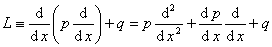

齐次边界条件为在端点<i>x</i>=<i>a</i>,
<i>x</i>=<i>b</i>处，满足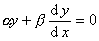，其中<i>α</i>,<i>β</i>为常数。

为了得出这个问题解的形式，首先构造函数<i>G</i>,使对一给定数<i>ξ</i>，

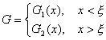

并且满足条件：

(i)&nbsp; 函数<i>G</i>1和<i>G</i>2在它们的定义区间上满足<i>LG</i>=0,即当<i>x</i>&lt;<i>ξ</i>时,<i>LG</i>1=0;当<i>x</i>&gt;<i>ξ</i>时，<i>LG</i>2=0。

(ii)&nbsp; 函数<i>G</i>满足边界条件，即<i>G</i>1满足在<i>x</i>=<i>a</i>的边界条件，<i>G</i>2满足在<i>x</i>=<i>b</i>的边界条件。

(iii)&nbsp; 函数<i>G</i>在<i>x</i>=<i>ξ</i>连续，即<i>G</i>1(<i>ξ</i>)=<i>G</i>2(<i>ξ</i>)。

(iv)&nbsp; <i>G</i>的导数以<i>x</i>=<i>ξ</i>为一不连续点，其跳跃是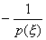，即

<pre align=center>&nbsp;&nbsp;&nbsp;&nbsp;&nbsp;&nbsp;&nbsp;&nbsp;&nbsp;&nbsp;&nbsp;&nbsp;&nbsp;&nbsp;&nbsp;&nbsp;&nbsp;&nbsp;&nbsp;&nbsp;&nbsp;&nbsp;&nbsp;&nbsp;&nbsp;&nbsp;&nbsp;&nbsp; 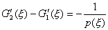</pre>

可以证明，若以<i>ξ</i>为参数的这个函数<i>G</i>存在，则原问题的解有如下的形式：

<pre style='text-align:right' align=right>&nbsp;&nbsp;&nbsp;&nbsp;&nbsp;&nbsp;&nbsp;&nbsp;&nbsp;&nbsp;&nbsp;&nbsp;&nbsp;&nbsp;&nbsp;&nbsp;&nbsp;&nbsp;&nbsp;&nbsp;&nbsp;&nbsp;&nbsp;&nbsp;&nbsp; 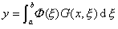&nbsp;&nbsp;&nbsp;&nbsp;&nbsp;&nbsp;&nbsp;&nbsp;&nbsp;&nbsp;&nbsp;&nbsp;&nbsp;&nbsp;&nbsp;&nbsp;&nbsp;&nbsp;&nbsp;&nbsp;&nbsp;&nbsp;&nbsp;&nbsp;&nbsp;&nbsp;&nbsp;(2)</pre>

例如<i>G</i>(<i>x,</i><i>ξ</i>)可取

<pre style='text-align:right' align=right>&nbsp; &nbsp;&nbsp;&nbsp;&nbsp;&nbsp;&nbsp;&nbsp;&nbsp;&nbsp;&nbsp;&nbsp;&nbsp;&nbsp;&nbsp;&nbsp;&nbsp;&nbsp;&nbsp;&nbsp;&nbsp;&nbsp;&nbsp;&nbsp;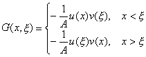&nbsp;&nbsp;&nbsp;&nbsp;&nbsp;&nbsp;&nbsp;&nbsp;&nbsp;&nbsp;&nbsp;&nbsp;&nbsp;&nbsp;&nbsp;&nbsp;&nbsp;&nbsp;&nbsp;&nbsp;&nbsp;&nbsp;&nbsp;&nbsp;&nbsp;(3)</pre>

式中<i>A</i>是由关系式

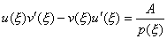

决定的一个常数，<i>u</i>(<i>x</i>)是<i>Ly</i>=0满足在<i>x</i>=<i>a</i>处所给定的齐次边值条件的一个解，<i>v</i>(<i>x</i>)是在<i>x</i>=<i>b</i>处满足边值条件的一个解。则<i>G</i>(<i>x,</i><i>ξ</i>)显然满足条件(i)~(iv)。

此外，还可证明，对由(3)定义的<i>G</i>(<i>x,</i><i>x</i>),由关系式(2)确定的函数<i>y</i>满足微分方程(1)并且满足<i>u</i>(<i>x</i>)在<i>x</i>=<i>a</i>与<i>v</i>(<i>x</i>)在<i>x</i>=<i>b</i>所规定的相同的齐次边界条件。

满足条件（i）~(iv)或由(3)式所定义的函数称为与微分表达式<i>Ly</i>和边界条件相联系的格林函数。在许多物理问题中，这个函数具有简单的物理意义，将在下一段中说明。

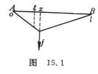[线性积分方程的一个典型实例]&nbsp; 考虑一条长为<i>l</i>的有弹性的弦，假定在平衡位置时，弦的位置在<i>Ox</i>轴的线段<i>Ol</i>上。在点<i>x</i>施加单位力，于是弦的每一点得到一个离差，在点<i>x</i>处所产生的离差以<i>G</i>(<i>x,</i><i>x</i>)表示（图15.1）。函数<i>G</i>(<i>x,</i>x)为两点（<i>x</i>和<i>x</i>）函数，在点<i>x</i>施加外力，在点<i>x</i>计量离差，称<i>G</i>为影响函数。

如果弦的两端固定在<i>x</i>轴上<i>A</i>,<i>B</i>两点，弦的张力为<i>T</i>0,则在点<i>x</i>外处施加的单位力作用下，弦成图15.1所示的形状。根据虎克（Hooke）定律与力的平衡条件，在点x处有

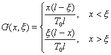

这就是弦的影响函数。

从能量守恒定律可导出<i>G</i>(<i>x</i>,<i>x</i>)的互易原理：在点<i>x</i>处施加外力在点<i>x</i>处产生的离差等于在点<i>x</i>处施加大小相同的力在点<i>x</i>处产生的离差，即

<i>G</i>(<i>x,</i><i>x</i> )=<i>G</i>(<i>x </i>, <i>x</i>)

如果在弦上施加的力<i>F</i>是连续分布的，并设线性强度是<i>p</i>(<i>x</i> ),则作用于弦上点<i>x</i> 和<i>x</i> +D<i>x</i> 之间的一小弦段的力就接近于<i>p</i>(<i>x </i>)D<i>x</i> 。把引起弦变形的这些力元素相加，便得弦的形状

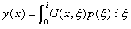

1°&nbsp; 设在某个力的作用下，弦成已知形状<i>y=y</i>(<i>x</i>),求定力分布强度<i>p</i>(<i>x</i> ),就得到含未知函数<i>p</i>(<i>x</i> )的第一类Fr积分方程

&nbsp;&nbsp;&nbsp;&nbsp;&nbsp;&nbsp;&nbsp;&nbsp;&nbsp;&nbsp;&nbsp;&nbsp;&nbsp;&nbsp;&nbsp;&nbsp;&nbsp;&nbsp;&nbsp;&nbsp;&nbsp;&nbsp;
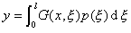&nbsp;&nbsp;&nbsp;&nbsp;&nbsp;&nbsp;&nbsp;&nbsp;&nbsp;&nbsp;&nbsp;&nbsp;&nbsp;&nbsp;&nbsp;&nbsp;&nbsp;&nbsp;&nbsp;&nbsp;&nbsp;&nbsp;&nbsp;&nbsp;&nbsp;&nbsp;&nbsp;&nbsp;&nbsp;&nbsp;&nbsp;(1)

2°&nbsp; 设作用力随时间<i>t</i>改变，且在点<i>x</i>的强度是

<i>&nbsp;&nbsp;&nbsp;&nbsp;&nbsp;&nbsp;&nbsp; p</i>(<i>x </i>)sin<i>w
t&nbsp;&nbsp;&nbsp;&nbsp;&nbsp; &nbsp;&nbsp;&nbsp;&nbsp;&nbsp;&nbsp;&nbsp;&nbsp;&nbsp;&nbsp;&nbsp;&nbsp;&nbsp;</i>(<i>w </i>&gt;0)

则弦的运动是由方程

<i>&nbsp;&nbsp;&nbsp;&nbsp;&nbsp;&nbsp;&nbsp;&nbsp;&nbsp;&nbsp;&nbsp;&nbsp;&nbsp;&nbsp;&nbsp;&nbsp;&nbsp;&nbsp;&nbsp;&nbsp;&nbsp;&nbsp;&nbsp;&nbsp;&nbsp;&nbsp;&nbsp;&nbsp;
y</i>=<i>y</i>(<i>x</i>)sin<i>w t</i>

描写的周期运动。

设<i>r </i>(<i>x</i> )为弦在点<i>x</i>的线性密度，则在时刻<i>t</i>,点<i>x</i> 与<i>x</i> +D<i>x</i> 之间的小弦段除受力<i>p</i>(x)sin<i>w t</i>D<i>x</i> 的作用外，还受惯性力

&nbsp;&nbsp;&nbsp;&nbsp;&nbsp;&nbsp;&nbsp;&nbsp;&nbsp;&nbsp;&nbsp;&nbsp;&nbsp;&nbsp;&nbsp;&nbsp;&nbsp;&nbsp;&nbsp;&nbsp;
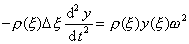sin<i>w t</i>D<i>x</i>

的作用，则等式(1)可化为如下的形式：

<pre style='text-align:right' align=right>&nbsp;&nbsp;&nbsp;&nbsp;&nbsp;&nbsp;&nbsp;&nbsp;&nbsp; 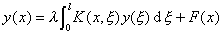&nbsp;&nbsp;&nbsp;&nbsp;&nbsp;&nbsp;&nbsp;&nbsp;&nbsp;&nbsp;&nbsp;&nbsp;&nbsp;&nbsp;&nbsp;&nbsp;&nbsp;&nbsp;&nbsp;&nbsp;&nbsp;&nbsp;&nbsp;&nbsp;&nbsp;&nbsp;&nbsp;(2)</pre>

式中

&nbsp;&nbsp;&nbsp;&nbsp;&nbsp;&nbsp;&nbsp;&nbsp;&nbsp;&nbsp;&nbsp;&nbsp;&nbsp;&nbsp;&nbsp;&nbsp;&nbsp;&nbsp;&nbsp;
&nbsp;&nbsp;&nbsp;&nbsp;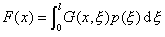

<i>K</i>(<i>x</i>,<i>x</i> )=<i>G</i>(<i>x</i>,<i>x</i> )<i>r</i> (<i>x</i>
),&nbsp;&nbsp;&nbsp;&nbsp;&nbsp;&nbsp;&nbsp;&nbsp;&nbsp;&nbsp; <i>l</i> =<i>w</i> 2

如果函数<i>p</i>(x)给定，那么<i>F</i>(<i>x</i>)也就给定，这样积分方程(2)就是确定函数<i>y</i>(<i>x</i>)的Fr方程。注意，由于<i>F</i>(<i>x</i>)的定义，有

<i>F</i>(0)=<i>F</i>(<i>l</i>)=0

若密度<i>r </i>(x)=<i>r</i> 是常数，而<i>F</i>(<i>x</i>)有二阶的连续导数，则方程(2)的解为

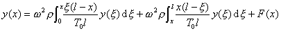

即

<pre style='text-align:right' align=right>&nbsp; 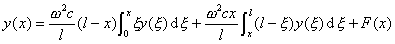&nbsp;&nbsp;&nbsp;&nbsp;&nbsp;&nbsp;&nbsp;&nbsp;&nbsp;&nbsp;&nbsp;&nbsp;(3)</pre>

式中

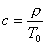

把(3)式微分两次就得到

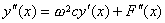

另一方面，可以证明这个微分方程的任一在<i>x</i>=0及<i>x</i>=<i>l</i>处等于0的解是积分方程(2)的解。

