

三、&nbsp;&nbsp;&nbsp;&nbsp;&nbsp;&nbsp;&nbsp;
三、&nbsp;&nbsp;&nbsp; 具有可分离核（退化核）的Fr方程

&nbsp;&nbsp;&nbsp; [可分离核（退化核）]&nbsp; 若核<i>K</i>(<i>x</i>,<i>x </i>)可分解为如下的形式：

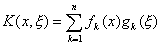

则称<i>K</i>(<i>x</i>,<i>x </i>)为可分离核或称为退化核。不妨假定<i>n</i>个函数<i>fk</i>(<i>x</i>) (<i>k</i>=1,2,L,<i>n</i>)在有关区间上是线性无关的。

例如，如果核是关于<i>x</i>和<i>x </i>的任一多项式，那么这个核就是退化核，核sin(<i>x+</i><i>x</i> )也是退化核。

[具有可分离核的第二类Fr方程解法]&nbsp; 具有可分离核的第二类Fr方程

<pre style='text-align:right' align=right>&nbsp;&nbsp;&nbsp;&nbsp;&nbsp;&nbsp;&nbsp;&nbsp;&nbsp;&nbsp; 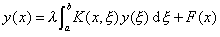&nbsp;&nbsp;&nbsp;&nbsp;&nbsp;&nbsp;&nbsp;&nbsp;&nbsp;&nbsp;&nbsp;&nbsp;&nbsp;&nbsp;&nbsp;&nbsp;&nbsp;&nbsp;&nbsp;&nbsp;&nbsp;&nbsp;&nbsp;&nbsp;(1)</pre>

即

<pre style='text-align:right' align=right>&nbsp;&nbsp; &nbsp;&nbsp;&nbsp;&nbsp;&nbsp;&nbsp;&nbsp;&nbsp;&nbsp;&nbsp;&nbsp;&nbsp;&nbsp;&nbsp;&nbsp;&nbsp;&nbsp;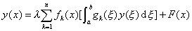&nbsp;&nbsp;&nbsp;&nbsp;&nbsp;&nbsp;&nbsp;&nbsp;&nbsp;&nbsp;&nbsp;&nbsp;&nbsp;&nbsp;&nbsp;&nbsp;&nbsp;&nbsp;&nbsp;&nbsp;(2)</pre>

的解法如下，首先设

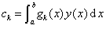&nbsp;&nbsp;&nbsp;&nbsp;&nbsp;&nbsp; (<i>k</i>=1,2,L,<i>n</i>)

则

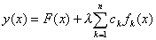

于是给定积分方程(1)的一切解应取这个形式。因此问题归结为求出常数<i>c</i>1,<i>c</i>2,L,<i>cn</i>。

再用<i>gi</i>乘(2)式两边且积分，令

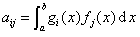，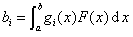

&nbsp;&nbsp;&nbsp; （<i>i</i>=1,2,L,<i>n </i>,&nbsp; <i>j</i>=1,2,L,<i>n</i>）

则<i>c</i>1,<i>c</i>2,L,<i>cn</i>满足方程组

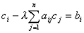&nbsp;&nbsp;&nbsp;&nbsp; （<i>i</i>=1,2,L,<i>n</i>）

即

<pre style='text-align:right' align=right>&nbsp;&nbsp;&nbsp;&nbsp;&nbsp;&nbsp;&nbsp;&nbsp;&nbsp;&nbsp;&nbsp;&nbsp;&nbsp;&nbsp;&nbsp;&nbsp;&nbsp;&nbsp;&nbsp;&nbsp;&nbsp;&nbsp;&nbsp;&nbsp;&nbsp; 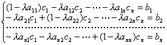&nbsp;&nbsp;&nbsp;&nbsp;&nbsp;&nbsp;&nbsp;&nbsp;&nbsp;&nbsp;&nbsp;&nbsp;&nbsp;&nbsp;&nbsp;&nbsp;&nbsp;&nbsp;（3）</pre>

矩阵形式为

&nbsp;&nbsp;&nbsp;&nbsp;&nbsp;&nbsp;&nbsp;&nbsp;&nbsp;&nbsp;&nbsp;&nbsp;&nbsp;&nbsp;&nbsp;&nbsp;&nbsp;&nbsp;&nbsp;&nbsp;&nbsp;&nbsp;
（<b><i>I</i></b>-<i>l</i><b><i>A</i></b>）<b><i>c</i></b>=<b><i>b</i></b>

式中<b><i>I</i></b>为<i>n</i>阶单位矩阵，<b><i>A</i></b>=(<i>aij</i>),<b><i>c</i></b>=<i>
</i>(<i>c</i>1,<i>c</i>2,L,<i>cn</i>)<i>t</i> ,<i> <b>b</b></i>=<i> </i>(<i>b</i>1,<i>b</i>2,L,<i>bn</i>)<i>t</i> 。这个方程组存在唯一解的充分必要条件是：方程的系数行列式

&nbsp; &nbsp;&nbsp;&nbsp;&nbsp;&nbsp;&nbsp;&nbsp;&nbsp;&nbsp;&nbsp;&nbsp;&nbsp;&nbsp;&nbsp;&nbsp;&nbsp;&nbsp;&nbsp;&nbsp;&nbsp;&nbsp;&nbsp;&nbsp;&nbsp;&nbsp;&nbsp;D=det（<b><i>I</i></b>-<i>l</i><b><i> A</i></b>）&sup1;0

如果<i>F</i>(<i>x</i>)&ordm;0,则<i>bi</i>=0(<i>i</i>=1,2,L<i>n</i>)，那末方程(3)为齐次方程组。因此,当D&sup1;0时，<i>y</i>(<i>x</i>)&ordm;0是积分方程(1)的平凡解（零解），且是唯一解。当D=0时，至少有一个<i>ci</i>可以任意指定，其余的<i>cj</i>可以求出，于是积分方程(1) 存在无穷多个解。

使D=0的<i>l</i>值称为特征值。齐次积分方程的任一非平凡解称为对应于积分方程的特征函数。

如果对于<i>l</i>的一个给定的特征值，可以从常数<i>c</i>1,<i>c</i>2,L,<i>cn</i>中任意指定<i>r</i>个，那么可得到<i>r</i>个线性无关的对应特征函数。

如果<i>F</i>(<i>x</i>)不恒为零,但与<i>g</i>1(<i>x</i>),<i> g</i>2(<i>x</i>),<i> </i>L,<i>gn</i>(<i>x</i>)正交，即<i>bi</i>=0
(<i>i</i>=1,2,L<i>n</i>)。那末方程组(3)仍为齐次的，以上的讨论也适用，除非这里积分方程的解也包含函数<i>F</i>(<i>x</i>)。这样平凡值 <i>c</i>1=<i> c</i>2=L=<i> cn</i>=0导出解<i>y</i>=<i>F</i>(<i>x</i>)。对应于<i>l</i>的特征值的解是<i>F</i>与特征函数的任意倍数之和。

最后，如果(3)式右边的<i>bi</i>至少有一个不为零，当行列式D&sup1;0时，方程组(3)存在唯一的非平凡解，于是可得到积分方程(1)的唯一的非平凡解，当D=0时，则方程(3)或者是不相容的，这时积分方程(1)没有解；或者<i>n</i>个方程中至少有两个是相同的，这时积分方程(1)有无穷多个解。

例&nbsp; 解积分方程

<pre style='text-align:right' align=right>&nbsp;&nbsp;&nbsp;&nbsp;&nbsp;&nbsp;&nbsp;&nbsp;&nbsp;&nbsp;&nbsp;&nbsp;&nbsp;&nbsp;&nbsp;&nbsp;&nbsp;&nbsp;&nbsp; 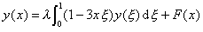&nbsp;&nbsp;&nbsp;&nbsp;&nbsp;&nbsp;&nbsp;&nbsp;&nbsp;&nbsp;&nbsp;&nbsp;&nbsp;&nbsp;&nbsp;&nbsp;&nbsp;&nbsp;&nbsp;&nbsp;&nbsp;&nbsp;&nbsp;&nbsp;(1)</pre>

解&nbsp; 可把这个方程改写为

<pre style='text-align:right' align=right><i>&nbsp; &nbsp;&nbsp;&nbsp;&nbsp;&nbsp;&nbsp;&nbsp;&nbsp;&nbsp;&nbsp;&nbsp;&nbsp;&nbsp;&nbsp;&nbsp;&nbsp;&nbsp;&nbsp;&nbsp;&nbsp;&nbsp;y</i>(<i>x</i>)=<i>l</i>(<i>c</i>1-3<i>c</i>2<i>x</i>)+<i>F</i>(<i>x</i>)&nbsp;&nbsp;&nbsp;&nbsp;&nbsp;&nbsp;&nbsp;&nbsp;&nbsp;&nbsp;&nbsp;&nbsp;&nbsp;&nbsp;&nbsp;&nbsp;&nbsp;&nbsp;&nbsp;&nbsp;&nbsp;&nbsp;&nbsp;&nbsp;&nbsp;&nbsp;&nbsp;&nbsp;&nbsp;&nbsp;&nbsp;&nbsp;&nbsp;&nbsp;&nbsp; (2)</pre>

式中

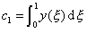，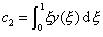

决定<i>c</i>1,<i>c</i>2的方程组是

<pre style='text-align:right' align=right>&nbsp;&nbsp;&nbsp;&nbsp;&nbsp;&nbsp;&nbsp;&nbsp;&nbsp;&nbsp;&nbsp;&nbsp;&nbsp;&nbsp;&nbsp;&nbsp;&nbsp;&nbsp;&nbsp;&nbsp;&nbsp; 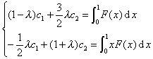&nbsp;&nbsp;&nbsp;&nbsp;&nbsp;&nbsp;&nbsp;&nbsp;&nbsp;&nbsp;&nbsp;&nbsp;&nbsp;&nbsp;&nbsp;&nbsp;&nbsp;&nbsp;&nbsp;&nbsp;&nbsp;&nbsp;&nbsp;&nbsp;(3)</pre>

其系数行列式为

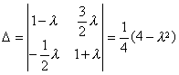

则积分方程(1)存在唯一解的条件是<i>l</i>&sup1;±2。由(3)解出<i>c</i>1,<i>c</i>2并代入(2)得到(1)的解。特别，若<i>F</i>(<i>x</i>)=0,<i>
</i><i>l</i>&sup1;±2,则唯一解是平凡解<i>y</i>(<i>x</i>)=0。数<i>λ=</i>±2为问题的特征值。

若<i>λ</i>=2，则方程组(3) 为

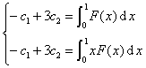

这两个方程是不相容的，除非函数<i>F</i>(<i>x</i>)满足条件

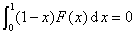

这时两个方程相同。

若<i>λ</i>=-2，则方程组(3) 为

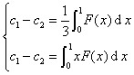

这两个方程也是不相容的，除非函数<i>F</i>(<i>x</i>)满足条件

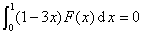

这时两个方程也是相同的。

现在具体讨论积分方程(1)的解。

1°&nbsp; 先考虑齐次方程（即<i>F</i>(<i>x</i>)=0）的情形。若<i>l</i> &sup1;±2，则唯一解是平凡解<i>y</i>(<i>x</i>)=0。

当<i>λ</i>=2时，代数方程组只给出一个条件<i>c</i>1=3<i>c</i>2。这时，解是

<i>y</i>(<i>x</i>)=<i>c</i>1(1-<i>x</i>)

式中<i>c</i>1=3<i>λc</i>2=6<i>c</i>2是任意常数，1-<i>x</i>是对应于特征值<i>λ</i>=2的特征函数。

当<i>λ</i>=-2时，解是

<i>y</i>(<i>x</i>)=<i>c</i>2(1-3<i>x</i>)

式中<i>c</i>2=<i>λc</i>1=-2<i>c</i>1是任意常数，1-3<i>x</i>是对应于<i>λ</i>=-2的特征函数<i>。</i>

方程(2)表明原积分方程(1)的任一解表示为如下形式：

<i>y</i>(<i>x</i>)=<i>F</i>(<i>x</i>)+<i>c</i>3(1-<i>x</i>)+<i>c</i>4(1-3<i>x</i>)

式中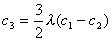，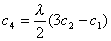。于是推出原积分方程(1)的任一解可以用特征函数的某一线性组合与<i>F</i>(<i>x</i>)的和来表达。

2° 在非齐次的情形（即<i>F</i>(<i>x</i>)不恒等于零）下，若<i>l</i>&sup1;±2，则积分方程(1)存在唯一解。

当<i>λ</i>=2时，积分方程(1)没有解，除非在区间[0,1]上<i>F</i>(<i>x</i>)正交于λ=2所对应的特征函数1-<i>x<a href="#None" name="_ftnref1" title="">*</a></i>,即

在此条件下，再利用<i>c</i>1-3<i>c</i>2=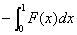,给出积分方程(1)的解。

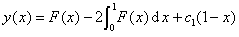

式中<i>c</i>1=6<i>c</i>2是任意常数，因此，这时存在无穷多个解。

类似地，当<i>λ</i>=-2时，积分方程(1)没有解，除非在区间[0,1]上<i>F</i>(<i>x</i>)正交于1-3<i>x</i><i>,</i>即

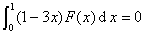

这时存在如下的无穷多个解：

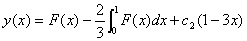

式中<i>c</i>2=-2<i>c</i>1是任意常数。

 

 

<a href="#None"
name="_ftn1" title="">*</a> 在下一段会看到，这个情形是原积分方程中核<i>K</i>(<i>x</i>,<i>ξ</i>)=1-3<i>x</i><i>ξ</i> &nbsp;的对称性的一个推论。

