

四、希尔伯特-施密特的理论

当齐次Fr方程的核<i>K</i>(<i>x,</i><i>ξ</i>)不可分离，特别，<i>K</i>(<i>x,</i><i>ξ</i>)对于<i>x&gt;</i><i>ξ</i>和<i>x&lt;</i><i>ξ</i>,分别由不同的分析表达式给定时，其特征值一般有无穷多个<i>λn</i>(<i>n</i>=1,2,L),每个特征值对应的特征函数除一个乘数外是确定的；在例外的情形，一个给定的特征值<i>lk</i>可以对应于两个或更多个独立的特征函数。本段将介绍这种特征函数的某些性质。

[具有对称核的Fr方程的性质]&nbsp; 如果在实核中交换它的变量时，它本身的值不变，这个核就叫做对称核。

1° 具有对称核的齐次Fr方程的特征函数系是正交的。

2° 具有实对称核的Fr方程的特征值都是实数。

注意，核不对称的Fr方程可以具有虚的特征值。

[希尔伯特-施密特定理]&nbsp; 设<i>Φ</i>为一平方可积函数，则形如

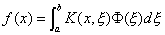

的函数<i>f</i>(<i>x</i>),可由对称核齐次Fr方程

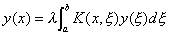

在[<i>a</i>,<i>b</i>]上的特征函数<i>y</i>1(<i>x</i>), <i>y</i>2(<i>x</i>),L的线性组合表达，如果特征函数有无穷多个，那末所得的无穷级数在区间[<i>a</i>,<i>b</i>]上绝对且一致收敛。

[施密特公式]&nbsp; 考虑非齐次第二类Fr方程

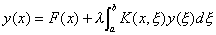

式中<i>K</i>(<i>x</i>,<i>x</i>)是在定义区间上平方可积的对称核，并假定在正方形<i>k</i>0(<i>a</i>≤<i>x</i>≤<i>b</i>，<i>a</i>≤<i>ξ</i>≤<i>b</i>）上是两变量<i>x</i>,<i>ξ</i>的连续函数,<i>F</i>(<i>x</i>)是已知的一致连续函数，<i>y</i>(<i>x</i>)是未知函数，而λ是参数，则有施密特公式

&nbsp;&nbsp;&nbsp;&nbsp;&nbsp;&nbsp;&nbsp; 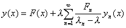&nbsp;（<i>λ</i>≠<i>λ</i><i>n</i> ，即<i>λ</i>不是特征值）&nbsp;&nbsp;&nbsp;&nbsp;&nbsp;&nbsp;&nbsp;&nbsp;&nbsp;&nbsp;&nbsp;&nbsp;&nbsp;&nbsp;&nbsp;&nbsp;
(1)

右边的级数是绝对且一致收敛的，式中<i>Fn</i>由下式决定：

&nbsp;&nbsp;&nbsp;&nbsp;&nbsp;&nbsp;&nbsp;&nbsp;&nbsp;&nbsp;&nbsp;&nbsp;
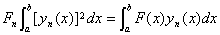&nbsp;&nbsp;&nbsp;&nbsp;（<i>n</i>=1,2,L）&nbsp;&nbsp;&nbsp;&nbsp;&nbsp;&nbsp;&nbsp;&nbsp;&nbsp;&nbsp;&nbsp;&nbsp;&nbsp;&nbsp;&nbsp;&nbsp;&nbsp;&nbsp;&nbsp;&nbsp;
(2)

[核的展开定理]&nbsp; 一个对称核<i>K</i>(<i>x</i>,x)可展开为级数

&nbsp;&nbsp;&nbsp;&nbsp;&nbsp;&nbsp;&nbsp;&nbsp;&nbsp;&nbsp;&nbsp;&nbsp;&nbsp;&nbsp;&nbsp;&nbsp;&nbsp;&nbsp;&nbsp;&nbsp;&nbsp;&nbsp;&nbsp;&nbsp;&nbsp;&nbsp;&nbsp;
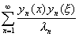

这个级数对任意固定的<i>x</i>，有

&nbsp;&nbsp;&nbsp;&nbsp;&nbsp;&nbsp;&nbsp;&nbsp;&nbsp;&nbsp;&nbsp;&nbsp;&nbsp;&nbsp;&nbsp;&nbsp;
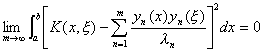&nbsp;

&nbsp;&nbsp;&nbsp; [具有非对称核的积分方程]&nbsp; 设核<i>K</i>(<i>x</i>,<i>x</i> )不是对称的，但可表为如下形式

<i>K</i>(<i>x</i>,<i>x</i> )=<i>r</i>(<i>x</i> )<i>G</i>(<i>x</i>,<i>x</i> )

式中<i>r</i>(<i>x </i>)在（<i>a</i>,<i>b</i>）内连续且不变号，而<i>G</i>(<i>x</i>,<i>x</i> )是对称的，这时有以下性质：

1°&nbsp; 对应于不同特征值<i>l m</i>和<i>l n</i>的两个特征函数<i>ym</i>(<i>x</i>)和<i>yn</i>(<i>x</i>)在[<i>a</i>,<i>b</i>]上关于权函数<i>r</i>(<i>x</i>)是正交的，即

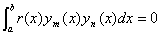

2°&nbsp; <i>K</i>(<i>x</i>,<i>x</i> )的特征值都是实数。

3°&nbsp; 若非齐次第二类Fr方程有一个解，则这个解由(1)给出，并以权函数<i>r</i>(<i>x</i>)去乘(2)式两边所包含的被积函数。

[具有埃尔米特核的积分方程]&nbsp; 设核<i>K</i>(<i>x</i>,<i>x</i> )为一复核，如果

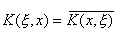

则称<i>K</i>(<i>x</i>,<i>x </i>)为埃尔米特核，式中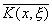表示<i>K</i>(<i>x</i>,<i>x</i> )的共轭复函数。具有埃尔米特核的积分方程有以下性质：

1°&nbsp; 对应于不同特征值<i>l m</i>和<i>l n</i>的两个特征函数<i>ym</i>(<i>x</i>)和<i>yn</i>(<i>x</i>)在[<i>a</i>,<i>b</i>]上是按埃尔米特意义正交的：

&nbsp;&nbsp;&nbsp;&nbsp;&nbsp;&nbsp;&nbsp;&nbsp;&nbsp;&nbsp;&nbsp;&nbsp;&nbsp;&nbsp;&nbsp;&nbsp;&nbsp;&nbsp;&nbsp;&nbsp;&nbsp;
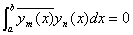

2°&nbsp; 在[<i>a</i>,<i>b</i>]上与埃尔米特核相联系的特征值都是实数。

3°&nbsp; 设特征函数按埃尔米特意义是标准化的：

&nbsp;&nbsp;&nbsp;&nbsp;&nbsp;&nbsp;&nbsp;&nbsp;&nbsp;&nbsp;&nbsp;&nbsp;&nbsp;&nbsp;&nbsp;&nbsp;&nbsp;&nbsp;
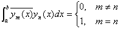

如果非齐次第二类Fr方程有一个解，那末这个解由(1)给出，并且(2)式改为

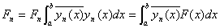&nbsp;&nbsp;&nbsp;&nbsp;
（<i>n</i>=1,2,L）

[具有反对称核的积分方程]&nbsp; 设<i>K</i>(<i>x</i>,<i>x</i> )满足条件

<i>K</i>(<i>x</i> ,<i>x</i>)=-<i>K</i>(<i>x</i>,<i>x</i> )

则称<i>K</i>(<i>x</i>,<i>x </i>)为反对称核，这时<i>iK</i>(<i>x</i>,<i>x </i>)是埃尔米特核。因此，具有反对称核的积分方程

如果以<i>lii</i>代替<i>l</i>，则得到具有埃尔米特核的积分方程

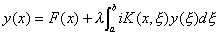

由此可见，具有反对称核的积分方程必有特征值，而且都是纯虚数。

[伴随核与自伴随核]&nbsp; 设<i>u</i>(<i>x</i>)是一复核<i>K</i>(<i>x</i>,<i>x </i>)(它不一定是埃尔米特核)对应于特征值<i>l</i> 的一个特征函数，<i>v</i>(<i>x</i>)是核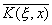对应于特征值<i>m </i>的一个特征函数，若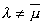，则

<i>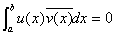</i>

这里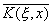称为<i>K</i>(<i>x</i>,<i>x </i>)的伴随核。如果=<i> K</i>(<i>x</i>,<i>x</i> )，那么<i>K</i>(<i>x</i>,<i>x</i> )称为自伴随核，显然实对称核与埃尔米特核都是自伴随核。

