

五、第二类Fr方程的逐次逼近法与诺伊曼级数解

[逐次逼近法]&nbsp; 在某种情形下，第二类Fr方程可用逐次逼近法来解。为此，设方程

<pre>&nbsp;&nbsp;&nbsp;&nbsp;&nbsp;&nbsp;&nbsp;&nbsp;&nbsp;&nbsp;&nbsp;&nbsp;&nbsp;&nbsp;&nbsp;&nbsp;&nbsp;&nbsp;&nbsp;&nbsp;&nbsp;&nbsp;&nbsp;&nbsp;&nbsp;&nbsp; &nbsp;&nbsp;&nbsp;&nbsp;&nbsp;&nbsp;&nbsp;&nbsp;&nbsp;&nbsp;&nbsp;&nbsp;&nbsp;&nbsp;&nbsp;&nbsp;&nbsp;&nbsp;&nbsp;&nbsp;&nbsp;&nbsp;&nbsp;&nbsp;(1)</pre>

的解可用<i>l</i>的幂级数来表达：

<i>&nbsp;&nbsp; &nbsp;&nbsp;&nbsp;&nbsp;&nbsp;&nbsp;&nbsp;&nbsp;&nbsp;&nbsp;&nbsp;&nbsp;&nbsp;&nbsp;&nbsp;&nbsp;&nbsp;y</i>(<i>x</i>)=<i>y</i>0(<i>x</i>)+<i>y</i>1(<i>x)</i><i>l</i>+<i>y</i>2(<i>x</i>)<i>l</i>2+L&nbsp;&nbsp;&nbsp;&nbsp;&nbsp;&nbsp;&nbsp;&nbsp;&nbsp;&nbsp;&nbsp;&nbsp;&nbsp;&nbsp;&nbsp;&nbsp;&nbsp;&nbsp;&nbsp;&nbsp;&nbsp;
(2)

&nbsp;&nbsp; 如果级数(2)在区间[<i>a</i>,<i>b</i>]上关于<i>x</i>是一致收敛的，那末把它代入(1)中，可逐项积分，比较<i>l </i>的系数就得到确定<i>yn</i>(<i>x</i>)的递推公式

<i>&nbsp;&nbsp;&nbsp;&nbsp;&nbsp;&nbsp;&nbsp; y</i>0(<i>x</i>)=<i>F</i>(<i>x</i>),&nbsp;&nbsp;&nbsp; 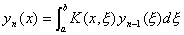&nbsp;&nbsp;(<i>n</i>=1,2,L)&nbsp;&nbsp;&nbsp;&nbsp;&nbsp;&nbsp;&nbsp;&nbsp;&nbsp;&nbsp;&nbsp;&nbsp;
(3)

式中<i>yn</i>(<i>x</i>)
(<i>n</i>=1,2,L)都是连续函数。若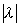充分小，则级数(2)关于<i>x</i>绝对且一致收敛，于是级数(2)是连续函数并且是积分方程(1)的解。

[叠核 × 预解核 × 诺伊曼级数解]&nbsp; 设<i>K</i>(<i>x</i>,<i>x </i>)为核，经递推公式

<i>K</i>1(<i>x</i>,<i>x</i> )=<i>K</i>(<i>x</i>,<i>x</i> ),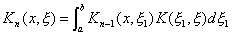&nbsp;&nbsp;&nbsp;&nbsp;&nbsp;
(<i>n</i>=2,3,4,L)&nbsp;&nbsp;&nbsp;&nbsp;&nbsp;&nbsp;&nbsp;&nbsp;&nbsp;&nbsp;&nbsp;&nbsp;&nbsp;&nbsp;
(4)

产生的<i>Kn</i>(<i>x</i>,<i>x </i>)称为已知核<i>K</i>(<i>x</i>,<i>x</i> )的<i>n</i>次叠核。它满足下面公式

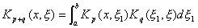

式中<i>p</i>,<i>q</i>为任意正整数。

由于<i>F</i>(<i>x</i>)和<i>K</i>(<i>x</i>,<i>x</i> )分别在[<i>a</i>,<i>b</i>]上和<i>k</i>0(<i>a</i>≤<i>x</i>≤<i>b</i>，<i>a</i>≤<i>ξ</i>≤<i>b</i>）上连续，所以各有极大值<i>m</i>和<i>M</i>：

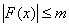，&nbsp;&nbsp;&nbsp; 

当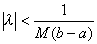时，级数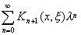在<i>k</i>0内绝对且一致收敛，记作

<pre style='text-align:right' align=right>&nbsp;&nbsp;&nbsp;&nbsp;&nbsp;&nbsp;&nbsp;&nbsp;&nbsp;&nbsp;&nbsp;&nbsp;&nbsp;&nbsp;&nbsp;&nbsp;&nbsp;&nbsp;&nbsp;&nbsp;&nbsp;&nbsp;&nbsp;&nbsp;&nbsp; 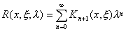&nbsp;&nbsp;&nbsp;&nbsp;&nbsp;&nbsp;&nbsp;&nbsp;&nbsp;&nbsp;&nbsp;&nbsp;&nbsp;&nbsp;&nbsp;&nbsp;&nbsp;&nbsp;&nbsp;&nbsp;&nbsp;&nbsp;&nbsp;&nbsp;&nbsp;(5)</pre>

如果用自由项<i>F</i>(<i>x</i>)来表达<i>yn</i>(<i>x</i>),则由(3),(4)推出

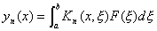

并把它代入级数(2)得到

<pre style='text-align:right' align=right>&nbsp;&nbsp;&nbsp;&nbsp;&nbsp;&nbsp;&nbsp;&nbsp;&nbsp;&nbsp;&nbsp;&nbsp;&nbsp;&nbsp;&nbsp;&nbsp;&nbsp;&nbsp;&nbsp;&nbsp;&nbsp;&nbsp;&nbsp;&nbsp; 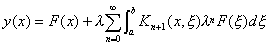&nbsp;&nbsp;&nbsp;&nbsp;&nbsp;&nbsp;&nbsp;&nbsp;&nbsp;&nbsp;&nbsp;&nbsp;&nbsp;&nbsp;&nbsp;&nbsp;&nbsp;&nbsp;&nbsp;(6)</pre>

因为级数(5)在<i>k</i>0内一致收敛，所以对[<i>a</i>,<i>b</i>]上任一固定值<i>x</i>,它在区间内关于<i>x</i>一致收敛，故得积分方程(1)的解

<pre style='text-align:right' align=right>&nbsp;&nbsp;&nbsp;&nbsp;&nbsp;&nbsp;&nbsp;&nbsp;&nbsp;&nbsp;&nbsp;&nbsp;&nbsp;&nbsp;&nbsp;&nbsp;&nbsp;&nbsp;&nbsp; 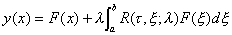， &nbsp;&nbsp;&nbsp;&nbsp;&nbsp;&nbsp;&nbsp;&nbsp;&nbsp;&nbsp;&nbsp;&nbsp;&nbsp;(7)</pre>

式中不依赖于自由项<i>F</i>(<i>t</i> )的函数<i>R</i>(<i>x</i>,<i>x </i>;<i>l</i> )称为核的（或Fr方程的）预解核，级数(5)称为诺伊曼级数。

[存在性与唯一性定理]&nbsp; 如果把级数(5)改写为

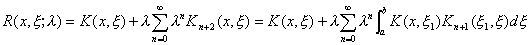

由(5)上式化为

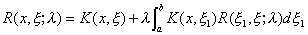

改变符号可写为

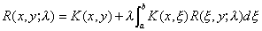

因此，当把方程(1)中<i>F</i>(<i>x</i>)换为<i>K</i>(<i>x</i>,<i>y</i>)时，上式表明存在预解核<i>R</i>(看作两个变量<i>x</i>,<i>y</i>与参数<i>l</i> 的函数)是方程(1)的唯一解。

例&nbsp; 举例说明预解核的实际算法。设积分方程(1)中

<i>K</i>(<i>x</i>,<i>x</i> )=1-3<i>x</i><i>x</i>

由公式(4)算出它的各次叠核：

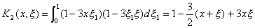

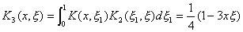

所以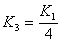，从此容易推出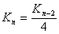（<i>n</i>≥3）,于是有 

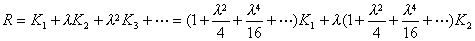

即

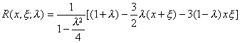&nbsp;&nbsp;&nbsp;&nbsp;&nbsp;
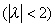

值得注意的是，由此式可以给出一切<i>λ</i>值（<i>λ</i>=±2除外）的预解核，但相应的诺伊曼级数只当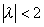时才收敛。

