

六、弗雷德霍姆的理论

[Fr方母]&nbsp; 预解核<i>R</i>(<i>x</i>,<i>ξ</i>;<i>λ</i>)可以用关于<i>λ</i>的两个幂级数之比来表达，这两个级数对一切<i>λ</i>值都是收敛的。

若预解核表成

<pre style='text-align:right' align=right>&nbsp;&nbsp;&nbsp;&nbsp;&nbsp;&nbsp;&nbsp;&nbsp;&nbsp;&nbsp;&nbsp;&nbsp;&nbsp;&nbsp;&nbsp;&nbsp;&nbsp;&nbsp;&nbsp; 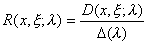&nbsp;&nbsp;&nbsp;&nbsp;&nbsp;&nbsp;&nbsp;&nbsp;&nbsp;&nbsp;&nbsp;&nbsp;&nbsp;&nbsp;&nbsp;&nbsp;&nbsp;&nbsp;&nbsp;&nbsp;&nbsp;&nbsp;&nbsp;&nbsp;&nbsp;&nbsp;(1)</pre>

式中

<pre style='text-align:right' align=right>&nbsp;&nbsp;&nbsp;&nbsp;&nbsp;&nbsp;&nbsp; &nbsp;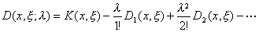&nbsp;&nbsp;&nbsp;&nbsp;&nbsp;&nbsp;&nbsp;&nbsp;&nbsp;&nbsp;&nbsp;&nbsp;&nbsp;(2)</pre><pre
style='text-align:right' align=right>&nbsp;&nbsp;&nbsp;&nbsp;&nbsp;&nbsp;&nbsp;&nbsp;&nbsp;&nbsp;&nbsp;&nbsp;&nbsp;&nbsp;&nbsp;&nbsp;&nbsp;&nbsp;&nbsp;&nbsp;&nbsp; 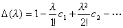&nbsp;&nbsp;&nbsp;&nbsp;&nbsp;&nbsp;&nbsp;&nbsp;&nbsp;&nbsp;&nbsp;&nbsp;&nbsp;&nbsp;&nbsp;&nbsp;&nbsp;&nbsp;&nbsp;&nbsp;&nbsp;&nbsp;&nbsp;(3)</pre>

Δ(λ)称为Fr分母，它与变量<i>x</i>,<i>ξ</i>无关。式中系数<i>cn</i>与函数<i>Dn</i>(<i>x</i>,<i>ξ</i>)可由下列递推公式逐次算出：

&nbsp;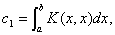&nbsp;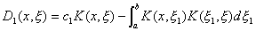

&nbsp;&nbsp;&nbsp; 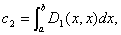&nbsp;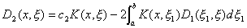

&nbsp;&nbsp;&nbsp;&nbsp;&nbsp;&nbsp;&nbsp;&nbsp;&nbsp;&nbsp;&nbsp;&nbsp;&nbsp;&nbsp;
LLL

&nbsp;&nbsp;&nbsp;&nbsp;&nbsp;&nbsp; 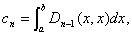&nbsp;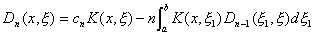

那末方程

的解可将（1）代入上段（7）式中得到，其形式为

<pre style='text-align:right' align=right>&nbsp;&nbsp;&nbsp;&nbsp;&nbsp;&nbsp;&nbsp;&nbsp;&nbsp;&nbsp;&nbsp;&nbsp;&nbsp;&nbsp;&nbsp;&nbsp;&nbsp;&nbsp;&nbsp;&nbsp;&nbsp;&nbsp;&nbsp;&nbsp;&nbsp;&nbsp;&nbsp;&nbsp;&nbsp;&nbsp; 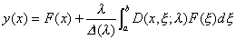&nbsp;&nbsp;&nbsp;&nbsp;&nbsp;&nbsp;&nbsp;&nbsp;&nbsp;&nbsp;&nbsp;&nbsp;&nbsp;&nbsp;&nbsp;&nbsp;&nbsp;&nbsp;&nbsp; （4）</pre>

当<i>K</i>(<i>x</i>,<i>x </i>)是可分离时，这个结果与本节三中所得到的解一致，这时级数(2)与(3)都只包含有限项。

更一般地，若级数(2)与(3)之比用关于<i>l</i>的幂级数(由除法或其他方法)来表达，结果将化为上段的(6)式的级数形式，而它只对充分小的<i>l </i><i>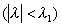</i>值收敛;但是(4)中最后一项的分子和分母的级数展开式对<i>l</i>的一切值都收敛。

分母D(<i>l</i> )只当<i>l</i>取一特征值时等于零，在这个情形下，Fr方程或者无解或者有无穷多个解，并且(4)不再成立。

[D(<i>l</i>)的零点与Fr方程]&nbsp; 应用存在性与唯一性定理，有以下结论：

1°&nbsp; 若<i>l</i>不是D(<i>l</i> )的零点，则对任意的<i>F</i>(<i>x</i>),(4)式是Fr方程的唯一解。

2°&nbsp; 函数D(<i>l</i> )的一切零点都是预解核的极点。

3°&nbsp; 若<i>lc</i>是D(<i>l</i> )的零点，则齐次方程

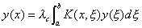

有非零解。

于是D(<i>l</i> )的一切零点都是上面积分方程的特征值，就是说，这时齐次方程

<pre style='text-align:right' align=right>&nbsp;&nbsp;&nbsp;&nbsp;&nbsp;&nbsp;&nbsp;&nbsp;&nbsp;&nbsp;&nbsp;&nbsp;&nbsp;&nbsp;&nbsp;&nbsp;&nbsp;&nbsp;&nbsp;&nbsp;&nbsp;&nbsp; 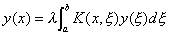&nbsp;&nbsp;&nbsp;&nbsp;&nbsp;&nbsp;&nbsp;&nbsp;&nbsp;&nbsp;&nbsp;&nbsp;&nbsp;&nbsp;&nbsp;&nbsp;&nbsp;&nbsp;&nbsp;&nbsp;&nbsp;&nbsp;&nbsp;&nbsp;(5)</pre>

有非零解。若<i>l</i> 不是D(<i>l</i> )的零点，则由1o，非齐次Fr方程对任意的<i>F</i>(<i>x</i>)有唯一解，特别，这时上面齐次方程只有零解，即

若<i>l</i>是D(<i>l</i> )的零点，则它是特征值，若<i>l</i>不是D(<i>l</i> )的零点，则它不是特征值，于是得到

4°&nbsp; 积分方程的特征值都是D(<i>l</i> )的零点。

5°&nbsp; 在<i>l</i> 平面的任何有限区域内只有有限个特征值。

[转置积分方程]&nbsp; 形如

<pre style='text-align:right' align=right>&nbsp;&nbsp;&nbsp;&nbsp;&nbsp;&nbsp;&nbsp;&nbsp;&nbsp;&nbsp;&nbsp; 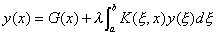&nbsp;&nbsp;&nbsp;&nbsp;&nbsp;&nbsp;&nbsp;&nbsp;&nbsp;&nbsp;&nbsp;&nbsp;&nbsp;&nbsp;&nbsp;&nbsp;&nbsp;&nbsp;&nbsp;&nbsp;&nbsp;&nbsp;&nbsp;&nbsp;(6)</pre>

的方程叫做Fr方程

的转置积分方程，它的相应的齐次方程为

<pre style='text-align:right' align=right>&nbsp;&nbsp;&nbsp;&nbsp;&nbsp;&nbsp;&nbsp;&nbsp;&nbsp;&nbsp;&nbsp;&nbsp;&nbsp;&nbsp;&nbsp;&nbsp;&nbsp;&nbsp;&nbsp;&nbsp;&nbsp;&nbsp; 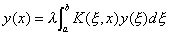&nbsp;&nbsp;&nbsp;&nbsp;&nbsp;&nbsp;&nbsp;&nbsp;&nbsp;&nbsp;&nbsp;&nbsp;&nbsp;&nbsp;&nbsp;&nbsp;&nbsp;&nbsp;&nbsp;&nbsp;&nbsp;&nbsp;&nbsp;&nbsp;&nbsp;(7)</pre>

这个方程的核记作

<i>K</i>0(<i>x</i>,<i>x </i>)=<i>K</i>(<i>x</i>, <i>x</i>)

转置积分方程具有以下性质：

1°&nbsp; 齐次方程(5)与它的转置方程(7)或同时仅有零解，或同时有非零解。

2°&nbsp; 齐次方程(5)与它的转置方程(7)有相同个数的线性无关的解。

3°&nbsp; 若<i>l</i>是特征值，则非齐次Fr方程可解的充分必要条件是：自由项<i>F</i>(<i>x</i>)满足条件

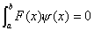

式中是转置方程的任何特征函数，即齐次方程(7)的任何解。若这个条件满足，则Fr方程有无穷多个解，而一切这样的解取形式

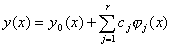

式中<i>y</i>0(<i>x</i>)为Fr方程的任意特解，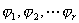为方程(5)的<i>r</i>个非平凡的线性无关的解，<i>c</i>1,<i>c</i>2,L,<i>cr</i>为任意常数。

&nbsp;&nbsp;&nbsp; 应当指出，上式结果与<i>n</i>个变量的<i>n</i>个线性代数方程组的关于解的存在和唯一性的对应结果完全类似。

