

<b>§</b><b>2&nbsp; </b><b>奇异积分方程</b>

一、&nbsp;&nbsp;&nbsp;
一、奇异积分方程的定义与例子

1°&nbsp; 如果积分方程的积分是积分区间为无限（或核<i>K</i>(<i>x,</i><i>ξ</i>)为无界函数）的广义积分，那末称该方程为奇异积分方程，例如

<pre style='text-align:right' align=right>&nbsp;&nbsp;&nbsp;&nbsp;&nbsp;&nbsp;&nbsp;&nbsp;&nbsp;&nbsp;&nbsp;&nbsp;&nbsp;&nbsp;&nbsp;&nbsp;&nbsp;&nbsp;&nbsp;&nbsp;&nbsp;&nbsp;&nbsp;&nbsp; 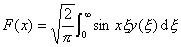&nbsp;&nbsp;&nbsp;&nbsp;&nbsp;&nbsp;&nbsp;&nbsp;&nbsp;&nbsp;&nbsp;&nbsp;&nbsp;&nbsp;&nbsp;&nbsp;&nbsp;&nbsp;&nbsp;&nbsp;&nbsp;&nbsp;&nbsp;&nbsp;&nbsp;&nbsp;&nbsp;(1)</pre><pre
style='text-align:right' align=right>&nbsp;&nbsp;&nbsp;&nbsp;&nbsp;&nbsp;&nbsp;&nbsp; &nbsp;&nbsp;&nbsp;&nbsp;&nbsp;&nbsp;&nbsp;&nbsp;&nbsp;&nbsp;&nbsp;&nbsp;&nbsp;&nbsp;&nbsp;&nbsp;&nbsp;&nbsp;&nbsp;&nbsp;&nbsp; &nbsp;&nbsp;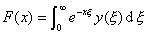&nbsp;&nbsp;&nbsp;&nbsp;&nbsp;&nbsp;&nbsp;&nbsp;&nbsp;&nbsp;&nbsp;&nbsp;&nbsp;&nbsp;&nbsp;&nbsp;&nbsp;&nbsp;&nbsp;&nbsp;&nbsp;&nbsp;&nbsp;&nbsp;&nbsp;&nbsp;&nbsp;(2)</pre>

和

<pre style='text-align:right' align=right>&nbsp;&nbsp;&nbsp;&nbsp;&nbsp;&nbsp;&nbsp;&nbsp;&nbsp;&nbsp;&nbsp;&nbsp;&nbsp;&nbsp;&nbsp;&nbsp;&nbsp;&nbsp;&nbsp;&nbsp; 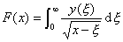&nbsp;&nbsp;&nbsp;&nbsp;&nbsp;&nbsp;&nbsp;&nbsp;&nbsp;&nbsp;&nbsp;&nbsp;&nbsp;&nbsp;&nbsp;&nbsp;&nbsp;&nbsp;&nbsp;&nbsp;&nbsp;&nbsp;&nbsp;&nbsp;&nbsp;&nbsp;&nbsp;&nbsp;&nbsp;(3)</pre>

都是奇异积分方程。

&nbsp;&nbsp; 2°&nbsp; 方程（1）的右边所定义的函数可以看作<i>y(x)</i>的傅立叶正弦变换。若当<i>x&gt;</i>0时，<i>F(x)</i>逐段可微且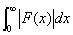存在，则方程（1）有唯一的反演公式：

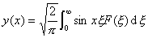&nbsp; （<i>x</i>&gt;0）

&nbsp;&nbsp;&nbsp;&nbsp;&nbsp;&nbsp; 考虑齐次积分方程&nbsp;&nbsp;&nbsp;&nbsp;&nbsp;&nbsp;&nbsp;&nbsp;&nbsp;&nbsp;

<pre style='text-align:right' align=right>&nbsp;&nbsp;&nbsp;&nbsp;&nbsp;&nbsp;&nbsp;&nbsp;&nbsp;&nbsp;&nbsp;&nbsp;&nbsp;&nbsp; &nbsp;&nbsp;&nbsp;&nbsp;&nbsp;&nbsp;&nbsp;&nbsp;&nbsp;&nbsp;&nbsp; 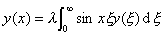&nbsp;&nbsp;&nbsp;&nbsp;&nbsp;&nbsp;&nbsp;&nbsp;&nbsp;&nbsp;&nbsp;&nbsp;&nbsp;&nbsp;&nbsp;&nbsp;&nbsp;&nbsp;&nbsp;&nbsp;&nbsp;&nbsp;&nbsp;&nbsp;&nbsp;&nbsp;&nbsp;(4)&nbsp;&nbsp;&nbsp;&nbsp;&nbsp; </pre>

&nbsp;&nbsp;&nbsp;&nbsp;&nbsp;&nbsp; 从已知的公式

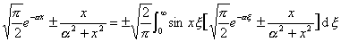&nbsp;&nbsp;&nbsp;
(<i>x&gt;</i>0,α&gt;0)

可知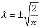确实是特征值。当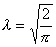时，对任意正常数<i>α</i>，函数

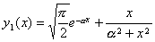&nbsp;&nbsp;&nbsp; (<i>x</i><i>&gt;</i>0)

满足方程（4）；而当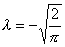时，对任意正常数α，函数

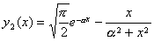&nbsp;&nbsp;&nbsp; (<i>x</i><i>&gt;</i>0)

也满足方程（4）。于是这两个λ值是无穷重的特征值，即每个值对应无穷多个特征函数。这个事实与Fr方程的任一特征值只对应有限个独立特征函数是大不相同的。

&nbsp;&nbsp; 3°&nbsp; 由方程（2）右边所定义的函数<i>F</i>（<i>x</i>）是函数<i>y</i>（<i>x</i>）的拉普拉斯变换。因为不是一切函数都能作拉普拉斯变换，两个不同函数不能有同一个拉普拉斯变换。所以对一个给定函数<i>F(x)</i>，若（2）存在一个解，则解是唯一的。

考虑齐次积分方程

<pre style='text-align:right' align=right>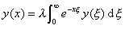&nbsp;&nbsp;&nbsp;&nbsp;&nbsp; （<i>x</i>&gt;0）&nbsp;&nbsp;&nbsp;&nbsp;&nbsp;&nbsp;&nbsp;&nbsp;&nbsp;&nbsp;&nbsp;&nbsp;&nbsp;&nbsp;&nbsp;&nbsp;&nbsp;&nbsp;&nbsp;&nbsp; （5）</pre>

根据伽马函数的定义有

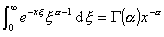&nbsp;&nbsp;&nbsp;&nbsp;&nbsp;
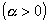

以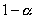代替<i>a</i>，得

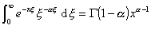&nbsp;&nbsp; 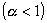

由上面两等式推出

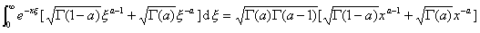

&nbsp;&nbsp;&nbsp;&nbsp;&nbsp;&nbsp;&nbsp;&nbsp;&nbsp;&nbsp;&nbsp;&nbsp;&nbsp;&nbsp;&nbsp;&nbsp;&nbsp;&nbsp;&nbsp;&nbsp;&nbsp;&nbsp;&nbsp;&nbsp;&nbsp;&nbsp;&nbsp;&nbsp;&nbsp;&nbsp;&nbsp;&nbsp;&nbsp;&nbsp;&nbsp;&nbsp;&nbsp;&nbsp;&nbsp;&nbsp;&nbsp;&nbsp;&nbsp;&nbsp;&nbsp;&nbsp;&nbsp;&nbsp;&nbsp;&nbsp;&nbsp;&nbsp;&nbsp;&nbsp;&nbsp;&nbsp;&nbsp;&nbsp;&nbsp;&nbsp;&nbsp;&nbsp;&nbsp;&nbsp;&nbsp;
&nbsp;

如果令

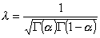&nbsp;&nbsp;&nbsp;
&nbsp;&nbsp;&nbsp;&nbsp;&nbsp;

那末上式表明，函数

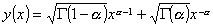&nbsp;&nbsp;&nbsp;
（<i>x</i>&gt;0）

是积分方程（5）的解。

因此，对参数<i>a</i>的任一值，有一个<i>λ</i>值对应，并且决定了方程（5）的一个非平凡解。

利用恒等式

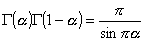&nbsp;&nbsp;&nbsp;&nbsp;&nbsp;&nbsp;&nbsp;&nbsp;&nbsp;&nbsp;&nbsp;&nbsp;
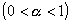

有

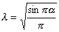&nbsp;&nbsp;&nbsp;&nbsp;&nbsp;&nbsp;&nbsp;&nbsp;&nbsp;&nbsp;&nbsp;&nbsp;

由此推出，在区间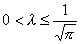内的一切<i>λ</i>值都是奇异积分方程（5）的特征值。

&nbsp;&nbsp;&nbsp; 还能证明在区间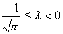内的一切<i>λ</i>值也是奇异积分方程（5）的特征值。

&nbsp;&nbsp; 积分方程（3）的积分区间是有限的，但是核是无界函数，这种奇异积分方程将在本节二和§3中考虑。

