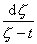
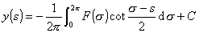

二、具有柯西核和希尔伯特核的积分方程

[柯西核与希尔伯特核]

定理&nbsp; 设<i>L</i>是任一光滑闭曲线，是定义在<i>L</i> 上且满足具有指数<i>a </i>的李普希茨条件<a href="#None" name="_ftnref1"
title="">*</a>的一个函数，当<i>z</i>从<i>L</i>的内部趋于<i>L</i>上任一点<i>t</i>时，则柯西型积分

<pre style='text-align:right' align=right>&nbsp;&nbsp;&nbsp;&nbsp;&nbsp;&nbsp;&nbsp;&nbsp;&nbsp;&nbsp;&nbsp;&nbsp;&nbsp;&nbsp;&nbsp;&nbsp;&nbsp;&nbsp;&nbsp;&nbsp; &nbsp;&nbsp;&nbsp;&nbsp;&nbsp;&nbsp;&nbsp;&nbsp;&nbsp;&nbsp;&nbsp;&nbsp;&nbsp;&nbsp;&nbsp;&nbsp;&nbsp;&nbsp;&nbsp;&nbsp;&nbsp;&nbsp;&nbsp;&nbsp;&nbsp;&nbsp;&nbsp;&nbsp;（1）</pre>

趋于极限值

当<i>z</i>从<i>L</i>的外部趋于<i>L</i>上任一点<i>t</i>时，积分（1）趋于相应的极限值

上面两个等式中的积分都是广义积分

&nbsp;&nbsp;&nbsp; 表达式

&nbsp;&nbsp;&nbsp;&nbsp;&nbsp;&nbsp;&nbsp;&nbsp;&nbsp;&nbsp;&nbsp;&nbsp;&nbsp;&nbsp;&nbsp;&nbsp;&nbsp;&nbsp;&nbsp;&nbsp;&nbsp;&nbsp;&nbsp;

称为柯西核，式中<i>ζ</i>和<i>t</i>是<i>L</i>上的任意两点。

&nbsp;&nbsp;&nbsp; 表达式

&nbsp;&nbsp;&nbsp;&nbsp;&nbsp;&nbsp;&nbsp;&nbsp;&nbsp;&nbsp;&nbsp;&nbsp;&nbsp;&nbsp;&nbsp;&nbsp;&nbsp;&nbsp;&nbsp;&nbsp;&nbsp;&nbsp;&nbsp;&nbsp;&nbsp;

称为希尔伯特核，式中<i>s</i>和<i>σ</i>都是实变量，并在闭区间内变动。

柯西核和希尔伯特核之间有很简单的关系。设<i>L</i>是一简单闭曲线，它是有连续曲率的一条光滑曲线。设<i>L</i>的参数方程是

，

设相应的参数<i>s</i>在闭区间内变动。令<i>t=x</i>+<b><i>i</i></b><i>y</i>和<i>t=x</i>(s)+<b><i>i</i></b><i>y</i>(s)。<i>L</i>的方程可写作<i>t=t</i>(<i>s</i>)。设<i>ζ</i>是<i>L</i>上任一点，则有一参数值σ，使。于是不难证明：

<i></i>

式中<i>P</i>(<i>s</i>,<i>σ</i>)是两个变量<i>s </i>和<i>σ</i>的连续函数，这函数满足具有某指数的李普希茨条件。

[具有希尔伯特核的奇异积分方程] 考虑如下形式的方程:

&nbsp;&nbsp;&nbsp;&nbsp;&nbsp;&nbsp; &nbsp;&nbsp;&nbsp;&nbsp;&nbsp;&nbsp;&nbsp;&nbsp;&nbsp;&nbsp;&nbsp;&nbsp;&nbsp;&nbsp;&nbsp;&nbsp;(2)

式中<i>a</i>和<i>b</i>是常数。

假定核<i>K</i>(<i>s</i>,<i>σ</i>)和自由项<i>F</i>（<i>s</i>）都满足李普希茨条件。

如果<i>K</i>(<i>s</i>,<i>σ</i>)≡0，则所考虑的方程是 

<pre align=left>&nbsp;&nbsp;&nbsp;&nbsp;&nbsp;&nbsp;&nbsp;&nbsp;&nbsp;&nbsp;&nbsp;&nbsp;&nbsp;&nbsp;&nbsp;&nbsp;&nbsp;&nbsp; &nbsp;&nbsp;&nbsp;&nbsp;&nbsp;&nbsp;&nbsp;&nbsp;&nbsp;&nbsp;&nbsp;&nbsp;&nbsp;&nbsp;&nbsp;&nbsp;&nbsp;&nbsp;&nbsp;&nbsp;&nbsp;&nbsp;&nbsp;&nbsp;&nbsp;&nbsp;&nbsp;&nbsp;&nbsp;&nbsp;(3)</pre>

若<i>a2+b2</i>≠0,则这个方程的解是

&nbsp;&nbsp; &nbsp;&nbsp;&nbsp;&nbsp;&nbsp;&nbsp;(4)

若<i>a2+b2</i>=0,则方程一般没有解。

注意特殊情况<i>a</i>=0.不防设<i>b</i>=1,则（3）变为第一类Fr方程

<pre>&nbsp;&nbsp;&nbsp;&nbsp;&nbsp;&nbsp;&nbsp;&nbsp;&nbsp;&nbsp;&nbsp;&nbsp;&nbsp;&nbsp;&nbsp;&nbsp;&nbsp;&nbsp;&nbsp;&nbsp;&nbsp; </pre>

这时，（4）式的解没有用，但方程（3）有解的充分必要条件是:

<pre>&nbsp;&nbsp;&nbsp;&nbsp;&nbsp;&nbsp;&nbsp;&nbsp;&nbsp;&nbsp;&nbsp;&nbsp;&nbsp;&nbsp;&nbsp;&nbsp;&nbsp;&nbsp;&nbsp;&nbsp;&nbsp;&nbsp;&nbsp;&nbsp;&nbsp;&nbsp;&nbsp;&nbsp;&nbsp;&nbsp;&nbsp;&nbsp; </pre>

解的形式是

<pre>&nbsp;&nbsp;&nbsp;&nbsp;&nbsp;&nbsp;&nbsp;&nbsp;&nbsp;&nbsp;&nbsp;&nbsp;&nbsp;&nbsp;&nbsp;&nbsp;&nbsp;&nbsp;&nbsp;&nbsp;&nbsp;&nbsp;&nbsp;&nbsp; </pre>

式中<i>C</i>是任意常数。

在一般情形下，可以证明方程（2）与一般形式的Fr方程等价，于是所考虑的方程归结到解Fr方程。

具有希尔伯特核的奇异积分方程的一般形式是

<pre>&nbsp;&nbsp;&nbsp;&nbsp;&nbsp;&nbsp;&nbsp; </pre>

式中<i>a</i>(<i>s</i>)和<i>b</i>(<i>s</i>)是变量<i>s</i>的函数。若<i>a</i>(<i>s</i>)和<i>b</i>(<i>s</i>)满足李普希茨条件，上式可化为Fr方程，但是二者可能不等价。

[具有柯西核的奇异积分方程]&nbsp; 考虑如下形式的方程：

<pre style='text-align:right' align=right>&nbsp;&nbsp;&nbsp;&nbsp;&nbsp;&nbsp;&nbsp;&nbsp;&nbsp;&nbsp;&nbsp; &nbsp;&nbsp;&nbsp;&nbsp;&nbsp;&nbsp;&nbsp;&nbsp;&nbsp;&nbsp;&nbsp;&nbsp;&nbsp;&nbsp;&nbsp;&nbsp;&nbsp;&nbsp;&nbsp;&nbsp;&nbsp;&nbsp;&nbsp;&nbsp;&nbsp;&nbsp;&nbsp;&nbsp;（5）</pre>

式中<i>a</i>和<i>b</i>是常数，<i>L</i>是闭曲线。

若<i>a</i>2-<i>b</i>2≠0,则（5）的解为

具有柯西核的奇异积分方程的一般形式是

&nbsp;&nbsp;&nbsp; 

它也可化为Fr方程。若<i>a</i>和<i>b</i>是常数，则得到的Fr方程与上面方程等价。在一般情形下需加补充说明。

 

 

<a href="#None" name="_ftn1" title="">*</a>如果存在两个常数<i>K</i>和<i>a</i>（0&lt;<i>a</i>≤1）,使对区间[<i>a</i>,<i>b</i>]上的任意一对值下面的不等式成立：

则称函数<i>f</i>(<i>x</i>)满足具有指数<i>α</i>的李普希茨条件。

