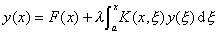
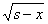

<b>§</b><b>3&nbsp; </b><b>沃尔泰拉积分方程</b>

&nbsp;&nbsp;&nbsp;
[第二类沃尔泰拉积分方程]&nbsp; 一维的第二类沃尔泰拉方程为

<pre style='text-align:right' align=right>&nbsp;&nbsp;&nbsp;&nbsp;&nbsp;&nbsp;&nbsp; &nbsp;&nbsp;&nbsp;&nbsp;&nbsp;&nbsp;&nbsp;&nbsp;&nbsp;&nbsp;&nbsp;&nbsp;&nbsp;&nbsp;&nbsp;&nbsp;&nbsp;&nbsp;&nbsp;&nbsp;&nbsp;&nbsp;&nbsp;（1）</pre>

这是Fr方程的特殊情形（当<i>ξ</i>&gt;<i>x</i>时，<i>K</i>(<i>x,</i><i>ξ</i>)=0）。假定<i>F</i>(<i>x</i>)在区间[<i>a</i>,<i>b</i>]上连续,<i> K</i>(<i>x,</i><i>ξ</i>)在正方形<i>k0&nbsp;
</i>(<i>a</i>≤<i>x</i>≤<i>b,a</i>≤<i>ξ</i>≤<i>b</i>)上连续，且当（<i>ξ</i>&gt;<i>x</i>）时，

<i>K</i>(<i>x,</i><i>ξ</i>)=0

因此，当<i>K</i>(<i>x,x</i>)≠0时，核有第一类不连续点<i>x</i>=<i>ξ</i>。

积分方程（1）的解用<i>λ</i>的幂级数表示为

<pre style='text-align:right' align=right>&nbsp;&nbsp;&nbsp;&nbsp;&nbsp;&nbsp;&nbsp; &nbsp;&nbsp;&nbsp;&nbsp;&nbsp;&nbsp;&nbsp;&nbsp;&nbsp;&nbsp;&nbsp;&nbsp;&nbsp;&nbsp;&nbsp;&nbsp;&nbsp;&nbsp;&nbsp;&nbsp;&nbsp;（2）</pre>

对函数<i>yn</i>(<i>x</i>)有下列递推公式：

， &nbsp;&nbsp;&nbsp;&nbsp;&nbsp;

设在有限区间或正方形上，连续函数<i>F</i>(<i>x</i>)和<i>K</i>（<i>x,</i><i>ξ</i>）满足

，&nbsp;&nbsp;

式中<i>m, M</i>为常数。因此当充分小时，级数（2）在[<i>a, b</i>]上绝对且一致收敛，其和<i>y</i>(<i>x</i>)是连续函数且满足方程（1）。

也可以作预解核

<pre style='text-align:right' align=right>&nbsp;&nbsp;&nbsp;&nbsp;&nbsp;&nbsp;&nbsp;&nbsp;&nbsp;&nbsp; &nbsp;&nbsp;&nbsp;&nbsp;&nbsp;&nbsp;&nbsp;&nbsp;&nbsp;&nbsp;&nbsp;&nbsp;&nbsp;&nbsp;&nbsp;&nbsp;&nbsp;&nbsp;&nbsp;&nbsp;&nbsp;&nbsp;（3）</pre>

式中叠核<i>Kn</i>(<i>x,</i><i>ξ</i>)由下面递推公式计算：

； &nbsp;&nbsp;

且从此得出当<i>ξ</i>&gt;<i>x</i>时，<i>Kn</i>(<i>x,</i><i>ξ</i>)=0。事实上，若<i>ξ</i>&gt;<i>x,</i>则<i>ξ</i><i>1</i>&lt;<i>ξ</i>,因而

<i>K</i>(<i>ξ</i><i>,</i><i>ξ</i>)=0

可证明级数（3）对一切<i>λ</i>值绝对且一致收敛。于是，沃尔泰拉方程（1）的预解核是整函数，并且对任何<i>λ</i>有如下形式的唯一解：

所以沃尔泰拉方程没有特征值，就是说齐次方程

对任何<i>λ</i>只有平凡解<i>y</i>(<i>x</i>)≡0。因此，若作方程（1）的Fr分母，则可发现它根本没有零点。

[特殊沃尔泰拉方程]&nbsp;
设<i>u</i>(<i>x</i>),<i>v</i>(<i>x</i>)是定义在<i>x</i>≥0上的两个连续函数，由积分

所定义的函数称为函数的<i>u</i>(<i>x</i>)和<i>v</i>(<i>x</i>)的卷积（或褶积）。

根据卷积的性质（即<i>u</i>和<i>v</i>的卷积的拉普拉斯变换等于<i>u</i>和<i>v</i>的拉普拉斯变换之积）可把解特殊沃尔泰拉方程（其核只与两个变量之差有关）：

的问题变为决定一个拉普拉斯变换的反演变换问题。为此，将上式两边各取拉普拉斯变换，并利用卷积的性质，有

得 

查拉普拉斯变换表或用其他方法便可以确定<i>y</i>(<i>x</i>)。

&nbsp;&nbsp;&nbsp; [第一类沃尔泰拉积分方程]&nbsp;&nbsp;&nbsp;
第一类沃尔泰拉积分方程

<pre style='text-align:right' align=right>&nbsp;&nbsp;&nbsp;&nbsp;&nbsp;&nbsp;&nbsp;&nbsp;&nbsp;&nbsp;&nbsp;&nbsp;&nbsp;&nbsp;&nbsp;&nbsp;&nbsp;&nbsp;&nbsp;&nbsp;&nbsp;&nbsp; &nbsp;&nbsp;&nbsp;&nbsp;&nbsp;&nbsp;&nbsp;&nbsp;&nbsp;&nbsp;&nbsp;&nbsp;&nbsp;&nbsp;&nbsp;&nbsp;&nbsp;&nbsp;&nbsp;&nbsp;&nbsp;&nbsp;&nbsp;&nbsp;&nbsp;&nbsp;（1）</pre>

可变为第二类沃尔泰拉积分方程。在核是连续可微的假定下，有两种变换方法。一种方法是，对（1）两边求导，便得

若<i>K</i>(<i>x,x</i>)≠0,这个方程可化为

式中

，&nbsp;&nbsp;&nbsp;&nbsp;&nbsp;

另一种方法是，设

则方程（1）化为

分部积分得

若<i>K</i>(<i>x,x</i>)≠0,这个方程可改写为

式中

&nbsp; ，&nbsp;&nbsp; 

[阿贝耳积分方程]&nbsp;&nbsp;&nbsp;
形如

<pre style='text-align:right' align=right>&nbsp;&nbsp;&nbsp;&nbsp;&nbsp;&nbsp;&nbsp;&nbsp;&nbsp;&nbsp;&nbsp;&nbsp;&nbsp;&nbsp;&nbsp;&nbsp;&nbsp;&nbsp;&nbsp;&nbsp;&nbsp;&nbsp;&nbsp;&nbsp;&nbsp;&nbsp;&nbsp; &nbsp;&nbsp;&nbsp;&nbsp;&nbsp;&nbsp;&nbsp;&nbsp;&nbsp;&nbsp;&nbsp;&nbsp;&nbsp;&nbsp;&nbsp;&nbsp;&nbsp;&nbsp;&nbsp;&nbsp;&nbsp;&nbsp;&nbsp;&nbsp;&nbsp;&nbsp;&nbsp;&nbsp;&nbsp;&nbsp;&nbsp;&nbsp;&nbsp;&nbsp;&nbsp;&nbsp;&nbsp;&nbsp;&nbsp;(1)</pre>

的沃尔泰拉积分方程称为阿贝耳积分方程。对给定函数<i>F</i>(<i>x</i>)适当加以限制下，积分方程（1）可用间接方法求解。（1）式除以（<i>s</i>是一参数），然后两边积分，得

把上式右边的积分次序交换，并改变积分限，化为

<pre style='text-align:right' align=right>&nbsp;&nbsp;&nbsp; &nbsp;&nbsp;&nbsp;&nbsp;&nbsp;&nbsp;&nbsp;&nbsp;&nbsp;&nbsp;&nbsp;&nbsp;&nbsp;&nbsp;&nbsp;&nbsp;&nbsp;&nbsp;(2)</pre>

令<i>x=</i>(<i>s</i>-<i>ξ</i>)<i>t</i>+<i>ξ</i>,则有

代入（2）式有

或者写为

把这个等式求导，便得所求的解为

若<i>F</i>(<i>x</i>)不能使这个等式的右边存在且连续，则方程（1）没有连续解。

