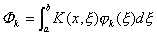
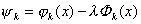
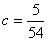

<b>§</b><b>4&nbsp; </b><b>积分方程的近似解法</b>

&nbsp;&nbsp;&nbsp; [对Fr方程的线性代数方程组的逼近法]&nbsp;
Fr方程

<pre style='text-align:right' align=right>&nbsp;&nbsp;&nbsp;&nbsp;&nbsp;&nbsp;&nbsp;&nbsp;&nbsp;&nbsp;&nbsp;&nbsp;&nbsp;&nbsp;&nbsp;&nbsp;&nbsp;&nbsp;&nbsp; &nbsp;&nbsp;&nbsp;&nbsp;&nbsp;&nbsp;&nbsp;&nbsp;&nbsp;&nbsp;&nbsp;&nbsp;&nbsp;&nbsp;&nbsp;&nbsp;&nbsp;&nbsp;&nbsp;&nbsp;&nbsp;&nbsp;（1）</pre>

可按形式

<pre style='text-align:right' align=right>&nbsp;&nbsp;&nbsp;&nbsp;&nbsp;&nbsp;&nbsp;&nbsp;&nbsp;&nbsp;&nbsp; &nbsp;&nbsp;&nbsp;&nbsp;&nbsp;&nbsp;&nbsp;&nbsp;&nbsp;&nbsp;&nbsp;&nbsp;&nbsp;&nbsp;&nbsp;&nbsp;&nbsp;&nbsp;&nbsp;&nbsp;（2）</pre>

来逼近，其中<i>xk</i>(<i>k</i>=1,2,…,<i>n</i>)是区间[<i>a</i>,<i>b</i>]上<i>n</i>个适当选定的求积节点，常数<i>ω</i><i>k</i>是对应的求积系数。如果要求在每点<i>xk</i>(<i>k</i>=1,2,…,<i>n</i>)处，（2）式两边相等，则得到关于<i>n</i>个未知函数<i>y</i>(<i>x1</i>),<i>y</i>(<i>x2</i>),…<i>y</i>(<i>xn</i>)的<i>n</i>个线性方程：

<pre style='text-align:right' align=right>&nbsp;&nbsp;&nbsp;&nbsp;&nbsp;&nbsp; &nbsp;&nbsp;&nbsp;&nbsp;&nbsp;&nbsp;&nbsp;&nbsp;&nbsp;&nbsp;&nbsp;&nbsp;&nbsp;&nbsp;&nbsp;&nbsp;（3）</pre>

式中<i>y</i>(<i>xi</i>)(<i>i</i>=1,2,…<i>n</i>)为未知函数<i>y</i>(<i>x</i>)分别在<i>n</i>个点<i>xi</i>(<i>i</i>=1,2,…<i>n</i>)处指定的近似值。

若令

（3）可改写为

<i></i>&nbsp;&nbsp;&nbsp;&nbsp;&nbsp;&nbsp;&nbsp;&nbsp;
(<i>i</i>=1,2,…<i>n</i>)

写成矩阵形式为

<i>y</i>=<b><i>F</i></b>+<i>λ<b>KW</b>y</i>

或&nbsp;&nbsp;&nbsp;&nbsp;&nbsp;&nbsp;&nbsp;&nbsp;&nbsp;&nbsp;&nbsp;&nbsp;&nbsp;&nbsp;&nbsp;&nbsp;&nbsp;&nbsp;&nbsp;
&nbsp;&nbsp;&nbsp;&nbsp;&nbsp;&nbsp;&nbsp;&nbsp;&nbsp;&nbsp;&nbsp;&nbsp;&nbsp;&nbsp;&nbsp;&nbsp;&nbsp;&nbsp;&nbsp;&nbsp;&nbsp;&nbsp;&nbsp;&nbsp; &nbsp;&nbsp;&nbsp;<b><i>Ay</i></b>=<b><i>F</i></b>&nbsp;&nbsp;&nbsp;&nbsp;&nbsp;&nbsp;&nbsp;&nbsp;&nbsp;&nbsp;&nbsp;&nbsp;&nbsp;&nbsp;&nbsp;&nbsp;&nbsp;&nbsp;&nbsp;&nbsp;&nbsp;&nbsp;&nbsp;&nbsp;&nbsp;&nbsp;&nbsp;&nbsp;&nbsp;&nbsp;&nbsp;
（4）

式中<b><i>A</i></b>=<b><i>I</i></b>-<i>λ<b>KW</b>,<b>I</b></i>为<i>n</i>阶单位矩阵，<b><i>K</i></b><i>=</i>（<i>Kij</i>），<b><i>W</i></b>为对角线矩阵

<b><i>W</i></b>=é<i>w
1</i>,<i>w 2</i>,L,<i>wn</i>&ucirc; ,<b><i>y</i></b><i>=</i>(<i>y1,y2,</i><i>L</i>,<i>yn</i>)t,<b><i>F</i></b><i>=</i>(<i>F1</i>,<i>F2</i>,L,<i>Fn</i>)t

&nbsp;&nbsp;
例 解第二类Fr方程

解&nbsp;&nbsp; 1°&nbsp; 在这个特例中，积分方程可化为具端点条件<i>y</i>(0)=0,<i>y</i>(1)=1的微分方程

其精确解为&nbsp;&nbsp;&nbsp; 

&nbsp;&nbsp;&nbsp;&nbsp;&nbsp;&nbsp;&nbsp;&nbsp;
2°&nbsp; 用逼近法来求近似解。取<i>n</i>=5个等距节点：

可以算出矩阵<i>K</i> 为

如果采用梯形法求积，那么求积系数的对角线矩阵<i>W</i>为

<i>W</i>= é&ucirc;

由于<i>l</i>=1，则

而&nbsp;&nbsp;&nbsp;&nbsp;&nbsp;&nbsp;&nbsp;&nbsp;&nbsp;&nbsp;&nbsp;&nbsp;&nbsp;&nbsp;&nbsp;&nbsp;&nbsp;&nbsp;&nbsp;&nbsp;&nbsp;&nbsp;&nbsp;&nbsp;&nbsp;&nbsp;&nbsp;&nbsp;&nbsp;&nbsp;

解线性方程组，计算到小数点后四位得到

<i>y</i>1=0,&nbsp;
<i>y</i>2<i>=</i>0.2943,&nbsp; <i>y</i>3=0.5702,&nbsp; <i>y</i>4=0.8104,&nbsp;
<i>y</i>5=1

与精确解<i>y</i>(<i>x</i>)在点<i>x=</i>0,和1的值

<i>y</i>1=0,&nbsp;
<i>y</i>2<i>=</i>0.2940,&nbsp; <i>y</i>3=0.5697,&nbsp; <i>y</i>4=0.8100,&nbsp;
<i>y</i>5=1

进行比较，可以看到误差程度。

上述方法显然可以用来求第一类Fr方程的近似解，以及处理特征值的问题。

应当指出，当核<i>K</i>(<i>x</i>,<i>x</i>)不是以分析表达式给定，而由实验数据确定时，上述方法特别有用。

[待定系数逼近法]&nbsp; 为了求积分方程

<pre style='text-align:right' align=right>&nbsp;&nbsp;&nbsp;&nbsp;&nbsp;&nbsp;&nbsp;&nbsp;&nbsp; &nbsp;&nbsp;&nbsp;&nbsp;&nbsp;&nbsp;&nbsp;&nbsp;&nbsp;&nbsp;&nbsp;&nbsp;&nbsp;&nbsp;&nbsp;&nbsp;&nbsp;&nbsp;&nbsp;&nbsp;&nbsp;&nbsp;&nbsp;&nbsp;&nbsp;（1）</pre>

的解，可适当选择<i>n</i>个函数，用它们的线性组合来逼近

&nbsp;&nbsp;&nbsp;&nbsp;&nbsp;&nbsp;&nbsp;&nbsp;&nbsp;&nbsp;&nbsp;&nbsp;&nbsp;&nbsp;&nbsp;&nbsp;&nbsp;&nbsp;&nbsp;&nbsp;&nbsp;&nbsp;&nbsp;&nbsp;&nbsp;&nbsp;&nbsp;&nbsp;&nbsp;&nbsp;&nbsp;&nbsp;

其中<i>n</i>个系数<i>ak</i>（<i>k</i>=1，2，L<i>n</i>）可以这样决定：使这个线性组合尽可能近似地满足（1），即

&nbsp;&nbsp;
（<i>a</i>≤<i>x</i>≤<i>b</i>）

令

上式变成

<pre style='text-align:right' align=right>&nbsp;&nbsp;&nbsp;&nbsp;&nbsp;&nbsp; （<i>a</i>≤<i>x</i>≤<i>b</i>）&nbsp;&nbsp;&nbsp;&nbsp;&nbsp;&nbsp;&nbsp; （2）</pre>

待定系数<i>a1</i>,<i>a2</i>,L,<i>an</i>可由<i>n</i>个条件决定，方法如下：

&nbsp;&nbsp;&nbsp; 1°&nbsp; 配置法&nbsp; 令

<pre style='text-align:right' align=right>&nbsp;&nbsp;&nbsp;&nbsp;&nbsp; （<i>a</i>≤<i>x</i> ≤<i>b</i>）&nbsp;&nbsp;&nbsp;&nbsp;&nbsp;&nbsp;&nbsp;&nbsp; （3）</pre>

为决定这<i>n</i>个常数<i>a</i>1,<i>a</i>2,L,<i>an</i>，在区间[<i>a</i>,<i>b</i>]上适当选择<i>a</i>≤<i>x</i>1&lt;<i>x</i>2&lt;L&lt;<i>xn</i>≤<i>b</i>(<i>xi</i>称为配置点)，使

&nbsp;&nbsp;&nbsp;&nbsp;&nbsp;&nbsp;&nbsp;&nbsp;&nbsp;&nbsp;&nbsp;&nbsp;&nbsp;
&nbsp;&nbsp;&nbsp;&nbsp;&nbsp;&nbsp;&nbsp;&nbsp;&nbsp;&nbsp;&nbsp;&nbsp;&nbsp;&nbsp;&nbsp;（<i>i</i>=1,2,L<i>n</i>）

其矩阵形式为

<pre style='text-align:right' align=right><i>&nbsp;&nbsp;&nbsp;&nbsp;&nbsp;&nbsp;&nbsp;&nbsp;&nbsp;&nbsp;&nbsp;&nbsp;&nbsp;&nbsp;&nbsp;&nbsp;&nbsp;&nbsp;&nbsp;&nbsp;&nbsp;&nbsp;&nbsp;&nbsp;&nbsp;&nbsp;&nbsp;&nbsp;&nbsp;&nbsp;&nbsp;&nbsp;&nbsp; </i><i>y</i><b><i>a</i></b> =<b><i>F</i></b><i>&nbsp;&nbsp;&nbsp;&nbsp;&nbsp;&nbsp;&nbsp;&nbsp;&nbsp;&nbsp;&nbsp;&nbsp; &nbsp;&nbsp;&nbsp;&nbsp;&nbsp;&nbsp;&nbsp;&nbsp;&nbsp;&nbsp;&nbsp;&nbsp;&nbsp;&nbsp;&nbsp;&nbsp;&nbsp;&nbsp;&nbsp;&nbsp;&nbsp;&nbsp;&nbsp;&nbsp;&nbsp;&nbsp;&nbsp;&nbsp;&nbsp;</i>(4)</pre>

式中<i>y</i> =(<i>ψ</i><i>ij</i>)=(<i>ψ</i><i>j</i>(<i>xi</i>)),<b><i>F</i></b><i>=</i>(<i>F</i>(<i>x</i>1),<i>F</i>(<i>x</i>2),L<i>F</i>(<i>xn</i>))τ为已知量，

<b><i>&nbsp;&nbsp;&nbsp;&nbsp;&nbsp;&nbsp;&nbsp;&nbsp;&nbsp;&nbsp;&nbsp;&nbsp;&nbsp;&nbsp;&nbsp;&nbsp;&nbsp;&nbsp;&nbsp;&nbsp;&nbsp;&nbsp;&nbsp;&nbsp;&nbsp;
</i></b><b><i>a </i></b>=（<i>a</i>1,<i>a</i>2,L,<i>an</i>）<i>t</i> 

为 未 知 量。解
线性方程组（4）便得到所求的系数<i>a</i>1,<i>a</i>2,L,<i>an</i>。

2°权函数法&nbsp; 设<i>w</i>1(<i>x</i>),<i>w</i>2(<i>x</i>),L,<i>wn</i>(<i>x</i>)为区间[<i>a,b</i>]上<i>n</i>个线性无关的函数（称为权函数）。为决定系数<i>a</i>1,<i>a</i>2,L,<i>an</i>，可以要求（3）式两边之差

与这<i>n</i>个权函数正交，即使得

&nbsp;&nbsp;&nbsp;
(<i>i</i>=1,2,…<i>n</i>)

其矩阵形式为

<pre style='text-align:right' align=right><i>&nbsp;&nbsp;&nbsp;&nbsp;&nbsp;&nbsp;&nbsp;&nbsp;&nbsp;&nbsp;&nbsp;&nbsp;&nbsp;&nbsp;&nbsp;&nbsp;&nbsp;&nbsp; A</i><b><i>a</i></b> =<b><i>b</i></b><i>&nbsp;&nbsp;&nbsp;&nbsp;&nbsp;&nbsp;&nbsp;&nbsp;&nbsp;&nbsp;&nbsp;&nbsp;&nbsp;&nbsp;&nbsp;&nbsp;&nbsp;&nbsp;&nbsp;&nbsp; </i>&nbsp;&nbsp;&nbsp;&nbsp;&nbsp;&nbsp;&nbsp;&nbsp;&nbsp;&nbsp;&nbsp;&nbsp;&nbsp;&nbsp;&nbsp;&nbsp;&nbsp;&nbsp;&nbsp;&nbsp;(5)</pre>

式中&nbsp;&nbsp;&nbsp;&nbsp;&nbsp;&nbsp;&nbsp;&nbsp;&nbsp;&nbsp; &nbsp;

<pre>&nbsp;&nbsp;&nbsp;&nbsp;&nbsp;&nbsp;&nbsp;&nbsp;&nbsp;&nbsp;&nbsp;&nbsp;&nbsp;&nbsp;&nbsp;&nbsp;&nbsp;&nbsp;&nbsp;&nbsp; &nbsp;</pre>

为已知量，

<b><i>&nbsp;&nbsp;&nbsp;&nbsp;&nbsp;&nbsp;&nbsp;&nbsp;&nbsp;&nbsp;&nbsp;&nbsp;&nbsp;&nbsp;&nbsp;&nbsp;&nbsp;&nbsp;&nbsp;&nbsp;&nbsp;&nbsp;&nbsp;&nbsp;
</i></b><b><i>a</i></b> =（<i>a </i>1,<i>a </i>2,L,<i>a n</i>）<i>t</i>

为未知量。解线性方程组（5）便得到所求的系数<i>a</i> 1,<i>a</i> 2,L,<i>a n</i>。

通常选取权函数<i>w i</i>(<i>x</i>)与近似函数<i>j i</i>(<i>x</i>)恒等比较方便，一般都取为

1,<i>x</i>,<i>x</i>2,L,<i>xn</i><i>-</i>1

[核的逼近法]&nbsp; §1指出Fr方程的核可用<i>x</i>和<i>ξ</i>的一个多项式或一个更一般形式的可分离核来逼近，并用那里的方法来解所得的近似方程。

例&nbsp; 积分方程

<pre style='text-align:right' align=right>&nbsp;&nbsp;&nbsp;&nbsp;&nbsp;&nbsp;&nbsp;&nbsp;&nbsp;&nbsp; &nbsp;&nbsp;&nbsp;&nbsp;&nbsp;&nbsp;&nbsp;&nbsp;&nbsp;&nbsp;&nbsp;&nbsp;&nbsp;&nbsp;&nbsp;&nbsp;&nbsp;&nbsp;&nbsp;&nbsp;&nbsp;&nbsp;&nbsp;&nbsp;&nbsp;&nbsp;&nbsp;&nbsp;&nbsp;&nbsp;(1)</pre>

中的核

<i></i>

可用多项式<i>A</i>1+<i>A</i>2<i>x</i>+<i>A</i>3<i>x</i>2或更适当的形式<i>x</i>(1-<i>x</i>)(<i>B</i>1+<i>B</i>2<i>x</i>+<i>B</i>3<i>x</i>2)来逼近，其中<i>A</i>,<i>B</i>为包含<i>ξ</i>的参数，采用权函数或配置点可决定<i>A</i>与<i>B</i>。

&nbsp;&nbsp;&nbsp; 首先取一个粗糙的逼近形式

它在端点<i>x=</i>0和<i>x=</i>1是精确的，为决定系数<i>B</i>，可要求在[0,1]上核的积分等于它的近似表达式的积分，即

直接计算得

<i>B</i>=3<i>ξ</i>(1-<i>ξ</i>)

并把对应的近似核代入(1)导出近似积分方程

<pre align=left>&nbsp;&nbsp;&nbsp;&nbsp;&nbsp;&nbsp;&nbsp;&nbsp;&nbsp;&nbsp;&nbsp;&nbsp;&nbsp;&nbsp;&nbsp;&nbsp;&nbsp;&nbsp;&nbsp;&nbsp;&nbsp;&nbsp;&nbsp;&nbsp;&nbsp;&nbsp;&nbsp;&nbsp;&nbsp;&nbsp;&nbsp;&nbsp; &nbsp;&nbsp;&nbsp;&nbsp;&nbsp;&nbsp;&nbsp;&nbsp;&nbsp;&nbsp;&nbsp;&nbsp;&nbsp;&nbsp;&nbsp;&nbsp;&nbsp;&nbsp;&nbsp;&nbsp;&nbsp;&nbsp;&nbsp;(2)</pre>

令

(2)式化为&nbsp;&nbsp;&nbsp;&nbsp;&nbsp;&nbsp;&nbsp;&nbsp;&nbsp;&nbsp;&nbsp;&nbsp;&nbsp;&nbsp;&nbsp;&nbsp;&nbsp;&nbsp;&nbsp;&nbsp;&nbsp;&nbsp;&nbsp;

&nbsp;&nbsp;&nbsp;&nbsp;&nbsp;&nbsp;&nbsp;&nbsp;&nbsp;&nbsp;&nbsp;&nbsp;&nbsp;&nbsp;&nbsp;&nbsp;&nbsp;&nbsp;&nbsp;&nbsp;&nbsp;&nbsp;&nbsp;&nbsp;&nbsp;&nbsp;&nbsp;&nbsp;&nbsp;&nbsp;&nbsp;&nbsp;&nbsp;&nbsp;
<i>y</i>(<i>x</i>)=<i>x</i>+3<i>cx</i>(1-<i>x</i>)&nbsp;&nbsp;&nbsp;&nbsp;&nbsp;&nbsp;&nbsp;&nbsp;&nbsp;&nbsp;&nbsp;&nbsp;&nbsp;&nbsp;&nbsp;&nbsp;&nbsp;&nbsp;&nbsp;&nbsp;&nbsp;&nbsp;&nbsp;&nbsp;&nbsp;&nbsp;&nbsp;&nbsp;
(3)

为了决定<i>c</i>，以<i>x</i>(1-<i>x</i>)乘上式的两边，并在[0,1]上积分，得

从此算出,代入(3)得到方程(1)的近似解

更一般地，如果取近似核为

则类似地可得方程(1)的近似解

）

