

<b>§</b><b>5&nbsp; </b><b>非线性积分方程</b>

[积分算子与线性算子]&nbsp; 考虑表达式

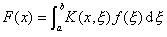

对于给定的核<i>K</i>(<i>x</i>,<i>ξ</i>),每个函数<i>f</i>(<i>x</i>)都有另一个函数<i>F</i>(<i>x</i>)与之对应，这种对应关系称为积分算子，记作<i>K</i>, 即

<i>F=Kf</i>

使得函数<i>F</i>=<i>Kf</i>存在的那些函数<i>f</i>的集合称为算子<i>K</i>的定义域。

&nbsp;&nbsp;&nbsp; 如果算子<i>K</i>满足条件

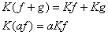（<i>a</i>为常数）

则称<i>K</i>为线性算子。

&nbsp;&nbsp;&nbsp;
[有界算子及其范数]&nbsp; 如果存在某常数<i>M</i>,对一切函数<i>f</i>都有

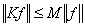

则称<i>K</i>为有界算子，式中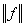表示函数<i>f</i>的范数(模)。使上面不等式成立的一切<i>M</i>的最大下界称为算子<i>K</i>的范数，记作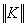，它也可以定义为

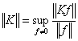

&nbsp;&nbsp;&nbsp; 有界算子具有以下性质：

&nbsp;&nbsp;&nbsp; 1°&nbsp; 若<i>K</i>1和<i>K</i>2是有界算子，则<i>K</i>1<i>K</i>2也是有界算子。

&nbsp;&nbsp;&nbsp; 2°&nbsp; 如果对有限正方形<i>k0</i>(<i>a</i>≤<i>x</i>≤<i>b</i>, <i>a</i>≤<i>ξ</i>≤<i>b</i>)上的一切<i>x</i>,<i>ξ</i>,函数<i>K</i>(<i>x</i>,<i>ξ</i>)是连续的，则由

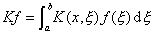

定义的算子<i>K</i> 是有界算子。

&nbsp;&nbsp;&nbsp; 3°&nbsp; 如果在无限区间[<i>a,b</i>]上，函数<i>K</i>(<i>x,</i><i>ξ</i>)满足

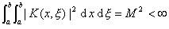

则由

定义的算子<i>K</i>是有界算子。

[非线性积分方程解的存在定理]&nbsp; 考虑如下形式的积分方程

<pre style='text-align:right' align=right>&nbsp;&nbsp;&nbsp;&nbsp; &nbsp;&nbsp;&nbsp;&nbsp;&nbsp;&nbsp;&nbsp;&nbsp;&nbsp;&nbsp;&nbsp;&nbsp;&nbsp;&nbsp;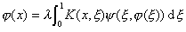&nbsp;&nbsp;&nbsp;&nbsp;&nbsp;&nbsp;&nbsp;&nbsp;&nbsp;&nbsp;&nbsp;&nbsp;&nbsp;&nbsp;&nbsp;&nbsp;&nbsp;&nbsp;&nbsp;&nbsp;&nbsp;&nbsp;&nbsp;&nbsp;&nbsp;&nbsp;(1)</pre>

前几节中解线性积分方程的方法对于非线性积分方程是不适用的。下面仅列出几个解的存在性定理。

&nbsp;&nbsp;&nbsp; 定理1&nbsp; 假定<i>K</i>(<i>x</i>,<i>ξ</i>)对单位正方形<i>k0</i>(0≤<i>x</i>≤1,0≤<i>ξ</i>≤1)上的一切<i>x,</i><i>ξ</i>是连续的，设&ocirc;<i>K</i>(<i>x,</i><i>ξ</i>)&ocirc;≤C (C为常数)，<i></i>对单位正方形<i>k0</i>上的一切<i>ξ</i>, <i>t</i>也是连续的，并且

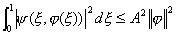&nbsp;&nbsp;&nbsp;&nbsp;&nbsp;&nbsp;&nbsp;
(<i>A</i>为常数)

又假定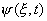满足李普希茨条件

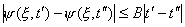

式中<i>B</i>是与<i>ξ</i>无关的常数。那末当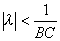时，积分方程(1)在<i>L2</i>[0,1]*中有唯一的解。

&nbsp;&nbsp;&nbsp;
定理2&nbsp;
假定<i>K</i>(<i>x,</i><i>ξ</i>)对单位正方形<i>k0</i>上的一切<i>x,</i><i>ξ</i>是连续的，设 

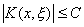&nbsp;&nbsp;&nbsp;&nbsp;&nbsp;&nbsp;&nbsp;&nbsp;&nbsp;&nbsp;&nbsp;
（<i>C</i>为常数）

满足

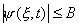&nbsp;&nbsp;&nbsp;&nbsp;&nbsp;&nbsp;
&nbsp;&nbsp;&nbsp;&nbsp;&nbsp;&nbsp;（<i>B</i>为常数）

并对任意<i>ε</i>&gt;0，都有<i>δ</i>=<i>δ</i>(<i>ε</i>)使得

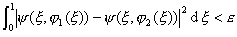&nbsp;&nbsp;&nbsp;&nbsp;
（当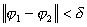时）

式中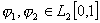。那么当时，积分方程(1)在<i>L</i>2[0,1]<a
href="bword://None" name="_ftnref1" title="">*</a>中至少有一个解。

&nbsp;&nbsp;&nbsp;
定理3&nbsp;
假定<i>K</i>(<i>x</i>,<i>ξ</i>)和都是它们的自变量的连续函数，设<i>S</i>是<i>L</i>2[0,1]中满足

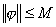&nbsp;&nbsp;
（<i>M</i>为常数）

的函数的全体。假定 

&nbsp; （<i>C</i>为常数）

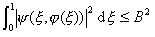（一切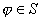）

并对任意<i>ε</i>&gt;0，都存在<i>δ</i>=<i>δ</i>(<i>ε</i>),使得

&nbsp;&nbsp;&nbsp;&nbsp;
（当时）

那末当时，积分方程(1)在<i>S</i>中至少有一个解。

&nbsp;&nbsp;&nbsp; 这个定理的条件要求<i>K</i>(<i>x,</i><i>ξ</i>)是连续的，事实上可以证明，只要核<i>K</i>(<i>x</i>,<i>ξ</i>)是平方可积的就有同样的结论。

&nbsp;&nbsp;&nbsp;
定理4&nbsp;
假定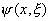满足定理3所述的条件，并设<i>K</i>(<i>x,</i><i>ξ</i>)满足

&nbsp;&nbsp;&nbsp;&nbsp;&nbsp;&nbsp;&nbsp;&nbsp;&nbsp;&nbsp;&nbsp;&nbsp;&nbsp;&nbsp;&nbsp;&nbsp;&nbsp;&nbsp;&nbsp;&nbsp;&nbsp;&nbsp;&nbsp;&nbsp;&nbsp;
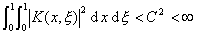

那末当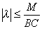时，积分方程(1)在<i>S</i>中至少有一个解。

 

 

<a href="#None" name="_ftn1" title="">*</a> 表示在区间上一切平方可积的函数的全体

