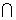
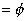

第十六章&nbsp;&nbsp;&nbsp;&nbsp;&nbsp;&nbsp;&nbsp;&nbsp;&nbsp;&nbsp;&nbsp;&nbsp;&nbsp;&nbsp;&nbsp;&nbsp;&nbsp;&nbsp;&nbsp;&nbsp;&nbsp;&nbsp;&nbsp;&nbsp;&nbsp;&nbsp;&nbsp;&nbsp;
<b>第十六章</b><b>&nbsp;&nbsp;&nbsp;&nbsp;&nbsp;&nbsp;&nbsp;&nbsp;&nbsp;&nbsp;
</b><b>概率统计与随机过程</b>

&nbsp;&nbsp;&nbsp; 本章扼要的介绍了概率论的重要内容，除了介绍随机事件及其概率、随机变量和分布函数、随机变量的数值特征、概率母函数、矩母函数和特征函数、大数法则和中心极限定理等基本概念外,还介绍了正态分布表和概率纸的用途。这一章着重的叙述了常用数理统计方法，包括样本及其频率分布、总体参数的区间估计、统计检验、方差分析、回归分析、正交实验设计、抽样检验、质量评估（工序控制）等八个部分；最后简述了随机过程论的基本内容，突出了较为常用的马尔科夫过程和平稳随机过程。

<b>§</b><b>1&nbsp; </b><b>概率论</b>

一、&nbsp;&nbsp;&nbsp; 一、&nbsp;&nbsp;&nbsp;&nbsp;&nbsp;&nbsp;&nbsp; 事件与概率

1.随机事件及其运算关系

[随机事件 · 必然事件 · 不可能事件] 在一定条件下，可能发生也可能不发生的试验结果称为随机事件，简称事件，用<i>A</i> ,<i> B</i> ,<i> C</i> ,···表示。随机事件有两个特殊情况，即必然事件（在一定条件下，每次试验都必定发生的事件）和不可能事件（在一定条件下，各次试验都一定不发生的事件），分别记为<i>Ω</i>和<i>Φ</i>。

[事件的运算关系]

&nbsp;&nbsp;&nbsp;&nbsp; 1° &nbsp;包含&nbsp; 当事件<i>B</i>发生时,事件<i>A</i>也一定发生，则称<i>A</i>包含<i>B</i>或<i>B</i>包含于<i>A</i>中，记作<i>AB</i>，或<i>BA</i><i>。</i>

&nbsp;&nbsp;&nbsp;&nbsp; 2°&nbsp;&nbsp; 等价&nbsp; 如果<i>AB</i>且<i>AB</i><i>，</i>即事件<i>A</i>和<i>B</i>同时发生或不发生，则称<i>A</i>与<i>B</i>等价，记作<i>A=B</i>。

&nbsp;&nbsp;&nbsp;&nbsp; 3° &nbsp;&nbsp;&nbsp;积&nbsp;&nbsp; 表示事件<i>A</i>和<i>B</i>同时发生的事件，称为<i>A</i>与<i>B</i>的积，记作<i>AB</i>(或<i>AB</i>）。

&nbsp;&nbsp;&nbsp;&nbsp; 4°&nbsp; 和&nbsp;&nbsp; 表示事件<i>A</i>或事件<i>B</i>发生的事件，称为<i>A</i>与<i>B</i>的和，记作<i>AB</i>(或<i>A+B</i>）。

&nbsp;&nbsp;&nbsp;&nbsp; 5°&nbsp;&nbsp;&nbsp;
差&nbsp;&nbsp;&nbsp; 表示事件<i>A</i>发生而事件<i>B</i>不发生的事件，称为<i>A</i>与<i>B</i>的差，记作<i>A </i>\ <i>B</i>（或<i>A</i>）。

&nbsp;&nbsp;&nbsp;&nbsp; 6°&nbsp;&nbsp;&nbsp;
互斥&nbsp;&nbsp; 如果事件<i>A</i>与<i>B</i>不可能同时发生，即<i>AB</i>，那末称<i>A</i>与<i>B</i>是互斥（或互不相容）的。

&nbsp;&nbsp;&nbsp;&nbsp;
7° &nbsp;&nbsp;&nbsp;&nbsp;对立&nbsp;&nbsp; 如果事件<i>A</i>与<i>B</i>互斥，又在每次试验中不是出现<i>A</i>就是出现<i>B</i>，即<i>A B=</i>且<i>A B=</i><i>Ω</i>，那末称<i>B</i>为<i>A </i>的对立事件，记作<i>B=</i>。

&nbsp;&nbsp;&nbsp;&nbsp; 8°&nbsp; 完备&nbsp;&nbsp;
如果事件<i>A</i>1，<i>A</i>2,<i> </i>··· , <i>An</i>在每次试验中至少发生一个，即 ，则称{<i>A</i>1，<i>A</i>2，··· ，<i>An</i>}构成一个事件完备组。特别当<i>A</i>1<i> </i>，<i>A</i>2 ，··· ，<i>An</i>又是两两互斥时，即<i>Ai Aj=</i>（<i>i</i><i>j</i>，<i>i</i>，<i>j</i>=1，2，··· ，<i>n</i>），就称{<i>A</i>1，<i>A</i>2 ，··· ，<i>An</i>}是两两互斥的事件完备组。

