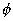
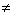

2、概率的几种定义

[频率与概率]&nbsp; 随机事件在一次试验中是否发生，固然是无法事先肯定的偶然现象，但当进行多次重复试验，就可以发现其发生的可能性大小的统计规律性。具体说，如果在相同条件下进行<i>n</i>次重复试验，事件<i>A</i>出现了<i>v</i>次，那末事件<i>A</i>在<i>n</i>次试验中出现的频率<i></i>当<i>n</i>无限增大时呈现稳定性。这一统计规律性表明事件<i>A</i>发生的可能性大小是事件本身所固有的、不以人们主观意志改变的一种客观属性。事件<i>A</i>发生的可能性大小称为事件<i>A</i>的概率，记作<i>P</i>(<i>A</i>)。当试验的次数<i>n</i>足够大，可用事件的频率近似地表示该事件的概率，即

<pre>&nbsp;&nbsp;&nbsp;&nbsp;&nbsp;&nbsp;&nbsp;&nbsp;&nbsp;&nbsp;&nbsp;&nbsp;&nbsp;&nbsp;&nbsp;&nbsp;&nbsp;&nbsp;&nbsp;&nbsp;&nbsp;&nbsp;&nbsp;&nbsp; </pre>

[概率的古典定义]&nbsp; 设一个随机试验（不能事先准确的预言它的结果，而且在相同条件下可以重复进行的试验）只有有限个不同的基本事件<i>ω</i>1&nbsp; ,<i> </i><i>ω</i>2&nbsp;
, ··· ,<i>ωn</i>（基本事件也是一种事件，一般的事件总是有几个基本事件共同组成的），每个基本事件都是等可能<a
href="bword://None" name="_ftnref1" title="">*</a>的，基本事件的全体记作<i>Ω</i>，称它为基本事件空间，如果事件<i>A</i>由<i>k </i>(<i>kn</i>) 个不同的基本事件组成，那末规定<i>A</i>的概率<i>P</i>(<i>A</i>)为

不可能事件的概率规定为

<i></i>

[概率的公理化定义]

&nbsp;&nbsp;&nbsp; 定义 1&nbsp;&nbsp; 设，<i>F </i>,如果<i>F</i>满足下面条件：

&nbsp;&nbsp;&nbsp; （i）<i>F</i>;

&nbsp;&nbsp;&nbsp;&nbsp; (ii)&nbsp; 若<i>F</i>，则<i>F</i>（）;

&nbsp;&nbsp;&nbsp;&nbsp; (iii) 对于任意<i>F </i>(<i>n=</i>1,2,···)<i>，</i>有

<i>F</i>

则称<i>F</i>是中的一个代数。

&nbsp;&nbsp;&nbsp; 定义2&nbsp; 设是代数<i>F</i>上的实值集函数，如果它满足条件：

&nbsp;&nbsp;&nbsp; （i） 对任意<i>F</i>，有0<i>P</i>(<i>A</i>)<i></i>1； 

&nbsp;&nbsp;&nbsp; （ii） <i></i>；

&nbsp;&nbsp;&nbsp; （iii） 对任意<i>F</i>(<i>n=</i>1 , 2 , ···)，<i>AiAj=</i>&nbsp; ( <i>ij </i>) 有

&nbsp;&nbsp;&nbsp;&nbsp;&nbsp;&nbsp;&nbsp;&nbsp;&nbsp;&nbsp;&nbsp;&nbsp;
<i>P</i>(<i></i> )=<i>An</i>)

则称<i>P</i>(<i>A</i>)为<i>F</i>上的概率测度，或简称概率。这时，称<i>ω</i>为基本事件，<i>A</i>(<i>F</i>)称为事件，<i>F</i>是事件的全体，<i>P</i>(<i>A</i>)称为事件<i>A</i>的概率，&lt;,<i>F</i> ,<i>P&gt;</i>称为概率空间。

 

 

<a href="#None" name="_ftn1" title="">*</a> （在应用中，往往当一种事件没有任何理由比另一事件更容易发生时，就认为这两个事件等可能）

