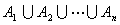
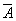
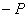
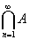
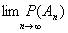

3．概率的基本性质

&nbsp;&nbsp;&nbsp; 1°&nbsp; 0<i>P</i>(<i>A</i>)<i></i>1

&nbsp;&nbsp;&nbsp; 2°&nbsp;&nbsp;&nbsp;
<i>P</i>(必然事件)=<i>P</i>(<i>Ω</i>)=1

&nbsp;&nbsp;&nbsp; 3°&nbsp; <i>P</i>(不可能事件)=<i>P</i>()=0

&nbsp;&nbsp;&nbsp; 4°&nbsp; &nbsp;<i>P(AB</i>)<i>=P</i>(<i>A</i>)<i>+P</i>(<i>B</i>)—<i>P</i>(<i>AB</i>)

<i>&nbsp;&nbsp;&nbsp;&nbsp;&nbsp;&nbsp; </i>若<i>A</i> ,<i> B</i>互斥，则<i>P</i>(<i>AB</i>)<i>=P</i>(<i>A</i>)<i>+P</i>(<i>B</i>)

<i>&nbsp;&nbsp;&nbsp;&nbsp;&nbsp;&nbsp; </i>若<i>A</i>1 ,<i> A</i>2<i> </i>&nbsp;,
··· ,<i> An</i>两两互斥，则

<i>P</i>(<i></i>)<i>=P</i>(<i>A</i>1)<i>+P</i>(<i>A</i>2)<i>+</i>···<i>+P</i>(<i>An</i>)=1

&nbsp;&nbsp;&nbsp; 5°&nbsp;&nbsp;&nbsp;
若<i>AB</i>，则<i>P</i>(<i>A</i>)<i>P</i>(<i>B</i>)

&nbsp;&nbsp;&nbsp; 6°&nbsp; 若<i>AB</i>，则<i>P</i>(<i>A</i>)<i></i>(<i>B</i>)<i>=P</i>(<i>A</i>\<i>B</i>)

&nbsp;&nbsp;&nbsp; 7°&nbsp; 对任意事件<i>A</i>，<i>P</i>(<i></i>)<i>=</i>1<i></i> (<i>A</i>)

&nbsp;&nbsp;&nbsp; 8°&nbsp; 若<i>A</i>1&nbsp; ,<i> A</i>2 <i>&nbsp;</i>,···
,<i> An</i>是两两互斥的事件完备组，则

<i>P</i>(<i> </i>)<i>=P</i>(<i>A</i>1)<i>+P</i>(<i>A</i>2)<i>+</i>···<i>+P</i>(<i>An</i>)<i>=</i>1

&nbsp;&nbsp;&nbsp; 9°&nbsp;&nbsp;
设<i>An</i><i>F</i>，<i>AnAn+</i>1 ,<i> n=</i>1,2,···<i>,</i>令<i>A=n&nbsp; </i>, 则 

<i>P</i>(<i>A</i>)<i>=&nbsp;&nbsp;&nbsp; </i>（连续性定理）

