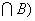

4、概率的计算公式

[条件概率与乘法公式] 在事件<i>B</i>发生的条件下，事件<i>A</i>发生的概率称为事件<i>A</i>在事件<i>B</i>已发生的条件下的条件概率，记作<i>P</i>(<i>A|B</i>)。当<i>P</i>(<i>B</i>)<i>&gt;</i>0时，规定

<i>P</i>(<i>A|B</i>)<i>=</i>

当<i>P</i>(<i>B</i>)<i>=</i>0时，规定<i>P</i>(<i>A|B</i>)=0。由此得出乘法公式：

<i>P</i>(<i>A=P</i>(<i>B</i>)<i>P</i>(<i>A|B</i>)<i>=P</i>(<i>A</i>)<i>P</i>(<i>B|A</i>)

&nbsp;&nbsp;&nbsp;&nbsp;&nbsp;&nbsp;&nbsp;&nbsp;
<i>P</i>(<i>A</i>1<i>A</i>2···<i>An</i>)<i>=P</i>(<i>A</i>1)<i>P</i>(<i>A</i>2|<i>A</i>1)<i>P</i>(<i>A</i>3<i>|A</i>1<i>A</i>2)···<i>P</i>(<i>An|A</i>1<i>A</i>2···<i>An-</i>1)&nbsp;&nbsp;&nbsp;&nbsp;&nbsp;&nbsp;&nbsp;
(<i>P</i>(<i>A</i>1<i>A</i>2···<i>An</i>-1)&gt;0)

[独立性公式]&nbsp; 如果事件<i>A</i>与<i>B</i>满足<i>P</i>(<i>A|B</i>)<i>=P</i>(<i>A</i>)，那末称事件<i>A</i>关于事件<i>B</i>是独立的。独立性是相互的性质，即<i>A</i>关于<i>B</i>独立，<i>B</i>一定关于<i>A</i>独立，或称<i>A</i>与<i>B</i>相互独立。

&nbsp;&nbsp; <i>A</i>与<i>B</i>相互独立的充分必要条件是：

&nbsp;&nbsp;&nbsp;&nbsp;&nbsp;&nbsp;&nbsp;&nbsp;&nbsp;&nbsp;&nbsp;&nbsp;
&nbsp;&nbsp;&nbsp;&nbsp;&nbsp;<i>P</i>(<i>AB</i>)<i>=P</i>(<i>A</i>)<i>P</i>(<i>B</i>)

如果事件<i>A</i>1 ,<i>A</i>2
,···,<i> An</i>中任意<i>m</i>个()都满足关系式

<pre>&nbsp; &nbsp;&nbsp;&nbsp;&nbsp;&nbsp;&nbsp;&nbsp;&nbsp;&nbsp;&nbsp;&nbsp;&nbsp;&nbsp;&nbsp;&nbsp;&nbsp;&nbsp;&nbsp;&nbsp;&nbsp;&nbsp;&nbsp;&nbsp;&nbsp;&nbsp;&nbsp;&nbsp;&nbsp;&nbsp;&nbsp;</pre>

称<i>A</i>1 ,<i>
A</i>2 ,···, <i>An</i>是总起来独立的，简称为相互独立。

[全概率公式]&nbsp; 如果事件组<i>B</i>1 , <i>B</i>2 ,···满足

&nbsp;&nbsp;&nbsp;&nbsp; 

<i>P</i>()<i>=</i>1,&nbsp;&nbsp; <i>P</i>(<i>Bi</i>)<i>&gt;</i>0
<i>&nbsp;&nbsp;&nbsp;</i>&nbsp;(<i>i=</i>1,2,···)

则对于任意一事件<i>A</i>，有

<pre>&nbsp;&nbsp;&nbsp;&nbsp;&nbsp;&nbsp;&nbsp;&nbsp;&nbsp;&nbsp;&nbsp;&nbsp;&nbsp;&nbsp;&nbsp;&nbsp;&nbsp;&nbsp;&nbsp;&nbsp;&nbsp;&nbsp;&nbsp;&nbsp;&nbsp;&nbsp;&nbsp;&nbsp;&nbsp;&nbsp;&nbsp;&nbsp;&nbsp;&nbsp; </pre>

如果<i>Bi</i>只有<i>n</i>个，公式也成立，此时右端只有<i>n</i>项相加。

[贝叶斯公式]&nbsp; 如果事件组<i>B</i>1 , <i>B</i>2 ,···满足

<i>&nbsp; </i>(<i>ij</i>)

,&nbsp;&nbsp; &nbsp;&nbsp;&nbsp;

则对于任一事件<i>A</i>(<i>P</i>(<i>A</i>)&gt;0)，有 

<i>P</i>(<i>Bi </i>|<i>A</i>)<i>=</i>

如果<i>Bi</i>只有<i>n</i>个，公式也成立，此时右端分母只有<i>n</i>项相加。

[伯努利公式]&nbsp; 设一次试验中某事件<i>A</i>出现的概率为<i>p</i>，则<i>n</i>次重复试验中事件<i>A</i>出现<i>k</i>次的概率<i>pn,k</i>为

<i>pn,k
=</i> <i>pk</i>(1)<i>n-k&nbsp;&nbsp;&nbsp;&nbsp;
</i>&nbsp;(<i>k=</i>0,1,···,<i>n</i>)

式中<i></i>为二项系数。

&nbsp;&nbsp; 当<i>n</i>和<i>k</i>都很大时，有近似公式

<i>pn,k</i>

式中,&nbsp; 。

[泊松公式]&nbsp; 当<i>n</i>充分大，且<i>p</i>很小时，有近似公式

<i>pn,k
</i>

式中= <i>np</i><i>。</i>

