

二、随机变量与分布函数

[随机变量及其概率分布函数]&nbsp; 每次试验的结果可以用一个变量的数值来表示，这个变量的取值随偶然因素而变化，但又遵从一定的概率分布规律，这种变量称为随机变量，用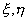,···表示。它是随机现象的数量比。

&nbsp;&nbsp;&nbsp; 给定随机变量，它的取值不超过实数<i>x</i>的事件的概率<i>P</i>(<i></i><i>x</i>)是<i>x</i>的函数，称为的概率分布函数，简称分布函数，记作<i>F</i>(<i>x</i>) ，即

&nbsp;&nbsp;&nbsp;&nbsp;&nbsp;&nbsp;&nbsp;&nbsp;&nbsp;&nbsp;&nbsp;&nbsp;&nbsp;&nbsp;&nbsp;&nbsp;
<i>F</i>(<i>x</i>)<i>=P</i>(<i>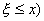&nbsp; </i>(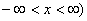

[分布函数的基本性质]

&nbsp;&nbsp;&nbsp;&nbsp;&nbsp; 1°&nbsp;
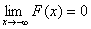,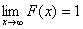

&nbsp;&nbsp;&nbsp;&nbsp;&nbsp; 2°&nbsp;&nbsp;
若<i>x</i>1<i>&lt;x</i>2，则<i>F</i>(<i>x</i>1)<i>F</i>(<i>x</i>2)<i>&nbsp; </i>（单调性）

&nbsp;&nbsp;&nbsp;&nbsp;&nbsp; 3°&nbsp;
<i>F</i>(<i>x+</i>0)=<i>F</i>(<i>x</i>)<i>&nbsp;&nbsp;&nbsp;&nbsp;&nbsp;&nbsp;&nbsp;&nbsp;&nbsp;&nbsp;&nbsp;
</i>（右连续性）

&nbsp;&nbsp;&nbsp;&nbsp;&nbsp; 4°&nbsp;
<i>P</i>(<i>a&lt;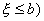=F</i>(<i>b</i>)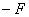(<i>a</i>)<i> </i>

&nbsp;&nbsp;&nbsp;&nbsp;&nbsp; 5°&nbsp;
<i>P</i>(<i>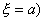=F</i>(<i>a</i>)<i>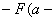</i>0)

[离散分布与概率分布列]&nbsp; 如果随机变量只能取有限个或可列个数值<i>x</i>1 ,<i> x</i>2 ,···,<i> xn
</i>，···，就称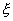为离散型随机变量。若记<i>P</i>(<i>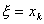</i>)<i>=pk&nbsp;&nbsp;&nbsp;
</i>(<i>k=</i>1,2,···)，则取值的概率分布由{<i>pk</i>}完全确定。称{<i>pk</i>}为的概率分布列。{<i>pk</i>}有以下性质：

&nbsp;&nbsp; 1° <i>&nbsp;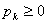</i>

&nbsp;&nbsp; 2°&nbsp; 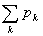=1

&nbsp;&nbsp; 3° 设<i>D</i>为实数轴上任一可测集，则<i>P</i>(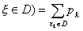

&nbsp;&nbsp; 4° 的分布函数

&nbsp;&nbsp;&nbsp;&nbsp;&nbsp;&nbsp;&nbsp;&nbsp;&nbsp;&nbsp;&nbsp;&nbsp;&nbsp;&nbsp;&nbsp;&nbsp;
<i>F</i>(<i>x</i>)<i>=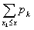</i>

是在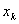处有跳跃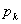的阶梯函数。

[连续分布与分布密度函数]&nbsp; 如果随机变量的分布函数<i>F</i>(<i>x</i>)能够表示为

&nbsp;&nbsp;&nbsp;&nbsp;&nbsp;&nbsp;&nbsp;&nbsp;&nbsp;&nbsp;&nbsp;&nbsp;&nbsp;&nbsp;&nbsp;
<i>F</i>(<i>x</i>)<i>= 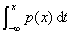&nbsp;</i>（<i>p </i>(<i>x</i>)非负） 

就称是连续型随机变量。<i>p</i>(<i>x</i>)称为的分布密度函数（或分布密度）。分布密度函数具有以下性质：

&nbsp;&nbsp; 1°&nbsp; <i>p</i>(<i>x</i>)<i>=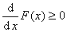</i>

&nbsp;&nbsp; 2°&nbsp; 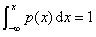

&nbsp;&nbsp; 3°&nbsp; 若<i>p </i>(<i>x</i>)是连续型随机变量的分布密度，则对实数轴上的任一可测集<i>D</i>，有

&nbsp;&nbsp;&nbsp;&nbsp;&nbsp;&nbsp;&nbsp;&nbsp;&nbsp;&nbsp;&nbsp;&nbsp;&nbsp;&nbsp;&nbsp;&nbsp;
<i>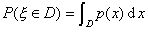&nbsp;&nbsp;&nbsp;&nbsp;&nbsp;&nbsp;&nbsp;&nbsp;&nbsp;&nbsp;&nbsp;&nbsp;&nbsp;&nbsp;&nbsp;&nbsp;&nbsp;&nbsp;&nbsp;&nbsp; </i>

[随机变量的函数的分布]&nbsp; 如果随机变量是随机变量的函数

&nbsp;&nbsp;&nbsp;&nbsp;&nbsp;&nbsp;&nbsp;&nbsp;&nbsp;&nbsp;&nbsp;&nbsp;&nbsp;&nbsp;&nbsp;&nbsp;&nbsp;&nbsp;&nbsp;&nbsp;&nbsp;&nbsp;&nbsp;&nbsp;
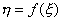

设随机变量的分布函数为<i>F</i>(<i>x</i>)，则的分布函数<i>G</i>(<i>x</i>)为

&nbsp;&nbsp;&nbsp;&nbsp;&nbsp;&nbsp;&nbsp;&nbsp;&nbsp;&nbsp;&nbsp;&nbsp;&nbsp;&nbsp;&nbsp;&nbsp;&nbsp;&nbsp;&nbsp;&nbsp;
<i>G</i>(<i>x</i>)<i>=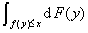 </i>

特别，当是离散型随机变量时，其可能值为<i>x</i>1 , <i>x</i>2，···,且<i>P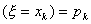</i>，则

&nbsp;&nbsp;&nbsp;&nbsp;&nbsp;&nbsp;&nbsp;&nbsp;&nbsp;&nbsp;&nbsp;&nbsp;&nbsp;&nbsp;&nbsp;&nbsp;&nbsp;&nbsp;&nbsp;&nbsp;
<i>G</i>(<i>x</i>)= 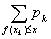&nbsp;&nbsp;

当是连续型随机变量时 ，其分布密度为<i>p</i>(<i>x</i>)，则

&nbsp;&nbsp;&nbsp;&nbsp;&nbsp;&nbsp;&nbsp;&nbsp;&nbsp;&nbsp;&nbsp;&nbsp;&nbsp;&nbsp;&nbsp;&nbsp;&nbsp;&nbsp;&nbsp;&nbsp;
<i>G</i>(<i>x</i>)<i>=</i> 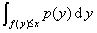&nbsp;

[随机矢量的联合分布函数与边缘分布函数]&nbsp; 如果···,联系于同一组条件下的<i>n</i>个随机变量，则称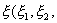···,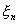)为<i>n</i>维随机变量或随机矢量。

&nbsp;&nbsp;&nbsp; 若(<i>x</i>1 ,<i>
x</i>2<i> </i>,···，<i>xn</i>)是<i>n</i>维实数空间<i>Rn</i>上的一点，则事件&quot;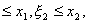···,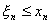&quot;的概率

&nbsp;&nbsp;&nbsp;&nbsp;&nbsp;&nbsp;&nbsp;&nbsp;&nbsp;&nbsp;
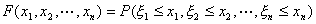

作为<i>x</i>1 ,<i>
x</i>2 ,···, <i>xn</i>的函数，称为随机矢量···,的联合分布函数。

&nbsp;&nbsp;&nbsp; 设(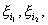···,是(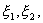···,中任意取出<i>m</i>(<i>mn</i>)个分量构成的<i>m</i>维随机变量，则称(···,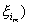的联合分布函数为(···,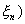的<i>m</i>维边缘分布函数。

&nbsp;&nbsp;&nbsp; 这时，如果分别记(···,与(···,的分布函数为<i>F</i>(<i>x</i>1,<i>x</i>2,···,<i>xn</i>)与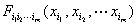，那末

&nbsp;&nbsp;&nbsp;&nbsp;&nbsp;&nbsp;&nbsp;&nbsp;&nbsp;&nbsp;&nbsp;
<i>=F</i>(<i>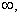</i>···<i>,x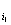,</i>···<i>,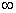 ,</i>···<i>,x,</i>···<i>,</i>)

[条件分布函数与独立性]&nbsp;
设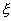是一随机变量，事件<i>B</i>满足<i>P</i>(<i>B</i>)&gt;0，则称

&nbsp;&nbsp;&nbsp;&nbsp;&nbsp;&nbsp;&nbsp;&nbsp;&nbsp;&nbsp;&nbsp;&nbsp;&nbsp;&nbsp;&nbsp;&nbsp;&nbsp;&nbsp;&nbsp;&nbsp;&nbsp;&nbsp;
<i>F</i>(<i>x</i>|<i>B</i>)<i>=P </i>(x|<i>B</i>)

为在事件<i>B</i>已发生的条件下的条件分布函数。

&nbsp;&nbsp; 1°
设(,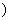是二维离散型随机变量，和的可能取值分别为<i>xi</i> (<i>i=</i>1,2,···)和<i>yk </i>(<i>k=</i>1,2,···).又记(,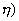的联合分布为

&nbsp;&nbsp;&nbsp;&nbsp;&nbsp;&nbsp;&nbsp;&nbsp;&nbsp;&nbsp;&nbsp;&nbsp;&nbsp;&nbsp;&nbsp;&nbsp;&nbsp;&nbsp;&nbsp;&nbsp;&nbsp;&nbsp;&nbsp;&nbsp;&nbsp;&nbsp;&nbsp;
<i>P</i>(<i>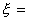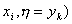= pik</i>

两个一维边缘分布为

&nbsp;&nbsp;&nbsp;&nbsp;&nbsp;&nbsp;&nbsp;&nbsp;&nbsp;&nbsp;&nbsp;&nbsp;&nbsp;&nbsp;&nbsp;&nbsp;&nbsp;&nbsp;&nbsp;&nbsp;&nbsp;&nbsp;&nbsp;
<i>P</i>(<i>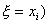=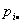·=&nbsp;&nbsp; </i>(<i>i=</i>1,2,···)

<i>&nbsp;&nbsp;&nbsp;&nbsp;&nbsp;&nbsp;&nbsp;&nbsp;&nbsp;&nbsp;&nbsp;&nbsp;&nbsp;&nbsp;&nbsp;&nbsp;&nbsp;&nbsp;&nbsp;&nbsp;&nbsp;&nbsp;&nbsp;
P</i>(<i>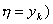=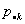=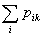&nbsp; 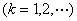</i>&nbsp;

则称

&nbsp;&nbsp;&nbsp;&nbsp;&nbsp;&nbsp;&nbsp;&nbsp;&nbsp;&nbsp;&nbsp;&nbsp;&nbsp;&nbsp;&nbsp;&nbsp;&nbsp;&nbsp;&nbsp;&nbsp;&nbsp;&nbsp;&nbsp;
<i>P</i>(<i></i>|<i></i>)<i>=</i>&nbsp;&nbsp; 

为在<i></i>条件下离散型随机变量的条件分布。类似的，称

&nbsp;&nbsp;&nbsp;&nbsp;&nbsp;&nbsp;&nbsp;&nbsp;&nbsp;&nbsp;&nbsp;&nbsp;&nbsp;&nbsp;&nbsp;&nbsp;&nbsp;&nbsp;&nbsp;&nbsp;&nbsp;&nbsp;&nbsp;
<i>P(</i>|<i></i>)<i>=&nbsp; </i>(<i>&gt;</i>0, <i>k=</i>1,2,···)

为在条件下离散型随机变量的条件分布。

2°&nbsp;
设()是二维连续型随机变量，其联合分布密度是<i>f</i>(<i>x,y</i>)，在点<i>y</i> ,则称

&nbsp;&nbsp;&nbsp;&nbsp;&nbsp;&nbsp;&nbsp;&nbsp;&nbsp;&nbsp;&nbsp;&nbsp;&nbsp;&nbsp;&nbsp;&nbsp;&nbsp;
<i></i>

为在=y条件下的条件分布函数，在点<i>x</i>，则称

&nbsp;&nbsp;&nbsp;&nbsp;&nbsp;&nbsp;&nbsp;&nbsp;&nbsp;&nbsp;&nbsp;&nbsp;&nbsp;&nbsp;&nbsp;&nbsp;&nbsp;&nbsp;&nbsp;&nbsp;&nbsp;
<i></i>&nbsp;

为在条件下的条件分布函数。

3°&nbsp;
如果(···,的联合分布函数等于所有一维边缘分布函数的乘积，即

&nbsp;&nbsp;&nbsp;&nbsp;&nbsp;&nbsp;&nbsp;&nbsp;&nbsp;&nbsp;&nbsp;&nbsp;&nbsp;&nbsp;&nbsp;&nbsp;&nbsp;
<i>F</i>(<i>x</i>1 ,<i> x</i>2 ,···,<i> xn</i>)<i>=</i>

（它相当于<i>P</i>(<i>,</i>···,<i></i><i>xn</i>)<i>=</i>那末称,···,是相互独立的。

