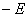
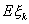
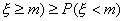
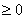
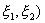
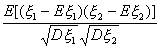

三、随机变量的数字特征

[数学期望（均值）与方差]&nbsp; 随机变量的数学期望（或均值）记作<i>E</i>（或<i>M</i>），它描述了随机变量的取值中心。随机变量()2的数学期望称为的方差，记作<i>D</i>（或Var），而<i>D</i>的平方根称为的均方差（或标准差），记作=。它们描述了随机变量的可能取值与均值的偏差的疏密程度。

&nbsp;&nbsp; 1°&nbsp; 若是连续型随机变量，其分布密度为<i>p</i>(<i>x</i>)，分布函数为<i>F</i>(<i>x</i>)，则（当积分绝对收敛时）

<i>E</i>=

<i>D</i>=

&nbsp; 2°&nbsp;&nbsp; 若是离散型随机变量，其可能取值为<i>xk</i> ,<i> k=</i>1,2,···，且<i>P(</i>=<i>xk)=pk</i>，则（当级数是绝对收敛时）

<i>E</i>

<i>D=pk</i>

[均值与方差的几个公式]

&nbsp;&nbsp; 1 °&nbsp; <i>D=E2-</i>(<i>E</i>)<i>2</i>

&nbsp;&nbsp; 2°&nbsp; <i>&nbsp;&nbsp;</i><i>Ea=a
, Da=</i>0<i> </i>（<i>a</i>为常数）

&nbsp;&nbsp; 3° <i>&nbsp;&nbsp;E</i>(<i>c</i>)<i>=cE , D</i>(<i>c</i>)<i>=c2D</i>（<i>c</i>为常数）

&nbsp;&nbsp; 4°&nbsp;&nbsp; <i>E</i>(<i></i> 

&nbsp;&nbsp; 5°&nbsp; 若<i></i>1 ,<i> </i>2&nbsp; ,···,<i> n</i>为互相独立的<i>n</i>个随机变量，则

&nbsp;&nbsp;&nbsp;&nbsp;&nbsp;&nbsp;&nbsp;&nbsp;&nbsp;&nbsp;&nbsp;&nbsp;&nbsp;&nbsp;&nbsp;&nbsp;
<i>&nbsp;E</i>(<i></i>1<i>+</i>2<i>+</i>···<i>+n</i>)<i>=E</i>1<i>+E</i>2+···<i>+En</i>

<i>&nbsp;&nbsp;&nbsp;&nbsp;&nbsp;&nbsp;&nbsp;&nbsp;&nbsp;&nbsp;&nbsp;&nbsp;&nbsp;&nbsp;&nbsp;&nbsp;&nbsp;
D</i>(1+2+···+n)=

&nbsp;&nbsp; 6°&nbsp; 若<i></i>1 ,<i> </i>2 <i>&nbsp;</i>,···,
<i>n</i>为互相独立的<i>n</i>个随机变量,则

&nbsp;&nbsp;&nbsp;&nbsp;&nbsp;&nbsp;&nbsp;&nbsp;&nbsp;&nbsp;&nbsp;&nbsp;&nbsp;
<i>E</i>(<i></i>12···<i>n</i>)<i>=</i>(<i>E</i>1)(<i>E</i>2)···(<i>En</i>)

<i>&nbsp;&nbsp;&nbsp;&nbsp;&nbsp;&nbsp;&nbsp;&nbsp;&nbsp;&nbsp;&nbsp;&nbsp;&nbsp;
D</i>(1<i>+</i>2<i>+</i>···<i>+n</i>)<i>=D</i>1<i>+D</i>2<i>+</i>···<i>+Dn</i>

&nbsp;&nbsp; 7°&nbsp; 若<i></i>1 ,<i> </i>2&nbsp; ,···, <i>n</i>为互相独立的随机变量，且<i>=</i>0,<i> Dk=</i>(<i>k=</i>1,2,···,<i>n</i>)则随机变量的均值与方差分别为 

&nbsp;&nbsp;&nbsp;&nbsp;&nbsp;&nbsp;&nbsp;&nbsp;&nbsp;&nbsp;&nbsp;&nbsp;&nbsp;&nbsp;&nbsp;&nbsp;&nbsp;&nbsp;&nbsp;&nbsp;&nbsp;&nbsp;
<i></i>

[契贝谢夫不等式]&nbsp; 对任一给定的正数，有

[条件数学期望与全数学期望公式]&nbsp; 设<i>F</i>(<i>x</i>|<i>B</i>)是随机变量对事件<i>B</i>的条件分布函数，则

<i></i>

称为（当积分绝对收敛时）<i></i>对事件<i>B</i>的条件数学期望。若<i></i>是连续型随机变量，其条件分布密度为<i>p</i>(<i>x</i>|<i>B</i>)，则

<i></i>

若<i></i>是离散型随机变量，其可能取值为<i>x</i>1&nbsp; , <i>x</i>2&nbsp; ,···，则

<i></i>

若<i>B</i>1 ,<i>
B</i>2&nbsp; ,···,<i>Bn</i>是两两互斥的事件完备组，则有全数学期望公式

<i></i>

[中位数、众数与均值的关系]&nbsp; 满足

<i>P</i>(<i></i>,&nbsp;&nbsp;&nbsp; <i>P</i>(<i></i>

的数<i>m</i>称为随机变量<i></i>的中位数。换句话说，<i>m</i>满足下面两式：

<i>P</i>(

<i>P</i>(

&nbsp;&nbsp; 使分布密度函数取值为最大，即

p()=极大值

的称为随机变量<i></i>的众数。

&nbsp;&nbsp; 对于单峰对称分布函数，<i>m</i>==（均值）

&nbsp;&nbsp; 对于非对称单峰分布函数，<i>m</i>位于与之间。

[高阶原点矩与中心矩]&nbsp; 当<i>r</i>，随机变量和(的数学期望（假设存在）分别称为随机变量的<i>r</i>阶原点矩和<i>r</i>阶中心矩，分别记作和。特别，为均值，为方差。

&nbsp;&nbsp; 1°&nbsp; 若是连续型随机变量，其分布密度为<i>p(x)</i>，则

&nbsp;&nbsp; 2°&nbsp; 若是离散型随机变量，其可能取值为<i>xk
</i>&nbsp;(<i>k=</i>1,2,···)<i>,</i>且<i>P</i>(<i>=xk</i>)<i>=pk </i>，则

&nbsp;&nbsp; 3°&nbsp; 当<i>r</i>，随机变量和的数学期望（假设存在）分别称为随机变量的<i>r</i>阶绝对原点矩和<i>r</i>阶绝对中心矩。且有类似公式与1°,2°对应。

&nbsp;&nbsp; 4°&nbsp;&nbsp; 原点矩和中心矩满足如下关系（<i>r</i>是正整数）；

&nbsp;式中为二项系数。

[协方差与相关系数]&nbsp; 设随机变量和的均值和方差都存在，则和的协方差或Cov(为

<i>=E</i>[(<i></i>

&nbsp;和的相关系数为

=

