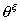
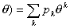

四、概率母函数·矩母函数·特征函数

[整数值随机变量的概率母函数] 若是只取非负整数值的随机变量，则称随机变量函数的均值为随机变量<i></i>的概率母函数。记<i>P=</i>(<i>=k</i>)<i>=pk &nbsp;&nbsp;&nbsp;</i>(
<i>k=</i>0,1,2,···),&nbsp;
则<i></i>的概率母函数是

<i>P</i>(&nbsp; (<i>-</i>1<i></i>

&nbsp;&nbsp;&nbsp;
设,则

<i>&nbsp;&nbsp;&nbsp;&nbsp;&nbsp;&nbsp;&nbsp;&nbsp;&nbsp;&nbsp;&nbsp;&nbsp;&nbsp;&nbsp;&nbsp;&nbsp;&nbsp;&nbsp;&nbsp;&nbsp;&nbsp;&nbsp;&nbsp;&nbsp;&nbsp;&nbsp;&nbsp;&nbsp;
</i>(1)<i>=E</i>

<i></i>(1)<i>=E</i>[

···········································

<i>&nbsp;&nbsp;
P</i>

反过来有&nbsp;&nbsp;&nbsp;&nbsp;&nbsp;&nbsp;&nbsp;&nbsp;&nbsp;&nbsp;&nbsp;&nbsp;&nbsp;&nbsp;&nbsp;&nbsp;&nbsp;&nbsp;&nbsp;&nbsp;

&nbsp;&nbsp;&nbsp;&nbsp;&nbsp;&nbsp;&nbsp;&nbsp;&nbsp;&nbsp;&nbsp;&nbsp;&nbsp;&nbsp;&nbsp;&nbsp;&nbsp;&nbsp;&nbsp;&nbsp;&nbsp;&nbsp;&nbsp;&nbsp;&nbsp;&nbsp;&nbsp;&nbsp;&nbsp;

[矩母函数]&nbsp; 若是随机变量，则称随机变量函数的均值

为的矩母函数。如果有任意阶原点矩···)，则

&nbsp;&nbsp;
1° 若是离散型随机变量，其可能值为<i>x</i>1, <i>x</i>2,···,则

&nbsp;&nbsp;
2° 若是连续型随机变量，其分布密度为<i>p</i>(<i>x</i>),则

[特征函数]&nbsp; 若是随机变量，称复值随机变量<i>e</i>的均值

&nbsp; (<i>i</i>=)

为的特征函数。如果有任意阶原点矩(<i>k</i>=1,2,···)，则

&nbsp; 若是离散型随机变量，其可能值为<i>x</i>1&nbsp; ,<i> x</i>2 ,···, <i>P(</i>,则

&nbsp; &nbsp;2°&nbsp;&nbsp; &nbsp;若是连续型随机变量，其分布密度为<i>p</i>(<i>x</i>)，则

[概率母函数、矩母函数和特征函数之间的关系]

<i>P</i>(<i>et</i>)=

<i>P</i>(<i>eit</i>)=

