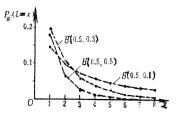
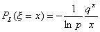

五、&nbsp;&nbsp;&nbsp;&nbsp;&nbsp;&nbsp;&nbsp;
五、&nbsp;&nbsp;&nbsp; 常用分布函数

1、&nbsp;&nbsp; 1、
常用离散型分布

<table class=MsoNormalTable border=1 cellspacing=0 cellpadding=0
 style='border-collapse:collapse;border:none'>
 <tr>
  <td width=104 valign=top style='width:78.0pt;border:solid windowtext 1.0pt;
  padding:0mm 5.4pt 0mm 5.4pt'>
  
名称记号

  </td>
  <td width=200 valign=top style='width:150.0pt;border:solid windowtext 1.0pt;
  border-left:none;padding:0mm 5.4pt 0mm 5.4pt'>
  
概率分布及其定义域

  
参数条件

  </td>
  <td width=88 valign=top style='width:66.0pt;border:solid windowtext 1.0pt;
  border-left:none;padding:0mm 5.4pt 0mm 5.4pt'>
  
&nbsp;

  
均值

  </td>
  <td width=96 valign=top style='width:72.0pt;border:solid windowtext 1.0pt;
  border-left:none;padding:0mm 5.4pt 0mm 5.4pt'>
  
&nbsp;

  
方差

  </td>
  <td width=96 valign=top style='width:72.0pt;border:solid windowtext 1.0pt;
  border-left:none;padding:0mm 5.4pt 0mm 5.4pt'>
  
概率母函数

  

  </td>
  <td width=88 valign=top style='width:66.0pt;border:solid windowtext 1.0pt;
  border-left:none;padding:0mm 5.4pt 0mm 5.4pt'>
  
矩母函数

  

  </td>
  <td width=88 valign=top style='width:66.0pt;border:solid windowtext 1.0pt;
  border-left:none;padding:0mm 5.4pt 0mm 5.4pt'>
  
特征函数

  

  </td>
  <td width=204 colspan=2 valign=top style='width:152.95pt;border:solid windowtext 1.0pt;
  border-left:none;padding:0mm 5.4pt 0mm 5.4pt'>
  
图&nbsp;&nbsp;&nbsp; 示

  </td>
 </tr>
 <tr style='height:89.7pt'>
  <td width=104 valign=top style='width:78.0pt;border:solid windowtext 1.0pt;
  border-top:none;padding:0mm 5.4pt 0mm 5.4pt;height:89.7pt'>
  
二项分布

  

  </td>
  <td width=200 valign=top style='width:150.0pt;border-top:none;border-left:
  none;border-bottom:solid windowtext 1.0pt;border-right:solid windowtext 1.0pt;
  padding:0mm 5.4pt 0mm 5.4pt;height:89.7pt'>
  

  

  

  
为正整数

  </td>
  <td width=88 valign=top style='width:66.0pt;border-top:none;border-left:none;
  border-bottom:solid windowtext 1.0pt;border-right:solid windowtext 1.0pt;
  padding:0mm 5.4pt 0mm 5.4pt;height:89.7pt'>
  
&nbsp;

  

  </td>
  <td width=96 valign=top style='width:72.0pt;border-top:none;border-left:none;
  border-bottom:solid windowtext 1.0pt;border-right:solid windowtext 1.0pt;
  padding:0mm 5.4pt 0mm 5.4pt;height:89.7pt'>
  
&nbsp;

  

  </td>
  <td width=96 valign=top style='width:72.0pt;border-top:none;border-left:none;
  border-bottom:solid windowtext 1.0pt;border-right:solid windowtext 1.0pt;
  padding:0mm 5.4pt 0mm 5.4pt;height:89.7pt'>
  
&nbsp;

  

  </td>
  <td width=88 valign=top style='width:66.0pt;border-top:none;border-left:none;
  border-bottom:solid windowtext 1.0pt;border-right:solid windowtext 1.0pt;
  padding:0mm 5.4pt 0mm 5.4pt;height:89.7pt'>
  
&nbsp;

  

  </td>
  <td width=88 valign=top style='width:66.0pt;border-top:none;border-left:none;
  border-bottom:solid windowtext 1.0pt;border-right:solid windowtext 1.0pt;
  padding:0mm 5.4pt 0mm 5.4pt;height:89.7pt'>
  
&nbsp;

  

  </td>
  <td width=204 colspan=2 valign=top style='width:152.95pt;border-top:none;
  border-left:none;border-bottom:solid windowtext 1.0pt;border-right:solid windowtext 1.0pt;
  padding:0mm 5.4pt 0mm 5.4pt;height:89.7pt'>
  

  </td>
 </tr>
 <tr style='height:80.9pt'>
  <td width=104 valign=top style='width:78.0pt;border:solid windowtext 1.0pt;
  border-top:none;padding:0mm 5.4pt 0mm 5.4pt;height:80.9pt'>
  
泊松分布

  

  </td>
  <td width=200 valign=top style='width:150.0pt;border-top:none;border-left:
  none;border-bottom:solid windowtext 1.0pt;border-right:solid windowtext 1.0pt;
  padding:0mm 5.4pt 0mm 5.4pt;height:80.9pt'>
  

  

  
为正整数

  </td>
  <td width=88 valign=top style='width:66.0pt;border-top:none;border-left:none;
  border-bottom:solid windowtext 1.0pt;border-right:solid windowtext 1.0pt;
  padding:0mm 5.4pt 0mm 5.4pt;height:80.9pt'>
  
&nbsp;

  

  </td>
  <td width=96 valign=top style='width:72.0pt;border-top:none;border-left:none;
  border-bottom:solid windowtext 1.0pt;border-right:solid windowtext 1.0pt;
  padding:0mm 5.4pt 0mm 5.4pt;height:80.9pt'>
  
&nbsp;

  

  </td>
  <td width=96 valign=top style='width:72.0pt;border-top:none;border-left:none;
  border-bottom:solid windowtext 1.0pt;border-right:solid windowtext 1.0pt;
  padding:0mm 5.4pt 0mm 5.4pt;height:80.9pt'>
  
&nbsp;

  

  </td>
  <td width=88 valign=top style='width:66.0pt;border-top:none;border-left:none;
  border-bottom:solid windowtext 1.0pt;border-right:solid windowtext 1.0pt;
  padding:0mm 5.4pt 0mm 5.4pt;height:80.9pt'>
  
&nbsp;

  

  </td>
  <td width=88 valign=top style='width:66.0pt;border-top:none;border-left:none;
  border-bottom:solid windowtext 1.0pt;border-right:solid windowtext 1.0pt;
  padding:0mm 5.4pt 0mm 5.4pt;height:80.9pt'>
  
&nbsp;

  

  </td>
  <td width=204 colspan=2 valign=top style='width:152.95pt;border-top:none;
  border-left:none;border-bottom:solid windowtext 1.0pt;border-right:solid windowtext 1.0pt;
  padding:0mm 5.4pt 0mm 5.4pt;height:80.9pt'>
  

  </td>
 </tr>
 <tr style='height:87.95pt'>
  <td width=104 valign=top style='width:78.0pt;border:solid windowtext 1.0pt;
  border-top:none;padding:0mm 5.4pt 0mm 5.4pt;height:87.95pt'>
  
几何分布

  

  </td>
  <td width=200 valign=top style='width:150.0pt;border-top:none;border-left:
  none;border-bottom:solid windowtext 1.0pt;border-right:solid windowtext 1.0pt;
  padding:0mm 5.4pt 0mm 5.4pt;height:87.95pt'>
  

  

  

  </td>
  <td width=88 valign=top style='width:66.0pt;border-top:none;border-left:none;
  border-bottom:solid windowtext 1.0pt;border-right:solid windowtext 1.0pt;
  padding:0mm 5.4pt 0mm 5.4pt;height:87.95pt'>
  
&nbsp;

  

  </td>
  <td width=96 valign=top style='width:72.0pt;border-top:none;border-left:none;
  border-bottom:solid windowtext 1.0pt;border-right:solid windowtext 1.0pt;
  padding:0mm 5.4pt 0mm 5.4pt;height:87.95pt'>
  
&nbsp;

  

  </td>
  <td width=96 valign=top style='width:72.0pt;border-top:none;border-left:none;
  border-bottom:solid windowtext 1.0pt;border-right:solid windowtext 1.0pt;
  padding:0mm 5.4pt 0mm 5.4pt;height:87.95pt'>
  
&nbsp;

  

  </td>
  <td width=88 valign=top style='width:66.0pt;border-top:none;border-left:none;
  border-bottom:solid windowtext 1.0pt;border-right:solid windowtext 1.0pt;
  padding:0mm 5.4pt 0mm 5.4pt;height:87.95pt'>
  
&nbsp;

  

  </td>
  <td width=88 valign=top style='width:66.0pt;border-top:none;border-left:none;
  border-bottom:solid windowtext 1.0pt;border-right:solid windowtext 1.0pt;
  padding:0mm 5.4pt 0mm 5.4pt;height:87.95pt'>
  
&nbsp;

  

  </td>
  <td width=204 colspan=2 valign=top style='width:152.95pt;border-top:none;
  border-left:none;border-bottom:solid windowtext 1.0pt;border-right:solid windowtext 1.0pt;
  padding:0mm 5.4pt 0mm 5.4pt;height:87.95pt'>
  

  </td>
 </tr>
 <tr>
  <td width=104 valign=top style='width:78.0pt;border:solid windowtext 1.0pt;
  border-top:none;padding:0mm 5.4pt 0mm 5.4pt'>
  
负二项分布

  

  </td>
  <td width=200 valign=top style='width:150.0pt;border-top:none;border-left:
  none;border-bottom:solid windowtext 1.0pt;border-right:solid windowtext 1.0pt;
  padding:0mm 5.4pt 0mm 5.4pt'>
  

  

  

  
为正实数

  </td>
  <td width=88 valign=top style='width:66.0pt;border-top:none;border-left:none;
  border-bottom:solid windowtext 1.0pt;border-right:solid windowtext 1.0pt;
  padding:0mm 5.4pt 0mm 5.4pt'>
  
&nbsp;

  

  </td>
  <td width=96 valign=top style='width:72.0pt;border-top:none;border-left:none;
  border-bottom:solid windowtext 1.0pt;border-right:solid windowtext 1.0pt;
  padding:0mm 5.4pt 0mm 5.4pt'>
  
&nbsp;

  

  </td>
  <td width=96 valign=top style='width:72.0pt;border-top:none;border-left:none;
  border-bottom:solid windowtext 1.0pt;border-right:solid windowtext 1.0pt;
  padding:0mm 5.4pt 0mm 5.4pt'>
  
&nbsp;

  

  </td>
  <td width=88 valign=top style='width:66.0pt;border-top:none;border-left:none;
  border-bottom:solid windowtext 1.0pt;border-right:solid windowtext 1.0pt;
  padding:0mm 5.4pt 0mm 5.4pt'>
  
&nbsp;

  

  </td>
  <td width=88 valign=top style='width:66.0pt;border-top:none;border-left:none;
  border-bottom:solid windowtext 1.0pt;border-right:solid windowtext 1.0pt;
  padding:0mm 5.4pt 0mm 5.4pt'>
  
&nbsp;

  

  </td>
  <td width=204 colspan=2 valign=top style='width:152.95pt;border-top:none;
  border-left:none;border-bottom:solid windowtext 1.0pt;border-right:solid windowtext 1.0pt;
  padding:0mm 5.4pt 0mm 5.4pt'>
  

  </td>
 </tr>
 <tr style='height:58.5pt'>
  <td width=104 valign=top style='width:78.0pt;border:solid windowtext 1.0pt;
  border-top:none;padding:0mm 5.4pt 0mm 5.4pt;height:58.5pt'>
  
单点分布

  

  </td>
  <td width=200 valign=top style='width:150.0pt;border-top:none;border-left:
  none;border-bottom:solid windowtext 1.0pt;border-right:solid windowtext 1.0pt;
  padding:0mm 5.4pt 0mm 5.4pt;height:58.5pt'>
  

  
为正整数

  </td>
  <td width=88 valign=top style='width:66.0pt;border-top:none;border-left:none;
  border-bottom:solid windowtext 1.0pt;border-right:solid windowtext 1.0pt;
  padding:0mm 5.4pt 0mm 5.4pt;height:58.5pt'>
  
&nbsp;

  

  </td>
  <td width=96 valign=top style='width:72.0pt;border-top:none;border-left:none;
  border-bottom:solid windowtext 1.0pt;border-right:solid windowtext 1.0pt;
  padding:0mm 5.4pt 0mm 5.4pt;height:58.5pt'>
  
&nbsp;

  

  </td>
  <td width=96 valign=top style='width:72.0pt;border-top:none;border-left:none;
  border-bottom:solid windowtext 1.0pt;border-right:solid windowtext 1.0pt;
  padding:0mm 5.4pt 0mm 5.4pt;height:58.5pt'>
  
&nbsp;

  

  </td>
  <td width=88 valign=top style='width:66.0pt;border-top:none;border-left:none;
  border-bottom:solid windowtext 1.0pt;border-right:solid windowtext 1.0pt;
  padding:0mm 5.4pt 0mm 5.4pt;height:58.5pt'>
  
&nbsp;

  

  </td>
  <td width=88 valign=top style='width:66.0pt;border-top:none;border-left:none;
  border-bottom:solid windowtext 1.0pt;border-right:solid windowtext 1.0pt;
  padding:0mm 5.4pt 0mm 5.4pt;height:58.5pt'>
  
&nbsp;

  

  </td>
  <td width=204 colspan=2 valign=top style='width:152.95pt;border-top:none;
  border-left:none;border-bottom:solid windowtext 1.0pt;border-right:solid windowtext 1.0pt;
  padding:0mm 5.4pt 0mm 5.4pt;height:58.5pt'>
  

  </td>
 </tr>
 <tr style='height:23.95pt'>
  <td width=104 valign=top style='width:78.0pt;border:solid windowtext 1.0pt;
  border-top:none;padding:0mm 5.4pt 0mm 5.4pt;height:23.95pt'>
  
名称记号

  </td>
  <td width=200 valign=top style='width:150.0pt;border-top:none;border-left:
  none;border-bottom:solid windowtext 1.0pt;border-right:solid windowtext 1.0pt;
  padding:0mm 5.4pt 0mm 5.4pt;height:23.95pt'>
  
概率分布及其定义域

  
参数条件

  </td>
  <td width=88 valign=top style='width:66.0pt;border-top:none;border-left:none;
  border-bottom:solid windowtext 1.0pt;border-right:solid windowtext 1.0pt;
  padding:0mm 5.4pt 0mm 5.4pt;height:23.95pt'>
  
&nbsp;

  
均值

  </td>
  <td width=96 valign=top style='width:72.0pt;border-top:none;border-left:none;
  border-bottom:solid windowtext 1.0pt;border-right:solid windowtext 1.0pt;
  padding:0mm 5.4pt 0mm 5.4pt;height:23.95pt'>
  
&nbsp;

  
方差

  </td>
  <td width=96 valign=top style='width:72.0pt;border-top:none;border-left:none;
  border-bottom:solid windowtext 1.0pt;border-right:solid windowtext 1.0pt;
  padding:0mm 5.4pt 0mm 5.4pt;height:23.95pt'>
  
概率母函数

  

  </td>
  <td width=88 valign=top style='width:66.0pt;border-top:none;border-left:none;
  border-bottom:solid windowtext 1.0pt;border-right:solid windowtext 1.0pt;
  padding:0mm 5.4pt 0mm 5.4pt;height:23.95pt'>
  
矩母函数

  

  </td>
  <td width=88 valign=top style='width:66.0pt;border-top:none;border-left:none;
  border-bottom:solid windowtext 1.0pt;border-right:solid windowtext 1.0pt;
  padding:0mm 5.4pt 0mm 5.4pt;height:23.95pt'>
  
特征函数

  

  </td>
  <td width=204 colspan=2 valign=top style='width:152.95pt;border-top:none;
  border-left:none;border-bottom:solid windowtext 1.0pt;border-right:solid windowtext 1.0pt;
  padding:0mm 5.4pt 0mm 5.4pt;height:23.95pt'>
  
图&nbsp;&nbsp;&nbsp;&nbsp;
  示

  </td>
 </tr>
 <tr style='height:58.5pt'>
  <td width=104 valign=top style='width:78.0pt;border:solid windowtext 1.0pt;
  border-top:none;padding:0mm 5.4pt 0mm 5.4pt;height:58.5pt'>
  
对数分布

  

  </td>
  <td width=200 valign=top style='width:150.0pt;border-top:none;border-left:
  none;border-bottom:solid windowtext 1.0pt;border-right:solid windowtext 1.0pt;
  padding:0mm 5.4pt 0mm 5.4pt;height:58.5pt'>
  

  

  

  </td>
  <td width=88 valign=top style='width:66.0pt;border-top:none;border-left:none;
  border-bottom:solid windowtext 1.0pt;border-right:solid windowtext 1.0pt;
  padding:0mm 5.4pt 0mm 5.4pt;height:58.5pt'>
  

  </td>
  <td width=96 valign=top style='width:72.0pt;border-top:none;border-left:none;
  border-bottom:solid windowtext 1.0pt;border-right:solid windowtext 1.0pt;
  padding:0mm 5.4pt 0mm 5.4pt;height:58.5pt'>
  

  </td>
  <td width=96 valign=top style='width:72.0pt;border-top:none;border-left:none;
  border-bottom:solid windowtext 1.0pt;border-right:solid windowtext 1.0pt;
  padding:0mm 5.4pt 0mm 5.4pt;height:58.5pt'>
  

  </td>
  <td width=88 valign=top style='width:66.0pt;border-top:none;border-left:none;
  border-bottom:solid windowtext 1.0pt;border-right:solid windowtext 1.0pt;
  padding:0mm 5.4pt 0mm 5.4pt;height:58.5pt'>
  

  </td>
  <td width=88 valign=top style='width:66.0pt;border-top:none;border-left:none;
  border-bottom:solid windowtext 1.0pt;border-right:solid windowtext 1.0pt;
  padding:0mm 5.4pt 0mm 5.4pt;height:58.5pt'>
  

  </td>
  <td width=204 colspan=2 valign=top style='width:152.95pt;border-top:none;
  border-left:none;border-bottom:solid windowtext 1.0pt;border-right:solid windowtext 1.0pt;
  padding:0mm 5.4pt 0mm 5.4pt;height:58.5pt'>
  
&nbsp; 

  </td>
 </tr>
 <tr style='height:58.5pt;mso-row-'>
  <td width=104 valign=top style='width:78.0pt;border:solid windowtext 1.0pt;
  border-top:none;padding:0mm 5.4pt 0mm 5.4pt;height:58.5pt'>
  
超几何分布

  

  </td>
  <td width=200 valign=top style='width:150.0pt;border-top:none;border-left:
  none;border-bottom:solid windowtext 1.0pt;border-right:solid windowtext 1.0pt;
  padding:0mm 5.4pt 0mm 5.4pt;height:58.5pt'>
  

  

  

  
为正整数

  

  </td>
  <td width=88 valign=top style='width:66.0pt;border-top:none;border-left:none;
  border-bottom:solid windowtext 1.0pt;border-right:solid windowtext 1.0pt;
  padding:0mm 5.4pt 0mm 5.4pt;height:58.5pt'>
  

  

  </td>
  <td width=392 colspan=5 valign=top style='width:294.0pt;border-top:none;
  border-left:none;border-bottom:solid windowtext 1.0pt;border-right:solid windowtext 1.0pt;
  padding:0mm 5.4pt 0mm 5.4pt;height:58.5pt'>
  

  
（为超几何函数）

  </td>
  <td style='border:none;padding:0mm 0mm 0mm 0mm' width=180>
&nbsp;</td>
 </tr>
 <tr>
  <td width=102 style='width:76.5pt;border:none;padding:0mm 5.4pt 0mm 5.4pt'>
  
&nbsp;

  </td>
  <td width=204 style='width:153.0pt;border:none;padding:0mm 5.4pt 0mm 5.4pt'>
  
&nbsp;

  </td>
  <td width=94 style='width:70.5pt;border:none;padding:0mm 5.4pt 0mm 5.4pt'>
  
&nbsp;

  </td>
  <td width=106 style='width:79.5pt;border:none;padding:0mm 5.4pt 0mm 5.4pt'>
  
&nbsp;

  </td>
  <td width=94 style='width:70.5pt;border:none;padding:0mm 5.4pt 0mm 5.4pt'>
  
&nbsp;

  </td>
  <td width=88 style='width:66.0pt;border:none;padding:0mm 5.4pt 0mm 5.4pt'>
  
&nbsp;

  </td>
  <td width=89 style='width:66.75pt;border:none;padding:0mm 5.4pt 0mm 5.4pt'>
  
&nbsp;

  </td>
  <td width=24 style='width:18.0pt;border:none;padding:0mm 5.4pt 0mm 5.4pt'>
  
&nbsp;

  </td>
  <td width=178 style='width:133.5pt;border:none;padding:0mm 5.4pt 0mm 5.4pt'>
  
&nbsp;

  </td>
 </tr>
</table>

&nbsp;

