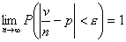
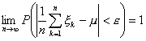

六、大数法则与中心极限定理

[大数法则]

&nbsp;&nbsp;&nbsp; 1°&nbsp; 伯努利定理&nbsp; 随机事件<i>A</i>在<i>n</i>次独立试验中的频率依概率收敛于事件<i>A</i>的概率<i>p</i>，即对任意，

2° 互相独立的随机变量···如果(i)存在均值方差。记<i>E</i>,···)

；或者（ii）具有相同分布，且有有限均值<i>E</i>。那末

<pre>&nbsp;&nbsp;&nbsp;&nbsp;&nbsp;&nbsp;&nbsp;&nbsp;&nbsp;&nbsp;&nbsp;&nbsp;&nbsp;&nbsp;&nbsp;&nbsp;&nbsp;&nbsp;&nbsp;&nbsp;&nbsp; </pre>

依概率收敛于随机变量的均值，即对任意，

&nbsp;&nbsp;&nbsp;&nbsp;
3°&nbsp; 如果互相独立具有相同分布的随机变量的均值和方差都存在，记那末

依概率收敛于随机变量的方差，即对任意，

[中心极限定理]

&nbsp;&nbsp;&nbsp;
1° 如果互相独立具有相同分布的随机变量的均值和方差都存在，记，那末随机变量&nbsp;&nbsp;&nbsp; 

渐近地遵从标准正态分布<b><i>N(0,1)</i></b>，即

2°&nbsp; 在1°的条件下，有

&nbsp;&nbsp;&nbsp;&nbsp;&nbsp;&nbsp;&nbsp;&nbsp;&nbsp;&nbsp;&nbsp;&nbsp;&nbsp;&nbsp;&nbsp;&nbsp;&nbsp;&nbsp;

或&nbsp;&nbsp;&nbsp;&nbsp;&nbsp;&nbsp;&nbsp;&nbsp;&nbsp;&nbsp;&nbsp;&nbsp;&nbsp;&nbsp;&nbsp;&nbsp;&nbsp;

