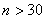

<b>§</b><b>2</b><b>&nbsp; </b><b>数理统计方法</b>

一、&nbsp;&nbsp; 一、&nbsp;&nbsp;&nbsp;&nbsp;&nbsp;&nbsp;&nbsp; 总体参数的估计

1、总体（母体）与样本（子样）

&nbsp;&nbsp;&nbsp;
研究某个问题，它的对象的所有可能观测结果称为总体（或母体），记作。总体中抽取一部分样品称为总体的一个样本（或子样）。样本中样品的个数称为样本的大小（或容量）。，可以认为是大样本，否则称为小样本。

&nbsp;&nbsp; 数理统计方法就是应用概率论的结果，通过样本来了解和判断总体的统计特性的科学方法。

