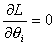
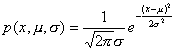
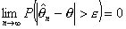

3、总体参数的点估计

&nbsp;&nbsp; 记<i>x</i>1 ,<i>x</i>2&nbsp; ,···,<i>xn</i>是从总体中取出的一个样本，可用样本的特征数来估计总体的数字特征。其常用方法有以下两种：

[矩法] 矩法是用样本的<i>r</i>阶矩作为总体<i>r</i>阶矩的估值。具体步骤如下：

&nbsp;&nbsp;&nbsp;
设的分布函数包含<i>k</i>个参数（其取值未知），记作。假定的<i>k</i>阶原点矩存在，它们自然是的函数，即

&nbsp;&nbsp;&nbsp;&nbsp; (<i>r=</i>1,2,···<i>,k</i>)

&nbsp;&nbsp;&nbsp;
考虑总体的一个样本作出这一样本的<i>r</i>阶矩，即

&nbsp;&nbsp;&nbsp;&nbsp;&nbsp;&nbsp;&nbsp;&nbsp;&nbsp;&nbsp;&nbsp;&nbsp;&nbsp;&nbsp;&nbsp;
=&nbsp;&nbsp;&nbsp;&nbsp;&nbsp; 

然后解方程组

&nbsp;&nbsp;&nbsp;&nbsp;&nbsp;&nbsp;&nbsp;&nbsp;&nbsp;&nbsp;&nbsp;&nbsp;&nbsp;&nbsp;&nbsp;
(=&nbsp; (<i>r=1,2,···,k)</i>

记所得的解为

&nbsp;&nbsp;&nbsp;&nbsp;&nbsp;&nbsp;&nbsp;&nbsp;&nbsp;&nbsp;&nbsp;&nbsp;&nbsp;&nbsp;&nbsp;

用分别作为的估值。

[最大似然法]&nbsp;&nbsp; 设总体的分布是连续型的，分布密度函数为，其中是待估计的未知参数。对于给定的使函数达到最大值的，并用它们分别作为的估值。

由于ln与在同一点()上达到最大值，因此，引入函数

&nbsp;&nbsp;&nbsp;
<i>L</i>()=ln=)

它称为似然函数。只要解方程组&nbsp; 

&nbsp;&nbsp;&nbsp;&nbsp;&nbsp;&nbsp;&nbsp;&nbsp;&nbsp;&nbsp;&nbsp;&nbsp;&nbsp;&nbsp;&nbsp;&nbsp;&nbsp;&nbsp;&nbsp;&nbsp;
&nbsp;&nbsp;(<i>i=</i>1,2,···,<i>k</i>)

就可以从中确定所要求的，它们分别称为参数的最大似然估计值。

&nbsp;&nbsp; 如果总体的分布是离散型的，只要把上述似然函数中的取为就可以了。

&nbsp;&nbsp; 例&nbsp; 正态总体的参数估计，假定已知总体遵从正态分布<i>N</i>(<i></i>，但参数未知。现在要用总体的<i>n</i>次观测值<i>x1&nbsp;
, x2 </i>&nbsp;,···,<i> xn</i>求的最大似然估值。

&nbsp;&nbsp; 解&nbsp; 因为总体的分布密度函数为

&nbsp;&nbsp;&nbsp;&nbsp;&nbsp;&nbsp;&nbsp;&nbsp;&nbsp;&nbsp;&nbsp;&nbsp;&nbsp;&nbsp;&nbsp;&nbsp;&nbsp;&nbsp;

因此，似然函数为

&nbsp;&nbsp;&nbsp;&nbsp;&nbsp;&nbsp;&nbsp;&nbsp;&nbsp;&nbsp;&nbsp;&nbsp;&nbsp;

解方程组

&nbsp;&nbsp;&nbsp;&nbsp;&nbsp;&nbsp;&nbsp;&nbsp;&nbsp;&nbsp;&nbsp;&nbsp;&nbsp;&nbsp;&nbsp;&nbsp;&nbsp;

得&nbsp;&nbsp;&nbsp;&nbsp;&nbsp;&nbsp;&nbsp;&nbsp;&nbsp;&nbsp;&nbsp;&nbsp;&nbsp;&nbsp;&nbsp;

&nbsp;&nbsp;&nbsp;&nbsp;&nbsp;&nbsp;&nbsp;&nbsp;&nbsp;&nbsp;&nbsp;&nbsp;&nbsp;&nbsp;

&nbsp;&nbsp;&nbsp;&nbsp;&nbsp;&nbsp;&nbsp;&nbsp;&nbsp;&nbsp;&nbsp;&nbsp;&nbsp;&nbsp;

容易检验确实使取到最大值。因此它们分别是的最大似然估值。

[估值好坏的判别标准]

&nbsp;&nbsp;
1°&nbsp; 无偏性&nbsp; 如果参数的估值<i> x1&nbsp;
, x2&nbsp; </i>,···,<i> xn)</i>满足关系式

&nbsp;&nbsp;&nbsp;&nbsp;&nbsp;&nbsp;&nbsp;&nbsp;&nbsp;&nbsp;&nbsp;&nbsp;&nbsp;&nbsp;&nbsp;&nbsp;&nbsp;&nbsp;&nbsp;

则称是的无偏估值。

&nbsp;&nbsp;
2°&nbsp; 有效性&nbsp; 如果和都是参数的无偏估值。

&nbsp;&nbsp;&nbsp;&nbsp;&nbsp;&nbsp;&nbsp;&nbsp;&nbsp;&nbsp;&nbsp;&nbsp;&nbsp;&nbsp;&nbsp;

则称比有效。进一步，如果固定样本的容量<i>n</i>，使极小值的无偏估值就称为的有效估值。

&nbsp;&nbsp;
3°&nbsp; 一致性&nbsp; 如果对任意给定的正数，总有

&nbsp;&nbsp;&nbsp;&nbsp;&nbsp;&nbsp;&nbsp;&nbsp;&nbsp;&nbsp;&nbsp;&nbsp;&nbsp;&nbsp;&nbsp;

则称的估值是一致的。

&nbsp; 由契贝谢夫不等式（见§1,三）易见，当

&nbsp;&nbsp;&nbsp;&nbsp;&nbsp;&nbsp;&nbsp;&nbsp;&nbsp;&nbsp;&nbsp;&nbsp;&nbsp;&nbsp;&nbsp;&nbsp;&nbsp;&nbsp;&nbsp;&nbsp;&nbsp;

对某成立时，是的一致估值。

&nbsp; 在实用中，往往应用这一充分条件来验证是否是的一致估值。

&nbsp; 例

<table class=MsoNormalTable border=1 cellspacing=0 cellpadding=0
 style='border-collapse:collapse;border:none'>
 <tr>
  <td width=90 valign=top style='width:67.8pt;border:solid windowtext 1.0pt;
  border-left:none;padding:0mm 5.4pt 0mm 5.4pt'>
  
总体分布

  </td>
  <td width=106 valign=top style='width:79.2pt;border:solid windowtext 1.0pt;
  border-left:none;padding:0mm 5.4pt 0mm 5.4pt'>
  
未知总体

  
参&nbsp;&nbsp;&nbsp;&nbsp; 数

  </td>
  <td width=176 valign=top style='width:131.8pt;border:solid windowtext 1.0pt;
  border-left:none;padding:0mm 5.4pt 0mm 5.4pt'>
  
总体参数估值

  </td>
  <td width=63 valign=top style='width:47.1pt;border:solid windowtext 1.0pt;
  border-left:none;padding:0mm 5.4pt 0mm 5.4pt'>
  
无偏性

  </td>
  <td width=74 valign=top style='width:55.8pt;border:solid windowtext 1.0pt;
  border-left:none;padding:0mm 5.4pt 0mm 5.4pt'>
  
有效性

  </td>
  <td width=74 valign=top style='width:55.8pt;border-top:solid windowtext 1.0pt;
  border-left:none;border-bottom:solid windowtext 1.0pt;border-right:none;
  padding:0mm 5.4pt 0mm 5.4pt'>
  
一致性

  </td>
 </tr>
 <tr>
  <td width=90 valign=top style='width:67.8pt;border-top:none;border-left:none;
  border-bottom:solid windowtext 1.0pt;border-right:solid windowtext 1.0pt;
  padding:0mm 5.4pt 0mm 5.4pt'>
  
<b></b>

  </td>
  <td width=106 valign=top style='width:79.2pt;border-top:none;border-left:
  none;border-bottom:solid windowtext 1.0pt;border-right:solid windowtext 1.0pt;
  padding:0mm 5.4pt 0mm 5.4pt'>
  

  </td>
  <td width=176 valign=top style='width:131.8pt;border-top:none;border-left:
  none;border-bottom:solid windowtext 1.0pt;border-right:solid windowtext 1.0pt;
  padding:0mm 5.4pt 0mm 5.4pt'>
  
<b></b>

  
<b></b>

  
<b></b>

  
<b></b>

  
<b></b>

  
<b></b>

  
<b></b>

  
<b></b>

  </td>
  <td width=63 valign=top style='width:47.1pt;border-top:none;border-left:none;
  border-bottom:solid windowtext 1.0pt;border-right:solid windowtext 1.0pt;
  padding:0mm 5.4pt 0mm 5.4pt'>
  
有

  
有

  
有

  
有

  
有

  
有

  
有

  </td>
  <td width=74 valign=top style='width:55.8pt;border-top:none;border-left:none;
  border-bottom:solid windowtext 1.0pt;border-right:solid windowtext 1.0pt;
  padding:0mm 5.4pt 0mm 5.4pt'>
  
有

  
有

  
有

  
有

  </td>
  <td width=74 valign=top style='width:55.8pt;border:none;border-bottom:solid windowtext 1.0pt;
  padding:0mm 5.4pt 0mm 5.4pt'>
  
有

  
有

  
有

  
有

  
有

  
有

  </td>
 </tr>
</table>

&nbsp;

