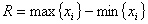
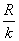
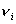
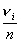

4、样本的频率分布

<b>&nbsp;&nbsp;
</b>频率分布较完整地反映实验数据的变化规律。建立频率分布的步骤（设样本为<i>x</i>1<i> </i><i>,x</i>2<i> </i><i>,···, xn</i>）是：

&nbsp; （1）
找出最大值与最小值，求得极差。

&nbsp; （2）
根据样本大小分组，通常大样本分成10~20组，小样本分成5~6组，再根据组数<i>k</i>和极差<i>R</i>决定组距<i>c</i>，如果按等距分组，则c。

&nbsp; （3） 确定分点（常取比原数据的精度高一位）。

&nbsp; （4）
数出各组的频率。

&nbsp; （5）
计算频率

&nbsp; （6）
画直方图（分点为横坐标，频率与组距之比为纵坐标）。

&nbsp; （7）
如果变量是连续的，则描出光滑曲线，近似的代替总体的分布。

