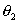

5、总体参数的区间估计

[小概率原理]&nbsp; 在一次试验中，概率很小（接近于零）的事件认为是实际上不可能发生的事件；而概率接近于1的事件认为是实际上必然发生的事件。

[置信区间与显著性水平]&nbsp; 对总体参数（如）进行区间估计（即估计参数的取值范围）时，如果对于预先给定的很小的概率，能找到一个区间()，使得

=1-

那末称区间()为参数的置信区间，和称为置信限（或临界值）；和称为否定域；概率称为显著性水平，1-称为置信水平（或置信概率）。

[总体参数的区间估计表]&nbsp; 假设总体遵从正态分布)。对于预先给的显著性水平，可用一个样本<i>x</i>1,<i> x</i>2 ,···,<i>xn</i>的均值和标准差<i>s</i>来估计总体的均值和方差的置信区间，也可用两个样本与的均值和标准差来估计两总体均值差的置信区间。&nbsp; 

<table class=MsoNormalTable border=1 cellspacing=0 cellpadding=0
 style='border-collapse:collapse;border:none'>
 <tr>
  <td width=115 valign=top style='width:86.4pt;border:solid windowtext 1.0pt;
  border-left:none;padding:0mm 5.4pt 0mm 5.4pt'>
  
样本情况

  </td>
  <td width=270 valign=top style='width:202.35pt;border:solid windowtext 1.0pt;
  border-left:none;padding:0mm 5.4pt 0mm 5.4pt'>
  
总体参数或的置信区间

  </td>
  <td width=216 valign=top style='width:162.25pt;border-top:solid windowtext 1.0pt;
  border-left:none;border-bottom:solid windowtext 1.0pt;border-right:none;
  padding:0mm 5.4pt 0mm 5.4pt'>
  
与置信区间有关的与的确定

  </td>
 </tr>
 <tr>
  <td width=115 valign=top style='width:86.4pt;border-top:none;border-left:
  none;border-bottom:solid windowtext 1.0pt;border-right:solid windowtext 1.0pt;
  padding:0mm 5.4pt 0mm 5.4pt'>
  
大样本

  
已知总体方差

  

  </td>
  <td width=270 valign=top style='width:202.35pt;border-top:none;border-left:
  none;border-bottom:solid windowtext 1.0pt;border-right:solid windowtext 1.0pt;
  padding:0mm 5.4pt 0mm 5.4pt'>
  

  </td>
  <td width=216 valign=top style='width:162.25pt;border:none;border-bottom:
  solid windowtext 1.0pt;padding:0mm 5.4pt 0mm 5.4pt'>
  

  
查正态分布表

  </td>
 </tr>
 <tr>
  <td width=115 valign=top style='width:86.4pt;border-top:none;border-left:
  none;border-bottom:solid windowtext 1.0pt;border-right:solid windowtext 1.0pt;
  padding:0mm 5.4pt 0mm 5.4pt'>
  
大样本

  
总体方差未知

  </td>
  <td width=270 valign=top style='width:202.35pt;border-top:none;border-left:
  none;border-bottom:solid windowtext 1.0pt;border-right:solid windowtext 1.0pt;
  padding:0mm 5.4pt 0mm 5.4pt'>
  

  </td>
  <td width=216 valign=top style='width:162.25pt;border:none;border-bottom:
  solid windowtext 1.0pt;padding:0mm 5.4pt 0mm 5.4pt'>
  
同上

  </td>
 </tr>
 <tr>
  <td width=115 valign=top style='width:86.4pt;border-top:none;border-left:
  none;border-bottom:solid windowtext 1.0pt;border-right:solid windowtext 1.0pt;
  padding:0mm 5.4pt 0mm 5.4pt'>
  
小样本

  
已知总体方差

  

  </td>
  <td width=270 valign=top style='width:202.35pt;border-top:none;border-left:
  none;border-bottom:solid windowtext 1.0pt;border-right:solid windowtext 1.0pt;
  padding:0mm 5.4pt 0mm 5.4pt'>
  

  </td>
  <td width=216 valign=top style='width:162.25pt;border:none;border-bottom:
  solid windowtext 1.0pt;padding:0mm 5.4pt 0mm 5.4pt'>
  
同上

  </td>
 </tr>
 <tr>
  <td width=115 valign=top style='width:86.4pt;border-top:none;border-left:
  none;border-bottom:solid windowtext 1.0pt;border-right:solid windowtext 1.0pt;
  padding:0mm 5.4pt 0mm 5.4pt'>
  
小样本

  
总体方差未知

  </td>
  <td width=270 valign=top style='width:202.35pt;border-top:none;border-left:
  none;border-bottom:solid windowtext 1.0pt;border-right:solid windowtext 1.0pt;
  padding:0mm 5.4pt 0mm 5.4pt'>
  

  </td>
  <td width=216 valign=top style='width:162.25pt;border:none;border-bottom:
  solid windowtext 1.0pt;padding:0mm 5.4pt 0mm 5.4pt'>
  

  
查<i>t</i>分布表（自由度为<i>n</i>-1）

  </td>
 </tr>
 <tr>
  <td width=115 valign=top style='width:86.4pt;border-top:none;border-left:
  none;border-bottom:solid windowtext 1.0pt;border-right:solid windowtext 1.0pt;
  padding:0mm 5.4pt 0mm 5.4pt'>
  
已知两总体的

  
方差

  </td>
  <td width=270 valign=top style='width:202.35pt;border-top:none;border-left:
  none;border-bottom:solid windowtext 1.0pt;border-right:solid windowtext 1.0pt;
  padding:0mm 5.4pt 0mm 5.4pt'>
  

  

  </td>
  <td width=216 valign=top style='width:162.25pt;border:none;border-bottom:
  solid windowtext 1.0pt;padding:0mm 5.4pt 0mm 5.4pt'>
  

  
查正态分布表

  </td>
 </tr>
 <tr>
  <td width=115 valign=top style='width:86.4pt;border-top:none;border-left:
  none;border-bottom:solid windowtext 1.0pt;border-right:solid windowtext 1.0pt;
  padding:0mm 5.4pt 0mm 5.4pt'>
  
两总体的方差

  
未&nbsp;&nbsp; 知

  </td>
  <td width=270 valign=top style='width:202.35pt;border-top:none;border-left:
  none;border-bottom:solid windowtext 1.0pt;border-right:solid windowtext 1.0pt;
  padding:0mm 5.4pt 0mm 5.4pt'>
  

  

  
式中

  </td>
  <td width=216 valign=top style='width:162.25pt;border:none;border-bottom:
  solid windowtext 1.0pt;padding:0mm 5.4pt 0mm 5.4pt'>
  

  
查<i>t</i>分布表

  
（自由度为<i>n</i>1<i> + n</i>2-2<i> </i>）

  </td>
 </tr>
 <tr>
  <td width=115 valign=top style='width:86.4pt;border-top:none;border-left:
  none;border-bottom:solid windowtext 1.0pt;border-right:solid windowtext 1.0pt;
  padding:0mm 5.4pt 0mm 5.4pt'>
  
小样本

  
已知总体均值

  </td>
  <td width=270 valign=top style='width:202.35pt;border-top:none;border-left:
  none;border-bottom:solid windowtext 1.0pt;border-right:solid windowtext 1.0pt;
  padding:0mm 5.4pt 0mm 5.4pt'>
  

  

  </td>
  <td width=216 valign=top style='width:162.25pt;border:none;border-bottom:
  solid windowtext 1.0pt;padding:0mm 5.4pt 0mm 5.4pt'>
  

  
查分布表

  
（自由度为<i>n</i>）

  </td>
 </tr>
 <tr style='height:65.45pt'>
  <td width=115 valign=top style='width:86.4pt;border-top:none;border-left:
  none;border-bottom:solid windowtext 1.0pt;border-right:solid windowtext 1.0pt;
  padding:0mm 5.4pt 0mm 5.4pt;height:65.45pt'>
  
小样本

  
总体均值未知

  </td>
  <td width=270 valign=top style='width:202.35pt;border-top:none;border-left:
  none;border-bottom:solid windowtext 1.0pt;border-right:solid windowtext 1.0pt;
  padding:0mm 5.4pt 0mm 5.4pt;height:65.45pt'>
  

  </td>
  <td width=216 valign=top style='width:162.25pt;border:none;border-bottom:
  solid windowtext 1.0pt;padding:0mm 5.4pt 0mm 5.4pt;height:65.45pt'>
  

  
查分布表

  
（自由度为<i>n</i>）

  </td>
 </tr>
 <tr>
  <td width=115 valign=top style='width:86.4pt;border-top:none;border-left:
  none;border-bottom:solid windowtext 1.0pt;border-right:solid windowtext 1.0pt;
  padding:0mm 5.4pt 0mm 5.4pt'>
  
小样本

  
两总体的均值

  
与方差未知

  </td>
  <td width=270 valign=top style='width:202.35pt;border-top:none;border-left:
  none;border-bottom:solid windowtext 1.0pt;border-right:solid windowtext 1.0pt;
  padding:0mm 5.4pt 0mm 5.4pt'>
  

  

  </td>
  <td width=216 valign=top style='width:162.25pt;border:none;border-bottom:
  solid windowtext 1.0pt;padding:0mm 5.4pt 0mm 5.4pt'>
  

  
查<i>F</i>分布表

  
（自由度为

  

  
查分布表

  
（自由度为(<i>n</i>2 -1,<i>n</i>1 –1)）

  </td>
 </tr>
</table>

&nbsp;

