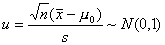

二、统计假设实验

1、统计假设检验的步骤 

<b>&nbsp;&nbsp;&nbsp;
</b>先假设总体具有某种统计特性（如具有某种参数，或遵从某种分布等），然后再检验这个假设是否可信，这种方法称为统计假设检验（或假设检验），其步骤如下：

例<b>&nbsp; </b>已知某产品平均强度公斤，现改变制作方法，并随意抽取件，算得公斤，公斤。问制作方法的改变对强度有无显著影响？

<table class=MsoNormalTable border=1 cellspacing=0 cellpadding=0
 style='border-collapse:collapse;border:none'>
 <tr>
  <td width=259 valign=top style='width:194.4pt;border:solid windowtext 1.0pt;
  border-left:none;padding:0mm 5.4pt 0mm 5.4pt'>
  
统计假设检验步骤

  </td>
  <td width=309 valign=top style='width:231.7pt;border-top:solid windowtext 1.0pt;
  border-left:none;border-bottom:solid windowtext 1.0pt;border-right:none;
  padding:0mm 5.4pt 0mm 5.4pt'>
  
&nbsp;&nbsp;&nbsp;&nbsp;&nbsp;&nbsp;&nbsp;&nbsp;&nbsp;
  过&nbsp; 程&nbsp; 分&nbsp; 析

  </td>
 </tr>
 <tr>
  <td width=259 valign=top style='width:194.4pt;border-top:none;border-left:
  none;border-bottom:solid windowtext 1.0pt;border-right:solid windowtext 1.0pt;
  padding:0mm 5.4pt 0mm 5.4pt'>
  
（1） 假设<i>H</i>0

  
（2） 选取统计量，明确其分布

  
（3） 给出显著性水平

  
（4） 查出置信限

  
（5） 计算统计量<i>u</i>

  
（6） 统计推断

  
&nbsp;&nbsp;&nbsp;
  当时，接受<i>H</i>0

  
&nbsp;&nbsp;&nbsp;
  当时，否定<i>H</i>0

  </td>
  <td width=309 valign=top style='width:231.7pt;border:none;border-bottom:solid windowtext 1.0pt;
  padding:0mm 5.4pt 0mm 5.4pt'>
  
<i>H</i>0:<i> </i>

  
&nbsp;&nbsp;
  （是制作方法改变后的总体均值）

  

  

  
由

  
查正态分布表得<i>K</i>0.025<i>=1.96</i>

  

  
&nbsp; 由于

  
&nbsp;&nbsp;&nbsp;&nbsp;&nbsp;
  &nbsp;&nbsp;

  
所以相信<i>H</i>0 ，以5<i>%</i>的显著性水平认为制作方法的改变对产品强度无显著影响。

  </td>
 </tr>
</table>

&nbsp;

