

3、总体分布函数的统计假设检验

<b>&nbsp;&nbsp;
</b>设 <b>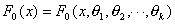</b>为已知类型的分布函数，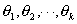为参数（已知或部分已知），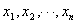为总体的样本，假设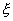的分布函数为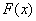，分两种情况进行统计假设检验。

1° 的全部参数已知&nbsp; 把实轴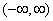分成<i>m</i>个不相交的区间：

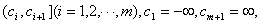其中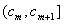理解成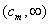。记理论频率为

&nbsp;&nbsp;&nbsp;&nbsp;&nbsp;&nbsp;&nbsp;&nbsp;&nbsp;&nbsp;&nbsp;&nbsp;&nbsp;&nbsp;&nbsp;
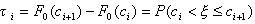

的样本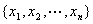落在区间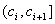的个数为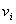（经验频率），那末统计量

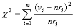

遵从自由度为<i>m</i>的分布，应用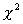检验法便可检验假设

&nbsp;&nbsp;&nbsp;&nbsp;&nbsp;&nbsp;&nbsp;&nbsp;&nbsp;&nbsp;&nbsp;&nbsp;&nbsp;&nbsp;&nbsp;&nbsp;&nbsp;&nbsp;&nbsp;&nbsp;&nbsp;
<i>H</i>0: <i>&nbsp;F</i>(<i>x</i>)<i>=F</i>0(<i>x</i>)

是否可信。

&nbsp; &nbsp;&nbsp;2°&nbsp;&nbsp; <i>F</i>0(<i>x</i>) 的参数全部或一部分未知&nbsp; 设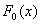有<i>l</i>个参数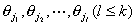未知，可先用最大似然法（本节，一，3）定出这<i>l</i>个参数的估值，把这些估值就当作的相应参数，于是类似1°的情形可计算理论频率，再算出经验频数，那末统计量

&nbsp;&nbsp;&nbsp;&nbsp;&nbsp;&nbsp;&nbsp;&nbsp;&nbsp;&nbsp;&nbsp;&nbsp;&nbsp;&nbsp;&nbsp;&nbsp;&nbsp;&nbsp;&nbsp;&nbsp;

当<i>n</i>很大时遵从自由度为<i>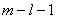</i>的分布。应用检验法便可检验假设

&nbsp;&nbsp;&nbsp;&nbsp;&nbsp;&nbsp;&nbsp;&nbsp;&nbsp;&nbsp;&nbsp;&nbsp;&nbsp;&nbsp;&nbsp;&nbsp;&nbsp;&nbsp;&nbsp;&nbsp;
<i>H</i>0:&nbsp; <i>F</i>(<i>x</i>)<i>=F</i>0(<i>x</i>)

是否可信。

