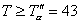

4、两个样本是否来自同分布总体的统计假设检验

&nbsp;&nbsp;
[符号检验法]&nbsp; 此法简单、直观，不要求对检验量的分布规律有所了解，常用来检验波动的程度是否一样和检验生产的状况有无明显的改变等问题。

&nbsp;&nbsp;&nbsp;
用符号“+”,“-”与“0”分别表示甲比乙的数据大、小与相等，并用,与表示出现“+”,“-”与“0”的次数。统计假设检验步骤用例说明如下：

例&nbsp; 甲乙两人分析同一物质中某成分的含量，得下表

<table class=MsoNormalTable border=1 cellspacing=0 cellpadding=0
 style='border-collapse:collapse;border:none'>
 <tr>
  <td width=55 valign=top style='width:41.4pt;border:solid windowtext 1.0pt;
  border-left:none;padding:0mm 5.4pt 0mm 5.4pt'>
  
&nbsp;甲

  
&nbsp;乙

  
符号

  </td>
  <td width=492 valign=top style='width:369.0pt;border-top:solid windowtext 1.0pt;
  border-left:none;border-bottom:solid windowtext 1.0pt;border-right:none;
  padding:0mm 5.4pt 0mm 5.4pt'>
  
14.7&nbsp; 15.0&nbsp; 15.2&nbsp;
  14.8&nbsp; 15.5&nbsp; 14.6&nbsp; 14.9&nbsp; 14.8&nbsp; 15.1&nbsp; 15.0

  
14.6&nbsp; 15.1&nbsp; 15.4&nbsp;
  14.7&nbsp; 15.2&nbsp; 14.7&nbsp; 14.8&nbsp; 14.6&nbsp; 15.2&nbsp; 15.0

  
&nbsp;
  +&nbsp;&nbsp;&nbsp; -&nbsp;&nbsp;&nbsp; -&nbsp;&nbsp;&nbsp;&nbsp;
  +&nbsp;&nbsp;&nbsp;&nbsp; +&nbsp;&nbsp;&nbsp;&nbsp; -&nbsp;&nbsp;&nbsp;
  +&nbsp;&nbsp;&nbsp;&nbsp; +&nbsp;&nbsp;&nbsp; -&nbsp;&nbsp;&nbsp; 0

  </td>
 </tr>
 <tr>
  <td width=55 valign=top style='width:41.4pt;border-top:none;border-left:none;
  border-bottom:solid windowtext 1.0pt;border-right:solid windowtext 1.0pt;
  padding:0mm 5.4pt 0mm 5.4pt'>
  
&nbsp;甲

  
&nbsp;乙

  
符号

  </td>
  <td width=492 valign=top style='width:369.0pt;border:none;border-bottom:solid windowtext 1.0pt;
  padding:0mm 5.4pt 0mm 5.4pt'>
  
14.7&nbsp; 14.8&nbsp; 14.7&nbsp;
  15.0&nbsp; 14.9&nbsp; 14.9&nbsp; 15.2&nbsp; 14.7&nbsp; 15.4&nbsp; 15.3 

  
14.6&nbsp; 14.6&nbsp; 14.8&nbsp;
  15.3&nbsp; 14.7&nbsp; 14.6&nbsp; 14.8&nbsp; 14.9&nbsp; 15.2&nbsp; 15.0

  
&nbsp;
  +&nbsp;&nbsp;&nbsp; +&nbsp;&nbsp;&nbsp;&nbsp; -&nbsp;&nbsp;&nbsp;
  -&nbsp;&nbsp;&nbsp;&nbsp; +&nbsp;&nbsp;&nbsp;&nbsp; +&nbsp;&nbsp;&nbsp;
  +&nbsp;&nbsp;&nbsp; -&nbsp;&nbsp;&nbsp;&nbsp; +&nbsp;&nbsp;&nbsp; +

  </td>
 </tr>
</table>

&nbsp; 问两人的分析结果有无显著差异?

<table class=MsoNormalTable border=1 cellspacing=0 cellpadding=0
 style='border-collapse:collapse;border:none'>
 <tr>
  <td width=210 valign=top style='width:157.5pt;border:solid windowtext 1.0pt;
  border-left:none;padding:0mm 5.4pt 0mm 5.4pt'>
  
统计假设检验步骤

  </td>
  <td width=336 valign=top style='width:252.0pt;border-top:solid windowtext 1.0pt;
  border-left:none;border-bottom:solid windowtext 1.0pt;border-right:none;
  padding:0mm 5.4pt 0mm 5.4pt'>
  
&nbsp;&nbsp;&nbsp;&nbsp;&nbsp;&nbsp;&nbsp;&nbsp;&nbsp;&nbsp;&nbsp;
  过 程 分 析

  </td>
 </tr>
 <tr>
  <td width=210 valign=top style='width:157.5pt;border-top:none;border-left:
  none;border-bottom:solid windowtext 1.0pt;border-right:solid windowtext 1.0pt;
  padding:0mm 5.4pt 0mm 5.4pt'>
  
(1) 假设<i>H</i>0

  
(2) 统计量

  
(3) 给出显著性水平

  
(4) 查出置信限

  
(5) 计算统计量

  
(6) 统计推断

  
&nbsp;&nbsp;
  当时,接受<i>H</i>0

  
&nbsp;&nbsp;
  当时,否定<i>H</i>0

  </td>
  <td width=336 valign=top style='width:252.0pt;border:none;border-bottom:solid windowtext 1.0pt;
  padding:0mm 5.4pt 0mm 5.4pt'>
  
假设两人分析结果具有相同的分布函数

  
<i>&nbsp;&nbsp;&nbsp; r= min</i> {<i>n+ </i>&nbsp;,<i> n-</i>}

  
&nbsp;&nbsp;&nbsp;
  <i>a</i>=10%

  
查符号检验表(见下页),由

  
<i>N=n++</i><i>=</i>12+7=19,

  
<i>a</i>=10% 得 即否定域为.

  
&nbsp;&nbsp;&nbsp;
  

  
因为&nbsp;&nbsp; <i>r=</i>7&gt;5<i>=r</i>10%

  
所以接受<i>H</i>0,即以10%的信度认为甲乙两人的分析结果无显著差异.

  </td>
 </tr>
</table>

&nbsp;&nbsp;&nbsp;&nbsp;&nbsp;&nbsp;&nbsp;&nbsp;&nbsp;&nbsp;&nbsp;&nbsp;&nbsp;&nbsp;&nbsp;&nbsp;&nbsp;&nbsp;&nbsp;&nbsp;&nbsp;
符&nbsp; 号&nbsp; 检&nbsp; 验&nbsp; 表

<table class=MsoNormalTable border=1 cellspacing=0 cellpadding=0
 style='border-collapse:collapse;border:none'>
 <tr style='height:40.5pt'>
  <td width=63 valign=top style='width:47.25pt;border:solid windowtext 1.0pt;
  padding:0mm 5.4pt 0mm 5.4pt;height:40.5pt'><pre>&nbsp;&nbsp; </pre>
  
<i>N</i>

  </td>
  <td width=119 valign=top style='width:89.25pt;border:solid windowtext 1.0pt;
  border-left:none;padding:0mm 5.4pt 0mm 5.4pt;height:40.5pt'>
  
1&nbsp; 5&nbsp; 10&nbsp;&nbsp; 25

  
&nbsp;&nbsp;&nbsp;&nbsp; (%)

  </td>
  <td width=70 valign=top style='width:52.5pt;border:solid windowtext 1.0pt;
  border-left:none;padding:0mm 5.4pt 0mm 5.4pt;height:40.5pt'><pre>&nbsp;&nbsp; </pre>
  
<i>N</i>

  </td>
  <td width=132 valign=top style='width:99.0pt;border:solid windowtext 1.0pt;
  border-left:none;padding:0mm 5.4pt 0mm 5.4pt;height:40.5pt'>
  
1&nbsp;&nbsp; 5&nbsp; 10&nbsp;&nbsp; 25

  
&nbsp;&nbsp;&nbsp;&nbsp;&nbsp; (%)

  </td>
  <td width=71 valign=top style='width:53.25pt;border:solid windowtext 1.0pt;
  border-left:none;padding:0mm 5.4pt 0mm 5.4pt;height:40.5pt'><pre>&nbsp;&nbsp; </pre>
  
<i>N</i>

  </td>
  <td width=132 valign=top style='width:99.0pt;border:solid windowtext 1.0pt;
  border-left:none;padding:0mm 5.4pt 0mm 5.4pt;height:40.5pt'>
  
1&nbsp;&nbsp; 5&nbsp; 10&nbsp;&nbsp; 25

  
&nbsp;&nbsp;&nbsp;&nbsp;&nbsp; (%)

  </td>
 </tr>
 <tr>
  <td width=63 valign=top style='width:47.25pt;border:solid windowtext 1.0pt;
  border-top:none;padding:0mm 5.4pt 0mm 5.4pt'>
  
&nbsp;1

  
&nbsp;2

  
&nbsp;3

  
&nbsp;4

  
&nbsp;5

  
&nbsp;6

  
&nbsp;7

  
&nbsp;8

  
&nbsp;9

  
&nbsp;10

  
&nbsp;11

  
&nbsp;12

  
&nbsp;13

  
&nbsp;14

  
&nbsp;15

  
&nbsp;16

  
&nbsp;17

  
&nbsp;18

  
&nbsp;19

  
&nbsp;20

  
&nbsp;21

  
&nbsp;22

  
&nbsp;23

  
&nbsp;24

  
&nbsp;25

  
&nbsp;26

  
&nbsp;27

  
&nbsp;28

  
&nbsp;29

  
&nbsp;30

  </td>
  <td width=119 valign=top style='width:89.25pt;border-top:none;border-left:
  none;border-bottom:solid windowtext 1.0pt;border-right:solid windowtext 1.0pt;
  padding:0mm 5.4pt 0mm 5.4pt'>
  
&nbsp;&nbsp;&nbsp;&nbsp;&nbsp;&nbsp;&nbsp;&nbsp;&nbsp;&nbsp;&nbsp;
  0

  
&nbsp;&nbsp;&nbsp;&nbsp;&nbsp;&nbsp;&nbsp;&nbsp;&nbsp;&nbsp;&nbsp;
  0

  
&nbsp;&nbsp;&nbsp;&nbsp;&nbsp;&nbsp;&nbsp;
  0&nbsp;&nbsp; 0

  
&nbsp;&nbsp;&nbsp; 0&nbsp;&nbsp;
  0&nbsp;&nbsp; 1

  
&nbsp;&nbsp;&nbsp; 0&nbsp;&nbsp;
  0&nbsp;&nbsp; 1

  
0&nbsp;&nbsp; 0&nbsp;&nbsp; 1&nbsp;&nbsp;
  1

  
0&nbsp;&nbsp; 1&nbsp;&nbsp; 1&nbsp;&nbsp;
  2

  
0&nbsp;&nbsp; 1&nbsp;&nbsp; 1&nbsp;&nbsp;
  2

  
0&nbsp;&nbsp; 1&nbsp;&nbsp; 2&nbsp;&nbsp;
  3

  
1&nbsp;&nbsp; 2&nbsp;&nbsp; 2&nbsp;&nbsp;
  3

  
1&nbsp;&nbsp; 2&nbsp;&nbsp; 3&nbsp;&nbsp;
  3

  
1&nbsp;&nbsp; 2&nbsp;&nbsp; 3&nbsp;&nbsp;
  4

  
2&nbsp;&nbsp; 3&nbsp;&nbsp; 3&nbsp;&nbsp;
  4

  
2&nbsp;&nbsp; 3&nbsp;&nbsp; 4&nbsp;&nbsp;
  5

  
2&nbsp;&nbsp; 4&nbsp;&nbsp; 4&nbsp;&nbsp;
  5

  
3&nbsp;&nbsp; 4&nbsp;&nbsp; 5&nbsp;&nbsp;
  6

  
3&nbsp;&nbsp; 4&nbsp;&nbsp; 5&nbsp;&nbsp;
  6

  
3&nbsp;&nbsp; 5&nbsp;&nbsp; 5&nbsp;&nbsp;
  6

  
4&nbsp;&nbsp; 5&nbsp;&nbsp; 6&nbsp;&nbsp;
  7

  
4&nbsp;&nbsp; 5&nbsp;&nbsp; 6&nbsp;&nbsp;
  7

  
4&nbsp;&nbsp; 6&nbsp;&nbsp; 7&nbsp;&nbsp;
  8

  
5&nbsp;&nbsp; 6&nbsp;&nbsp; 7&nbsp;&nbsp;
  8

  
5&nbsp;&nbsp; 7&nbsp;&nbsp; 7&nbsp;&nbsp;
  9

  
6&nbsp;&nbsp; 7&nbsp;&nbsp; 8&nbsp;&nbsp;
  9

  
6&nbsp;&nbsp; 7&nbsp;&nbsp; 8&nbsp; 10

  
6&nbsp;&nbsp; 8&nbsp;&nbsp; 9&nbsp; 10

  
7&nbsp;&nbsp; 8&nbsp;&nbsp; 9&nbsp; 10

  
7&nbsp;&nbsp; 9&nbsp; 10&nbsp; 11

  </td>
  <td width=70 valign=top style='width:52.5pt;border-top:none;border-left:none;
  border-bottom:solid windowtext 1.0pt;border-right:solid windowtext 1.0pt;
  padding:0mm 5.4pt 0mm 5.4pt'>
  
&nbsp;31

  
&nbsp;32

  
&nbsp;33

  
&nbsp;34

  
&nbsp;35

  
&nbsp;36

  
&nbsp;37

  
&nbsp;38

  
&nbsp;39

  
&nbsp;40

  
&nbsp;41

  
&nbsp;42

  
&nbsp;43

  
&nbsp;44

  
&nbsp;45

  
&nbsp;46

  
&nbsp;47

  
&nbsp;48

  
&nbsp;49

  
&nbsp;50

  
&nbsp;51

  
&nbsp;52

  
&nbsp;53

  
&nbsp;54

  
&nbsp;55

  
&nbsp;56

  
&nbsp;57

  
&nbsp;58

  
&nbsp;59

  
&nbsp;60

  </td>
  <td width=132 valign=top style='width:99.0pt;border-top:none;border-left:
  none;border-bottom:solid windowtext 1.0pt;border-right:solid windowtext 1.0pt;
  padding:0mm 5.4pt 0mm 5.4pt'>
  
&nbsp;7&nbsp;&nbsp; 9&nbsp; 10&nbsp; 11

  
&nbsp;8&nbsp;&nbsp; 9&nbsp; 10&nbsp; 12

  
&nbsp;8&nbsp; 10&nbsp; 11&nbsp; 12

  
&nbsp;9&nbsp; 10&nbsp; 11&nbsp; 13

  
&nbsp;9&nbsp; 11&nbsp; 12&nbsp; 13

  
&nbsp;9&nbsp; 11&nbsp; 12&nbsp; 14

  
10&nbsp; 12&nbsp; 13&nbsp; 14

  
10&nbsp; 12&nbsp; 13&nbsp; 14

  
11&nbsp; 12&nbsp; 13&nbsp; 15

  
11&nbsp; 13&nbsp; 14&nbsp; 15

  
11&nbsp; 13&nbsp; 14&nbsp; 16 

  
12&nbsp; 14&nbsp; 15&nbsp; 16

  
12&nbsp; 14&nbsp; 15&nbsp; 17

  
13&nbsp; 15&nbsp; 16&nbsp; 17

  
13&nbsp; 15&nbsp; 16&nbsp; 18

  
13&nbsp; 15&nbsp; 16&nbsp; 18

  
14&nbsp; 16&nbsp; 17&nbsp; 19

  
14&nbsp; 16&nbsp; 17&nbsp; 19

  
15&nbsp; 17&nbsp; 18&nbsp; 19

  
15&nbsp; 17&nbsp; 18&nbsp; 20

  
15&nbsp; 18&nbsp; 19&nbsp; 20

  
16&nbsp; 18&nbsp; 19&nbsp; 21

  
16&nbsp; 18&nbsp; 20&nbsp; 21

  
17&nbsp; 19&nbsp; 20&nbsp; 22

  
17&nbsp; 19&nbsp; 20&nbsp; 22

  
17&nbsp; 20&nbsp; 21&nbsp; 23 

  
18&nbsp; 20&nbsp; 21&nbsp; 23

  
18&nbsp; 21&nbsp; 22&nbsp; 24

  
19&nbsp; 21&nbsp; 22&nbsp; 24

  
19&nbsp; 21&nbsp; 23&nbsp; 25

  </td>
  <td width=71 valign=top style='width:53.25pt;border-top:none;border-left:
  none;border-bottom:solid windowtext 1.0pt;border-right:solid windowtext 1.0pt;
  padding:0mm 5.4pt 0mm 5.4pt'>
  
&nbsp;61

  
&nbsp;62

  
&nbsp;63

  
&nbsp;64

  
&nbsp;65

  
&nbsp;66

  
&nbsp;67

  
&nbsp;68

  
&nbsp;69

  
&nbsp;70

  
&nbsp;71

  
&nbsp;72

  
&nbsp;73

  
&nbsp;74

  
&nbsp;75

  
&nbsp;76

  
&nbsp;77

  
&nbsp;78

  
&nbsp;79

  
&nbsp;80

  
&nbsp;81

  
&nbsp;82

  
&nbsp;83

  
&nbsp;84

  
&nbsp;85

  
&nbsp;86

  
&nbsp;87

  
&nbsp;88

  
&nbsp;89

  
&nbsp;90 

  </td>
  <td width=132 valign=top style='width:99.0pt;border-top:none;border-left:
  none;border-bottom:solid windowtext 1.0pt;border-right:solid windowtext 1.0pt;
  padding:0mm 5.4pt 0mm 5.4pt'>
  
20&nbsp; 22&nbsp; 23&nbsp; 25

  
20&nbsp; 22&nbsp; 24&nbsp; 25

  
20&nbsp; 23&nbsp; 24&nbsp; 26

  
21&nbsp; 23&nbsp; 24&nbsp; 26

  
21&nbsp; 24&nbsp; 25&nbsp; 27

  
22&nbsp; 24&nbsp; 25&nbsp; 27

  
22&nbsp; 25&nbsp; 26&nbsp; 28

  
22&nbsp; 25&nbsp; 26&nbsp; 28

  
23&nbsp; 25&nbsp; 27&nbsp; 29

  
23&nbsp; 26&nbsp; 27&nbsp; 29

  
24&nbsp; 26&nbsp; 28&nbsp; 30

  
24&nbsp; 27&nbsp; 28&nbsp; 30

  
25&nbsp; 27&nbsp; 28&nbsp; 31

  
25&nbsp; 28&nbsp; 29&nbsp; 31

  
25&nbsp; 28&nbsp; 29&nbsp; 32

  
26&nbsp; 28&nbsp; 30&nbsp; 32

  
26&nbsp; 29&nbsp; 30&nbsp; 32

  
27&nbsp; 29&nbsp; 31&nbsp; 33

  
27&nbsp; 30&nbsp; 31&nbsp; 33 

  
28&nbsp; 30&nbsp; 32&nbsp; 34

  
28&nbsp; 31&nbsp; 32&nbsp; 34

  
28&nbsp; 31&nbsp; 33&nbsp; 35

  
29&nbsp; 32&nbsp; 33&nbsp; 35

  
29&nbsp; 32&nbsp; 33&nbsp; 36

  
30&nbsp; 32&nbsp; 34&nbsp; 36

  
30&nbsp; 33&nbsp; 34&nbsp; 37

  
31&nbsp; 33&nbsp; 35&nbsp; 37

  
31&nbsp; 34&nbsp; 35&nbsp; 38

  
31&nbsp; 34&nbsp; 36&nbsp; 38

  
32&nbsp; 35&nbsp; 36&nbsp; 39

  </td>
 </tr>
</table>

&nbsp;&nbsp;&nbsp;&nbsp;
[注]&nbsp; 表中数字表示对应于符号和<i>N</i>与显著性水平的符号限<i></i><i>。</i>

[秩和检验法]&nbsp; 此法比符号检验法的精度要高,能更好的利用数据提供的信息,并且不要求数据“成对”.其步骤用例说明如下:

&nbsp;&nbsp;&nbsp;
例 对用甲乙两种材料制成的产品进行寿命试验,得

&nbsp;&nbsp;&nbsp;&nbsp;&nbsp;&nbsp;&nbsp;&nbsp;&nbsp;&nbsp;&nbsp;&nbsp;&nbsp;
甲&nbsp;&nbsp; 1610&nbsp;
1650&nbsp; 1680&nbsp; 1700&nbsp; 1750&nbsp; 1720&nbsp; 1800

&nbsp;&nbsp;&nbsp;&nbsp;&nbsp;&nbsp;&nbsp;&nbsp;&nbsp;&nbsp;&nbsp;&nbsp;&nbsp;
乙&nbsp;&nbsp; 1580&nbsp;
1600&nbsp; 1640&nbsp; 1640&nbsp; 1700

&nbsp;问两种材料对产品质量的影响有无显著差异?

&nbsp;&nbsp;&nbsp;&nbsp;
解&nbsp; 把上述数据从小到大排成下表:

<table class=MsoNormalTable border=1 cellspacing=0 cellpadding=0
 style='border-collapse:collapse;border:none'>
 <tr>
  <td width=34 valign=top style='width:25.5pt;border:solid windowtext 1.0pt;
  border-left:none;padding:0mm 5.4pt 0mm 5.4pt'>
  
秩

  </td>
  <td width=554 valign=top style='width:415.5pt;border-top:solid windowtext 1.0pt;
  border-left:none;border-bottom:solid windowtext 1.0pt;border-right:none;
  padding:0mm 5.4pt 0mm 5.4pt'>
  
&nbsp;1&nbsp;&nbsp;&nbsp; 2&nbsp;&nbsp;&nbsp; 3&nbsp;&nbsp;
  4&nbsp;&nbsp; 5&nbsp;&nbsp;&nbsp; 6&nbsp;&nbsp;&nbsp; 7&nbsp;&nbsp;
  8&nbsp;&nbsp;&nbsp; 9&nbsp;&nbsp; 10&nbsp;&nbsp; 11&nbsp;&nbsp; 12

  </td>
 </tr>
 <tr>
  <td width=34 valign=top style='width:25.5pt;border-top:none;border-left:none;
  border-bottom:solid windowtext 1.0pt;border-right:solid windowtext 1.0pt;
  padding:0mm 5.4pt 0mm 5.4pt'>
  
甲

  
乙

  </td>
  <td width=554 valign=top style='width:415.5pt;border:none;border-bottom:solid windowtext 1.0pt;
  padding:0mm 5.4pt 0mm 5.4pt'>
  
&nbsp;&nbsp;&nbsp;&nbsp;&nbsp;&nbsp;
  &nbsp;&nbsp;1610&nbsp;&nbsp;&nbsp;&nbsp;&nbsp;&nbsp;&nbsp;&nbsp;&nbsp;
  1650 1680 1700&nbsp;&nbsp;&nbsp;&nbsp; 1720 1750&nbsp; 1800

  
1580 1600&nbsp;&nbsp;&nbsp;&nbsp; 1640
  1640&nbsp;&nbsp;&nbsp;&nbsp;&nbsp;&nbsp;&nbsp;&nbsp;&nbsp; 1700

  </td>
 </tr>
</table>

上表中第一行秩表示从小到大排列的序数,数据1700甲乙均有,排在8,9两个序位,其秩按平均秩取为。

<table class=MsoNormalTable border=1 cellspacing=0 cellpadding=0
 style='border-collapse:collapse;border:none'>
 <tr>
  <td width=284 valign=top style='width:213.05pt;border:solid windowtext 1.0pt;
  border-left:none;padding:0mm 5.4pt 0mm 5.4pt'>
  
统计假设检验步骤

  </td>
  <td width=304 valign=top style='width:227.95pt;border-top:solid windowtext 1.0pt;
  border-left:none;border-bottom:solid windowtext 1.0pt;border-right:none;
  padding:0mm 5.4pt 0mm 5.4pt'>
  
&nbsp;&nbsp;&nbsp;&nbsp;&nbsp;&nbsp;
  过 程 分 析

  </td>
 </tr>
 <tr>
  <td width=284 valign=top style='width:213.05pt;border-top:none;border-left:
  none;border-bottom:solid windowtext 1.0pt;border-right:solid windowtext 1.0pt;
  padding:0mm 5.4pt 0mm 5.4pt'>
  
（1） 假设<i>H</i>0

  
（2） 统计量

  
（3） 给出显著性水平

  
（4） 查出置信限

  
（5） 计算统计量

  
（6） 统计推断 

  
&nbsp;&nbsp;&nbsp;&nbsp;&nbsp;
  当时，接受<i>H</i>0

  
&nbsp;&nbsp;&nbsp;&nbsp;&nbsp;
  当或时，否定<i>H</i>0

  </td>
  <td width=304 valign=top style='width:227.95pt;border:none;border-bottom:
  solid windowtext 1.0pt;padding:0mm 5.4pt 0mm 5.4pt'>
  
假设两种材料对产品寿命影响无显著差异

  
<i>T</i>=样品数目小的那组的秩和

  

  
查“秩和检验表”（见下页），参数<i>n</i>1=5,<i>n</i>2=7

  
（<i>n</i>1<i>n</i>2 ,为两样本的大小）对,得<i>T</i>的下限

  
和上限（即否定域或

  
<i>T=</i>1+2+4+5+8.5=20.5（乙组的秩和）

  
因为，所以否定<i>H</i>0，即以5<i>%</i>的认为两种材料对产品寿命的影响有显著差异

  </td>
 </tr>
</table>

秩&nbsp; 和&nbsp; 检&nbsp; 验&nbsp; 表

<table class=MsoNormalTable border=1 cellspacing=0 cellpadding=0
 style='border-collapse:collapse;border:none'>
 <tr>
  <td width=36 valign=top style='width:27.0pt;border:solid windowtext 1.0pt;
  border-left:none;padding:0mm 5.4pt 0mm 5.4pt'>
  
<i>n</i>1

  </td>
  <td width=36 valign=top style='width:27.0pt;border:solid windowtext 1.0pt;
  border-left:none;padding:0mm 5.4pt 0mm 5.4pt'>
  
<i>n</i>2

  </td>
  <td width=30 valign=top style='width:22.5pt;border:solid windowtext 1.0pt;
  border-left:none;padding:0mm 5.4pt 0mm 5.4pt'>
  
<b></b>

  </td>
  <td width=28 valign=top style='width:21.3pt;border:solid windowtext 1.0pt;
  border-left:none;padding:0mm 5.4pt 0mm 5.4pt'>
  
<b></b>

  </td>
  <td width=28 valign=top style='width:21.3pt;border:solid windowtext 1.0pt;
  border-left:none;padding:0mm 5.4pt 0mm 5.4pt'>
  
<i>n</i>1

  </td>
  <td width=28 valign=top style='width:21.3pt;border:solid windowtext 1.0pt;
  border-left:none;padding:0mm 5.4pt 0mm 5.4pt'>
  
<i>n</i>2

  </td>
  <td width=28 valign=top style='width:21.3pt;border:solid windowtext 1.0pt;
  border-left:none;padding:0mm 5.4pt 0mm 5.4pt'>
  
<b></b>

  </td>
  <td width=28 valign=top style='width:21.3pt;border:solid windowtext 1.0pt;
  border-left:none;padding:0mm 5.4pt 0mm 5.4pt'>
  
<b></b>

  </td>
  <td width=28 valign=top style='width:21.3pt;border:solid windowtext 1.0pt;
  border-left:none;padding:0mm 5.4pt 0mm 5.4pt'>
  
<i>n</i>1

  </td>
  <td width=28 valign=top style='width:21.3pt;border:solid windowtext 1.0pt;
  border-left:none;padding:0mm 5.4pt 0mm 5.4pt'>
  
<i>n</i>2

  </td>
  <td width=28 valign=top style='width:21.3pt;border:solid windowtext 1.0pt;
  border-left:none;padding:0mm 5.4pt 0mm 5.4pt'>
  
<b></b>

  </td>
  <td width=28 valign=top style='width:21.3pt;border:solid windowtext 1.0pt;
  border-left:none;padding:0mm 5.4pt 0mm 5.4pt'>
  
<b></b>

  </td>
  <td width=28 valign=top style='width:21.3pt;border:solid windowtext 1.0pt;
  border-left:none;padding:0mm 5.4pt 0mm 5.4pt'>
  
<i>n</i>1

  </td>
  <td width=28 valign=top style='width:21.3pt;border:solid windowtext 1.0pt;
  border-left:none;padding:0mm 5.4pt 0mm 5.4pt'>
  
<i>n</i>2

  </td>
  <td width=28 valign=top style='width:21.3pt;border:solid windowtext 1.0pt;
  border-left:none;padding:0mm 5.4pt 0mm 5.4pt'>
  
<b></b>

  </td>
  <td width=28 valign=top style='width:21.3pt;border:solid windowtext 1.0pt;
  border-left:none;padding:0mm 5.4pt 0mm 5.4pt'>
  
<b></b>

  </td>
  <td width=28 valign=top style='width:21.3pt;border:solid windowtext 1.0pt;
  border-left:none;padding:0mm 5.4pt 0mm 5.4pt'>
  
<i>n</i>1

  </td>
  <td width=28 valign=top style='width:21.3pt;border:solid windowtext 1.0pt;
  border-left:none;padding:0mm 5.4pt 0mm 5.4pt'>
  
<i>n</i>2

  </td>
  <td width=28 valign=top style='width:21.3pt;border:solid windowtext 1.0pt;
  border-left:none;padding:0mm 5.4pt 0mm 5.4pt'>
  
<b></b>

  </td>
  <td width=40 valign=top style='width:30.0pt;border-top:solid windowtext 1.0pt;
  border-left:none;border-bottom:solid windowtext 1.0pt;border-right:none;
  padding:0mm 5.4pt 0mm 5.4pt'>
  
<b></b>

  </td>
 </tr>
 <tr style='height:184.9pt'>
  <td width=36 valign=top style='width:27.0pt;border-top:none;border-left:none;
  border-bottom:solid windowtext 1.0pt;border-right:solid windowtext 1.0pt;
  padding:0mm 5.4pt 0mm 5.4pt;height:184.9pt'>
  
2

  
2

  
2

  
2

  
2

  
2

  
2

  
2

  
2

  
2

  
2

  
2

  
3

  
3

  
3

  
3

  
3

  </td>
  <td width=36 valign=top style='width:27.0pt;border-top:none;border-left:none;
  border-bottom:solid windowtext 1.0pt;border-right:solid windowtext 1.0pt;
  padding:0mm 5.4pt 0mm 5.4pt;height:184.9pt'>
  
4

  
5

  
6

  
6

  
7

  
7

  
8

  
8

  
9

  
9

  
10

  
10

  
3

  
4

  
4

  
5

  
5

  </td>
  <td width=30 valign=top style='width:22.5pt;border-top:none;border-left:none;
  border-bottom:solid windowtext 1.0pt;border-right:solid windowtext 1.0pt;
  padding:0mm 5.4pt 0mm 5.4pt;height:184.9pt'>
  
3

  
3

  
<b>3</b>

  
4

  
<b>3</b>

  
4

  
<b>3</b>

  
4

  
<b>3</b>

  
4

  
<b>4</b>

  
5

  
6

  
<b>6</b>

  
7

  
<b>6</b>

  
7

  </td>
  <td width=28 valign=top style='width:21.3pt;border-top:none;border-left:none;
  border-bottom:solid windowtext 1.0pt;border-right:solid windowtext 1.0pt;
  padding:0mm 5.4pt 0mm 5.4pt;height:184.9pt'>
  
11

  
13

  
<b>15</b>

  
14

  
<b>17</b>

  
16

  
<b>19</b>

  
18

  
<b>21</b>

  
20

  
<b>22</b>

  
21

  
15

  
<b>18</b>

  
17

  
<b>21</b>

  
20

  </td>
  <td width=28 valign=top style='width:21.3pt;border-top:none;border-left:none;
  border-bottom:solid windowtext 1.0pt;border-right:solid windowtext 1.0pt;
  padding:0mm 5.4pt 0mm 5.4pt;height:184.9pt'>
  
3

  
3

  
3

  
3

  
3

  
3

  
3

  
3

  
3

  
3

  
4

  
4

  
4

  
4

  
4

  
4

  
4

  </td>
  <td width=28 valign=top style='width:21.3pt;border-top:none;border-left:none;
  border-bottom:solid windowtext 1.0pt;border-right:solid windowtext 1.0pt;
  padding:0mm 5.4pt 0mm 5.4pt;height:184.9pt'>
  
6

  
6

  
7

  
7

  
8

  
8

  
9

  
9

  
10

  
10

  
4

  
4

  
5

  
5

  
6

  
6

  
7

  </td>
  <td width=28 valign=top style='width:21.3pt;border-top:none;border-left:none;
  border-bottom:solid windowtext 1.0pt;border-right:solid windowtext 1.0pt;
  padding:0mm 5.4pt 0mm 5.4pt;height:184.9pt'>
  
<b>7</b>

  
8

  
<b>8</b>

  
9

  
<b>8</b>

  
9

  
<b>9</b>

  
10

  
<b>9</b>

  
11

  
<b>11</b>

  
12

  
<b>12</b>

  
13

  
<b>12</b>

  
14

  
<b>13</b>

  </td>
  <td width=28 valign=top style='width:21.3pt;border-top:none;border-left:none;
  border-bottom:solid windowtext 1.0pt;border-right:solid windowtext 1.0pt;
  padding:0mm 5.4pt 0mm 5.4pt;height:184.9pt'>
  
<b>23</b>

  
22

  
<b>25</b>

  
24

  
<b>28</b>

  
27

  
<b>30</b>

  
29

  
<b>33</b>

  
31

  
<b>25</b>

  
24

  
<b>28</b>

  
27

  
<b>32</b>

  
30

  
<b>35</b>

  </td>
  <td width=28 valign=top style='width:21.3pt;border-top:none;border-left:none;
  border-bottom:solid windowtext 1.0pt;border-right:solid windowtext 1.0pt;
  padding:0mm 5.4pt 0mm 5.4pt;height:184.9pt'>
  
4

  
4

  
4

  
4

  
4

  
4

  
4

  
5

  
5

  
5

  
5

  
5

  
5

  
5

  
5

  
5

  
5

  </td>
  <td width=28 valign=top style='width:21.3pt;border-top:none;border-left:none;
  border-bottom:solid windowtext 1.0pt;border-right:solid windowtext 1.0pt;
  padding:0mm 5.4pt 0mm 5.4pt;height:184.9pt'>
  
7

  
8

  
8

  
9

  
9

  
10

  
10

  
5

  
5

  
6

  
6

  
7

  
7

  
8

  
8

  
9

  
9

  </td>
  <td width=28 valign=top style='width:21.3pt;border-top:none;border-left:none;
  border-bottom:solid windowtext 1.0pt;border-right:solid windowtext 1.0pt;
  padding:0mm 5.4pt 0mm 5.4pt;height:184.9pt'>
  
15

  
<b>14</b>

  
16

  
<b>15</b>

  
17

  
<b>16</b>

  
18

  
<b>18</b>

  
19

  
<b>19</b>

  
20

  
<b>20</b>

  
22

  
<b>21</b>

  
23

  
<b>22</b>

  
25

  </td>
  <td width=28 valign=top style='width:21.3pt;border-top:none;border-left:none;
  border-bottom:solid windowtext 1.0pt;border-right:solid windowtext 1.0pt;
  padding:0mm 5.4pt 0mm 5.4pt;height:184.9pt'>
  
33

  
<b>38</b>

  
36

  
<b>41</b>

  
39

  
<b>44</b>

  
42

  
<b>37</b>

  
36

  
<b>41</b>

  
40

  
<b>45</b>

  
43

  
<b>49</b>

  
47

  
<b>53</b>

  
50

  </td>
  <td width=28 valign=top style='width:21.3pt;border-top:none;border-left:none;
  border-bottom:solid windowtext 1.0pt;border-right:solid windowtext 1.0pt;
  padding:0mm 5.4pt 0mm 5.4pt;height:184.9pt'>
  
5

  
5

  
6

  
6

  
6

  
6

  
6

  
6

  
6

  
6

  
6

  
6

  
7

  
7

  
7

  
7

  
7

  </td>
  <td width=28 valign=top style='width:21.3pt;border-top:none;border-left:none;
  border-bottom:solid windowtext 1.0pt;border-right:solid windowtext 1.0pt;
  padding:0mm 5.4pt 0mm 5.4pt;height:184.9pt'>
  
10

  
10

  
6

  
6

  
7

  
7

  
8

  
8

  
9

  
9

  
10

  
10

  
7

  
7

  
8

  
8

  
9

  </td>
  <td width=28 valign=top style='width:21.3pt;border-top:none;border-left:none;
  border-bottom:solid windowtext 1.0pt;border-right:solid windowtext 1.0pt;
  padding:0mm 5.4pt 0mm 5.4pt;height:184.9pt'>
  
<b>24</b>

  
26

  
<b>26</b>

  
28

  
<b>28</b>

  
30

  
<b>29</b>

  
32

  
<b>31</b>

  
33

  
<b>33</b>

  
35

  
<b>37</b>

  
39

  
<b>39</b>

  
41

  
<b>41</b>

  </td>
  <td width=28 valign=top style='width:21.3pt;border-top:none;border-left:none;
  border-bottom:solid windowtext 1.0pt;border-right:solid windowtext 1.0pt;
  padding:0mm 5.4pt 0mm 5.4pt;height:184.9pt'>
  
<b>56</b>

  
54

  
<b>52</b>

  
50

  
<b>56</b>

  
54

  
<b>61</b>

  
58

  
<b>65</b>

  
63

  
<b>69</b>

  
67

  
<b>68</b>

  
66

  
<b>73</b>

  
71

  
<b>78</b>

  </td>
  <td width=28 valign=top style='width:21.3pt;border-top:none;border-left:none;
  border-bottom:solid windowtext 1.0pt;border-right:solid windowtext 1.0pt;
  padding:0mm 5.4pt 0mm 5.4pt;height:184.9pt'>
  
7

  
7

  
7

  
8

  
8

  
8

  
8

  
8

  
8

  
9

  
9

  
9

  
9

  
10

  
10

  </td>
  <td width=28 valign=top style='width:21.3pt;border-top:none;border-left:none;
  border-bottom:solid windowtext 1.0pt;border-right:solid windowtext 1.0pt;
  padding:0mm 5.4pt 0mm 5.4pt;height:184.9pt'>
  
9

  
10

  
10

  
8

  
8

  
9

  
9

  
10

  
10

  
9

  
9

  
10

  
10

  
10

  
10

  </td>
  <td width=28 valign=top style='width:21.3pt;border-top:none;border-left:none;
  border-bottom:solid windowtext 1.0pt;border-right:solid windowtext 1.0pt;
  padding:0mm 5.4pt 0mm 5.4pt;height:184.9pt'>
  
43

  
<b>43</b>

  
46

  
<b>49</b>

  
52

  
<b>51</b>

  
54

  
<b>54</b>

  
57

  
<b>63</b>

  
66

  
<b>66</b>

  
69

  
<b>79</b>

  
83

  </td>
  <td width=40 valign=top style='width:30.0pt;border:none;border-bottom:solid windowtext 1.0pt;
  padding:0mm 5.4pt 0mm 5.4pt;height:184.9pt'>
  
76

  
<b>83</b>

  
80

  
<b>87</b>

  
84

  
<b>93</b>

  
90

  
<b>98</b>

  
95

  
<b>108</b>

  
105

  
<b>114</b>

  
111

  
<b>131</b>

  
127

  </td>
 </tr>
</table>

&nbsp;[注]&nbsp;
表头表示两组数据的个数；和分别为秩和的下限和上限。 对应的秩和上、下限用黑体数字表示，对应的秩和上、下限用普通字体表示。

