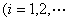
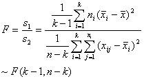
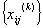
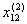
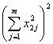
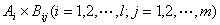

三、方差分析

&nbsp;&nbsp;&nbsp;
方差分析是分析试验（或观测）数据的一种方法，它所要解决的基本问题是通过数据的分析，弄清与研究对象有关的各个因素以及各个因素之间的交互作用对该对象的影响。它所研究的对象都假定遵从正态分布。

[单因素方差分析]&nbsp; 考虑一个因素<i>A</i>的不同水平对所考察的对象的影响。对<i>A</i>的<i>k</i>个不同水平<i>Ai</i>（其分布进行试验，得试验数据; <i>nk</i>）假定（尽管数值未知），检验各<i>Ai</i>的试验结果的平均值有无显著差异。其检验步骤如下：

&nbsp;&nbsp; （1）
假设

&nbsp;&nbsp; （2）
选取统计量并明确其分布

&nbsp;&nbsp;&nbsp;&nbsp;&nbsp;&nbsp;&nbsp;&nbsp;&nbsp;&nbsp;&nbsp;&nbsp;&nbsp;&nbsp;&nbsp;&nbsp;&nbsp;&nbsp;

式中&nbsp;&nbsp;&nbsp;&nbsp;&nbsp;&nbsp;&nbsp;&nbsp;&nbsp;&nbsp;&nbsp;&nbsp;&nbsp;

&nbsp;&nbsp;&nbsp;&nbsp;&nbsp;&nbsp;&nbsp;&nbsp;&nbsp;&nbsp;&nbsp;&nbsp;&nbsp;&nbsp;&nbsp;&nbsp;&nbsp;

&nbsp;&nbsp;&nbsp;&nbsp;&nbsp;&nbsp;&nbsp;&nbsp;&nbsp;&nbsp;&nbsp;&nbsp;&nbsp;&nbsp;&nbsp;&nbsp;&nbsp;&nbsp;

&nbsp;&nbsp; （3）
给出显著性水平

&nbsp;&nbsp; （4）
由<i>F</i>分布表（自由度为(<i>k</i>-1,<i>n</i>-<i>k</i>)）可以查出置信限，它满足

&nbsp;&nbsp;&nbsp;&nbsp;&nbsp;&nbsp;&nbsp;&nbsp;&nbsp;&nbsp;&nbsp;
&nbsp;&nbsp;&nbsp;&nbsp;&nbsp;&nbsp;

&nbsp;&nbsp; （5）
列表计算统计量。

<table class=MsoNormalTable border=1 cellspacing=0 cellpadding=0
 style='border-collapse:collapse;border:none'>
 <tr>
  <td width=35 valign=top style='width:26.25pt;border:solid windowtext 1.0pt;
  border-left:none;padding:0mm 5.4pt 0mm 5.4pt'>
  
分级

  </td>
  <td width=121 colspan=2 valign=top style='width:90.75pt;border:solid windowtext 1.0pt;
  border-left:none;padding:0mm 5.4pt 0mm 5.4pt'>
  
试验数据<i>xij</i>

  </td>
  <td width=68 valign=top style='width:51.0pt;border:solid windowtext 1.0pt;
  border-left:none;padding:0mm 5.4pt 0mm 5.4pt'>
  
<i>ni</i>

  </td>
  <td width=70 valign=top style='width:52.5pt;border:solid windowtext 1.0pt;
  border-left:none;padding:0mm 5.4pt 0mm 5.4pt'>
  

  </td>
  <td width=74 valign=top style='width:55.5pt;border:solid windowtext 1.0pt;
  border-left:none;padding:0mm 5.4pt 0mm 5.4pt'>
  

  </td>
  <td width=108 valign=top style='width:81.0pt;border:solid windowtext 1.0pt;
  border-left:none;padding:0mm 5.4pt 0mm 5.4pt'>
  

  </td>
  <td width=91 valign=top style='width:68.25pt;border-top:solid windowtext 1.0pt;
  border-left:none;border-bottom:solid windowtext 1.0pt;border-right:none;
  padding:0mm 5.4pt 0mm 5.4pt'>
  

  </td>
 </tr>
 <tr>
  <td width=35 valign=top style='width:26.25pt;border-top:none;border-left:
  none;border-bottom:solid windowtext 1.0pt;border-right:solid windowtext 1.0pt;
  padding:0mm 5.4pt 0mm 5.4pt'>
  
<i>A</i>1

  
<i>A</i>2

  

  
<i>Ak</i>

  </td>
  <td width=121 colspan=2 valign=top style='width:90.75pt;border-top:none;
  border-left:none;border-bottom:solid windowtext 1.0pt;border-right:solid windowtext 1.0pt;
  padding:0mm 5.4pt 0mm 5.4pt'>
  
&nbsp;<i>&nbsp;...</i>
  

  
&nbsp;&nbsp;<i>...</i>
  

  
&nbsp;&nbsp; &nbsp;&nbsp;<i>...&nbsp;
  </i>

  
&nbsp;&nbsp;<i>...
  </i>

  </td>
  <td width=68 valign=top style='width:51.0pt;border-top:none;border-left:none;
  border-bottom:solid windowtext 1.0pt;border-right:solid windowtext 1.0pt;
  padding:0mm 5.4pt 0mm 5.4pt'>
  
<i>n</i>1

  
<i>n</i>2

  
&nbsp;

  
<i>nk</i>

  </td>
  <td width=70 valign=top style='width:52.5pt;border-top:none;border-left:none;
  border-bottom:solid windowtext 1.0pt;border-right:solid windowtext 1.0pt;
  padding:0mm 5.4pt 0mm 5.4pt'>
  

  

  
&nbsp; 

  

  </td>
  <td width=74 valign=top style='width:55.5pt;border-top:none;border-left:none;
  border-bottom:solid windowtext 1.0pt;border-right:solid windowtext 1.0pt;
  padding:0mm 5.4pt 0mm 5.4pt'>
  

  

  
&nbsp;&nbsp;&nbsp; 

  

  </td>
  <td width=108 valign=top style='width:81.0pt;border-top:none;border-left:
  none;border-bottom:solid windowtext 1.0pt;border-right:solid windowtext 1.0pt;
  padding:0mm 5.4pt 0mm 5.4pt'>
  

  

  
&nbsp;&nbsp; <i>&nbsp;&nbsp;</i>&nbsp;

  

  </td>
  <td width=91 valign=top style='width:68.25pt;border:none;border-bottom:solid windowtext 1.0pt;
  padding:0mm 5.4pt 0mm 5.4pt'>
  

  

  
&nbsp;&nbsp; 

  

  </td>
 </tr>
 <tr>
  <td width=91 colspan=2 rowspan=2 valign=top style='width:68.25pt;border:none;
  border-right:solid windowtext 1.0pt;padding:0mm 5.4pt 0mm 5.4pt'>
  
&nbsp; 

  </td>
  <td width=65 valign=top style='width:48.75pt;border-top:none;border-left:
  none;border-bottom:solid windowtext 1.0pt;border-right:solid windowtext 1.0pt;
  padding:0mm 5.4pt 0mm 5.4pt'>
  

  </td>
  <td width=68 valign=top style='width:51.0pt;border-top:none;border-left:none;
  border-bottom:solid windowtext 1.0pt;border-right:solid windowtext 1.0pt;
  padding:0mm 5.4pt 0mm 5.4pt'>
  
<i></i>

  </td>
  <td width=70 valign=top style='width:52.5pt;border-top:none;border-left:none;
  border-bottom:solid windowtext 1.0pt;border-right:solid windowtext 1.0pt;
  padding:0mm 5.4pt 0mm 5.4pt'>
  

  </td>
  <td width=74 valign=top style='width:55.5pt;border-top:none;border-left:none;
  border-bottom:solid windowtext 1.0pt;border-right:solid windowtext 1.0pt;
  padding:0mm 5.4pt 0mm 5.4pt'>
  
&nbsp; 

  </td>
  <td width=108 valign=top style='width:81.0pt;border-top:none;border-left:
  none;border-bottom:solid windowtext 1.0pt;border-right:solid windowtext 1.0pt;
  padding:0mm 5.4pt 0mm 5.4pt'>
  

  </td>
  <td width=91 valign=top style='width:68.25pt;border:none;border-bottom:solid windowtext 1.0pt;
  padding:0mm 5.4pt 0mm 5.4pt'>
  

  </td>
 </tr>
 <tr>
  <td width=65 valign=top style='width:48.75pt;border-top:none;border-left:
  none;border-bottom:solid windowtext 1.0pt;border-right:solid windowtext 1.0pt;
  padding:0mm 5.4pt 0mm 5.4pt'>
  
记号

  </td>
  <td width=138 colspan=2 valign=top style='width:103.5pt;border-top:none;
  border-left:none;border-bottom:solid windowtext 1.0pt;border-right:solid windowtext 1.0pt;
  padding:0mm 5.4pt 0mm 5.4pt'>
  

  </td>
  <td width=182 colspan=2 valign=top style='width:136.5pt;border-top:none;
  border-left:none;border-bottom:solid windowtext 1.0pt;border-right:solid windowtext 1.0pt;
  padding:0mm 5.4pt 0mm 5.4pt'>
  
&nbsp;&nbsp; 

  </td>
  <td width=91 valign=top style='width:68.25pt;border:none;border-bottom:solid windowtext 1.0pt;
  padding:0mm 5.4pt 0mm 5.4pt'>
  

  </td>
 </tr>
 <tr>
  <td width=35 style='width:26.25pt;border:none;padding:0mm 5.4pt 0mm 5.4pt'>
  
&nbsp;

  </td>
  <td width=56 style='width:42.0pt;border:none;padding:0mm 5.4pt 0mm 5.4pt'>
  
&nbsp;

  </td>
  <td width=65 style='width:48.75pt;border:none;padding:0mm 5.4pt 0mm 5.4pt'>
  
&nbsp;

  </td>
  <td width=68 style='width:51.0pt;border:none;padding:0mm 5.4pt 0mm 5.4pt'>
  
&nbsp;

  </td>
  <td width=70 style='width:52.5pt;border:none;padding:0mm 5.4pt 0mm 5.4pt'>
  
&nbsp;

  </td>
  <td width=74 style='width:55.5pt;border:none;padding:0mm 5.4pt 0mm 5.4pt'>
  
&nbsp;

  </td>
  <td width=108 style='width:81.0pt;border:none;padding:0mm 5.4pt 0mm 5.4pt'>
  
&nbsp;

  </td>
  <td width=91 style='width:68.25pt;border:none;padding:0mm 5.4pt 0mm 5.4pt'>
  
&nbsp;

  </td>
 </tr>
</table>

&nbsp;&nbsp;（6） 单因素方差分析表

<table class=MsoNormalTable border=1 cellspacing=0 cellpadding=0
 style='border-collapse:collapse;border:none'>
 <tr>
  <td width=56 valign=top style='width:42.0pt;border:solid windowtext 1.0pt;
  border-left:none;padding:0mm 5.4pt 0mm 5.4pt'>
  
方差

  
来源

  </td>
  <td width=87 valign=top style='width:65.3pt;border:solid windowtext 1.0pt;
  border-left:none;padding:0mm 5.4pt 0mm 5.4pt'>
  
平方和

  </td>
  <td width=63 valign=top style='width:47.1pt;border:solid windowtext 1.0pt;
  border-left:none;padding:0mm 5.4pt 0mm 5.4pt'>
  
自由度

  </td>
  <td width=77 valign=top style='width:57.75pt;border:solid windowtext 1.0pt;
  border-left:none;padding:0mm 5.4pt 0mm 5.4pt'>
  
均 方

  </td>
  <td width=72 valign=top style='width:54.0pt;border:solid windowtext 1.0pt;
  border-left:none;padding:0mm 5.4pt 0mm 5.4pt'>
  
统计量

  </td>
  <td width=108 valign=top style='width:81.0pt;border:solid windowtext 1.0pt;
  border-left:none;padding:0mm 5.4pt 0mm 5.4pt'>
  
置信限

  </td>
  <td width=104 valign=top style='width:78.1pt;border-top:solid windowtext 1.0pt;
  border-left:none;border-bottom:solid windowtext 1.0pt;border-right:none;
  padding:0mm 5.4pt 0mm 5.4pt'>
  
统计推断

  </td>
 </tr>
 <tr style='height:69.0pt'>
  <td width=56 valign=top style='width:42.0pt;border-top:none;border-left:none;
  border-bottom:solid windowtext 1.0pt;border-right:solid windowtext 1.0pt;
  padding:0mm 5.4pt 0mm 5.4pt;height:69.0pt'>
  
组间

  
组内

  </td>
  <td width=87 valign=top style='width:65.3pt;border-top:none;border-left:none;
  border-bottom:solid windowtext 1.0pt;border-right:solid windowtext 1.0pt;
  padding:0mm 5.4pt 0mm 5.4pt;height:69.0pt'>
  

  </td>
  <td width=63 valign=top style='width:47.1pt;border-top:none;border-left:none;
  border-bottom:solid windowtext 1.0pt;border-right:solid windowtext 1.0pt;
  padding:0mm 5.4pt 0mm 5.4pt;height:69.0pt'>
  
<i>k</i>

  
<i>n</i>

  </td>
  <td width=77 valign=top style='width:57.75pt;border-top:none;border-left:
  none;border-bottom:solid windowtext 1.0pt;border-right:solid windowtext 1.0pt;
  padding:0mm 5.4pt 0mm 5.4pt;height:69.0pt'>
  

  

  </td>
  <td width=72 valign=top style='width:54.0pt;border-top:none;border-left:none;
  border-bottom:solid windowtext 1.0pt;border-right:solid windowtext 1.0pt;
  padding:0mm 5.4pt 0mm 5.4pt;height:69.0pt'>
  

  </td>
  <td width=108 valign=top style='width:81.0pt;border-top:none;border-left:
  none;border-bottom:solid windowtext 1.0pt;border-right:solid windowtext 1.0pt;
  padding:0mm 5.4pt 0mm 5.4pt;height:69.0pt'>
  

  </td>
  <td width=104 valign=top style='width:78.1pt;border:none;border-bottom:solid windowtext 1.0pt;
  padding:0mm 5.4pt 0mm 5.4pt;height:69.0pt'>
  
当时，接受<i>H</i>0

  
当时，否定<i>H</i>0

  </td>
 </tr>
 <tr style='height:11.25pt'>
  <td width=56 valign=top style='width:42.0pt;border-top:none;border-left:none;
  border-bottom:solid windowtext 1.0pt;border-right:solid windowtext 1.0pt;
  padding:0mm 5.4pt 0mm 5.4pt;height:11.25pt'>
  
总和

  </td>
  <td width=87 valign=top style='width:65.3pt;border-top:none;border-left:none;
  border-bottom:solid windowtext 1.0pt;border-right:solid windowtext 1.0pt;
  padding:0mm 5.4pt 0mm 5.4pt;height:11.25pt'>
  

  </td>
  <td width=63 valign=top style='width:47.1pt;border-top:none;border-left:none;
  border-bottom:solid windowtext 1.0pt;border-right:solid windowtext 1.0pt;
  padding:0mm 5.4pt 0mm 5.4pt;height:11.25pt'>
  
<i>n</i>

  </td>
  <td width=77 valign=top style='width:57.75pt;border-top:none;border-left:
  none;border-bottom:solid windowtext 1.0pt;border-right:solid windowtext 1.0pt;
  padding:0mm 5.4pt 0mm 5.4pt;height:11.25pt'>
  
&nbsp; 

  </td>
  <td width=72 valign=top style='width:54.0pt;border-top:none;border-left:none;
  border-bottom:solid windowtext 1.0pt;border-right:solid windowtext 1.0pt;
  padding:0mm 5.4pt 0mm 5.4pt;height:11.25pt'>
  
&nbsp; 

  </td>
  <td width=108 valign=top style='width:81.0pt;border-top:none;border-left:
  none;border-bottom:solid windowtext 1.0pt;border-right:solid windowtext 1.0pt;
  padding:0mm 5.4pt 0mm 5.4pt;height:11.25pt'>
  
&nbsp; 

  </td>
  <td width=104 valign=top style='width:78.1pt;border:none;border-bottom:solid windowtext 1.0pt;
  padding:0mm 5.4pt 0mm 5.4pt;height:11.25pt'>
  
&nbsp; 

  </td>
 </tr>
</table>

&nbsp;<b>&nbsp;</b>说明：1°&nbsp;
若<i></i>的数值较大，取为某常数，则用代替进行上述计算，其分析结果不变。2°&nbsp; 组间方差<i>S</i>1反映了因素<i>A</i>的不同水平引起的系统误差，而组内方差<i>S</i>2则是随机因素引起的组内差异。如果不同因素<i>Ai</i>所起的作用差不多，组间方差与组内方差之比就较小，则可认为；如果不同因素<i>Ai</i>所起的作用显著不同，组间方差与组内方差之比就较大，就不能认为。

[双因素方差分析]&nbsp; 考虑两个因素<i>A</i>和<i>B</i>的影响。<i>A</i>分成<i>l</i>个等级<i>A</i>1 , <i>A</i>2 , ··· ,<i>Al</i>。<i>B</i>分成<i>m</i>个等级<i>B</i>1 ,<i> B</i>2 , ···，<i>Bm </i>在双因素<i>Ai
j </i>条件下（即每次试验都要让<i>Ai</i>与<i>Bj</i>作<i>lm</i>种配合）作<i>n</i>次试验，得<i>lmn</i>个数据。假定的分布，检验<i>A</i>的作用或<i>B</i>的作用或的作用分别对试验结果有无显著影响。其检验步骤如下：

&nbsp; （1）
假设<i>H</i>0<i> </i>：对应的作用（<i>A</i>或<i>B</i>或）对试验结果无显著影响。

&nbsp; （2）
选取统计量并明确其分布

<i></i>

<i></i>

<i></i>

式中<i>FA , FB </i>及<i></i>分别表示因素<i>A</i>的作用，<i>B</i>的作用及因素<i>A</i>与<i>B</i>的交互作用，且

,

&nbsp;

（3） 给出信度。

（4） 查出置信限。当自由度为，则满足

&nbsp;&nbsp;&nbsp;&nbsp;&nbsp;&nbsp;&nbsp;&nbsp;&nbsp;&nbsp;&nbsp;&nbsp;&nbsp;&nbsp;&nbsp;&nbsp;&nbsp;&nbsp;

（5） 列表计算统计量（表1和表2）。

表
1

<table class=MsoNormalTable border=1 cellspacing=0 cellpadding=0
 style='border-collapse:collapse;border:none'>
 <tr style='height:22.9pt'>
  <td width=31 valign=top style='width:23.4pt;border:solid windowtext 1.0pt;
  border-left:none;padding:0mm 5.4pt 0mm 5.4pt;height:22.9pt'>
  
<i>A</i>

  </td>
  <td width=36 valign=top style='width:27.0pt;border:solid windowtext 1.0pt;
  border-left:none;padding:0mm 5.4pt 0mm 5.4pt;height:22.9pt'>
  
<i>B</i>

  </td>
  <td width=136 colspan=2 valign=top style='width:102.0pt;border:solid windowtext 1.0pt;
  border-left:none;padding:0mm 5.4pt 0mm 5.4pt;height:22.9pt'>
  
试验结果

  </td>
  <td width=147 valign=top style='width:110.25pt;border:solid windowtext 1.0pt;
  border-left:none;padding:0mm 5.4pt 0mm 5.4pt;height:22.9pt'>
  

  </td>
  <td width=120 valign=top style='width:90.0pt;border:solid windowtext 1.0pt;
  border-left:none;padding:0mm 5.4pt 0mm 5.4pt;height:22.9pt'>
  

  </td>
  <td width=132 valign=top style='width:98.85pt;border-top:solid windowtext 1.0pt;
  border-left:none;border-bottom:solid windowtext 1.0pt;border-right:none;
  padding:0mm 5.4pt 0mm 5.4pt;height:22.9pt'>
  

  </td>
 </tr>
 <tr>
  <td width=31 valign=top style='width:23.4pt;border-top:none;border-left:none;
  border-bottom:solid windowtext 1.0pt;border-right:solid windowtext 1.0pt;
  padding:0mm 5.4pt 0mm 5.4pt'>
  
<i>A</i>1

  </td>
  <td width=36 valign=top style='width:27.0pt;border-top:none;border-left:none;
  border-bottom:solid windowtext 1.0pt;border-right:solid windowtext 1.0pt;
  padding:0mm 5.4pt 0mm 5.4pt'>
  
<i>B</i>1

  
<i>B</i>2

  

  
<i>Bm</i>

  </td>
  <td width=136 colspan=2 valign=top style='width:102.0pt;border-top:none;
  border-left:none;border-bottom:solid windowtext 1.0pt;border-right:solid windowtext 1.0pt;
  padding:0mm 5.4pt 0mm 5.4pt'>
  
&nbsp;...
  

  
&nbsp;...
  

  
&nbsp;&nbsp;&nbsp;
  

  
&nbsp;...
  

  </td>
  <td width=147 valign=top style='width:110.25pt;border-top:none;border-left:
  none;border-bottom:solid windowtext 1.0pt;border-right:solid windowtext 1.0pt;
  padding:0mm 5.4pt 0mm 5.4pt'>
  
&nbsp;&nbsp;&nbsp;&nbsp;
  

  
&nbsp;&nbsp;&nbsp;&nbsp;
  

  
&nbsp;&nbsp;&nbsp;&nbsp;&nbsp;
  

  
&nbsp;&nbsp;&nbsp;&nbsp;
  

  </td>
  <td width=120 valign=top style='width:90.0pt;border-top:none;border-left:
  none;border-bottom:solid windowtext 1.0pt;border-right:solid windowtext 1.0pt;
  padding:0mm 5.4pt 0mm 5.4pt'>
  
&nbsp;&nbsp;&nbsp;
  

  
&nbsp;&nbsp;&nbsp;
  

  
&nbsp;&nbsp;&nbsp;&nbsp;
  

  
&nbsp;&nbsp;&nbsp;
  

  </td>
  <td width=132 valign=top style='width:98.85pt;border:none;border-bottom:solid windowtext 1.0pt;
  padding:0mm 5.4pt 0mm 5.4pt'>
  

  

  
&nbsp;&nbsp;
  

  

  </td>
 </tr>
 <tr>
  <td width=31 valign=top style='width:23.4pt;border-top:none;border-left:none;
  border-bottom:solid windowtext 1.0pt;border-right:solid windowtext 1.0pt;
  padding:0mm 5.4pt 0mm 5.4pt'>
  

  </td>
  <td width=36 valign=top style='width:27.0pt;border-top:none;border-left:none;
  border-bottom:solid windowtext 1.0pt;border-right:solid windowtext 1.0pt;
  padding:0mm 5.4pt 0mm 5.4pt'>
  

  </td>
  <td width=136 colspan=2 valign=top style='width:102.0pt;border-top:none;
  border-left:none;border-bottom:solid windowtext 1.0pt;border-right:solid windowtext 1.0pt;
  padding:0mm 5.4pt 0mm 5.4pt'>
  
&nbsp;&nbsp;&nbsp;&nbsp;&nbsp;&nbsp;
  

  </td>
  <td width=147 valign=top style='width:110.25pt;border-top:none;border-left:
  none;border-bottom:solid windowtext 1.0pt;border-right:solid windowtext 1.0pt;
  padding:0mm 5.4pt 0mm 5.4pt'>
  
&nbsp;&nbsp;&nbsp;&nbsp;&nbsp;
  

  </td>
  <td width=120 valign=top style='width:90.0pt;border-top:none;border-left:
  none;border-bottom:solid windowtext 1.0pt;border-right:solid windowtext 1.0pt;
  padding:0mm 5.4pt 0mm 5.4pt'>
  
&nbsp;&nbsp;&nbsp;&nbsp;
  

  </td>
  <td width=132 valign=top style='width:98.85pt;border:none;border-bottom:solid windowtext 1.0pt;
  padding:0mm 5.4pt 0mm 5.4pt'>
  
&nbsp;&nbsp;&nbsp;
  

  </td>
 </tr>
 <tr style='height:125.8pt'>
  <td width=31 valign=top style='width:23.4pt;border-top:none;border-left:none;
  border-bottom:solid windowtext 1.0pt;border-right:solid windowtext 1.0pt;
  padding:0mm 5.4pt 0mm 5.4pt;height:125.8pt'>
  
<i>Al</i>

  </td>
  <td width=36 valign=top style='width:27.0pt;border-top:none;border-left:none;
  border-bottom:solid windowtext 1.0pt;border-right:solid windowtext 1.0pt;
  padding:0mm 5.4pt 0mm 5.4pt;height:125.8pt'>
  
<i>B</i>1

  
<i>B</i>2

  

  
<i>Bm</i>

  </td>
  <td width=136 colspan=2 valign=top style='width:102.0pt;border-top:none;
  border-left:none;border-bottom:solid windowtext 1.0pt;border-right:solid windowtext 1.0pt;
  padding:0mm 5.4pt 0mm 5.4pt;height:125.8pt'>
  
&nbsp;...
  

  
&nbsp;...
  

  
&nbsp;&nbsp;&nbsp;
  

  
&nbsp;...
  

  </td>
  <td width=147 valign=top style='width:110.25pt;border-top:none;border-left:
  none;border-bottom:solid windowtext 1.0pt;border-right:solid windowtext 1.0pt;
  padding:0mm 5.4pt 0mm 5.4pt;height:125.8pt'>
  
&nbsp;&nbsp;&nbsp;&nbsp;
  

  
&nbsp;&nbsp;&nbsp;&nbsp;
  

  
&nbsp;&nbsp;&nbsp;&nbsp;&nbsp;
  

  
&nbsp;&nbsp;&nbsp;&nbsp;
  

  </td>
  <td width=120 valign=top style='width:90.0pt;border-top:none;border-left:
  none;border-bottom:solid windowtext 1.0pt;border-right:solid windowtext 1.0pt;
  padding:0mm 5.4pt 0mm 5.4pt;height:125.8pt'>
  
&nbsp;&nbsp;&nbsp;
  

  
&nbsp;&nbsp;&nbsp;
  

  
&nbsp;&nbsp;&nbsp;&nbsp;
  

  
&nbsp;&nbsp;&nbsp;
  

  </td>
  <td width=132 valign=top style='width:98.85pt;border:none;border-bottom:solid windowtext 1.0pt;
  padding:0mm 5.4pt 0mm 5.4pt;height:125.8pt'>
  

  

  
&nbsp; 

  

  </td>
 </tr>
 <tr style='mso-row-'>
  <td style='border:none;padding:0mm 0mm 0mm 0mm' width=103 colspan=2>
&nbsp;</td>
  <td width=58 rowspan=2 valign=top style='width:43.2pt;border:none;border-right:
  solid windowtext 1.0pt;padding:0mm 5.4pt 0mm 5.4pt'>
  
&nbsp; 

  </td>
  <td width=78 valign=top style='width:58.8pt;border-top:none;border-left:none;
  border-bottom:solid windowtext 1.0pt;border-right:solid windowtext 1.0pt;
  padding:0mm 5.4pt 0mm 5.4pt'>
  

  </td>
  <td width=147 valign=top style='width:110.25pt;border-top:none;border-left:
  none;border-bottom:solid windowtext 1.0pt;border-right:solid windowtext 1.0pt;
  padding:0mm 5.4pt 0mm 5.4pt'>
  
&nbsp;&nbsp;&nbsp;&nbsp;
  

  </td>
  <td width=120 valign=top style='width:90.0pt;border-top:none;border-left:
  none;border-bottom:solid windowtext 1.0pt;border-right:solid windowtext 1.0pt;
  padding:0mm 5.4pt 0mm 5.4pt'>
  

  </td>
  <td width=132 valign=top style='width:98.85pt;border:none;border-bottom:solid windowtext 1.0pt;
  padding:0mm 5.4pt 0mm 5.4pt'>
  

  </td>
 </tr>
 <tr style='mso-row-'>
  <td style='border:none;padding:0mm 0mm 0mm 0mm' width=103 colspan=2>
&nbsp;</td>
  <td width=78 valign=top style='width:58.8pt;border-top:none;border-left:none;
  border-bottom:solid windowtext 1.0pt;border-right:solid windowtext 1.0pt;
  padding:0mm 5.4pt 0mm 5.4pt'>
  
记号

  </td>
  <td width=147 valign=top style='width:110.25pt;border-top:none;border-left:
  none;border-bottom:solid windowtext 1.0pt;border-right:solid windowtext 1.0pt;
  padding:0mm 5.4pt 0mm 5.4pt'>
  

  </td>
  <td width=120 valign=top style='width:90.0pt;border-top:none;border-left:
  none;border-bottom:solid windowtext 1.0pt;border-right:solid windowtext 1.0pt;
  padding:0mm 5.4pt 0mm 5.4pt'>
  

  </td>
  <td width=132 valign=top style='width:98.85pt;border:none;border-bottom:solid windowtext 1.0pt;
  padding:0mm 5.4pt 0mm 5.4pt'>
  

  </td>
 </tr>
</table>

表
2

<table class=MsoNormalTable border=1 cellspacing=0 cellpadding=0
 style='border-collapse:collapse;border:none'>
 <tr>
  <td width=60 valign=top style='width:45.0pt;border:solid windowtext 1.0pt;
  border-left:none;padding:0mm 5.4pt 0mm 5.4pt'>
  
<b>&nbsp; </b><i>&nbsp;&nbsp;&nbsp;</i>

  
<i>&nbsp;&nbsp;&nbsp;&nbsp;&nbsp;&nbsp;&nbsp; &nbsp;&nbsp;&nbsp;&nbsp;&nbsp;&nbsp;&nbsp;&nbsp;&nbsp;&nbsp;&nbsp;&nbsp;&nbsp;&nbsp;&nbsp;&nbsp;&nbsp;&nbsp;&nbsp;</i>

  </td>
  <td width=240 valign=top style='width:180.0pt;border:solid windowtext 1.0pt;
  border-left:none;padding:0mm 5.4pt 0mm 5.4pt'>
  
<i>&nbsp;&nbsp; B</i>1<i>&nbsp;&nbsp;&nbsp;&nbsp;&nbsp; B</i>2<i>&nbsp;&nbsp;&nbsp;&nbsp;
  ...&nbsp;&nbsp;&nbsp;&nbsp; Bm</i>

  </td>
  <td width=96 valign=top style='width:72.0pt;border:solid windowtext 1.0pt;
  border-left:none;padding:0mm 5.4pt 0mm 5.4pt'>
  

  </td>
  <td width=199 valign=top style='width:149.25pt;border-top:solid windowtext 1.0pt;
  border-left:none;border-bottom:solid windowtext 1.0pt;border-right:none;
  padding:0mm 5.4pt 0mm 5.4pt'>
  
<b></b>

  </td>
 </tr>
 <tr>
  <td width=60 valign=top style='width:45.0pt;border-top:none;border-left:none;
  border-bottom:solid windowtext 1.0pt;border-right:solid windowtext 1.0pt;
  padding:0mm 5.4pt 0mm 5.4pt'>
  
<b>&nbsp;</b><i>A</i>1

  
<i>&nbsp;A</i>2

  
<i>&nbsp; </i><b></b>

  
<i>&nbsp; Al</i>

  </td>
  <td width=240 valign=top style='width:180.0pt;border-top:none;border-left:
  none;border-bottom:solid windowtext 1.0pt;border-right:solid windowtext 1.0pt;
  padding:0mm 5.4pt 0mm 5.4pt'>
  
<b>&nbsp;&nbsp;
  </b><i>x</i>11<i>&nbsp;&nbsp;&nbsp;&nbsp;&nbsp; x</i>12<i>&nbsp;&nbsp;&nbsp;&nbsp; ...&nbsp;&nbsp;&nbsp;&nbsp; x</i>1<i>m</i>

  
<i>&nbsp;&nbsp; x</i>21<i>&nbsp;&nbsp;&nbsp;&nbsp;&nbsp;
  x</i>22<i>&nbsp;&nbsp;&nbsp;&nbsp;
  ...&nbsp;&nbsp;&nbsp;&nbsp; x</i>2<i>m</i>

  
<i>&nbsp;&nbsp; </i><b></b><i>&nbsp;&nbsp;&nbsp;&nbsp;</i><b>&nbsp;&nbsp;&nbsp;&nbsp;&nbsp;&nbsp;&nbsp;&nbsp;&nbsp;</b><i>...&nbsp;&nbsp;&nbsp;&nbsp;&nbsp; </i><b></b>

  
<b>&nbsp;&nbsp;
  </b><i>xl</i>1<i>&nbsp;&nbsp;&nbsp;&nbsp;&nbsp; xl</i>2<i>&nbsp;&nbsp;&nbsp;&nbsp;
  ...&nbsp;&nbsp;&nbsp;&nbsp; xlm</i>

  </td>
  <td width=96 valign=top style='width:72.0pt;border-top:none;border-left:none;
  border-bottom:solid windowtext 1.0pt;border-right:solid windowtext 1.0pt;
  padding:0mm 5.4pt 0mm 5.4pt'>
  
<b></b>

  
<b></b>

  
<b>&nbsp;</b>

  
<b></b>

  </td>
  <td width=199 valign=top style='width:149.25pt;border:none;border-bottom:
  solid windowtext 1.0pt;padding:0mm 5.4pt 0mm 5.4pt'>
  
<b></b>

  
<b></b>

  
<b>&nbsp; </b>

  
<b></b><b>&nbsp;</b>

  </td>
 </tr>
 <tr>
  <td width=60 valign=top style='width:45.0pt;border-top:none;border-left:none;
  border-bottom:solid windowtext 1.0pt;border-right:solid windowtext 1.0pt;
  padding:0mm 5.4pt 0mm 5.4pt'>
  
<b>&nbsp;</b>

  </td>
  <td width=240 valign=top style='width:180.0pt;border-top:none;border-left:
  none;border-bottom:solid windowtext 1.0pt;border-right:solid windowtext 1.0pt;
  padding:0mm 5.4pt 0mm 5.4pt'>
  
<b>&nbsp;&nbsp;&nbsp; &nbsp;&nbsp;&nbsp;...&nbsp;
  </b>

  </td>
  <td width=96 valign=top style='width:72.0pt;border-top:none;border-left:none;
  border-bottom:solid windowtext 1.0pt;border-right:solid windowtext 1.0pt;
  padding:0mm 5.4pt 0mm 5.4pt'>
  
<b>&nbsp;&nbsp;
  </b>

  </td>
  <td width=199 valign=top style='width:149.25pt;border:none;border-bottom:
  solid windowtext 1.0pt;padding:0mm 5.4pt 0mm 5.4pt'>
  
<b></b>

  </td>
 </tr>
 <tr>
  <td width=60 valign=top style='width:45.0pt;border-top:none;border-left:none;
  border-bottom:solid windowtext 1.0pt;border-right:solid windowtext 1.0pt;
  padding:0mm 5.4pt 0mm 5.4pt'>
  
<b></b>

  </td>
  <td width=240 valign=top style='width:180.0pt;border-top:none;border-left:
  none;border-bottom:solid windowtext 1.0pt;border-right:solid windowtext 1.0pt;
  padding:0mm 5.4pt 0mm 5.4pt'>
  
<b></b><b>&nbsp;... </b>

  </td>
  <td width=96 valign=top style='width:72.0pt;border-top:none;border-left:none;
  border-bottom:solid windowtext 1.0pt;border-right:solid windowtext 1.0pt;
  padding:0mm 5.4pt 0mm 5.4pt'>
  
<b></b>

  </td>
  <td width=199 valign=top style='width:149.25pt;border:none;border-bottom:
  solid windowtext 1.0pt;padding:0mm 5.4pt 0mm 5.4pt'>
  
<b></b>

  </td>
 </tr>
</table>

（6） 双因素方差分析表 

<table class=MsoNormalTable border=1 cellspacing=0 cellpadding=0
 style='border-collapse:collapse;border:none'>
 <tr>
  <td width=70 valign=top style='width:52.5pt;border:solid windowtext 1.0pt;
  border-left:none;padding:0mm 5.4pt 0mm 5.4pt'>
  
方差

  
来源

  </td>
  <td width=98 valign=top style='width:73.5pt;border:solid windowtext 1.0pt;
  border-left:none;padding:0mm 5.4pt 0mm 5.4pt'>
  
&nbsp;平方和

  </td>
  <td width=77 valign=top style='width:57.75pt;border:solid windowtext 1.0pt;
  border-left:none;padding:0mm 5.4pt 0mm 5.4pt'>
  
&nbsp;自由度

  </td>
  <td width=98 valign=top style='width:73.5pt;border:solid windowtext 1.0pt;
  border-left:none;padding:0mm 5.4pt 0mm 5.4pt'>
  
<b>&nbsp; </b>均&nbsp;&nbsp; 方

  </td>
  <td width=91 valign=top style='width:68.25pt;border:solid windowtext 1.0pt;
  border-left:none;padding:0mm 5.4pt 0mm 5.4pt'>
  
统 计 量

  </td>
  <td width=126 valign=top style='width:94.5pt;border:solid windowtext 1.0pt;
  border-left:none;padding:0mm 5.4pt 0mm 5.4pt'>
  
<b>&nbsp; </b>置&nbsp; 信&nbsp; 限

  </td>
  <td width=63 valign=top style='width:47.25pt;border-top:solid windowtext 1.0pt;
  border-left:none;border-bottom:solid windowtext 1.0pt;border-right:none;
  padding:0mm 5.4pt 0mm 5.4pt'>
  
统计推断

  </td>
 </tr>
 <tr style='height:82.5pt'>
  <td width=70 valign=top style='width:52.5pt;border:none;border-right:solid windowtext 1.0pt;
  padding:0mm 5.4pt 0mm 5.4pt;height:82.5pt'>
  
<i>A</i>的

  
作用

  
<i>B</i>的

  
作用

  </td>
  <td width=98 valign=top style='width:73.5pt;border:none;border-right:solid windowtext 1.0pt;
  padding:0mm 5.4pt 0mm 5.4pt;height:82.5pt'>
  
<i>SA=Q</i>

  
<i>SB=R</i>

  </td>
  <td width=77 valign=top style='width:57.75pt;border:none;border-right:solid windowtext 1.0pt;
  padding:0mm 5.4pt 0mm 5.4pt;height:82.5pt'>
  
<i>l</i>

  
<i>m</i>

  </td>
  <td width=98 valign=top style='width:73.5pt;border:none;border-right:solid windowtext 1.0pt;
  padding:0mm 5.4pt 0mm 5.4pt;height:82.5pt'>
  
<b></b>

  
<b></b>

  </td>
  <td width=91 valign=top style='width:68.25pt;border:none;border-right:solid windowtext 1.0pt;
  padding:0mm 5.4pt 0mm 5.4pt;height:82.5pt'>
  
<b></b>

  
<b></b>

  </td>
  <td width=126 valign=top style='width:94.5pt;border:none;border-right:solid windowtext 1.0pt;
  padding:0mm 5.4pt 0mm 5.4pt;height:82.5pt'>
  
<b></b>

  
<b></b>

  </td>
  <td width=63 valign=top style='width:47.25pt;border:none;padding:0mm 5.4pt 0mm 5.4pt;
  height:82.5pt'>
  
当

  
时，接受<i>H</i>0.

  </td>
 </tr>
 <tr style='height:82.5pt'>
  <td width=70 valign=top style='width:52.5pt;border-top:solid windowtext 1.0pt;
  border-left:none;border-bottom:none;border-right:solid windowtext 1.0pt;
  padding:0mm 5.4pt 0mm 5.4pt;height:82.5pt'>
  

  
的作用

  
随机作用

  </td>
  <td width=98 valign=top style='width:73.5pt;border-top:solid windowtext 1.0pt;
  border-left:none;border-bottom:none;border-right:solid windowtext 1.0pt;
  padding:0mm 5.4pt 0mm 5.4pt;height:82.5pt'>
  
<i>SAB=</i>

  
<i>T–Q+P</i>

  
<i>S</i>误=<i>W</i>

  </td>
  <td width=77 valign=top style='width:57.75pt;border-top:solid windowtext 1.0pt;
  border-left:none;border-bottom:none;border-right:solid windowtext 1.0pt;
  padding:0mm 5.4pt 0mm 5.4pt;height:82.5pt'>
  
(<i>l</i>)(<i>m</i>)

  
<i>lm</i>(<i>n</i>)

  </td>
  <td width=98 valign=top style='width:73.5pt;border-top:solid windowtext 1.0pt;
  border-left:none;border-bottom:none;border-right:solid windowtext 1.0pt;
  padding:0mm 5.4pt 0mm 5.4pt;height:82.5pt'>
  
<b></b>

  </td>
  <td width=91 valign=top style='width:68.25pt;border-top:solid windowtext 1.0pt;
  border-left:none;border-bottom:none;border-right:solid windowtext 1.0pt;
  padding:0mm 5.4pt 0mm 5.4pt;height:82.5pt'>
  
<b></b>

  </td>
  <td width=126 valign=top style='width:94.5pt;border-top:solid windowtext 1.0pt;
  border-left:none;border-bottom:none;border-right:solid windowtext 1.0pt;
  padding:0mm 5.4pt 0mm 5.4pt;height:82.5pt'>
  
<b></b>

  </td>
  <td width=63 valign=top style='width:47.25pt;border:none;border-top:solid windowtext 1.0pt;
  padding:0mm 5.4pt 0mm 5.4pt;height:82.5pt'>
  
当

  
时，否定<i>H</i>0 .

  </td>
 </tr>
 <tr>
  <td width=70 valign=top style='width:52.5pt;border:solid windowtext 1.0pt;
  border-left:none;padding:0mm 5.4pt 0mm 5.4pt'>
  
总平

  
方和

  </td>
  <td width=98 valign=top style='width:73.5pt;border:solid windowtext 1.0pt;
  border-left:none;padding:0mm 5.4pt 0mm 5.4pt'>
  
<b>&nbsp;&nbsp;
  </b><i>S</i>

  </td>
  <td width=77 valign=top style='width:57.75pt;border:solid windowtext 1.0pt;
  border-left:none;padding:0mm 5.4pt 0mm 5.4pt'>
  
<b>&nbsp;</b><i>lmn</i>

  </td>
  <td width=98 valign=top style='width:73.5pt;border:solid windowtext 1.0pt;
  border-left:none;padding:0mm 5.4pt 0mm 5.4pt'>
  
&nbsp; 

  </td>
  <td width=91 valign=top style='width:68.25pt;border:solid windowtext 1.0pt;
  border-left:none;padding:0mm 5.4pt 0mm 5.4pt'>
  
&nbsp; 

  </td>
  <td width=126 valign=top style='width:94.5pt;border:solid windowtext 1.0pt;
  border-left:none;padding:0mm 5.4pt 0mm 5.4pt'>
  
&nbsp; 

  </td>
  <td width=63 valign=top style='width:47.25pt;border-top:solid windowtext 1.0pt;
  border-left:none;border-bottom:solid windowtext 1.0pt;border-right:none;
  padding:0mm 5.4pt 0mm 5.4pt'>
  
&nbsp; 

  </td>
 </tr>
</table>

当<i>A</i>,<i>B</i>两个因素的交互作用不显著时，<i>SAB</i>与<i>S</i>误混合在一起，这时若在条件下只作一次试验（即<i>n=</i>1），测得试验数据为<i>xi j</i>，记

&nbsp;&nbsp;&nbsp;&nbsp;&nbsp;&nbsp;&nbsp;&nbsp;&nbsp;&nbsp;&nbsp;&nbsp;&nbsp;&nbsp;&nbsp;&nbsp;&nbsp;&nbsp;&nbsp;&nbsp;&nbsp;

&nbsp;&nbsp;&nbsp;&nbsp;&nbsp;&nbsp;&nbsp;&nbsp;&nbsp;&nbsp;&nbsp;&nbsp;&nbsp;&nbsp;&nbsp;&nbsp;&nbsp;&nbsp;&nbsp;&nbsp;&nbsp;

则&nbsp;&nbsp;&nbsp;&nbsp;&nbsp;&nbsp;&nbsp;&nbsp;&nbsp;&nbsp;&nbsp;&nbsp;

&nbsp;&nbsp;&nbsp;&nbsp;&nbsp;&nbsp;&nbsp;&nbsp;&nbsp;&nbsp;&nbsp;&nbsp;&nbsp;&nbsp;&nbsp;&nbsp;

这时，因素<i>A</i>及因素<i>B</i>的统计量与分布分别为

计算过程和方差分析同前。

[系统分组的方差分析]&nbsp; 作调查时常采用按系统分组的方法。例如到某县调查时，选几个公社，每个公社又分别选几个大队，每个大队又选几个生产队。这种方法称为系统分组。

&nbsp;&nbsp; 系统分组的方差分析与多因素方差分析是不同的。譬如双因素方差分析中，因素<i>A </i>, <i>B</i>是平行的，而在系统分组的方差分析中，<i>A</i> ,<i> B</i>不是平行的，它是先按因素<i>A</i>分组为<i>A</i>1 , <i>A</i>2
, ··· , <i>Al </i>,然后在每一组<i>Ai</i>中再按因素<i>B</i>分组为<i>Bi</i>1 ,<i> Bi</i>2 ,···, <i>Bim</i>。不过，分析的方法是类似的。

&nbsp;&nbsp; 设在因素<i>Ai</i>和因素<i>Bij</i>的条件下作<i>n</i>次试验，试验数据为<i></i>，其检验步骤如下：

&nbsp; （1） 假设<i>H</i>0：在条件下，因素<i>A</i>（或<i>B</i>）影响不显著。

&nbsp; （2） 选取统计量

式中<i>FAB</i>和<i>FB</i>分别表示因素<i>A</i>和因素<i>B</i>的影响的显著性，而且

&nbsp; （3） 给出信度。

&nbsp;&nbsp; ( 4 )&nbsp; 查出置信限。当自由度为时，满足

&nbsp;&nbsp;&nbsp;&nbsp;&nbsp;&nbsp;&nbsp;&nbsp;&nbsp;&nbsp;&nbsp;&nbsp;&nbsp;&nbsp;&nbsp;&nbsp;&nbsp;

&nbsp;&nbsp; (5) 列表计算统计量

<table class=MsoNormalTable border=1 cellspacing=0 cellpadding=0
 style='border-collapse:collapse;border:none'>
 <tr style='height:42.0pt'>
  <td width=35 valign=top style='width:26.25pt;border-top:solid windowtext 1.0pt;
  border-left:none;border-bottom:none;border-right:solid windowtext 1.0pt;
  padding:0mm 5.4pt 0mm 5.4pt;height:42.0pt'>
  

  </td>
  <td width=42 valign=top style='width:31.5pt;border-top:solid windowtext 1.0pt;
  border-left:none;border-bottom:none;border-right:solid windowtext 1.0pt;
  padding:0mm 5.4pt 0mm 5.4pt;height:42.0pt'>
  

  </td>
  <td width=147 colspan=2 valign=top style='width:110.25pt;border-top:solid windowtext 1.0pt;
  border-left:none;border-bottom:none;border-right:solid windowtext 1.0pt;
  padding:0mm 5.4pt 0mm 5.4pt;height:42.0pt'>
  
试验结果<i>xij(k)</i>

  </td>
  <td width=81 valign=top style='width:60.6pt;border-top:solid windowtext 1.0pt;
  border-left:none;border-bottom:none;border-right:solid windowtext 1.0pt;
  padding:0mm 5.4pt 0mm 5.4pt;height:42.0pt'>
  

  </td>
  <td width=52 valign=top style='width:39.15pt;border-top:solid windowtext 1.0pt;
  border-left:none;border-bottom:none;border-right:solid windowtext 1.0pt;
  padding:0mm 5.4pt 0mm 5.4pt;height:42.0pt'>
  

  </td>
  <td width=77 valign=top style='width:57.75pt;border-top:solid windowtext 1.0pt;
  border-left:none;border-bottom:none;border-right:solid windowtext 1.0pt;
  padding:0mm 5.4pt 0mm 5.4pt;height:42.0pt'>
  

  </td>
  <td width=105 valign=top style='width:78.75pt;border-top:solid windowtext 1.0pt;
  border-left:none;border-bottom:none;border-right:solid windowtext 1.0pt;
  padding:0mm 5.4pt 0mm 5.4pt;height:42.0pt'>
  

  </td>
  <td width=98 valign=top style='width:73.5pt;border:none;border-top:solid windowtext 1.0pt;
  padding:0mm 5.4pt 0mm 5.4pt;height:42.0pt'>
  

  </td>
 </tr>
 <tr style='height:6.75pt'>
  <td width=35 valign=top style='width:26.25pt;border-top:none;border-left:
  none;border-bottom:solid windowtext 1.0pt;border-right:solid windowtext 1.0pt;
  padding:0mm 5.4pt 0mm 5.4pt;height:6.75pt'>
  
<i>A1</i>

  </td>
  <td width=42 valign=top style='width:31.5pt;border-top:none;border-left:none;
  border-bottom:solid windowtext 1.0pt;border-right:solid windowtext 1.0pt;
  padding:0mm 5.4pt 0mm 5.4pt;height:6.75pt'>
  
<i>B</i>11

  
<i>B</i>12

  
<i></i>

  
<b></b>

  </td>
  <td width=147 colspan=2 valign=top style='width:110.25pt;border-top:none;
  border-left:none;border-bottom:solid windowtext 1.0pt;border-right:solid windowtext 1.0pt;
  padding:0mm 5.4pt 0mm 5.4pt;height:6.75pt'>
  

  
&nbsp; <i>&nbsp;&nbsp;&nbsp;&nbsp;&nbsp;&nbsp;&nbsp;&nbsp;... &nbsp;</i>

  

  </td>
  <td width=81 valign=top style='width:60.6pt;border-top:none;border-left:none;
  border-bottom:solid windowtext 1.0pt;border-right:solid windowtext 1.0pt;
  padding:0mm 5.4pt 0mm 5.4pt;height:6.75pt'>
  
<i>&nbsp;&nbsp;&nbsp; x</i>11

  
<i>&nbsp;&nbsp;&nbsp;&nbsp;&nbsp;&nbsp;
  x</i>12

  
<i>&nbsp;&nbsp;&nbsp;&nbsp;&nbsp;&nbsp;
  </i>

  
<i>&nbsp;&nbsp;&nbsp; x</i>1<i>m</i>

  </td>
  <td width=52 valign=top style='width:39.15pt;border-top:none;border-left:
  none;border-bottom:solid windowtext 1.0pt;border-right:solid windowtext 1.0pt;
  padding:0mm 5.4pt 0mm 5.4pt;height:6.75pt'>
  

  </td>
  <td width=77 valign=top style='width:57.75pt;border-top:none;border-left:
  none;border-bottom:solid windowtext 1.0pt;border-right:solid windowtext 1.0pt;
  padding:0mm 5.4pt 0mm 5.4pt;height:6.75pt'>
  

  </td>
  <td width=105 valign=top style='width:78.75pt;border-top:none;border-left:
  none;border-bottom:solid windowtext 1.0pt;border-right:solid windowtext 1.0pt;
  padding:0mm 5.4pt 0mm 5.4pt;height:6.75pt'>
  
<i>&nbsp; </i>

  
<i>&nbsp;</i>&nbsp;&nbsp;

  
<i>&nbsp;&nbsp;&nbsp; </i>

  
<i>&nbsp; &nbsp;&nbsp;</i>

  </td>
  <td width=98 valign=top style='width:73.5pt;border:none;border-bottom:solid windowtext 1.0pt;
  padding:0mm 5.4pt 0mm 5.4pt;height:6.75pt'>
  
<i></i>

  
<i></i>

  
&nbsp;&nbsp;&nbsp;
  <i>&nbsp;</i>

  
<i></i>

  </td>
 </tr>
 <tr>
  <td width=35 valign=top style='width:26.25pt;border-top:none;border-left:
  none;border-bottom:solid windowtext 1.0pt;border-right:solid windowtext 1.0pt;
  padding:0mm 5.4pt 0mm 5.4pt'>
  
<i></i>

  </td>
  <td width=42 valign=top style='width:31.5pt;border-top:none;border-left:none;
  border-bottom:solid windowtext 1.0pt;border-right:solid windowtext 1.0pt;
  padding:0mm 5.4pt 0mm 5.4pt'>
  
<i></i>

  </td>
  <td width=147 colspan=2 valign=top style='width:110.25pt;border-top:none;
  border-left:none;border-bottom:solid windowtext 1.0pt;border-right:solid windowtext 1.0pt;
  padding:0mm 5.4pt 0mm 5.4pt'>
  
<i>&nbsp;&nbsp;&nbsp;
  &nbsp;&nbsp;&nbsp;&nbsp;&nbsp;&nbsp;&nbsp;&nbsp;&nbsp;&nbsp;&nbsp;&nbsp;&nbsp;&nbsp;&nbsp;&nbsp;&nbsp;&nbsp;&nbsp;&nbsp;&nbsp;</i>

  </td>
  <td width=81 valign=top style='width:60.6pt;border-top:none;border-left:none;
  border-bottom:solid windowtext 1.0pt;border-right:solid windowtext 1.0pt;
  padding:0mm 5.4pt 0mm 5.4pt'>
  
&nbsp;&nbsp;&nbsp;&nbsp;
  <i>&nbsp;</i>

  </td>
  <td width=52 valign=top style='width:39.15pt;border-top:none;border-left:
  none;border-bottom:solid windowtext 1.0pt;border-right:solid windowtext 1.0pt;
  padding:0mm 5.4pt 0mm 5.4pt'>
  
&nbsp; <i></i>

  </td>
  <td width=77 valign=top style='width:57.75pt;border-top:none;border-left:
  none;border-bottom:solid windowtext 1.0pt;border-right:solid windowtext 1.0pt;
  padding:0mm 5.4pt 0mm 5.4pt'>
  
&nbsp;&nbsp;
  <i></i>

  </td>
  <td width=105 valign=top style='width:78.75pt;border-top:none;border-left:
  none;border-bottom:solid windowtext 1.0pt;border-right:solid windowtext 1.0pt;
  padding:0mm 5.4pt 0mm 5.4pt'>
  
&nbsp;&nbsp;&nbsp;&nbsp;
  <i></i>

  </td>
  <td width=98 valign=top style='width:73.5pt;border:none;border-bottom:solid windowtext 1.0pt;
  padding:0mm 5.4pt 0mm 5.4pt'>
  
&nbsp;&nbsp;&nbsp;
  <i></i>

  </td>
 </tr>
 <tr>
  <td width=35 valign=top style='width:26.25pt;border-top:none;border-left:
  none;border-bottom:solid windowtext 1.0pt;border-right:solid windowtext 1.0pt;
  padding:0mm 5.4pt 0mm 5.4pt'>
  
<i>Al</i>

  </td>
  <td width=42 valign=top style='width:31.5pt;border-top:none;border-left:none;
  border-bottom:solid windowtext 1.0pt;border-right:solid windowtext 1.0pt;
  padding:0mm 5.4pt 0mm 5.4pt'>
  
<i>Bl</i>1

  
<i>Bl2</i>

  
<i></i>

  
<i>Bl</i>m

  </td>
  <td width=147 colspan=2 valign=top style='width:110.25pt;border-top:none;
  border-left:none;border-bottom:solid windowtext 1.0pt;border-right:solid windowtext 1.0pt;
  padding:0mm 5.4pt 0mm 5.4pt'>
  

  
&nbsp; <i>&nbsp;&nbsp;&nbsp;&nbsp;&nbsp;&nbsp;&nbsp;&nbsp;&nbsp;...&nbsp;
  &nbsp;</i>

  

  </td>
  <td width=81 valign=top style='width:60.6pt;border-top:none;border-left:none;
  border-bottom:solid windowtext 1.0pt;border-right:solid windowtext 1.0pt;
  padding:0mm 5.4pt 0mm 5.4pt'>
  
&nbsp;&nbsp;&nbsp;
  <i>x</i>11

  
<i>&nbsp;&nbsp;&nbsp;&nbsp;&nbsp;&nbsp;
  x</i>12

  
<i>&nbsp;&nbsp;&nbsp;&nbsp;&nbsp;&nbsp;
  </i>

  
<i>&nbsp;&nbsp; x</i>1<i>m</i>

  </td>
  <td width=52 valign=top style='width:39.15pt;border-top:none;border-left:
  none;border-bottom:solid windowtext 1.0pt;border-right:solid windowtext 1.0pt;
  padding:0mm 5.4pt 0mm 5.4pt'>
  

  </td>
  <td width=77 valign=top style='width:57.75pt;border-top:none;border-left:
  none;border-bottom:solid windowtext 1.0pt;border-right:solid windowtext 1.0pt;
  padding:0mm 5.4pt 0mm 5.4pt'>
  

  </td>
  <td width=105 valign=top style='width:78.75pt;border-top:none;border-left:
  none;border-bottom:solid windowtext 1.0pt;border-right:solid windowtext 1.0pt;
  padding:0mm 5.4pt 0mm 5.4pt'>
  
<i></i>

  
<i>&nbsp; </i>

  
<i></i>

  
<i>&nbsp;&nbsp; </i>

  </td>
  <td width=98 valign=top style='width:73.5pt;border:none;border-bottom:solid windowtext 1.0pt;
  padding:0mm 5.4pt 0mm 5.4pt'>
  
<i></i>&nbsp;&nbsp;&nbsp;&nbsp;&nbsp;&nbsp;&nbsp;&nbsp;&nbsp;&nbsp;&nbsp;&nbsp;&nbsp;&nbsp;&nbsp;
  <i>&nbsp;&nbsp;&nbsp;&nbsp;&nbsp;&nbsp;&nbsp;&nbsp;&nbsp;&nbsp;&nbsp;&nbsp;&nbsp;&nbsp;&nbsp;&nbsp;&nbsp;&nbsp;&nbsp;&nbsp;&nbsp;&nbsp;&nbsp;&nbsp;&nbsp;&nbsp;&nbsp;&nbsp;&nbsp;&nbsp;&nbsp;&nbsp;&nbsp;&nbsp;&nbsp;&nbsp;&nbsp;&nbsp;&nbsp;&nbsp;&nbsp;&nbsp;&nbsp;&nbsp;&nbsp;&nbsp;&nbsp;&nbsp;&nbsp;&nbsp;&nbsp;&nbsp;&nbsp;&nbsp;&nbsp;&nbsp;&nbsp;&nbsp;&nbsp;&nbsp;&nbsp;&nbsp;&nbsp;&nbsp;&nbsp;</i>

  
&nbsp;&nbsp;&nbsp;&nbsp;
  <i></i>&nbsp;&nbsp;&nbsp;&nbsp;&nbsp;&nbsp;&nbsp;&nbsp;&nbsp;&nbsp;&nbsp;&nbsp;&nbsp;&nbsp;&nbsp;&nbsp;&nbsp;&nbsp;&nbsp;&nbsp;<i>&nbsp;&nbsp;&nbsp;&nbsp;&nbsp;&nbsp;&nbsp;</i>

  </td>
 </tr>
 <tr>
  <td width=168 colspan=3 rowspan=2 valign=top style='width:126.0pt;border:
  none;border-right:solid windowtext 1.0pt;padding:0mm 5.4pt 0mm 5.4pt'>
  
&nbsp; 

  </td>
  <td width=56 valign=top style='width:42.0pt;border-top:none;border-left:none;
  border-bottom:solid windowtext 1.0pt;border-right:solid windowtext 1.0pt;
  padding:0mm 5.4pt 0mm 5.4pt'>
  

  </td>
  <td width=133 colspan=2 valign=top style='width:99.75pt;border-top:none;
  border-left:none;border-bottom:solid windowtext 1.0pt;border-right:solid windowtext 1.0pt;
  padding:0mm 5.4pt 0mm 5.4pt'>
  

  </td>
  <td width=77 valign=top style='width:57.75pt;border-top:none;border-left:
  none;border-bottom:solid windowtext 1.0pt;border-right:solid windowtext 1.0pt;
  padding:0mm 5.4pt 0mm 5.4pt'>
  

  </td>
  <td width=105 valign=top style='width:78.75pt;border-top:none;border-left:
  none;border-bottom:solid windowtext 1.0pt;border-right:solid windowtext 1.0pt;
  padding:0mm 5.4pt 0mm 5.4pt'>
  

  </td>
  <td width=98 valign=top style='width:73.5pt;border:none;border-bottom:solid windowtext 1.0pt;
  padding:0mm 5.4pt 0mm 5.4pt'>
  

  </td>
 </tr>
 <tr>
  <td width=56 valign=top style='width:42.0pt;border-top:none;border-left:none;
  border-bottom:solid windowtext 1.0pt;border-right:solid windowtext 1.0pt;
  padding:0mm 5.4pt 0mm 5.4pt'>
  
记号

  </td>
  <td width=133 colspan=2 valign=top style='width:99.75pt;border-top:none;
  border-left:none;border-bottom:solid windowtext 1.0pt;border-right:solid windowtext 1.0pt;
  padding:0mm 5.4pt 0mm 5.4pt'>
  

  </td>
  <td width=77 valign=top style='width:57.75pt;border-top:none;border-left:
  none;border-bottom:solid windowtext 1.0pt;border-right:solid windowtext 1.0pt;
  padding:0mm 5.4pt 0mm 5.4pt'>
  

  </td>
  <td width=105 valign=top style='width:78.75pt;border-top:none;border-left:
  none;border-bottom:solid windowtext 1.0pt;border-right:solid windowtext 1.0pt;
  padding:0mm 5.4pt 0mm 5.4pt'>
  

  </td>
  <td width=98 valign=top style='width:73.5pt;border-top:none;border-left:none;
  border-bottom:solid windowtext 1.0pt;border-right:solid windowtext 1.0pt;
  padding:0mm 5.4pt 0mm 5.4pt'>
  

  </td>
 </tr>
 <tr>
  <td width=35 style='width:26.25pt;border:none;padding:0mm 5.4pt 0mm 5.4pt'>
  
&nbsp;

  </td>
  <td width=42 style='width:31.5pt;border:none;padding:0mm 5.4pt 0mm 5.4pt'>
  
&nbsp;

  </td>
  <td width=91 style='width:68.25pt;border:none;padding:0mm 5.4pt 0mm 5.4pt'>
  
&nbsp;

  </td>
  <td width=56 style='width:42.0pt;border:none;padding:0mm 5.4pt 0mm 5.4pt'>
  
&nbsp;

  </td>
  <td width=81 style='width:60.75pt;border:none;padding:0mm 5.4pt 0mm 5.4pt'>
  
&nbsp;

  </td>
  <td width=52 style='width:39.0pt;border:none;padding:0mm 5.4pt 0mm 5.4pt'>
  
&nbsp;

  </td>
  <td width=77 style='width:57.75pt;border:none;padding:0mm 5.4pt 0mm 5.4pt'>
  
&nbsp;

  </td>
  <td width=105 style='width:78.75pt;border:none;padding:0mm 5.4pt 0mm 5.4pt'>
  
&nbsp;

  </td>
  <td width=98 style='width:73.5pt;border:none;padding:0mm 5.4pt 0mm 5.4pt'>
  
&nbsp;

  </td>
 </tr>
</table>

(6) 系统分组方差分析表 

<table class=MsoNormalTable border=1 cellspacing=0 cellpadding=0
 style='border-collapse:collapse;border:none'>
 <tr>
  <td width=84 valign=top style='width:63.0pt;border:solid windowtext 1.0pt;
  padding:0mm 5.4pt 0mm 5.4pt'>
  
方差来源

  </td>
  <td width=91 valign=top style='width:68.25pt;border:solid windowtext 1.0pt;
  border-left:none;padding:0mm 5.4pt 0mm 5.4pt'>
  
平方和

  </td>
  <td width=72 valign=top style='width:54.0pt;border:solid windowtext 1.0pt;
  border-left:none;padding:0mm 5.4pt 0mm 5.4pt'>
  
自由度

  </td>
  <td width=113 valign=top style='width:85.0pt;border:solid windowtext 1.0pt;
  border-left:none;padding:0mm 5.4pt 0mm 5.4pt'>
  
&nbsp; 均 方

  </td>
  <td width=81 valign=top style='width:60.85pt;border:solid windowtext 1.0pt;
  border-left:none;padding:0mm 5.4pt 0mm 5.4pt'>
  
&nbsp;统计量

  </td>
  <td width=81 valign=top style='width:60.85pt;border:solid windowtext 1.0pt;
  border-left:none;padding:0mm 5.4pt 0mm 5.4pt'>
  
&nbsp;置信限

  </td>
  <td width=121 valign=top style='width:91.05pt;border:solid windowtext 1.0pt;
  border-left:none;padding:0mm 5.4pt 0mm 5.4pt'>
  
统计推断

  </td>
 </tr>
 <tr style='height:133.5pt'>
  <td width=84 valign=top style='width:63.0pt;border-top:none;border-left:solid windowtext 1.0pt;
  border-bottom:none;border-right:solid windowtext 1.0pt;padding:0mm 5.4pt 0mm 5.4pt;
  height:133.5pt'>
  
<i>A</i>的作用

  
<i>B</i>的作用

  
随机作用

  </td>
  <td width=91 valign=top style='width:68.25pt;border:none;border-right:solid windowtext 1.0pt;
  padding:0mm 5.4pt 0mm 5.4pt;height:133.5pt'>
  
<i>SA=Q-P</i>

  
<i>SB=T-Q</i>

  
<i>S</i>误<i>=W</i>-<i>T</i>

  </td>
  <td width=72 valign=top style='width:54.0pt;border:none;border-right:solid windowtext 1.0pt;
  padding:0mm 5.4pt 0mm 5.4pt;height:133.5pt'>
  
<i>&nbsp;l-</i>1

  
<i>&nbsp;l</i>(<i>m-</i>1)

  
<i>&nbsp;lm</i>(<i>n-</i>1)

  </td>
  <td width=113 valign=top style='width:85.0pt;border:none;border-right:solid windowtext 1.0pt;
  padding:0mm 5.4pt 0mm 5.4pt;height:133.5pt'>
  

  

  </td>
  <td width=81 valign=top style='width:60.85pt;border:none;border-right:solid windowtext 1.0pt;
  padding:0mm 5.4pt 0mm 5.4pt;height:133.5pt'>
  

  

  </td>
  <td width=81 valign=top style='width:60.85pt;border:none;border-right:solid windowtext 1.0pt;
  padding:0mm 5.4pt 0mm 5.4pt;height:133.5pt'>
  

  </td>
  <td width=121 valign=top style='width:91.05pt;border:none;border-right:solid windowtext 1.0pt;
  padding:0mm 5.4pt 0mm 5.4pt;height:133.5pt'>
  
当时，接受<i>H</i>0 ,认为相应的因素影响不显著；

  
当时，否定，认为相应的因素影响显著。

  </td>
 </tr>
 <tr style='height:14.25pt'>
  <td width=84 valign=top style='width:63.0pt;border:solid windowtext 1.0pt;
  border-top:none;padding:0mm 5.4pt 0mm 5.4pt;height:14.25pt'>
  
总平方和

  </td>
  <td width=91 valign=top style='width:68.25pt;border-top:none;border-left:
  none;border-bottom:solid windowtext 1.0pt;border-right:solid windowtext 1.0pt;
  padding:0mm 5.4pt 0mm 5.4pt;height:14.25pt'>
  

  </td>
  <td width=72 valign=top style='width:54.0pt;border-top:none;border-left:none;
  border-bottom:solid windowtext 1.0pt;border-right:solid windowtext 1.0pt;
  padding:0mm 5.4pt 0mm 5.4pt;height:14.25pt'>
  
<i>lmn</i>

  </td>
  <td width=113 valign=top style='width:85.0pt;border-top:none;border-left:
  none;border-bottom:solid windowtext 1.0pt;border-right:solid windowtext 1.0pt;
  padding:0mm 5.4pt 0mm 5.4pt;height:14.25pt'>
  
&nbsp; 

  </td>
  <td width=81 valign=top style='width:60.85pt;border-top:none;border-left:
  none;border-bottom:solid windowtext 1.0pt;border-right:solid windowtext 1.0pt;
  padding:0mm 5.4pt 0mm 5.4pt;height:14.25pt'>
  
&nbsp; 

  </td>
  <td width=81 valign=top style='width:60.85pt;border-top:none;border-left:
  none;border-bottom:solid windowtext 1.0pt;border-right:solid windowtext 1.0pt;
  padding:0mm 5.4pt 0mm 5.4pt;height:14.25pt'>
  
&nbsp; 

  </td>
  <td width=121 valign=top style='width:91.05pt;border-top:none;border-left:
  none;border-bottom:solid windowtext 1.0pt;border-right:solid windowtext 1.0pt;
  padding:0mm 5.4pt 0mm 5.4pt;height:14.25pt'>
  
&nbsp; 

  </td>
 </tr>
</table>

&nbsp;

