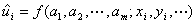
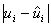
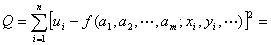
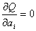

四、回归分析

1、最小二乘法原理

&nbsp;&nbsp; 设<i>u</i>是变量<i>x </i>,<i> y </i>,···的函数，含有<i>m</i>个参数<i>a</i>1 ,<i>a</i>2
,···,<i> am</i>，即

&nbsp;&nbsp;&nbsp;&nbsp;&nbsp;&nbsp;&nbsp;&nbsp;&nbsp;&nbsp;&nbsp;&nbsp;&nbsp;&nbsp;&nbsp;
<i>u =f </i>(<i>a1</i>
,<i>a</i>2<i> </i>,···,<i> am </i><b>; </b><i>x</i> ,<i>
y</i> ,···)

今对<i>u</i>和<i>x</i> ,<i> y </i>,···作<i>n</i>次观测得(<i> xi
</i>,<i>yi</i> <i>,</i>···<b>;</b><i> ui </i>)(<i>i=</i>1,2,···,<i>n</i>)。于是<i>u</i>的理论值与观测值<i>ui</i>的绝对误差为

&nbsp;&nbsp;&nbsp;&nbsp;&nbsp;&nbsp;&nbsp;&nbsp;&nbsp;&nbsp;&nbsp;&nbsp;&nbsp;&nbsp;&nbsp;&nbsp;&nbsp;&nbsp;
&nbsp;&nbsp;&nbsp;(<i> </i><i>i =</i>1,2,···,<i>n</i>)

所谓最小二乘法，就是要求上面<i>n</i>个误差在平方和最小的意义下，使得函数<i>u =f </i>(<i>a</i>1 ,<i>a</i>2
,···,<i> am </i><b>; </b><i>x </i>, <i>y</i> ,···)与观测值<i>u</i>1 , <i>u</i>2 ,<i> </i>···<i>
</i>,<i>un</i>最佳拟合。也就是参数<i>a</i>1 ,<i>a</i>2
,···<i> </i>,<i>am</i>应使

&nbsp;&nbsp;&nbsp;&nbsp;&nbsp;&nbsp;&nbsp;&nbsp;&nbsp;&nbsp;&nbsp;&nbsp;&nbsp;&nbsp;
最小值

由微分学的求极值方法可知<i>a</i>1 ,<i>a</i>2
,··· ,<i>am</i>，应满足下列方程组

&nbsp;&nbsp;&nbsp;&nbsp;&nbsp;&nbsp;&nbsp;&nbsp;&nbsp;&nbsp;&nbsp;&nbsp;&nbsp;&nbsp;
&nbsp;&nbsp;&nbsp;&nbsp;&nbsp;(<i> </i><i>i =</i>1,2,···,<i>n</i>)

