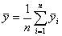
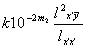

2、一元线性回归

[一元回归方程]&nbsp; 自变量<i>x</i>与变量y对应的观测值为

<table class=MsoNormalTable border=1 cellspacing=0 cellpadding=0
 style='border-collapse:collapse;border:none'>
 <tr>
  <td width=96 valign=top style='width:72.25pt;border:solid windowtext 1.0pt;
  border-left:none;padding:0mm 5.4pt 0mm 5.4pt'>
  

  </td>
  <td width=131 valign=top style='width:98.5pt;border-top:solid windowtext 1.0pt;
  border-left:none;border-bottom:solid windowtext 1.0pt;border-right:none;
  padding:0mm 5.4pt 0mm 5.4pt'>
  

  </td>
  <td width=131 valign=top style='width:98.5pt;border-top:solid windowtext 1.0pt;
  border-left:none;border-bottom:solid windowtext 1.0pt;border-right:none;
  padding:0mm 5.4pt 0mm 5.4pt'>
  

  </td>
  <td width=131 valign=top style='width:98.5pt;border-top:solid windowtext 1.0pt;
  border-left:none;border-bottom:solid windowtext 1.0pt;border-right:none;
  padding:0mm 5.4pt 0mm 5.4pt'>
  

  </td>
  <td width=98 valign=top style='width:73.25pt;border-top:solid windowtext 1.0pt;
  border-left:none;border-bottom:solid windowtext 1.0pt;border-right:none;
  padding:0mm 5.4pt 0mm 5.4pt'>
  

  </td>
 </tr>
 <tr>
  <td width=96 valign=top style='width:72.25pt;border-top:none;border-left:
  none;border-bottom:solid windowtext 1.0pt;border-right:solid windowtext 1.0pt;
  padding:0mm 5.4pt 0mm 5.4pt'>
  

  </td>
  <td width=131 valign=top style='width:98.5pt;border:none;border-bottom:solid windowtext 1.0pt;
  padding:0mm 5.4pt 0mm 5.4pt'>
  

  </td>
  <td width=131 valign=top style='width:98.5pt;border:none;border-bottom:solid windowtext 1.0pt;
  padding:0mm 5.4pt 0mm 5.4pt'>
  

  </td>
  <td width=131 valign=top style='width:98.5pt;border:none;border-bottom:solid windowtext 1.0pt;
  padding:0mm 5.4pt 0mm 5.4pt'>
  

  </td>
  <td width=98 valign=top style='width:73.25pt;border:none;border-bottom:solid windowtext 1.0pt;
  padding:0mm 5.4pt 0mm 5.4pt'>
  

  </td>
 </tr>
</table>

如果变量间存在着线性关系，则可用直线

来拟合它们之间的变化关系。由最小二乘法，<i>a</i>,<i>b</i>应使

最小值

得

式中

&nbsp;&nbsp;&nbsp; 

&nbsp;&nbsp;&nbsp; 

方程称为回归方程（或回归直线），<i>b</i>称为回归系数。

[相关系数及其检验表]&nbsp; 相关系数<i>rxy</i>反映了变量<i>x</i>和<i>y</i>之间的线性关系的密切程度，它是用下式定义

其中

（在不致误会时，<i>rx y</i>简记为<i>r</i>）。显然。当时，称为完全线性相关；当时，称全无线性相关；当越接近1，线性相关越大。

&nbsp;&nbsp; 下表给出相关系数的起码值（它与观测次数<i>n</i>及所给信度有关），当大于表中相应的值，所配的直线才有意义。

<table class=MsoNormalTable border=1 cellspacing=0 cellpadding=0
 style='border-collapse:collapse;border:none'>
 <tr>
  <td width=42 valign=top style='width:31.5pt;border:solid windowtext 1.0pt;
  border-left:none;padding:0mm 5.4pt 0mm 5.4pt'>
  
<i>N</i><i>—</i>2

  </td>
  <td width=66 valign=top style='width:49.5pt;border:solid windowtext 1.0pt;
  border-left:none;padding:0mm 5.4pt 0mm 5.4pt'>
  
<i>=</i>5<i>%</i>

  </td>
  <td width=72 valign=top style='width:54.0pt;border-top:solid windowtext 1.0pt;
  border-left:none;border-bottom:solid windowtext 1.0pt;border-right:double windowtext 1.5pt;
  padding:0mm 5.4pt 0mm 5.4pt'>
  
<i>=</i>1<i>%</i>

  </td>
  <td width=48 valign=top style='width:36.0pt;border:solid windowtext 1.0pt;
  border-left:none;padding:0mm 5.4pt 0mm 5.4pt'>
  
<i>n</i>-2

  </td>
  <td width=72 valign=top style='width:54.0pt;border:solid windowtext 1.0pt;
  border-left:none;padding:0mm 5.4pt 0mm 5.4pt'>
  
<i>=</i>5<i>%</i>

  </td>
  <td width=72 valign=top style='width:54.0pt;border-top:solid windowtext 1.0pt;
  border-left:none;border-bottom:solid windowtext 1.0pt;border-right:double windowtext 1.5pt;
  padding:0mm 5.4pt 0mm 5.4pt'>
  
<i>=</i>1<i>%</i>

  </td>
  <td width=48 valign=top style='width:36.0pt;border:solid windowtext 1.0pt;
  border-left:none;padding:0mm 5.4pt 0mm 5.4pt'>
  
<i>n-</i>2

  </td>
  <td width=72 valign=top style='width:54.0pt;border:solid windowtext 1.0pt;
  border-left:none;padding:0mm 5.4pt 0mm 5.4pt'>
  
<i>=</i>5<i>%</i>

  </td>
  <td width=72 valign=top style='width:54.0pt;border-top:solid windowtext 1.0pt;
  border-left:none;border-bottom:solid windowtext 1.0pt;border-right:none;
  padding:0mm 5.4pt 0mm 5.4pt'>
  
<i>=</i>1<i>%</i>

  </td>
 </tr>
 <tr>
  <td width=42 valign=top style='width:31.5pt;border-top:none;border-left:none;
  border-bottom:solid windowtext 1.0pt;border-right:solid windowtext 1.0pt;
  padding:0mm 5.4pt 0mm 5.4pt'>
  
1

  
2

  
3

  
4

  
5

  
6

  
7

  
8

  
9

  
10

  
11

  
12

  
13

  
14

  
15

  </td>
  <td width=66 valign=top style='width:49.5pt;border-top:none;border-left:none;
  border-bottom:solid windowtext 1.0pt;border-right:solid windowtext 1.0pt;
  padding:0mm 5.4pt 0mm 5.4pt'>
  
0.997

  
0.950

  
0.878

  
0.811

  
0.754

  
0.707

  
0.666

  
0.632

  
0.602

  
0.576

  
0.553

  
0.532

  
0.514

  
0.497

  
0.482

  </td>
  <td width=72 valign=top style='width:54.0pt;border-top:none;border-left:none;
  border-bottom:solid windowtext 1.0pt;border-right:double windowtext 1.5pt;
  padding:0mm 5.4pt 0mm 5.4pt'>
  
1.000

  
0.990

  
0.959

  
0.917

  
0.874

  
0.834

  
0.798

  
0.765

  
0.735

  
0.708

  
0.684

  
0.661

  
0.641

  
0.623

  
0.606

  </td>
  <td width=48 valign=top style='width:36.0pt;border-top:none;border-left:none;
  border-bottom:solid windowtext 1.0pt;border-right:solid windowtext 1.0pt;
  padding:0mm 5.4pt 0mm 5.4pt'>
  
16

  
17

  
18

  
19

  
20

  
21

  
22

  
23

  
24

  
25

  
26

  
27

  
28

  
29

  
30

  </td>
  <td width=72 valign=top style='width:54.0pt;border-top:none;border-left:none;
  border-bottom:solid windowtext 1.0pt;border-right:solid windowtext 1.0pt;
  padding:0mm 5.4pt 0mm 5.4pt'>
  
0.468

  
0.456

  
0.444

  
0.433

  
0.423

  
0.413

  
0.404

  
0.396

  
0.388

  
0.381

  
0.374

  
0.367

  
0.361

  
0.355

  
0.349

  </td>
  <td width=72 valign=top style='width:54.0pt;border-top:none;border-left:none;
  border-bottom:solid windowtext 1.0pt;border-right:double windowtext 1.5pt;
  padding:0mm 5.4pt 0mm 5.4pt'>
  
0.590

  
0.575

  
0.561

  
0.549

  
0.537

  
0.526

  
0.515

  
0.506

  
0.496

  
0.487

  
0.478

  
0.470

  
0.463

  
0.456

  
0.449

  </td>
  <td width=48 valign=top style='width:36.0pt;border-top:none;border-left:none;
  border-bottom:solid windowtext 1.0pt;border-right:solid windowtext 1.0pt;
  padding:0mm 5.4pt 0mm 5.4pt'>
  
35

  
40

  
45

  
50

  
60

  
70

  
80

  
90

  
100

  
125

  
150

  
200

  
300

  
400

  
1000

  </td>
  <td width=72 valign=top style='width:54.0pt;border-top:none;border-left:none;
  border-bottom:solid windowtext 1.0pt;border-right:solid windowtext 1.0pt;
  padding:0mm 5.4pt 0mm 5.4pt'>
  
0.325

  
0.304

  
0.288

  
0.273

  
0.250

  
0.232

  
0.217

  
0.205

  
0.195

  
0.174

  
0.159

  
0.138

  
0.113

  
0.098

  
0.062

  </td>
  <td width=72 valign=top style='width:54.0pt;border:none;border-bottom:solid windowtext 1.0pt;
  padding:0mm 5.4pt 0mm 5.4pt'>
  
0.418

  
0.393

  
0.372

  
0.354

  
0.325

  
0.302

  
0.283

  
0.267

  
0.254

  
0.228

  
0.208

  
0.181

  
0.148

  
0.128

  
0.081

  </td>
 </tr>
</table>

&nbsp;&nbsp; 注意，当观测次数<i>n</i>很大时 ，相关系数可用下述方法近似求得：将观测数对(<i>xi , yi</i>) (<i>i</i>=1,2,···,<i>n</i>)描在坐标纸上，先作一水平直线使位在直线的上下点数相等，再作一垂直线使左右点数相等，这两条直线（尽量使两直线上没有点）将平面分成四块（图16.5）设落在右上方,左上方,左下方,右下方的点数分别为<i>n</i>1 ,<i>n</i>2
,<i>n</i>3 ,<i> n</i>4,设

<i>n+=n</i>1<i>+n</i>3&nbsp; &nbsp;&nbsp;&nbsp;&nbsp; <i>=n</i>2<i>+n</i>4

&nbsp;

那末相关系数近似为&nbsp;&nbsp;&nbsp;&nbsp;&nbsp;&nbsp;&nbsp;&nbsp;&nbsp;&nbsp;&nbsp;&nbsp;&nbsp;&nbsp;&nbsp;&nbsp;&nbsp;&nbsp;&nbsp;&nbsp;&nbsp;&nbsp;&nbsp;&nbsp;&nbsp;&nbsp;&nbsp;&nbsp;&nbsp;&nbsp;&nbsp;&nbsp;&nbsp;&nbsp;&nbsp;&nbsp;&nbsp;&nbsp;&nbsp;&nbsp;&nbsp;&nbsp;&nbsp;&nbsp;&nbsp;&nbsp;&nbsp;&nbsp;&nbsp;&nbsp;&nbsp;&nbsp;&nbsp;&nbsp;&nbsp;&nbsp;&nbsp;&nbsp;&nbsp;&nbsp;&nbsp;&nbsp;&nbsp;&nbsp;&nbsp;&nbsp;&nbsp;&nbsp;&nbsp;&nbsp;&nbsp;&nbsp;

[剩余标准差]

&nbsp;&nbsp;
&nbsp;&nbsp;&nbsp; 

称为剩余标准差,它描述回归直线的精度:对于试验范围的每个<i>x</i>,有95.4%的<i>y</i>值落在两条平行直线

&nbsp;&nbsp; 

之间(图16.6);有99.7%的<i>y</i>值落在两条平行直线

&nbsp; 

之间. 

&nbsp;

<pre>[一元回归计算步骤]&nbsp;&nbsp;&nbsp;&nbsp;&nbsp;&nbsp; 为了方便计算,将<i>lxx,lyy ,lxy</i>改写成&nbsp;&nbsp;&nbsp;&nbsp;&nbsp;&nbsp;&nbsp;&nbsp;&nbsp;&nbsp;&nbsp;&nbsp;&nbsp;&nbsp;&nbsp;&nbsp;&nbsp;&nbsp;&nbsp;&nbsp;&nbsp;&nbsp;&nbsp;&nbsp;&nbsp;&nbsp;&nbsp;&nbsp;&nbsp;&nbsp;&nbsp;&nbsp;&nbsp;&nbsp;&nbsp;&nbsp;&nbsp;&nbsp;&nbsp;&nbsp;&nbsp;&nbsp;&nbsp;&nbsp;&nbsp;&nbsp;&nbsp;&nbsp;&nbsp; &nbsp;&nbsp;&nbsp;&nbsp;&nbsp;&nbsp;&nbsp;&nbsp;&nbsp;&nbsp;&nbsp;&nbsp;&nbsp;&nbsp;&nbsp;&nbsp;&nbsp;&nbsp;&nbsp;&nbsp;&nbsp;&nbsp;&nbsp;&nbsp;&nbsp;&nbsp;&nbsp;&nbsp;&nbsp;&nbsp;&nbsp;&nbsp;&nbsp;&nbsp;&nbsp;</pre>

并将数据整数化.即令

&nbsp;&nbsp; 

&nbsp;&nbsp;&nbsp;
经整数化后,有

&nbsp;&nbsp;&nbsp;&nbsp;&nbsp;&nbsp;&nbsp;&nbsp;&nbsp;&nbsp;
&nbsp;&nbsp;,&nbsp;&nbsp; 

&nbsp;&nbsp;&nbsp;&nbsp;&nbsp;&nbsp;&nbsp;&nbsp;&nbsp;&nbsp;
&nbsp;&nbsp;&nbsp;&nbsp;&nbsp;

于是列表计算如下:

<table class=MsoNormalTable border=1 cellspacing=0 cellpadding=0
 style='border-collapse:collapse;border:none'>
 <tr>
  <td width=56 valign=top style='width:42.0pt;border:solid windowtext 1.0pt;
  border-left:none;padding:0mm 5.4pt 0mm 5.4pt'>
  
&nbsp;序号

  </td>
  <td width=108 colspan=3 valign=top style='width:81.0pt;border:solid windowtext 1.0pt;
  border-left:none;padding:0mm 5.4pt 0mm 5.4pt'>
  
&nbsp; 

  </td>
  <td width=95 valign=top style='width:71.25pt;border:solid windowtext 1.0pt;
  border-left:none;padding:0mm 5.4pt 0mm 5.4pt'>
  
&nbsp;&nbsp;&nbsp;
  

  </td>
  <td width=104 valign=top style='width:78.0pt;border:solid windowtext 1.0pt;
  border-left:none;padding:0mm 5.4pt 0mm 5.4pt'>
  
&nbsp;&nbsp;
  

  </td>
  <td width=109 valign=top style='width:81.4pt;border:solid windowtext 1.0pt;
  border-left:none;padding:0mm 5.4pt 0mm 5.4pt'>
  
&nbsp; 

  </td>
  <td width=144 colspan=2 valign=top style='width:108.35pt;border-top:solid windowtext 1.0pt;
  border-left:none;border-bottom:solid windowtext 1.0pt;border-right:none;
  padding:0mm 5.4pt 0mm 5.4pt'>
  
&nbsp;&nbsp;&nbsp;&nbsp;&nbsp;
  

  </td>
 </tr>
 <tr>
  <td width=56 valign=top style='width:42.0pt;border-top:none;border-left:none;
  border-bottom:solid windowtext 1.0pt;border-right:solid windowtext 1.0pt;
  padding:0mm 5.4pt 0mm 5.4pt'>
  
&nbsp; 1

  
&nbsp; 2

  
&nbsp; 

  
&nbsp; <i>n</i>

  </td>
  <td width=108 colspan=3 valign=top style='width:81.0pt;border-top:none;
  border-left:none;border-bottom:solid windowtext 1.0pt;border-right:solid windowtext 1.0pt;
  padding:0mm 5.4pt 0mm 5.4pt'>
  
&nbsp; 

  
&nbsp; 

  
&nbsp;&nbsp;
  

  
&nbsp; 

  </td>
  <td width=95 valign=top style='width:71.25pt;border-top:none;border-left:
  none;border-bottom:solid windowtext 1.0pt;border-right:solid windowtext 1.0pt;
  padding:0mm 5.4pt 0mm 5.4pt'>
  
&nbsp;&nbsp;&nbsp;
  

  
&nbsp;&nbsp;&nbsp;
  

  
&nbsp;&nbsp;&nbsp;&nbsp;
  

  
&nbsp;&nbsp;&nbsp;
  

  </td>
  <td width=104 valign=top style='width:78.0pt;border-top:none;border-left:
  none;border-bottom:solid windowtext 1.0pt;border-right:solid windowtext 1.0pt;
  padding:0mm 5.4pt 0mm 5.4pt'>
  
&nbsp;&nbsp;
  

  
&nbsp;&nbsp;
  

  
&nbsp;&nbsp;&nbsp;
  

  
&nbsp;&nbsp;
  

  </td>
  <td width=109 valign=top style='width:81.4pt;border-top:none;border-left:
  none;border-bottom:solid windowtext 1.0pt;border-right:solid windowtext 1.0pt;
  padding:0mm 5.4pt 0mm 5.4pt'>
  
&nbsp; 

  
&nbsp; 

  
&nbsp;&nbsp;
  

  
&nbsp; 

  </td>
  <td width=144 colspan=2 valign=top style='width:108.35pt;border:none;
  border-bottom:solid windowtext 1.0pt;padding:0mm 5.4pt 0mm 5.4pt'>
  
&nbsp;&nbsp;&nbsp;&nbsp;&nbsp;
  

  
&nbsp;&nbsp;&nbsp;&nbsp;&nbsp;
  

  
&nbsp;&nbsp;&nbsp;&nbsp;&nbsp;&nbsp;
  

  
&nbsp;&nbsp;&nbsp;&nbsp;&nbsp;
  

  </td>
 </tr>
 <tr>
  <td width=56 valign=top style='width:42.0pt;border-top:none;border-left:none;
  border-bottom:solid windowtext 1.0pt;border-right:solid windowtext 1.0pt;
  padding:0mm 5.4pt 0mm 5.4pt'>
  
&nbsp;&nbsp;&nbsp;
  

  </td>
  <td width=108 colspan=3 valign=top style='width:81.0pt;border-top:none;
  border-left:none;border-bottom:solid windowtext 1.0pt;border-right:solid windowtext 1.0pt;
  padding:0mm 5.4pt 0mm 5.4pt'>
  
&nbsp; 

  </td>
  <td width=95 valign=top style='width:71.25pt;border-top:none;border-left:
  none;border-bottom:solid windowtext 1.0pt;border-right:solid windowtext 1.0pt;
  padding:0mm 5.4pt 0mm 5.4pt'>
  
&nbsp; 

  </td>
  <td width=104 valign=top style='width:78.0pt;border-top:none;border-left:
  none;border-bottom:solid windowtext 1.0pt;border-right:solid windowtext 1.0pt;
  padding:0mm 5.4pt 0mm 5.4pt'>
  
&nbsp; 

  </td>
  <td width=109 valign=top style='width:81.4pt;border-top:none;border-left:
  none;border-bottom:solid windowtext 1.0pt;border-right:solid windowtext 1.0pt;
  padding:0mm 5.4pt 0mm 5.4pt'>
  
&nbsp;

  </td>
  <td width=144 colspan=2 valign=top style='width:108.35pt;border:none;
  border-bottom:solid windowtext 1.0pt;padding:0mm 5.4pt 0mm 5.4pt'>
  
&nbsp;&nbsp;
  &nbsp;&nbsp;

  </td>
 </tr>
 <tr>
  <td width=56 valign=top style='width:42.0pt;border-top:none;border-left:none;
  border-bottom:solid windowtext 1.0pt;border-right:solid windowtext 1.0pt;
  padding:0mm 5.4pt 0mm 5.4pt'>
  
&nbsp; 

  </td>
  <td width=108 colspan=3 valign=top style='width:81.0pt;border-top:none;
  border-left:none;border-bottom:solid windowtext 1.0pt;border-right:solid windowtext 1.0pt;
  padding:0mm 5.4pt 0mm 5.4pt'>
  
&nbsp; 

  </td>
  <td width=95 valign=top style='width:71.25pt;border-top:none;border-left:
  none;border-bottom:solid windowtext 1.0pt;border-right:solid windowtext 1.0pt;
  padding:0mm 5.4pt 0mm 5.4pt'>
  
&nbsp; 

  </td>
  <td width=104 valign=top style='width:78.0pt;border-top:none;border-left:
  none;border-bottom:solid windowtext 1.0pt;border-right:solid windowtext 1.0pt;
  padding:0mm 5.4pt 0mm 5.4pt'>
  
&nbsp; 

  </td>
  <td width=109 valign=top style='width:81.4pt;border-top:none;border-left:
  none;border-bottom:solid windowtext 1.0pt;border-right:solid windowtext 1.0pt;
  padding:0mm 5.4pt 0mm 5.4pt'>
  
&nbsp;

  </td>
  <td width=144 colspan=2 valign=top style='width:108.35pt;border:none;
  border-bottom:solid windowtext 1.0pt;padding:0mm 5.4pt 0mm 5.4pt'>
  
&nbsp; 

  </td>
 </tr>
 <tr style='height:7.35pt'>
  <td width=56 valign=top style='width:42.0pt;border-top:none;border-left:none;
  border-bottom:solid windowtext 1.0pt;border-right:solid windowtext 1.0pt;
  padding:0mm 5.4pt 0mm 5.4pt;height:7.35pt'>
  

  </td>
  <td width=108 colspan=3 valign=top style='width:81.0pt;border-top:none;
  border-left:none;border-bottom:solid windowtext 1.0pt;border-right:solid windowtext 1.0pt;
  padding:0mm 5.4pt 0mm 5.4pt;height:7.35pt'>
  
&nbsp; 

  </td>
  <td width=95 valign=top style='width:71.25pt;border-top:none;border-left:
  none;border-bottom:solid windowtext 1.0pt;border-right:solid windowtext 1.0pt;
  padding:0mm 5.4pt 0mm 5.4pt;height:7.35pt'>
  
&nbsp; 

  </td>
  <td width=104 valign=top style='width:78.0pt;border-top:none;border-left:
  none;border-bottom:solid windowtext 1.0pt;border-right:solid windowtext 1.0pt;
  padding:0mm 5.4pt 0mm 5.4pt;height:7.35pt'>
  

  </td>
  <td width=109 valign=top style='width:81.4pt;border-top:none;border-left:
  none;border-bottom:solid windowtext 1.0pt;border-right:solid windowtext 1.0pt;
  padding:0mm 5.4pt 0mm 5.4pt;height:7.35pt'>
  

  </td>
  <td width=144 colspan=2 valign=top style='width:108.35pt;border:none;
  border-bottom:solid windowtext 1.0pt;padding:0mm 5.4pt 0mm 5.4pt;height:7.35pt'>
  
&nbsp;

  </td>
 </tr>
 <tr style='height:55.95pt'>
  <td width=56 valign=top style='width:42.0pt;border-top:none;border-left:none;
  border-bottom:solid windowtext 1.0pt;border-right:solid windowtext 1.0pt;
  padding:0mm 5.4pt 0mm 5.4pt;height:55.95pt'>
  
记号

  </td>
  <td width=108 colspan=3 valign=top style='width:81.0pt;border-top:none;
  border-left:none;border-bottom:solid windowtext 1.0pt;border-right:solid windowtext 1.0pt;
  padding:0mm 5.4pt 0mm 5.4pt;height:55.95pt'>
  

  </td>
  <td width=95 valign=top style='width:71.25pt;border-top:none;border-left:
  none;border-bottom:solid windowtext 1.0pt;border-right:solid windowtext 1.0pt;
  padding:0mm 5.4pt 0mm 5.4pt;height:55.95pt'>
  
=

  </td>
  <td width=104 valign=top style='width:78.0pt;border-top:none;border-left:
  none;border-bottom:solid windowtext 1.0pt;border-right:solid windowtext 1.0pt;
  padding:0mm 5.4pt 0mm 5.4pt;height:55.95pt'>
  
=

  
-

  </td>
  <td width=109 valign=top style='width:81.4pt;border-top:none;border-left:
  none;border-bottom:solid windowtext 1.0pt;border-right:solid windowtext 1.0pt;
  padding:0mm 5.4pt 0mm 5.4pt;height:55.95pt'>
  
=

  
-

  </td>
  <td width=144 colspan=2 valign=top style='width:108.35pt;border:none;
  border-bottom:solid windowtext 1.0pt;padding:0mm 5.4pt 0mm 5.4pt;height:55.95pt'>
  
&nbsp;=

  
-

  </td>
 </tr>
 <tr style='mso-row-mso-row-'>
  <td style='border:none;padding:0mm 0mm 0mm 0mm' width=221 colspan=2>
&nbsp;</td>
  <td width=36 valign=top style='width:27.0pt;border:solid windowtext 1.0pt;
  border-top:none;padding:0mm 5.4pt 0mm 5.4pt'>
  
计

  
算

  
结

  
果

  </td>
  <td width=324 colspan=5 valign=top style='width:243.0pt;border-top:none;
  border-left:none;border-bottom:solid windowtext 1.0pt;border-right:solid windowtext 1.0pt;
  padding:0mm 5.4pt 0mm 5.4pt'>
  
回归系数&nbsp; 

  
常数项&nbsp;&nbsp;&nbsp; 

  
回归方程&nbsp; 

  
相关系数&nbsp; 

  
剩余标准差

  </td>
  <td style='border:none;padding:0mm 0mm 0mm 0mm' width=143>
&nbsp;</td>
 </tr>
 <tr>
  <td width=60 style='width:45.0pt;border:none;padding:0mm 5.4pt 0mm 5.4pt'>
  
&nbsp;

  </td>
  <td width=57 style='width:42.75pt;border:none;padding:0mm 5.4pt 0mm 5.4pt'>
  
&nbsp;

  </td>
  <td width=36 style='width:27.0pt;border:none;padding:0mm 5.4pt 0mm 5.4pt'>
  
&nbsp;

  </td>
  <td width=15 style='width:11.25pt;border:none;padding:0mm 5.4pt 0mm 5.4pt'>
  
&nbsp;

  </td>
  <td width=95 style='width:71.25pt;border:none;padding:0mm 5.4pt 0mm 5.4pt'>
  
&nbsp;

  </td>
  <td width=104 style='width:78.0pt;border:none;padding:0mm 5.4pt 0mm 5.4pt'>
  
&nbsp;

  </td>
  <td width=109 style='width:81.75pt;border:none;padding:0mm 5.4pt 0mm 5.4pt'>
  
&nbsp;

  </td>
  <td width=10 style='width:7.2pt;border:none;padding:0mm 5.4pt 0mm 5.4pt'>
  
&nbsp;

  </td>
  <td width=143 style='width:107.25pt;border:none;padding:0mm 5.4pt 0mm 5.4pt'>
  
&nbsp;

  </td>
 </tr>
</table>

[一元线性回归的方差分析]&nbsp; 将自变量<i>x</i>看作单因素,对每个<i>xi</i>(<i>i</i>=1,2,···,<i>n</i>)作<i>k</i>次重复试验得到数据<i>yij</i>(<i>i=</i>1,2,···,<i>n</i><b>;</b><i> j=</i>1,2,···,<i>k</i>),记录如下:

<table class=MsoNormalTable border=1 cellspacing=0 cellpadding=0
 style='border-collapse:collapse;border:none'>
 <tr>
  <td width=50 valign=top style='width:37.6pt;border:solid windowtext 1.0pt;
  border-left:none;padding:0mm 5.4pt 0mm 5.4pt'>
  
<i></i>

  </td>
  <td width=279 valign=top style='width:209.15pt;border:solid windowtext 1.0pt;
  border-left:none;padding:0mm 5.4pt 0mm 5.4pt'>
  
<i>yij</i>

  </td>
  <td width=259 valign=top style='width:194.25pt;border-top:solid windowtext 1.0pt;
  border-left:none;border-bottom:solid windowtext 1.0pt;border-right:none;
  padding:0mm 5.4pt 0mm 5.4pt'>
  

  </td>
 </tr>
 <tr>
  <td width=50 valign=top style='width:37.6pt;border-top:none;border-left:none;
  border-bottom:solid windowtext 1.0pt;border-right:solid windowtext 1.0pt;
  padding:0mm 5.4pt 0mm 5.4pt'>
  
<i>x</i>1<i>&nbsp;&nbsp;&nbsp;&nbsp;&nbsp;&nbsp;&nbsp;&nbsp;&nbsp;&nbsp;&nbsp;&nbsp;&nbsp;&nbsp;
  x</i>2<i>&nbsp;&nbsp;&nbsp;&nbsp;
  &nbsp;&nbsp;&nbsp;&nbsp;&nbsp;xn</i>

  </td>
  <td width=279 valign=top style='width:209.15pt;border-top:none;border-left:
  none;border-bottom:solid windowtext 1.0pt;border-right:solid windowtext 1.0pt;
  padding:0mm 5.4pt 0mm 5.4pt'>
  
<i>y</i>11<i>&nbsp; y</i>12<i>&nbsp; </i>···<i>&nbsp; y</i>1<i>k</i>

  
<i>y</i>21<i>&nbsp; y</i>22<i> </i>&nbsp;···<i>&nbsp; y</i>2<i>k</i>

  
<i>&nbsp; &nbsp;&nbsp;&nbsp;</i>···<i>&nbsp;
  </i>

  
<i>yn</i>1<i>&nbsp; yn</i>2<i>&nbsp; </i>··· <i>&nbsp;ynk</i>

  </td>
  <td width=259 valign=top style='width:194.25pt;border:none;border-bottom:
  solid windowtext 1.0pt;padding:0mm 5.4pt 0mm 5.4pt'>
  

  

  
<i></i>

  
<i></i>

  </td>
 </tr>
 <tr>
  <td width=50 valign=top style='width:37.6pt;border-top:none;border-left:none;
  border-bottom:solid windowtext 1.0pt;border-right:solid windowtext 1.0pt;
  padding:0mm 5.4pt 0mm 5.4pt'>
  
&nbsp; 

  </td>
  <td width=279 valign=top style='width:209.15pt;border-top:none;border-left:
  none;border-bottom:solid windowtext 1.0pt;border-right:solid windowtext 1.0pt;
  padding:0mm 5.4pt 0mm 5.4pt'>
  
&nbsp; 

  </td>
  <td width=259 valign=top style='width:194.25pt;border:none;border-bottom:
  solid windowtext 1.0pt;padding:0mm 5.4pt 0mm 5.4pt'>
  

  </td>
 </tr>
</table>

按照数对求出回归方程&nbsp;&nbsp;&nbsp;&nbsp;&nbsp;&nbsp; 

<i>y</i>的总平方和为

&nbsp; &nbsp;&nbsp;&nbsp;&nbsp;&nbsp;&nbsp;

记作

&nbsp;&nbsp;&nbsp;&nbsp;&nbsp;&nbsp;&nbsp;&nbsp;&nbsp;&nbsp;&nbsp;&nbsp;&nbsp;&nbsp;&nbsp;&nbsp;&nbsp;

上述右边的<i>S</i>回称为回归平方和,它是由于<i>x</i>的变化使<i>y</i>也随之变化而引起的;<i>S</i>误称为误差平方和,它是由试验误差引起的;<i>S</i>余称为剩余平方和,它是由其他随机因素或回归直线配得不适当而引起的.

&nbsp;&nbsp; 同单因素方差分析类似,作一元线性回归方差分析表如下:&nbsp;

<table class=MsoNormalTable border=1 cellspacing=0 cellpadding=0
 style='border-collapse:collapse;border:none'>
 <tr>
  <td width=81 valign=top style='width:60.85pt;border:solid windowtext 1.0pt;
  border-left:none;padding:0mm 5.4pt 0mm 5.4pt'>
  
方差来源

  </td>
  <td width=70 valign=top style='width:52.55pt;border:solid windowtext 1.0pt;
  border-left:none;padding:0mm 5.4pt 0mm 5.4pt'>
  
平方和

  </td>
  <td width=72 valign=top style='width:54.0pt;border:solid windowtext 1.0pt;
  border-left:none;padding:0mm 5.4pt 0mm 5.4pt'>
  
自由度

  </td>
  <td width=101 valign=top style='width:76.0pt;border:solid windowtext 1.0pt;
  border-left:none;padding:0mm 5.4pt 0mm 5.4pt'>
  
均&nbsp;&nbsp;&nbsp;&nbsp;
  方

  </td>
  <td width=79 valign=top style='width:59.0pt;border:solid windowtext 1.0pt;
  border-left:none;padding:0mm 5.4pt 0mm 5.4pt'>
  
统计量

  </td>
  <td width=84 valign=top style='width:62.7pt;border:solid windowtext 1.0pt;
  border-left:none;padding:0mm 5.4pt 0mm 5.4pt'>
  
置信限

  </td>
  <td width=81 valign=top style='width:60.85pt;border-top:solid windowtext 1.0pt;
  border-left:none;border-bottom:solid windowtext 1.0pt;border-right:none;
  padding:0mm 5.4pt 0mm 5.4pt'>
  
统计推断

  </td>
 </tr>
 <tr>
  <td width=81 valign=top style='width:60.85pt;border-top:none;border-left:
  none;border-bottom:solid windowtext 1.0pt;border-right:solid windowtext 1.0pt;
  padding:0mm 5.4pt 0mm 5.4pt'>
  
&nbsp; 回归

  
&nbsp; 剩余

  
&nbsp; 误差

  </td>
  <td width=70 valign=top style='width:52.55pt;border-top:none;border-left:
  none;border-bottom:solid windowtext 1.0pt;border-right:solid windowtext 1.0pt;
  padding:0mm 5.4pt 0mm 5.4pt'>
  
<i>&nbsp; S</i>回

  
<i>&nbsp; S</i>余

  
<i>&nbsp; S</i>误

  </td>
  <td width=72 valign=top style='width:54.0pt;border-top:none;border-left:none;
  border-bottom:solid windowtext 1.0pt;border-right:solid windowtext 1.0pt;
  padding:0mm 5.4pt 0mm 5.4pt'>
  
<i>&nbsp; k</i>

  
<i>&nbsp; n</i>

  
<i>&nbsp; n</i>

  </td>
  <td width=101 valign=top style='width:76.0pt;border-top:none;border-left:
  none;border-bottom:solid windowtext 1.0pt;border-right:solid windowtext 1.0pt;
  padding:0mm 5.4pt 0mm 5.4pt'>
  
<i>s</i>回

  

  

  </td>
  <td width=79 valign=top style='width:59.0pt;border-top:none;border-left:none;
  border-bottom:solid windowtext 1.0pt;border-right:solid windowtext 1.0pt;
  padding:0mm 5.4pt 0mm 5.4pt'>
  

  

  </td>
  <td width=84 valign=top style='width:62.7pt;border-top:none;border-left:none;
  border-bottom:solid windowtext 1.0pt;border-right:solid windowtext 1.0pt;
  padding:0mm 5.4pt 0mm 5.4pt'>
  

  

  </td>
  <td width=81 valign=top style='width:60.85pt;border:none;border-bottom:solid windowtext 1.0pt;
  padding:0mm 5.4pt 0mm 5.4pt'>
  
当时，认为影响不显著；

  
当时，认为影响显著

  </td>
 </tr>
 <tr>
  <td width=81 valign=top style='width:60.85pt;border-top:none;border-left:
  none;border-bottom:solid windowtext 1.0pt;border-right:solid windowtext 1.0pt;
  padding:0mm 5.4pt 0mm 5.4pt'>
  
总平方和

  </td>
  <td width=70 valign=top style='width:52.55pt;border-top:none;border-left:
  none;border-bottom:solid windowtext 1.0pt;border-right:solid windowtext 1.0pt;
  padding:0mm 5.4pt 0mm 5.4pt'>
  
<i>&nbsp; S</i>总

  </td>
  <td width=72 valign=top style='width:54.0pt;border-top:none;border-left:none;
  border-bottom:solid windowtext 1.0pt;border-right:solid windowtext 1.0pt;
  padding:0mm 5.4pt 0mm 5.4pt'>
  
<i>&nbsp; nk</i>

  </td>
  <td width=101 valign=top style='width:76.0pt;border-top:none;border-left:
  none;border-bottom:solid windowtext 1.0pt;border-right:solid windowtext 1.0pt;
  padding:0mm 5.4pt 0mm 5.4pt'>
  
&nbsp; 

  </td>
  <td width=79 valign=top style='width:59.0pt;border-top:none;border-left:none;
  border-bottom:solid windowtext 1.0pt;border-right:solid windowtext 1.0pt;
  padding:0mm 5.4pt 0mm 5.4pt'>
  
&nbsp; 

  </td>
  <td width=84 valign=top style='width:62.7pt;border-top:none;border-left:none;
  border-bottom:solid windowtext 1.0pt;border-right:solid windowtext 1.0pt;
  padding:0mm 5.4pt 0mm 5.4pt'>
  
&nbsp; 

  </td>
  <td width=81 valign=top style='width:60.85pt;border:none;border-bottom:solid windowtext 1.0pt;
  padding:0mm 5.4pt 0mm 5.4pt'>
  
&nbsp; 

  </td>
 </tr>
</table>

&nbsp;&nbsp; 检验<i></i>时，若影响不显著，则表明剩余平方和基本上是试验误差等随机因素引起的；若影响显著，则表明可能存在另外不可忽略的因素，或者<i>x</i>与<i>y</i>不是直线相关，或者<i>x</i>与<i>y</i>无关。这时求出的回归直线不能刻划<i>x</i>与<i>y</i>之间的关系，需进一步查明原因，重新配线。

&nbsp;&nbsp; 检验时，若影响显著，则表明<i>x</i>与<i>y</i>之间有线性关系；若影响不显著，则需重新配线。

&nbsp;&nbsp; <i>S</i>总,<i>S</i>回,<i>S</i>余,和<i>S</i>误按下列公式计算（可先将数据整数化, ：

<i>S</i>总=

<i>S</i>回=

<i>S</i>余=

<i>S</i>误=<i> S</i>总回余

式中

