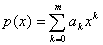
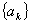
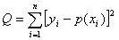
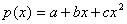
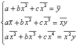
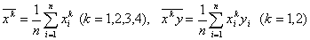

3、抛物线回归

&nbsp;&nbsp; 给定一组观测值(<i>xi
, yi</i>)(<i>i=</i>1,2,···,<i>n</i>)，如果有抛物线关系，就可用一个<i>m</i>(<i>m</i>2)次多项式

来拟合。依照最小二乘法原理，应使

=最小值

&nbsp;&nbsp;&nbsp;
特别地，若取<i>p(x)</i>为二次多项式

&nbsp;&nbsp;&nbsp;&nbsp;&nbsp;&nbsp;&nbsp;&nbsp;&nbsp;&nbsp;&nbsp;&nbsp;&nbsp;&nbsp;&nbsp;&nbsp;&nbsp;&nbsp;&nbsp;&nbsp;

则系数<i>a</i>,<i>b</i>,<i>c</i>满足方程组

式中

&nbsp;&nbsp;&nbsp;

